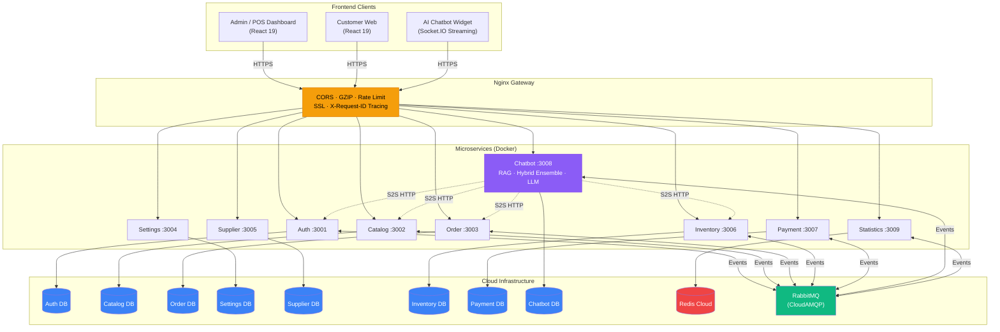
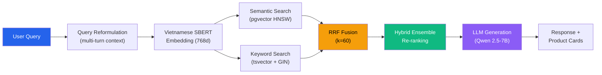

<p align="center">
  
</p>

<h1 align="center">POSMART — Mini-Mart Management System</h1>

<p align="center">
  <strong>A full-stack microservices platform for mini-mart operations with AI-powered chatbot, hybrid recommendation engine, and omnichannel retail (POS + E-commerce).</strong>
</p>

<p align="center">
  
  
  
  
  
</p>

---

## Overview

POSMART is a production-grade mini-mart management system designed for both **offline (POS)** and **online (E-commerce)** retail operations. The system is built on a **9-service microservices architecture** with an event-driven backbone (RabbitMQ), deployed via CI/CD on DigitalOcean and Vercel.

The standout feature is an **AI Chatbot** that goes beyond simple Q&A — it combines **4 recommendation algorithms** into a Hybrid Ensemble, learns from user behavior through a closed feedback loop, and functions as an **Action Assistant** capable of manipulating cart, orders, and payments through natural language.

---

## System Architecture



---

## Key Features

### 🏪 POS & Admin Dashboard

Full-featured back-office for in-store operations:

- **Point of Sale** — Fast checkout with barcode scanning, draft orders, and direct payment processing
- **Product & Category Management** — CRUD with price history tracking and QR code generation
- **Inventory Control** — Batch tracking, stock-in/stock-out, warehouse management, expiry alerts
- **Order Management** — Omnichannel orders (POS + online), status lifecycle, refund processing
- **Supplier & Purchase Orders** — Supplier directory, purchase order workflows
- **Employee & Role Management** — RBAC with granular permissions
- **Payment Integration** — VNPay gateway + cash/card direct payment
- **Analytics Dashboard** — Revenue, top products, customer insights, real-time statistics
- **AI Chatbot Dashboard** — Monitor recommendation performance, force data re-learning, view conversation analytics

### 🛒 Customer E-commerce Web

Modern shopping experience for end customers:

- **Product Browsing** — Category filtering, search, detailed product pages with stock availability
- **Shopping Cart** — Add/remove/update with real-time price calculation
- **Multi-store Support** — Store selection with location-aware inventory
- **Online Checkout** — VNPay integration with order tracking and status updates
- **Order History** — Full order lifecycle visibility
- **AI Shopping Assistant** — Chatbot widget with product recommendations and cart management via natural language

### 🤖 AI Chatbot — Hybrid Recommendation & Action Assistant

> The core differentiator of POSMART. Not just a Q&A bot — a full recommendation engine + operational assistant.

#### Hybrid Ensemble Recommendation (4 Algorithms)

The chatbot combines **4 recommendation algorithms** with dynamically learned weights:

| Algorithm | Symbol | Purpose |
|-----------|--------|---------|
| **Content-Based RAG** | α | Semantic + keyword search using Vietnamese SBERT embeddings (768d) with Reciprocal Rank Fusion |
| **Collaborative Filtering** | β | Item-based CF using cosine similarity on user-product interaction matrices |
| **Apriori Association Rules** | γ | Co-purchase pattern mining with support, confidence, and lift metrics |
| **Session Personalization** | δ | Customer-type clustering with contextual boosting based on shopping patterns |

**Final score**: `final = α×Content + β×CF + γ×Apriori + δ×Personal`

Weights (α, β, γ, δ) are **not static** — they are automatically optimized nightly by a **Weight Learner** that analyzes conversion funnels.

#### RAG Pipeline



#### Closed-Loop Feedback System

The system tracks a **5-step conversion funnel** and uses it to continuously improve:


- **Dual-Tracking Analytics**: Browser-side hover/click tracking + server-side purchase attribution (24h lookback window)
- **Nightly Batch Pipeline** (2:00 AM): Weight optimization, similarity matrix recomputation, Apriori statistics refresh
- **Self-improving**: The more users interact, the better recommendations become

#### Action Assistant (Write Operations)

Beyond read-only chat, the assistant can **execute actions** through natural conversation:

| Capability | Customer | Employee (POS) |
|------------|----------|----------------|
| Add/remove/update cart items | ✅ Via natural language | ✅ POS cart integration |
| Track orders | ✅ Own orders only | ✅ All store orders |
| Cancel orders | ✅ Draft only, with confirmation | ✅ Draft/shipping |
| Create orders | — | ✅ Multi-turn conversation |
| Check payments | ✅ Own orders | ✅ All payments |

**Security**: 7-layer protection — Intent classification → Permission check → Ownership validation → Status check → Confirmation gate → Audit log → Rate limiting

**Contextual Pronoun Resolution**: When a user says *"add that to cart"* after receiving a recommendation, the system resolves *"that"* using `lastMentionedProducts` from the session context.

---

## Tech Stack

| Layer | Technology |
|-------|-----------|
| **Backend** | Node.js 20, Express, Socket.IO |
| **Frontend** | React 19, Vite, Tailwind CSS |
| **Gateway** | Nginx (rate limiting, CORS, GZIP, WebSocket) |
| **Database** | PostgreSQL (Supabase) |
| **Vector Search** | pgvector (HNSW index, 768d embeddings) |
| **Full-text Search** | PostgreSQL tsvector + GIN index |
| **LLM** | Qwen/Qwen2.5-7B-Instruct (HuggingFace Inference API) |
| **Embedding** | Vietnamese SBERT (local ONNX runtime) |
| **Message Queue** | RabbitMQ (CloudAMQP) |
| **Cache** | Redis (Redis Cloud) |
| **Payment** | VNPay Sandbox |
| **CI/CD** | GitHub Actions → GHCR → DigitalOcean |
| **Hosting** | DigitalOcean Droplet (backend) + Vercel (frontend) |

---

## Microservices

| Service | Port | Responsibility |
|---------|------|---------------|
| **Gateway** | 8080 | Nginx reverse proxy, CORS, rate limiting, request tracing |
| **Auth** | 3001 | Authentication, JWT, RBAC, employee & customer management |
| **Catalog** | 3002 | Products, categories, price history (dedicated database) |
| **Order** | 3003 | Order lifecycle, POS + online orders, refunds |
| **Settings** | 3004 | System configuration, discount policies |
| **Supplier** | 3005 | Supplier management, purchase orders |
| **Inventory** | 3006 | Stock tracking, batches, warehouse, stock-in/out |
| **Payment** | 3007 | VNPay integration, direct payments, refund processing |
| **Chatbot** | 3008 | AI/RAG, hybrid recommendations, Socket.IO, action assistant |
| **Statistics** | 3009 | Analytics, revenue reports, dashboard metrics |

All services communicate asynchronously via **RabbitMQ events** (`ORDER_COMPLETED`, `PRODUCT_CREATED`, `INVENTORY_UPDATED`, etc.) and synchronously via internal HTTP for real-time queries.

---

## Project Structure

```
Mini-Mart/
├── backend/
│   ├── gateway/                  # Nginx config + Dockerfile
│   ├── services/
│   │   ├── auth/                 # Authentication & RBAC
│   │   ├── catalog/              # Product management
│   │   ├── order/                # Order processing
│   │   ├── settings/             # System configuration
│   │   ├── supplier/             # Supplier management
│   │   ├── inventory/            # Stock management
│   │   ├── payment/              # Payment processing
│   │   ├── chatbot/              # AI Chatbot + RAG + Recommendations
│   │   └── statistics/           # Analytics & reporting
│   ├── shared/                   # Common utilities, DB, event bus
│   ├── docker-compose.yml        # Development orchestration
│   └── docker-compose.prod.yml   # Production orchestration
│
├── frontend/                     # Admin Dashboard + POS (React 19 + Vite + TW4)
├── customer/                     # Customer E-commerce (React 19 + Vite + TW3)
│
├── .github/workflows/            # CI/CD pipelines
│   ├── deploy-backend.yml        # Build → GHCR → DigitalOcean
│   ├── deploy-frontend.yml       # Lint → Build → Vercel
│   ├── deploy-customer.yml       # Lint → Build → Vercel
│   └── ci.yml                    # PR quality gate
│
├── infra/scripts/                # Server setup & deploy scripts
└── docs/                         # Architecture, database, deployment docs
```

---

## Deployment

The system uses a fully automated CI/CD pipeline:

| Component | Platform | Trigger |
|-----------|----------|---------|
| **Backend** (9 services) | DigitalOcean Droplet (2GB + 4GB Swap) | Push to `main` (backend/**) |
| **Admin/POS** | Vercel | Push to `main` (frontend/**) |
| **Customer Web** | Vercel | Push to `main` (customer/**) |

**Pipeline**: Code push → GitHub Actions → Build Docker images (parallel) → Push to GHCR → SSH deploy to Droplet → Health check verification

**Domains**:
- `api.mini-mart.dev` — Backend API (SSL via Let's Encrypt)
- [`admin.mini-mart.dev`](https://admin.mini-mart.dev) — Admin/POS Dashboard
- [`shop.mini-mart.dev`](https://shop.mini-mart.dev) — Customer Web

See [`docs/deploy/`](docs/deploy/) for detailed deployment documentation.

---

## Getting Started

### Prerequisites

- Node.js ≥ 20
- Docker & Docker Compose
- PostgreSQL credentials (Supabase)
- Redis & RabbitMQ credentials

### Development

```bash
# Clone the repository
git clone https://github.com/PhatNguyenTT2/Mini-Mart.git
cd Mini-Mart

# Backend — Start all microservices
cd backend
cp .env.prod.example .env    # Fill in your credentials
docker compose up -d

# Admin Dashboard
cd ../frontend
npm install && npm run dev   # http://localhost:5173

# Customer Web
cd ../customer
npm install && npm run dev   # http://localhost:5174
```

---

## Documentation

| Document | Description |
|----------|-------------|
| [`docs/deploy/`](docs/deploy/) | Deployment guide & architecture overview |
| [`backend/docs/chatbot/report/`](backend/docs/chatbot/report/) | AI Chatbot & Recommendation Engine technical report |
| [`backend/docs/chatbot/assistant/`](backend/docs/chatbot/assistant/) | Action Assistant design & security protocol |

---

## License

This project is developed as part of an academic capstone project at UIT (University of Information Technology).
