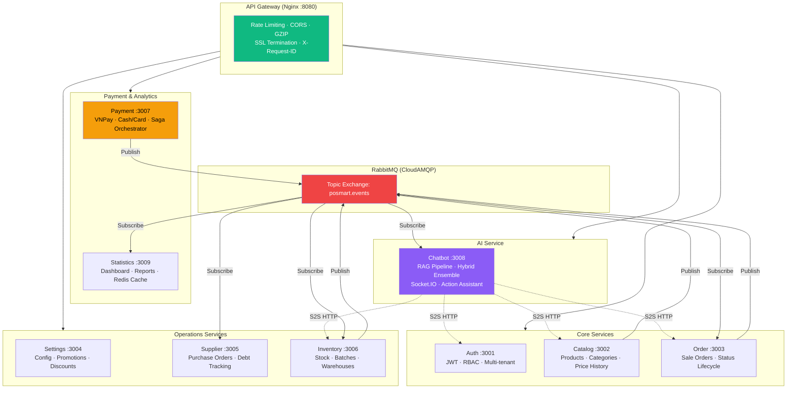
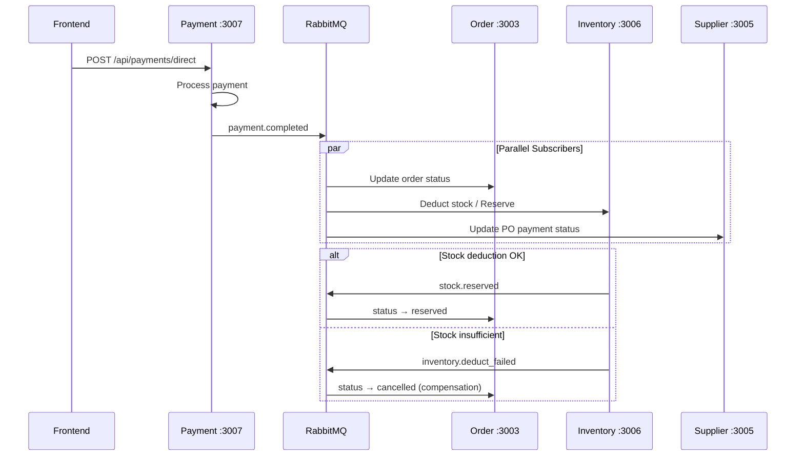
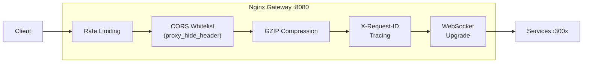

# POSMART Backend — Microservices

> **API**: [api.mini-mart.dev](https://api.mini-mart.dev/health) · 9 services · Event-driven architecture · Saga pattern

Backend for the POSMART mini-mart management system. Built as a microservices architecture with an Nginx API Gateway, RabbitMQ event bus, and PostgreSQL per-service databases hosted on Supabase.

---

## Architecture



---

## Service Registry

| # | Service | Port | Database | Events | Responsibility |
|---|---------|------|:--------:|:------:|---------------|
| 1 | **Auth** | 3001 | ✅ Dedicated | Pub | Authentication, JWT, RBAC, employee & customer management |
| 2 | **Catalog** | 3002 | ✅ Dedicated | Pub | Products, categories, price history, QR codes |
| 3 | **Order** | 3003 | ✅ Dedicated | Pub+Sub | Sale orders, status lifecycle (Saga participant) |
| 4 | **Settings** | 3004 | ✅ Dedicated | Pub | System config, promotions, discount policies |
| 5 | **Supplier** | 3005 | ✅ Dedicated | Pub+Sub | Suppliers, purchase orders, debt tracking |
| 6 | **Inventory** | 3006 | ✅ Dedicated | Pub+Sub | Stock, batches, warehouses, stock-in/out (Saga core) |
| 7 | **Payment** | 3007 | ✅ Dedicated | Pub | VNPay + cash/card payments (**Saga Orchestrator**) |
| 8 | **Chatbot** | 3008 | ✅ Dedicated | Sub | AI chatbot, RAG, hybrid recommendations, Socket.IO |
| 9 | **Statistics** | 3009 | ❌ (Redis) | Sub | Analytics dashboard, revenue reports, Redis cache |

---

## Saga Pattern (Event-Driven)

The payment-order-inventory flow uses a **Saga Choreography** pattern via RabbitMQ:



### Event Catalog

| Event | Publisher | Subscribers |
|-------|-----------|------------|
| `payment.completed` | Payment | Order, Inventory, Supplier, Statistics |
| `payment.failed` | Payment | Order |
| `payment.refunded` | Payment | Order, Inventory, Supplier |
| `order.completed` | Order | Chatbot (co-purchase stats) |
| `order.shipping` | Order | Chatbot (purchase attribution) |
| `order.delivered` | Order | Inventory |
| `order.cancelled` | Order | Inventory |
| `product.created` | Catalog | Chatbot (RAG index) |
| `product.updated` | Catalog | Chatbot (RAG index) |
| `product.deleted` | Catalog | Chatbot (RAG index) |
| `product.price_changed` | Catalog | Chatbot (RAG index) |
| `inventory.updated` | Inventory | Statistics, Chatbot |
| `inventory.deduct_failed` | Inventory | Order (compensation) |
| `settings.promotion_updated` | Settings | Inventory |
| `purchaseorder.received` | Supplier | Inventory |

### Saga Patterns

| Pattern | Description |
|---------|------------|
| **Transactional Outbox** | Event written to DB in same transaction, poller publishes to RabbitMQ |
| **Idempotency Guard** | `processed_events` table prevents duplicate event processing |
| **Compensation** | `inventory.deduct_failed` → Order reverts to `cancelled` |

---

## Gateway (Nginx)

The API Gateway handles cross-cutting concerns:



| Zone | Rate | Applied To |
|------|------|-----------|
| `strict` | 10 req/min | Auth, Chat, Online Orders |
| `standard` | 60 req/min | CRUD endpoints |
| `ws_conn` | Connection limit | WebSocket (Chatbot) |

CORS strategy: Gateway strips upstream CORS headers (`proxy_hide_header`) and applies its own whitelist to prevent header duplication.

---

## Multi-Tenancy

| Scope | Services | Description |
|-------|----------|------------|
| **Store-scoped** (`store_id`) | Order, Inventory, Payment, Supplier, Chatbot | JWT contains `storeId` → middleware injects into queries |
| **Chain-wide** | Auth, Catalog, Settings | Centralized data shared across all stores |
| **Stateless** | Statistics | API aggregation + Redis cache, no own database |

---

## Shared Modules

```
shared/
├── auth-middleware/       # JWT verification + role/permission extraction
├── common/
│   ├── logger.js          # Pino structured logging
│   └── errors.js          # AppError, ValidationError, NotFoundError
├── db/                    # PostgreSQL pool (Supabase SSL, connection pooling)
├── event-bus/             # RabbitMQ pub/sub (topic exchange: posmart.events)
│   └── eventTypes.js      # ~30 typed event constants
└── outbox/                # Transactional Outbox poller (1s interval)
```

---

## Project Structure

```
backend/
├── gateway/
│   ├── nginx.conf              # Routing, CORS, rate limiting, GZIP
│   └── Dockerfile
├── services/
│   ├── auth/
│   │   ├── src/
│   │   │   ├── app.js          # Express app setup
│   │   │   ├── index.js        # Service bootstrap
│   │   │   ├── db/init.sql     # Schema initialization
│   │   │   ├── repositories/   # Data access layer
│   │   │   ├── services/       # Business logic
│   │   │   └── routes/         # HTTP endpoints
│   │   └── Dockerfile
│   ├── catalog/                # Same structure
│   ├── order/
│   ├── settings/
│   ├── supplier/
│   ├── inventory/
│   ├── payment/
│   ├── chatbot/
│   │   └── src/
│   │       ├── services/       # RAG, HF Client, Embedding, CF, Hybrid
│   │       ├── ws/             # Socket.IO handlers
│   │       └── jobs/           # Nightly batch pipeline
│   └── statistics/
├── shared/                     # Common modules (see above)
├── scripts/
│   └── healthcheck.js          # 9-service health verification
├── docker-compose.yml          # Development (with volume mounts)
├── docker-compose.prod.yml     # Production (GHCR images, mem_limit)
├── .env.prod.example           # Environment template
└── docs/                       # Technical documentation
```

---

## Infrastructure

| Component | Provider | Purpose |
|-----------|----------|---------|
| **PostgreSQL** | Supabase | Per-service databases (2 projects) |
| **RabbitMQ** | CloudAMQP | Event bus for Saga choreography |
| **Redis** | Redis Cloud | Statistics service cache |
| **Nginx** | Containerized | API Gateway + reverse proxy |
| **Docker** | DigitalOcean | Container orchestration (production) |
| **CI/CD** | GitHub Actions → GHCR | Automated build + deploy pipeline |

---

## Quick Start

```bash
# 1. Set up environment
cp .env.prod.example .env   # Fill in credentials

# 2. Start all services (development)
docker compose up --build

# 3. Verify
node scripts/healthcheck.js

# Services:
#   Gateway    → http://localhost:8080
#   Auth       → http://localhost:3001
#   Catalog    → http://localhost:3002
#   ...
```

## Environment Variables

| Variable | Service | Description |
|----------|---------|-------------|
| `DATABASE_URL` | All (except Stats) | PostgreSQL connection string |
| `CATALOG_DATABASE_URL` | Catalog | Dedicated catalog database |
| `RABBITMQ_URL` | All | CloudAMQP connection |
| `REDIS_URL` | Statistics | Redis Cloud connection |
| `JWT_SECRET` | All | JWT signing secret |
| `CORS_ORIGINS` | All | Comma-separated allowed origins |
| `VNP_TMNCODE` | Payment | VNPay merchant code |
| `VNP_HASHSECRET` | Payment | VNPay hash secret |
| `HF_ACCESS_TOKEN` | Chatbot | HuggingFace API token |
| `HF_MODEL` | Chatbot | LLM model (default: `Qwen/Qwen2.5-7B-Instruct`) |

## Documentation

| Document | Path |
|----------|------|
| Chatbot RAG Report | [`docs/chatbot/report/`](docs/chatbot/report/) |
| Chatbot Assistant Design | [`docs/chatbot/assistant/`](docs/chatbot/assistant/) |
| Deployment Guide | [`../docs/deploy/`](../docs/deploy/) |
