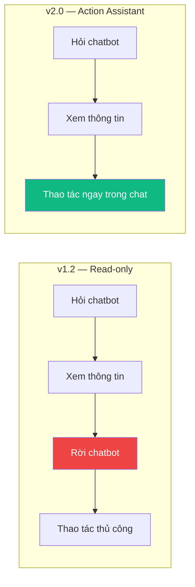
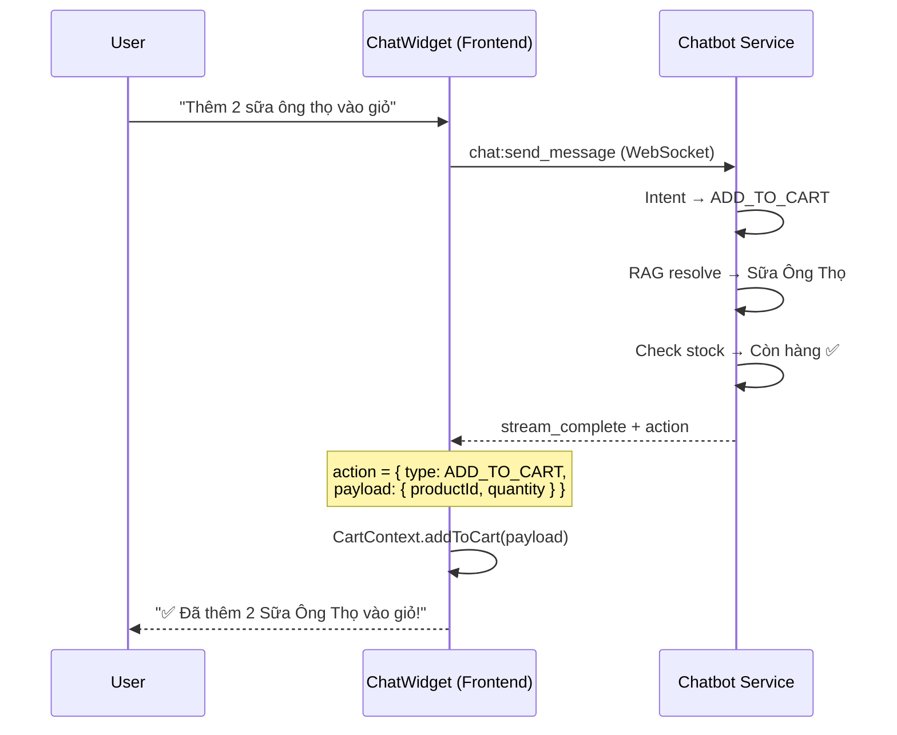
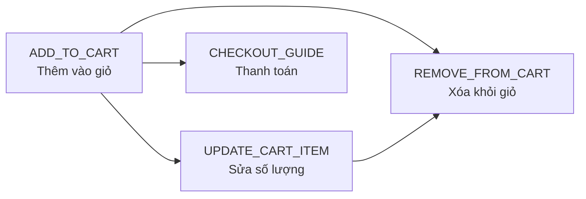
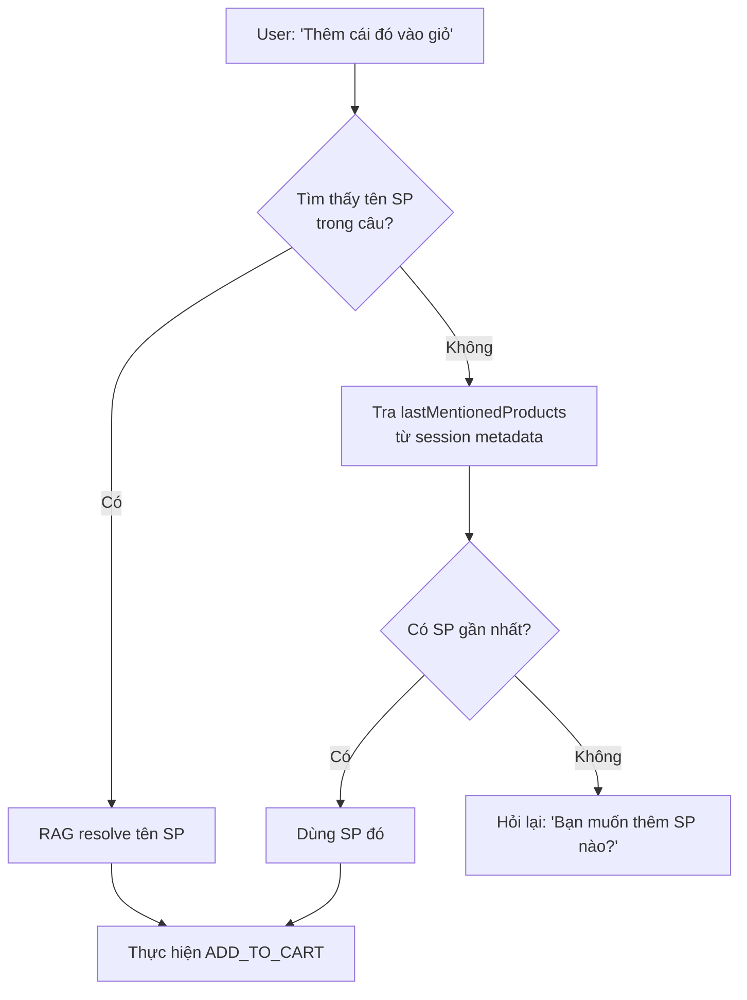
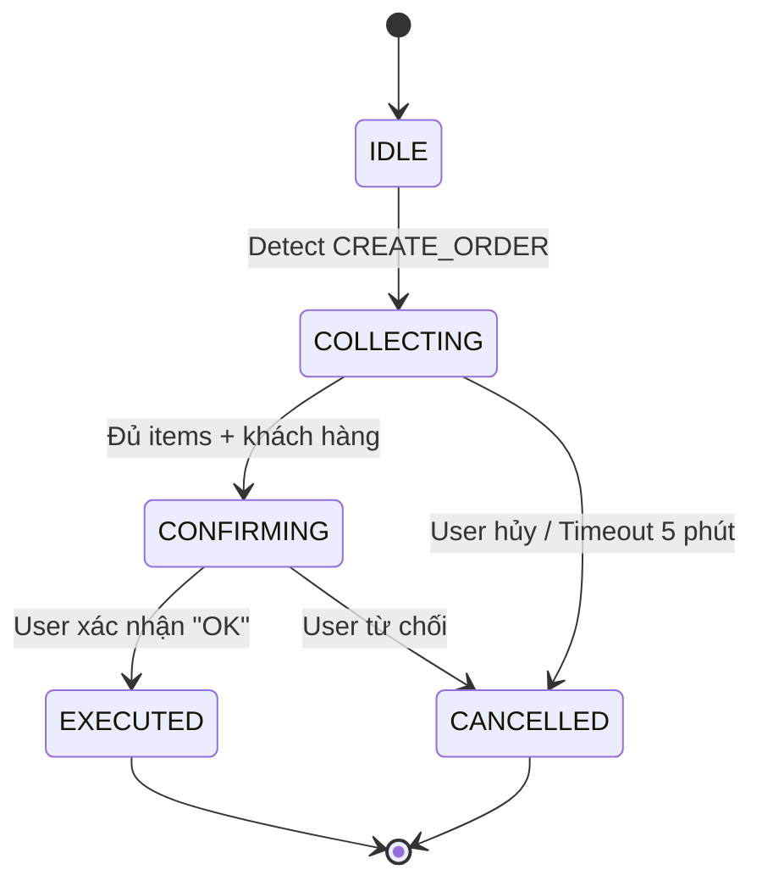
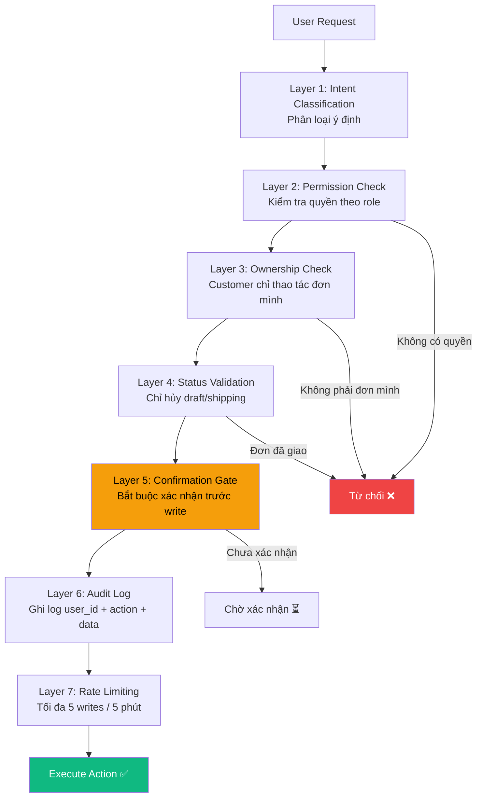
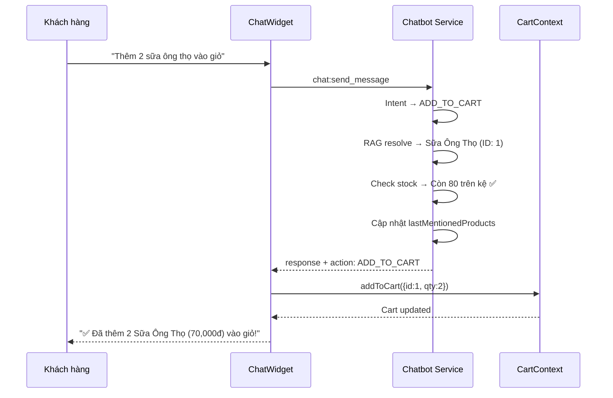
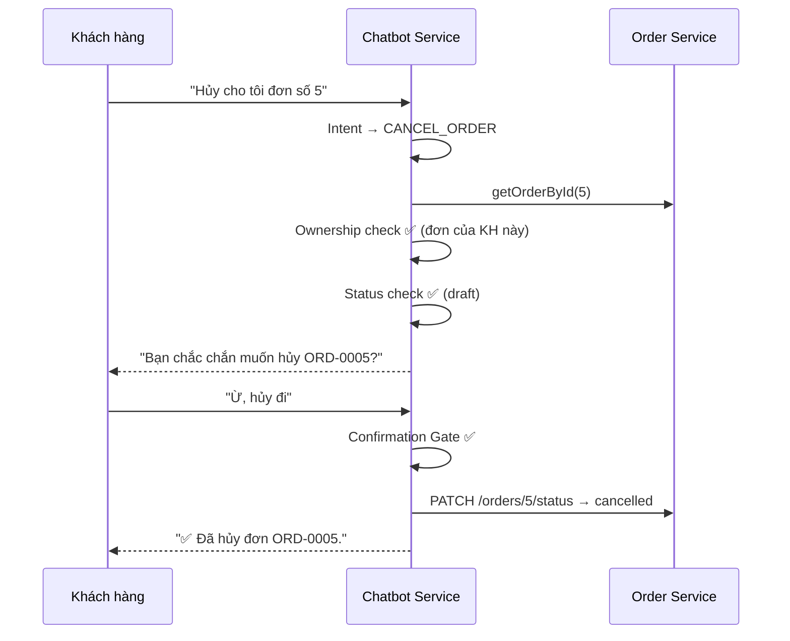
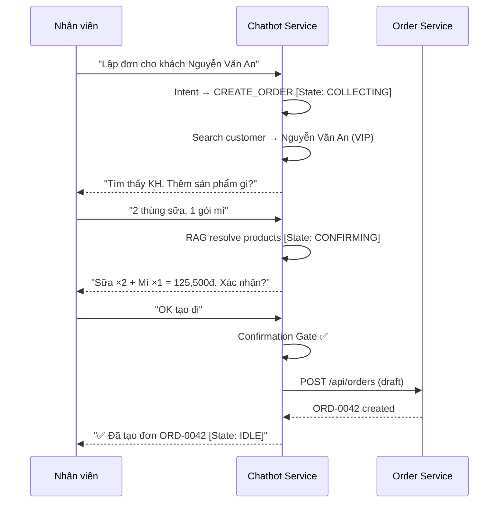

# BÁO CÁO ĐỒ ÁN: Chatbot Trợ Lý Thao Tác (Action Assistant) — POSMART

> **Sinh viên thực hiện**: [Tên SV]
> **GVHD**: [Tên GV]
> **Ngày**: 2026-05-08

---

## 1. TỔNG QUAN

### 1.1 Đặt vấn đề

Chatbot POSMART phiên bản hiện tại (v1.2) hoạt động ở chế độ **chỉ đọc (read-only)** — chỉ hỗ trợ tra cứu thông tin (tồn kho, giá, đơn hàng) và gợi ý sản phẩm thông qua RAG Pipeline. Khi khách hàng thấy một sản phẩm hấp dẫn từ chatbot, họ phải **rời khỏi giao diện chat**, tìm lại sản phẩm trên trang web, rồi mới thêm vào giỏ được.

Hiện tượng này tạo ra **ma sát trải nghiệm (UX Friction)** — mỗi bước rời khỏi chatbot là một cơ hội để mất khách hàng:

```
Luồng hiện tại (6 bước): Hỏi chatbot → Xem gợi ý → Đóng chat → Tìm SP → Thêm giỏ → Checkout
Luồng đề xuất (3 bước): Hỏi chatbot → "Thêm vào giỏ" → Checkout
```

### 1.2 Mục tiêu

Nâng cấp chatbot thành **Trợ lý thao tác (Action Assistant)** có khả năng tương tác hai chiều với hệ thống:

| Đối tượng | Khả năng hiện tại | Khả năng mới |
|---|---|---|
| **Khách hàng** (Customer Web) | Tra cứu, gợi ý | + Thêm/xóa/sửa giỏ hàng, hủy đơn, theo dõi giao hàng |
| **Nhân viên** (POS) | Tra cứu | + Thêm SP vào POS, tạo/hủy đơn, kiểm tra thanh toán |

### 1.3 Phạm vi

Báo cáo này tập trung vào **thiết kế kiến trúc** của Action Assistant, bao gồm:
- Giao thức truyền lệnh thao tác (Action Protocol)
- Quản lý hội thoại nhiều vòng (Multi-turn Conversation)
- Hiểu ngữ cảnh đại từ chỉ định (Contextual Pronoun Resolution)
- Mô hình phân quyền và bảo mật 7 lớp

---

## 2. HIỆN TRẠNG VÀ PHÂN TÍCH

### 2.1 Capabilities đã có (v1.2)

| Intent | Mô tả | Employee | Customer |
|---|---|---|---|
| `CHECK_STOCK` | Kiểm tra tồn kho | ✅ Full data | ✅ Simplified |
| `CHECK_PRICE` | Kiểm tra giá | ✅ Raw + ID | ✅ + O2O + co-purchase |
| `ORDER_STATUS` | Trạng thái đơn | ✅ Full detail | ✅ Chỉ đơn của mình |
| `RECOMMENDATION` | Gợi ý sản phẩm | ✅ RAG Pipeline | ✅ + Personalization |
| `SEARCH_PRODUCT` | Tìm kiếm | ✅ Semantic | ✅ Same |
| `FREE_CHAT` | Trò chuyện | ✅ Streaming | ✅ Same |
| `HELP` | Hướng dẫn | ✅ | ✅ |

> **Nhận xét**: Tất cả 7 intents đều là **read-only** — chatbot không thể thực hiện bất kỳ thao tác nào thay đổi dữ liệu hệ thống.

### 2.2 Phân tích khoảng cách (Gap Analysis)



| Gap | Mô tả | Ảnh hưởng |
|---|---|---|
| Không thêm được giỏ hàng | Khách thấy SP đẹp nhưng phải tự tìm lại | Giảm tỷ lệ chuyển đổi |
| Không quản lý giỏ hàng 2 chiều | Khách muốn "bỏ sữa ra" phải tự thao tác | UX Friction |
| Không hiểu đại từ chỉ định | "Thêm cái đó vào giỏ" → chatbot không hiểu | Hội thoại không tự nhiên |
| Không hủy đơn hàng | Khách phải liên hệ nhân viên để hủy đơn | Phụ thuộc con người |
| Không tạo đơn POS | Nhân viên phải thao tác tay trên giao diện | Giảm năng suất |

---

## 3. THIẾT KẾ GIẢI PHÁP

### 3.1 Intents mới — Write Actions

#### Khách hàng (Customer Web) — 7 intents mới

| Intent | Ví dụ kích hoạt | Mô tả |
|---|---|---|
| `ADD_TO_CART` | "Thêm 2 sữa ông thọ vào giỏ" | Thêm SP vào giỏ hàng |
| `REMOVE_FROM_CART` | "Bỏ hộp sữa ra đi" | Xóa SP khỏi giỏ |
| `UPDATE_CART_ITEM` | "Giảm xuống còn 1 hộp" | Thay đổi số lượng |
| `VIEW_CART` | "Trong giỏ có gì?" | Xem giỏ hàng |
| `TRACK_ORDER` | "Đơn #5 giao tới đâu rồi?" | Theo dõi giao hàng |
| `CANCEL_ORDER` | "Hủy cho tôi đơn số 5" | Hủy đơn (chỉ đơn mình, chỉ draft) |
| `CHECKOUT_GUIDE` | "Thanh toán đi" | Hướng dẫn checkout |

#### Nhân viên (POS) — 5 intents mới

| Intent | Ví dụ kích hoạt | Mô tả |
|---|---|---|
| `POS_ADD_ITEM` | "Thêm 3 mì hảo hảo" | Thêm SP vào giỏ POS |
| `CREATE_ORDER` | "Lập đơn cho khách An" | Tạo đơn hàng (multi-turn) |
| `CANCEL_ORDER` | "Hủy đơn #42" | Hủy đơn (draft/shipping) |
| `PAYMENT_CHECK` | "Đơn #42 thanh toán chưa?" | Kiểm tra thanh toán |
| `UPDATE_ORDER` | "Thêm mì vào đơn #42" | Cập nhật đơn nháp |

> Tổng cộng: Từ **7 intents** (read-only) lên **15 intents** (read + write).

### 3.2 Action Response Protocol — Kiến trúc cốt lõi

**Bài toán**: Làm sao để chatbot (backend) can thiệp vào trạng thái giao diện (frontend) mà không phá vỡ luồng dữ liệu?

**Giải pháp**: Thiết kế **Action Protocol** — chatbot trả về một chỉ thị `action` kèm theo response, frontend tự thực thi:



**Điểm then chốt**: Backend **không trực tiếp thao tác** giỏ hàng — chỉ trả về `action` cho frontend tự xử lý. Điều này đảm bảo:
- Backend hoàn toàn **stateless** về giỏ hàng
- Frontend giữ toàn quyền quản lý state
- Cùng một protocol hoạt động trên cả Customer Web và POS

**Bảng Action Types**:

| Action Type | Frontend xử lý | Yêu cầu xác nhận? |
|---|---|---|
| `ADD_TO_CART` | Thêm vào giỏ hàng | ❌ Không |
| `REMOVE_FROM_CART` | Xóa khỏi giỏ hàng | ❌ Không |
| `UPDATE_CART_ITEM` | Cập nhật số lượng | ❌ Không |
| `NAVIGATE` | Chuyển trang | ❌ Không |
| `CREATE_ORDER` | Gọi API tạo đơn | ✅ Bắt buộc |
| `CANCEL_ORDER` | Gọi API hủy đơn | ✅ Bắt buộc |

### 3.3 Quản lý giỏ hàng 2 chiều (Bi-directional Cart)

Trong thực tế, khách hàng thường xuyên đổi ý (Buyer's Remorse). Hệ thống hỗ trợ đầy đủ vòng đời giỏ hàng:



**Ví dụ hội thoại**:
```
KH: "Thêm 2 sữa ông thọ vào giỏ"    → ADD_TO_CART
KH: "Thôi bỏ hộp sữa ra đi"          → REMOVE_FROM_CART
KH: "Giảm xuống còn 1 hộp thôi"       → UPDATE_CART_ITEM
KH: "Xóa hết giỏ hàng đi"            → REMOVE_FROM_CART (clear all)
```

### 3.4 Hiểu đại từ chỉ định (Contextual Pronoun Resolution)

**Vấn đề**: Trong hội thoại tự nhiên, người dùng thường **không gõ lại tên sản phẩm**:

```
CB: "Mình có Ba chỉ bò Mỹ giá 125,000đ, còn 15 trên kệ."
KH: "Ok, thêm cái đó vào giỏ đi"     ← "cái đó" là gì?
KH: "Lấy 2 hộp"                       ← "2 hộp" của SP nào?
```

**Giải pháp**: Lưu `lastMentionedProducts` trong session metadata. Mỗi khi chatbot trả về sản phẩm (qua CHECK_PRICE, RECOMMENDATION, SEARCH_PRODUCT...), danh sách này tự động cập nhật.



**Cấu trúc session metadata**:

| Trường | Mô tả |
|---|---|
| `pendingAction` | Trạng thái multi-turn (type, state, data, expiresAt) |
| `lastMentionedProducts` | Danh sách SP gần nhất [{id, name, unitPrice}] — tự động cập nhật |

### 3.5 Hội thoại nhiều vòng (Multi-turn Conversation)

Với các thao tác phức tạp như tạo đơn hàng, chatbot cần duy trì trạng thái qua nhiều lượt hội thoại:



**Ví dụ hội thoại CREATE_ORDER (Employee)**:

| Lượt | Người nói | Nội dung | State |
|---|---|---|---|
| 1 | NV | "Lập đơn cho khách Nguyễn Văn An" | → COLLECTING |
| 2 | CB | "Tìm thấy KH: Nguyễn Văn An (VIP). Thêm SP gì?" | COLLECTING |
| 3 | NV | "2 thùng sữa ông thọ, 1 gói mì" | COLLECTING |
| 4 | CB | "Xác nhận: Sữa ×2 + Mì ×1 = 125,500đ. Tạo?" | → CONFIRMING |
| 5 | NV | "OK tạo đi" | → EXECUTED |
| 6 | CB | "✅ Đã tạo đơn ORD-0042. Tổng: 125,500đ" | → IDLE |

> **Lưu trữ**: Trạng thái được lưu trong `chat_session.metadata` (JSONB) với **auto-expire 5 phút** — nếu không có tương tác, state tự động reset về IDLE.

---

## 4. MÔ HÌNH BẢO MẬT

### 4.1 Ma trận phân quyền

| Thao tác | Employee | Customer | Kiểm tra |
|---|---|---|---|
| Thêm/xóa/sửa giỏ (client) | ✅ | ✅ | Stock check |
| Tạo đơn hàng | ✅ | ❌ (redirect checkout) | Permission + stock |
| Hủy đơn (Employee) | ✅ (draft/shipping) | — | Permission + status |
| Hủy đơn (Customer) | — | ✅ (đơn mình, draft) | Ownership + status |
| Cập nhật đơn | ✅ (chỉ draft) | ❌ | Permission + status |
| Kiểm tra thanh toán | ✅ (tất cả) | ✅ (đơn mình) | Ownership |

### 4.2 Kiến trúc bảo mật 7 lớp



> **Layer 5 (Confirmation Gate)** là lớp quan trọng nhất — đảm bảo ngay cả khi AI hiểu sai intent, hệ thống vẫn **không thực thi** cho đến khi người dùng xác nhận rõ ràng.

---

## 5. LUỒNG HOẠT ĐỘNG CHI TIẾT

### 5.1 Customer: Thêm vào giỏ hàng



### 5.2 Customer: Hủy đơn hàng



### 5.3 Employee: Tạo đơn hàng (Multi-turn)



---

## 6. SO SÁNH TRƯỚC VÀ SAU

| Tiêu chí | v1.2 (Read-only) | v2.0 (Action Assistant) |
|---|---|---|
| **Chế độ** | Chỉ tra cứu | Tra cứu + Thao tác |
| **Intents** | 7 | 15 (+8 write) |
| **Cart Management** | Không | 2 chiều (Add / Remove / Update) |
| **Pronoun Resolution** | Không | ✅ `lastMentionedProducts` |
| **Conversation** | Single-turn (1 vòng) | Multi-turn (State Machine) |
| **Customer tự phục vụ** | Chỉ xem | Thêm giỏ, hủy đơn, checkout |
| **Nhân viên POS** | Chỉ tra cứu | Tạo đơn, quản lý thanh toán |
| **Bảo mật** | JWT auth | 7 lớp (Permission → Audit) |
| **Nguyên tắc** | — | Data from API, Text from LLM |

---

## 7. TESTCASES

### 7.1 Customer Assistant

| # | Câu test | Kết quả mong đợi | Action |
|---|---|---|---|
| 1 | "Thêm 2 sữa ông thọ vào giỏ" | ✅ Resolve SP + check stock + thêm giỏ | `ADD_TO_CART` |
| 2 | "Thêm abc123 vào giỏ" | ⚠️ "Không tìm thấy sản phẩm" | None |
| 3 | "Thêm nước mắm vào giỏ" (hết hàng) | ⚠️ "Sản phẩm tạm hết hàng" | None |
| 4 | (Sau gợi ý) "Thêm cái đó vào giỏ" | ✅ Tra lastMentionedProducts → thêm | `ADD_TO_CART` |
| 5 | "Thôi bỏ sữa ra đi" | ✅ Xóa SP khỏi giỏ | `REMOVE_FROM_CART` |
| 6 | "Giảm xuống còn 1 hộp" | ✅ Cập nhật số lượng | `UPDATE_CART_ITEM` |
| 7 | "Hủy cho tôi đơn số 5" | ✅ Ownership + status → confirm → cancel | `CANCEL_ORDER` |
| 8 | "Hủy đơn #5" (đã giao) | ⚠️ "Không thể hủy đơn đã giao" | None |
| 9 | "Thanh toán đi" | ✅ Hướng dẫn → redirect /checkout | `NAVIGATE` |

### 7.2 Employee Assistant

| # | Câu test | Kết quả mong đợi | Action |
|---|---|---|---|
| 1 | "Thêm 3 mì hảo hảo" | ✅ Thêm vào POS cart | `POS_ADD_ITEM` |
| 2 | "Lập đơn cho khách An" | ✅ Multi-turn → collecting items | `CREATE_ORDER` |
| 3 | "Hủy đơn #42" | ✅ Check status → confirm → cancel | `CANCEL_ORDER` |
| 4 | "Đơn #42 thanh toán chưa?" | ✅ Payment status + options | `PAYMENT_CHECK` |
| 5 | "Hủy đơn #42" (đã giao) | ⚠️ "Không thể hủy đơn đã giao" | None |

---

## 8. RỦI RO VÀ GIẢI PHÁP

| Rủi ro | Mức độ | Giải pháp |
|---|---|---|
| AI bịa dữ liệu (hallucination) | 🔴 Cao | LLM chỉ format text, data luôn từ API |
| Tạo đơn nhầm | 🔴 Cao | Confirmation Protocol bắt buộc (Layer 5) |
| Khách thao tác đơn người khác | 🔴 Cao | Ownership Check bắt buộc (Layer 3) |
| Multi-turn state phức tạp | 🟡 Trung bình | Session metadata JSONB + auto-expire 5 phút |
| Spam tạo đơn (abuse) | 🟡 Trung bình | Rate limiting: 5 writes / session / 5 phút |
| Tăng latency (nhiều API calls) | 🟡 Trung bình | Parallel requests + caching |

---

## 9. KẾT LUẬN

Chatbot Action Assistant v2.0 giải quyết bài toán cốt lõi: **biến chatbot từ công cụ tra cứu thụ động thành trợ lý thao tác chủ động**. Với kiến trúc Action Protocol, backend hoàn toàn độc lập khỏi frontend state, trong khi vẫn cho phép chatbot điều khiển giỏ hàng, đơn hàng và thanh toán một cách an toàn qua 7 lớp bảo mật.

Hệ thống mở rộng từ 7 intents read-only lên 15 intents (read + write), hỗ trợ hội thoại nhiều vòng (Multi-turn State Machine), quản lý giỏ hàng 2 chiều, và giải quyết bài toán hiểu ngữ cảnh tự nhiên (Pronoun Resolution) — tất cả đều dựa trên nguyên tắc **"Data from API, Text from LLM"** để loại bỏ rủi ro AI hallucination.
