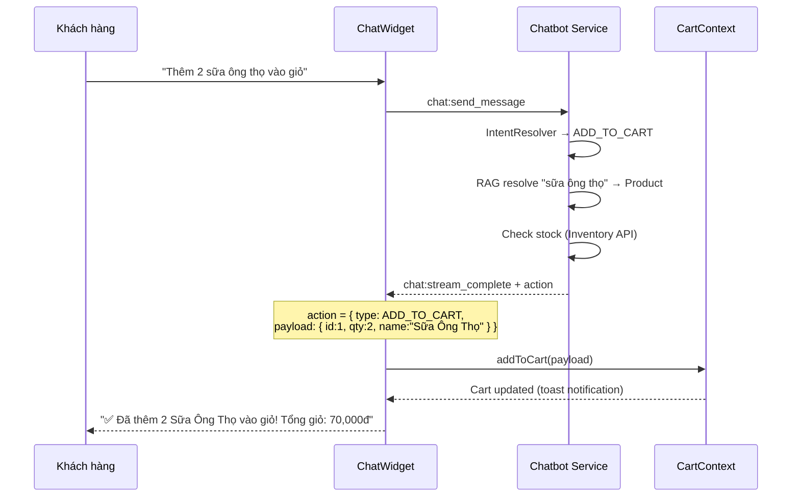
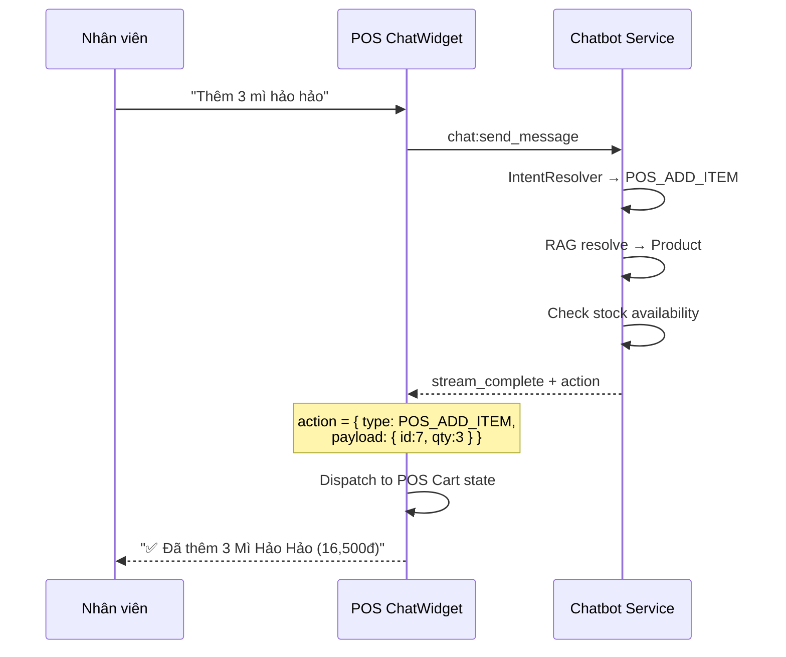

# BÁO CÁO KỸ THUẬT: CHATBOT ASSISTANT — TRỢ LÝ THAO TÁC HỆ THỐNG

> **Phiên bản**: v2.0 Draft
> **Ngày**: 2026-05-07
> **Tác giả**: POSMART Team
> **Phạm vi**: Chatbot Service + Customer Web + POS Frontend

---

## 1. TỔNG QUAN

### 1.1 Bối cảnh

Chatbot POSMART hiện tại (v1.2) hoạt động ở chế độ **read-only** — chỉ tra cứu thông tin (tồn kho, giá, đơn hàng) và gợi ý sản phẩm (RAG Pipeline). Người dùng phải rời khỏi chatbot để thực hiện các thao tác như thêm vào giỏ hàng, đặt hàng, hay thanh toán.

### 1.2 Mục tiêu

Nâng cấp chatbot thành **Trợ lý thao tác (Action Assistant)** có khả năng **write** vào hệ thống:

| Đối tượng | Khả năng mới |
|---|---|
| **Customer** (Web) | Thêm vào giỏ hàng, kiểm tra đơn hàng, theo dõi giao hàng |
| **Employee** (POS) | Thêm vào giỏ hàng POS, kiểm tra tồn kho nâng cao, quản lý đơn hàng, kiểm tra thanh toán |

### 1.3 Nguyên tắc thiết kế

1. **Confirmation Protocol**: Mọi write action bắt buộc xác nhận trước khi thực thi
2. **Least Privilege**: Chatbot chỉ có quyền tối thiểu cần thiết cho từng role
3. **Audit Trail**: Mọi thao tác write được log với user_id + session_id
4. **Graceful Degradation**: Nếu API downstream lỗi → thông báo rõ ràng, không crash
5. **Data from API, Text from LLM**: LLM chỉ format text, data luôn đến từ API thật

---

## 2. HIỆN TRẠNG HỆ THỐNG (v1.2)

### 2.1 Capabilities đã có (Read-only)

| Intent | Mô tả | Employee | Customer |
|---|---|---|---|
| `CHECK_STOCK` | Kiểm tra tồn kho | ✅ Full data | ✅ Simplified |
| `CHECK_PRICE` | Kiểm tra giá | ✅ Raw + ID | ✅ + O2O + co-purchase |
| `ORDER_STATUS` | Trạng thái đơn | ✅ Full detail | ✅ Chỉ đơn của mình |
| `RECOMMENDATION` | Gợi ý sản phẩm | ✅ RAG Pipeline | ✅ + Personalization |
| `SEARCH_PRODUCT` | Tìm kiếm | ✅ Semantic | ✅ Same |
| `FREE_CHAT` | Trò chuyện | ✅ Streaming | ✅ Same |
| `HELP` | Hướng dẫn | ✅ | ✅ |

### 2.2 Kiến trúc hiện tại

```
Frontend (React) → Socket.IO → Chatbot Service (:3008)
                                    ├── IntentResolver (keyword-based)
                                    ├── ChatService (intent handlers)
                                    ├── RAGService (pgvector)
                                    ├── HFClient (Qwen 7B)
                                    └── ApiClient (S2S HTTP → Catalog, Inventory, Order, Auth)
```

**Điểm quan trọng**:
- `ApiClient` hiện chỉ có READ methods (`getOrderById`, `getOrders`, `searchProducts`, `getInventorySummary`)
- `IntentResolver` chỉ phân loại 7 intents read-only
- `ChatService` xử lý single-turn (1 câu hỏi → 1 câu trả lời), không có multi-turn state
- WebSocket protocol: `chat:send_message` → `chat:stream_chunk` → `chat:stream_complete`

### 2.3 Backend APIs đã có (sẵn sàng cho chatbot gọi)

**Order Service (:3003)**:
| Method | Endpoint | Mô tả |
|---|---|---|
| `POST /api/orders` | Tạo đơn hàng (draft) |
| `PUT /api/orders/:id/items` | Cập nhật items trong đơn |
| `PATCH /api/orders/:id/status` | Đổi trạng thái (cancel, ship, deliver) |
| `DELETE /api/orders/:id` | Xóa đơn hàng |
| `POST /api/orders/:id/refund` | Hoàn tiền |

**Payment Service (:3004)**:
| Method | Endpoint | Mô tả |
|---|---|---|
| `POST /api/payments/direct` | Thanh toán trực tiếp (Cash/Card) |
| `POST /api/payments/vnpay/create-url` | Tạo URL VNPay |
| `GET /api/payments/vnpay/check-status/:ref` | Check VNPay status |
| `POST /api/payments/:id/refund` | Hoàn tiền |

→ **Backend APIs đã đầy đủ**, chatbot chỉ cần gọi qua `ApiClient`.

---

## 3. THIẾT KẾ CHATBOT ASSISTANT

### 3.1 Intents mới — Write Actions

#### Customer Assistant (Giao diện Customer Web)

| Intent | Triggers | Mô tả | Priority |
|---|---|---|---|
| `ADD_TO_CART` | "thêm vào giỏ", "bỏ vào giỏ", "mua [SP]", "lấy [SP]" | Thêm SP vào giỏ hàng trên giao diện | 🔴 High |
| `REMOVE_FROM_CART` | "bỏ ra", "xóa khỏi giỏ", "bỏ [SP] ra" | Xóa SP khỏi giỏ hàng | 🔴 High |
| `UPDATE_CART_ITEM` | "giảm xuống", "tăng lên", "đổi số lượng" | Thay đổi số lượng SP trong giỏ | 🟡 Medium |
| `VIEW_CART` | "giỏ hàng", "xem giỏ", "trong giỏ có gì" | Xem giỏ hàng hiện tại | 🟡 Medium |
| `TRACK_ORDER` | "theo dõi đơn", "đơn đang ở đâu", "giao tới đâu rồi" | Theo dõi shipping status | 🟡 Medium |
| `CANCEL_ORDER` | "hủy đơn", "cancel đơn" | Hủy đơn hàng (chỉ đơn mình, chỉ draft) | 🟡 Medium |
| `CHECKOUT_GUIDE` | "thanh toán", "checkout", "đặt hàng" | Hướng dẫn/redirect checkout | 🟢 Low |

#### Employee Assistant (Giao diện POS)

| Intent | Triggers | Mô tả | Priority |
|---|---|---|---|
| `POS_ADD_ITEM` | "thêm [SP]", "bán [SP]", "tính tiền [SP]" | Thêm SP vào giỏ POS | 🔴 High |
| `CREATE_ORDER` | "tạo đơn", "lập hóa đơn" | Tạo draft order | 🔴 High |
| `CANCEL_ORDER` | "hủy đơn", "cancel" | Hủy đơn (draft/shipping only) | 🔴 High |
| `PAYMENT_CHECK` | "thanh toán chưa", "payment status" | Kiểm tra trạng thái thanh toán | 🟡 Medium |
| `UPDATE_ORDER` | "sửa đơn", "thêm SP vào đơn" | Cập nhật items trong draft | 🟡 Medium |

### 3.2 Kiến trúc mới — Action Protocol

```
┌─── Frontend ──────────────────────────────────────────────┐
│                                                           │
│  ChatWidget                                               │
│    ├── chat:stream_complete → { intent, products, action }│
│    │                                                      │
│    ├── [NEW] action.type = 'ADD_TO_CART'                  │
│    │   └── CartContext.addToCart(product)  ← Frontend xử lý│
│    │                                                      │
│    ├── [NEW] action.type = 'NAVIGATE'                     │
│    │   └── navigate(action.url)                           │
│    │                                                      │
│    └── [NEW] action.type = 'CONFIRM_REQUIRED'             │
│        └── Hiện dialog xác nhận → chat:confirm_action     │
│                                                           │
└───────────────┬───────────────────────────────────────────┘
                │ Socket.IO
┌───────────────▼───────────────────────────────────────────┐
│  Chatbot Service (:3008)                                  │
│                                                           │
│  IntentResolver  →  ChatService                           │
│    [+8 write intents]  [+action handlers]                 │
│                          │                                │
│                    ActionExecutor [NEW]                    │
│                    ├── Permission check                   │
│                    ├── Confirmation gate                  │
│                    ├── ApiClient.writeMethod()             │
│                    └── Audit log                           │
│                                                           │
│  ApiClient [EXTEND]                                       │
│    [+createOrder, +cancelOrder, +createPayment, +refund]  │
└───────────────────────────────────────────────────────────┘
```

### 3.3 Action Response Protocol

Khi chatbot phát hiện write intent, response sẽ chứa thêm trường `action`:

```json
{
  "type": "complete",
  "intent": "ADD_TO_CART",
  "fullText": "Đã thêm Sữa Ông Thọ vào giỏ hàng! Bạn muốn mua thêm gì không?",
  "products": [{ "id": 1, "name": "Sữa Ông Thọ", "unitPrice": 35000 }],
  "action": {
    "type": "ADD_TO_CART",
    "payload": { "productId": 1, "quantity": 1, "name": "Sữa Ông Thọ", "price": 35000 },
    "requireConfirm": false
  }
}
```

**Action Types**:

| type | Frontend xử lý | Confirm? |
|---|---|---|
| `ADD_TO_CART` | `CartContext.addToCart(payload)` | ❌ (lightweight) |
| `REMOVE_FROM_CART` | `CartContext.removeFromCart(payload.productId)` | ❌ |
| `UPDATE_CART_ITEM` | `CartContext.updateQuantity(payload.productId, payload.quantity)` | ❌ |
| `NAVIGATE` | `navigate(payload.url)` | ❌ |
| `CREATE_ORDER` | Gọi API + hiện kết quả | ✅ Bắt buộc |
| `CANCEL_ORDER` | Gọi API + hiện kết quả | ✅ Bắt buộc |
| `CONFIRM_REQUIRED` | Hiện dialog xác nhận | ✅ |

### 3.4 Multi-turn Conversation State

Với write actions phức tạp (CREATE_ORDER), cần **multi-turn state**:

```
State Machine cho CREATE_ORDER:
┌──────────┐    ┌──────────────┐    ┌─────────────┐    ┌───────────┐
│  IDLE    │───>│ COLLECTING   │───>│ CONFIRMING  │───>│ EXECUTED  │
│          │    │ (items, KH)  │    │ (show recap)│    │ (done)    │
└──────────┘    └──────────────┘    └─────────────┘    └───────────┘
                      │                    │
                      └──── CANCELLED <────┘
```

**Lưu trữ**: `chat_session.metadata` (JSONB) — auto-expire sau 5 phút không tương tác.

```json
{
  "pendingAction": {
    "type": "CREATE_ORDER",
    "state": "COLLECTING",
    "data": {
      "customerId": 123,
      "items": [{ "productId": 1, "quantity": 2 }]
    },
    "expiresAt": "2026-05-07T13:15:00Z"
  },
  "lastMentionedProducts": [
    { "id": 1, "name": "Sữa Ông Thọ", "unitPrice": 35000 }
  ]
}
```

> **`lastMentionedProducts`**: Lưu danh sách sản phẩm được đề cập/gợi ý gần nhất trong hội thoại. Dùng để giải quyết **Contextual Pronoun Resolution** — khi khách nói "thêm cái đó vào giỏ" hoặc "lấy 2 hộp" mà không nêu tên sản phẩm, hệ thống tra cứu `lastMentionedProducts` để xác định sản phẩm được tham chiếu.

---

## 4. LUỒNG CHI TIẾT THEO ROLE

### 4.1 Customer: ADD_TO_CART Flow



**Điểm quan trọng**:
- Chatbot **không gọi API tạo đơn** — chỉ trả về `action` cho frontend
- Frontend tự xử lý `addToCart` qua `CartContext` (client-side state)
- Nếu hết hàng → chatbot thông báo "Sản phẩm tạm hết hàng" (không trả action)
- **Contextual Pronoun Resolution**: Nếu user nói "thêm cái đó vào giỏ" mà không nêu tên SP → chatbot tra `lastMentionedProducts` từ session metadata để xác định SP

### 4.2 Customer: REMOVE_FROM_CART / UPDATE_CART_ITEM Flow

```
KH: "Thôi bỏ hộp sữa ra đi"
CB: IntentResolver → REMOVE_FROM_CART
    → RAG resolve "sữa" hoặc tra lastMentionedProducts
    → action: { type: REMOVE_FROM_CART, payload: { productId: 1 } }
    → "✅ Đã bỏ Sữa Ông Thọ khỏi giỏ."

KH: "Giảm xuống còn 1 hộp thôi"
CB: IntentResolver → UPDATE_CART_ITEM
    → tra lastMentionedProducts → productId: 1
    → action: { type: UPDATE_CART_ITEM, payload: { productId: 1, quantity: 1 } }
    → "✅ Đã cập nhật Sữa Ông Thọ: 1 hộp."
```

### 4.2 Customer: TRACK_ORDER Flow

```
KH: "Đơn hàng #5 giao tới đâu rồi?"
CB: IntentResolver → TRACK_ORDER
    → ApiClient.getOrderById(5)
    → Filter: chỉ hiện nếu order.customerId === session.userId
    → Format: timeline (draft → paid → shipping → ???)
    → Response + action: { type: NAVIGATE, payload: { url: "/order-status/5" } }
KH: Thấy timeline + nút "Xem chi tiết" → navigate
```

### 4.3 Employee: POS_ADD_ITEM Flow



### 4.4 Employee: CREATE_ORDER Flow (Multi-turn)

```
NV: "Lập đơn cho khách Nguyễn Văn An"
CB: → Detect CREATE_ORDER → Search customer → Set state=COLLECTING
    → "Tìm thấy KH: Nguyễn Văn An (VIP). Thêm sản phẩm gì?"

NV: "2 thùng sữa ông thọ, 1 gói mì hảo hảo"
CB: → State=COLLECTING → RAG resolve products → Update pending items
    → "Xác nhận đơn:
       1. Sữa Ông Thọ x2 — 120,000đ
       2. Mì Hảo Hảo x1 — 5,500đ
       Tổng: 125,500đ. Xác nhận tạo?"
    → Set state=CONFIRMING

NV: "OK tạo đi"
CB: → State=CONFIRMING → Detect confirmation
    → ApiClient.createOrder(orderData)
    → "✅ Đã tạo đơn ORD-0042 (Nháp). Tổng: 125,500đ"
    → Set state=IDLE, clear pendingAction
```

### 4.5 Employee: PAYMENT_CHECK Flow

```
NV: "Đơn #42 thanh toán chưa?"
CB: → PAYMENT_CHECK
    → ApiClient.getOrderById(42) + check paymentStatus
    → "Đơn ORD-0042: Chờ thanh toán (pending). Tổng: 125,500đ.
       Bạn muốn thanh toán bằng phương thức nào? (Tiền mặt / VNPay)"
```

---

## 5. BẢO MẬT & PHÂN QUYỀN

### 5.1 Permission Matrix

| Action | Employee | Customer | Validation |
|---|---|---|---|
| Thêm vào giỏ (client-side) | ✅ | ✅ | Stock check |
| Xóa/sửa giỏ hàng (client-side) | ✅ | ✅ | None (client state) |
| Tạo đơn hàng | ✅ (`manage_orders`) | ❌ (redirect checkout) | Permission + stock |
| Hủy đơn (Employee) | ✅ (draft/shipping only) | — | Permission + status |
| Hủy đơn (Customer) | — | ✅ (chỉ đơn mình, chỉ draft) | Ownership + status + Confirm |
| Cập nhật đơn | ✅ (chỉ draft) | ❌ | Permission + status |
| Kiểm tra payment | ✅ (tất cả đơn store) | ✅ (chỉ đơn mình) | Ownership |
| Hoàn tiền | ✅ (`manage_payments`) | ❌ (yêu cầu qua NV) | Permission |

### 5.2 Security Layers

```
Layer 1: IntentResolver     → Phân loại intent
Layer 2: Permission Check   → session.userType + permissions
Layer 3: Ownership Check    → order.customerId === session.userId (Customer)
Layer 4: Status Check       → Chỉ cancel draft/shipping, chỉ update draft
Layer 5: Confirmation Gate  → Explicit "xác nhận" trước write
Layer 6: Audit Log          → INSERT audit_log (user_id, action, data, session_id)
Layer 7: Rate Limiting      → Max 5 write actions/session/5min
```

### 5.3 ApiClient Token

Hiện tại ApiClient dùng internal service token với quyền READ-only:
```js
permissions: ['products.read', 'inventory.read', 'orders.read', 'customers.read']
```

Cần mở rộng cho write actions:
```js
permissions: [...existing, 'orders.write', 'payments.write']
```

→ **Quan trọng**: Token này có quyền rộng, nên mọi write action PHẢI qua Confirmation Gate.

---

## 6. THAY ĐỔI CODE CẦN THIẾT

### 6.1 Backend — Chatbot Service

| File | Thay đổi | Effort |
|---|---|---|
| `intent.resolver.js` | +8 write intent patterns | 🟢 Low |
| `chat.service.js` | +8 action handlers, multi-turn state machine, pronoun resolution | 🔴 High |
| `api.client.js` | +`createOrder()`, `cancelOrder()`, `updateOrderItems()`, `createPayment()` | 🟡 Medium |
| `chat.handler.js` | +`chat:confirm_action` event, action relay | 🟡 Medium |
| `init.sql` | +`metadata JSONB` cho `chat_session` (pending state) | 🟢 Low |
| **[NEW]** `action.executor.js` | Permission check + confirmation gate + audit log | 🔴 High |
| **[NEW]** `action.types.js` | Action type constants + validation schemas | 🟢 Low |

### 6.2 Frontend — Customer Web

| File | Thay đổi | Effort |
|---|---|---|
| `ChatWidget/components/ChatMessage.jsx` | Render action buttons (Add to Cart, Navigate) | 🟡 Medium |
| `ChatWidget/ChatWidget.jsx` | Handle `action` from `stream_complete`, integrate CartContext | 🟡 Medium |
| `services/chatFeedbackService.js` | +`trackAction()` method | 🟢 Low |

### 6.3 Frontend — POS

| File | Thay đổi | Effort |
|---|---|---|
| POS ChatWidget | Handle `POS_ADD_ITEM` action → dispatch to POS cart state | 🟡 Medium |
| POS ChatWidget | Handle `CREATE_ORDER` confirmation dialog | 🟡 Medium |

---

## 7. TESTCASES

### 7.1 Customer Assistant

| # | Câu test | Expected | Action |
|---|---|---|---|
| 1 | "thêm 2 sữa ông thọ vào giỏ" | ✅ Resolve SP + check stock + thêm giỏ | `ADD_TO_CART` |
| 2 | "thêm abc123 vào giỏ" | ⚠️ "Không tìm thấy sản phẩm" | None |
| 3 | "thêm nước mắm vào giỏ" (hết hàng) | ⚠️ "Sản phẩm tạm hết hàng" | None |
| 4 | (Sau gợi ý SP) "thêm cái đó vào giỏ" | ✅ Tra `lastMentionedProducts` → thêm giỏ | `ADD_TO_CART` |
| 5 | (Sau gợi ý SP) "lấy 2 hộp" | ✅ Tra `lastMentionedProducts` → thêm 2 | `ADD_TO_CART` |
| 6 | "thôi bỏ sữa ra đi" | ✅ Xóa SP khỏi giỏ | `REMOVE_FROM_CART` |
| 7 | "giảm xuống còn 1 hộp" | ✅ Cập nhật số lượng | `UPDATE_CART_ITEM` |
| 8 | "xóa hết giỏ hàng đi" | ✅ Clear cart | `REMOVE_FROM_CART` |
| 9 | "xem giỏ hàng" | ✅ Hiện danh sách items trong giỏ | `VIEW_CART` |
| 10 | "đơn #5 giao tới đâu rồi" | ✅ Timeline + nút xem chi tiết | `NAVIGATE` |
| 11 | "hủy cho tôi đơn số 5" | ✅ Ownership + status check → confirm | `CANCEL_ORDER` |
| 12 | "hủy đơn #5" (đã giao) | ⚠️ "Không thể hủy đơn đã giao" | None |
| 13 | "thanh toán đi" | ✅ Hướng dẫn → redirect /checkout | `NAVIGATE` |

### 7.2 Employee Assistant

| # | Câu test | Expected | Action |
|---|---|---|---|
| 1 | "thêm 3 mì hảo hảo" | ✅ Thêm vào POS cart | `POS_ADD_ITEM` |
| 2 | "lập đơn cho khách An" | ✅ Multi-turn → collecting items | `CREATE_ORDER` |
| 3 | "hủy đơn #42" | ✅ Check status → confirm → cancel | `CANCEL_ORDER` |
| 4 | "đơn #42 thanh toán chưa" | ✅ Payment status + options | `PAYMENT_CHECK` |
| 5 | "hủy đơn #42" (đã giao) | ⚠️ "Không thể hủy đơn đã giao" | None |

---

## 8. TIMELINE & PHASES

### Phase 1: Foundation (1 tuần)

- [ ] `action.executor.js` — Permission + Confirmation + Audit framework
- [ ] `action.types.js` — Constants + validation
- [ ] `api.client.js` — Extend write methods
- [ ] `intent.resolver.js` — Add write intents
- [ ] `init.sql` — Session metadata schema

### Phase 2: Customer Assistant (1 tuần)

- [ ] `ADD_TO_CART` handler + frontend integration
- [ ] `VIEW_CART` handler
- [ ] `TRACK_ORDER` handler
- [ ] `CHECKOUT_GUIDE` handler
- [ ] Customer Web ChatWidget action handling

### Phase 3: Employee Assistant (1-2 tuần)

- [ ] `POS_ADD_ITEM` handler
- [ ] `CREATE_ORDER` multi-turn handler
- [ ] `CANCEL_ORDER` handler
- [ ] `PAYMENT_CHECK` handler
- [ ] `UPDATE_ORDER` handler
- [ ] POS ChatWidget action handling

### Phase 4: Polish & Security (1 tuần)

- [ ] Rate limiting
- [ ] Comprehensive audit logging
- [ ] Error handling edge cases
- [ ] E2E testing all flows

**Tổng effort ước tính**: 4-5 tuần

---

## 9. RỦI RO & GIẢI PHÁP

| Rủi ro | Mức độ | Giải pháp |
|---|---|---|
| LLM hallucination (bịa data) | 🔴 High | LLM chỉ format text, data luôn từ API |
| Multi-turn state phức tạp | 🟡 Medium | Session metadata JSONB + auto-expire 5 phút |
| Write action sai (tạo đơn nhầm) | 🔴 High | Confirmation protocol bắt buộc |
| Abuse (spam tạo đơn) | 🟡 Medium | Rate limiting 5 writes/session/5min |
| Latency tăng (nhiều API calls) | 🟡 Medium | Parallel requests + caching |
| Customer thao tác đơn người khác | 🔴 High | Ownership check bắt buộc (Layer 3) |

---

## 10. SO SÁNH TRƯỚC/SAU

| Khía cạnh | v1.2 (Hiện tại) | v2.0 (Assistant) |
|---|---|---|
| **Chế độ** | Read-only | Read + Write |
| **Intents** | 7 (tra cứu) | 15 (tra cứu + thao tác) |
| **Cart Management** | Không | 2 chiều (Add/Remove/Update) |
| **Conversation** | Single-turn | Multi-turn (state machine) |
| **Pronoun Resolution** | Không | ✅ `lastMentionedProducts` |
| **Frontend** | Hiển thị text + product cards | + Action buttons + cart integration |
| **Security** | JWT auth only | + Permission + Ownership + Confirmation + Audit |
| **ApiClient** | 8 read methods | 8 read + 5 write methods |
| **WebSocket events** | 5 events | 7 events (+confirm, +action) |
