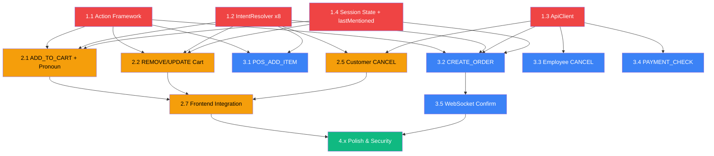

# IMPLEMENTATION PLAN: CHATBOT ASSISTANT v2.0

> **Tổng effort**: 4-5 tuần | **4 Phases**

---

## Phase 1: Foundation (Tuần 1)

### Task 1.1: Action Framework

> **Files**: `action.executor.js` [NEW], `action.types.js` [NEW]

**action.types.js** — Constants:
```js
const ACTION_TYPES = {
  ADD_TO_CART: 'ADD_TO_CART',
  REMOVE_FROM_CART: 'REMOVE_FROM_CART',
  UPDATE_CART_ITEM: 'UPDATE_CART_ITEM',
  VIEW_CART: 'VIEW_CART',
  POS_ADD_ITEM: 'POS_ADD_ITEM',
  CREATE_ORDER: 'CREATE_ORDER',
  CANCEL_ORDER: 'CANCEL_ORDER',
  UPDATE_ORDER: 'UPDATE_ORDER',
  PAYMENT_CHECK: 'PAYMENT_CHECK',
  TRACK_ORDER: 'TRACK_ORDER',
  CHECKOUT_GUIDE: 'CHECKOUT_GUIDE',
  NAVIGATE: 'NAVIGATE'
};

const CONFIRM_REQUIRED = ['CREATE_ORDER', 'CANCEL_ORDER', 'UPDATE_ORDER'];
```

**action.executor.js** — Core:
- `checkPermission(session, actionType)` → boolean
- `checkOwnership(session, resourceId)` → boolean
- `requireConfirmation(actionType)` → boolean
- `execute(session, actionType, payload)` → result
- `auditLog(session, actionType, payload, result)` → void

### Task 1.2: Extend IntentResolver

> **File**: `intent.resolver.js` [MODIFY]

Thêm 8 write intents với keyword triggers:
```js
ADD_TO_CART: { keywords: ['thêm vào giỏ', 'bỏ vào giỏ', 'mua', 'lấy'], writeAction: true },
REMOVE_FROM_CART: { keywords: ['bỏ ra', 'xóa khỏi giỏ', 'bỏ ra đi', 'xóa hết giỏ'], writeAction: true },
UPDATE_CART_ITEM: { keywords: ['giảm xuống', 'tăng lên', 'đổi số lượng', 'còn 1'], writeAction: true },
POS_ADD_ITEM: { keywords: ['thêm', 'bán', 'tính tiền'], writeAction: true, employeeOnly: true },
CREATE_ORDER: { keywords: ['tạo đơn', 'lập hóa đơn', 'đặt hàng'], writeAction: true, employeeOnly: true },
CANCEL_ORDER: { keywords: ['hủy đơn', 'cancel', 'bỏ đơn'], writeAction: true },
PAYMENT_CHECK: { keywords: ['thanh toán chưa', 'payment status', 'đã trả tiền'], writeAction: true },
UPDATE_ORDER: { keywords: ['sửa đơn', 'thêm SP vào đơn'], writeAction: true, employeeOnly: true }
```

**Chú ý**:
- `ADD_TO_CART` (Customer) vs `POS_ADD_ITEM` (Employee) phân biệt bằng `session.userType`
- `CANCEL_ORDER` cho cả Employee (draft/shipping) và Customer (chỉ đơn mình, chỉ draft)

### Task 1.3: Extend ApiClient

> **File**: `api.client.js` [MODIFY]

Thêm write methods:
```js
async createOrder(orderData) { return this._fetch(ORDER_URL + '/api/orders', { method: 'POST', body: JSON.stringify(orderData) }); }
async cancelOrder(orderId) { return this._fetch(ORDER_URL + `/api/orders/${orderId}/status`, { method: 'PATCH', body: JSON.stringify({ status: 'cancelled' }) }); }
async updateOrderItems(orderId, items) { return this._fetch(ORDER_URL + `/api/orders/${orderId}/items`, { method: 'PUT', body: JSON.stringify({ items }) }); }
async createDirectPayment(data) { return this._fetch(PAYMENT_URL + '/api/payments/direct', { method: 'POST', body: JSON.stringify(data) }); }
async createVNPayUrl(data) { return this._fetch(PAYMENT_URL + '/api/payments/vnpay/create-url', { method: 'POST', body: JSON.stringify(data) }); }
```

### Task 1.4: Session State Schema

> **File**: `init.sql` [MODIFY]

```sql
-- Add metadata column to chat_session for multi-turn state
DO $$ BEGIN
    ALTER TABLE chat_session ADD COLUMN metadata JSONB DEFAULT '{}';
EXCEPTION WHEN duplicate_column THEN NULL;
END $$;
```

**Metadata schema** — Quy định cấu trúc JSONB:
```json
{
  "pendingAction": { "type": "...", "state": "...", "data": {}, "expiresAt": "..." },
  "lastMentionedProducts": [
    { "id": 1, "name": "Sữa Ông Thọ", "unitPrice": 35000 }
  ]
}
```

> **`lastMentionedProducts`** được cập nhật tự động mỗi khi chatbot trả về `products[]` trong response (CHECK_PRICE, RECOMMENDATION, SEARCH_PRODUCT, CHECK_STOCK). Dùng để giải quyết **Contextual Pronoun Resolution** — khi user nói "thêm cái đó", "lấy 2 hộp" mà không nêu tên SP.

---

## Phase 2: Customer Assistant (Tuần 2)

### Task 2.1: ADD_TO_CART Handler (+ Pronoun Resolution)

> **File**: `chat.service.js` [MODIFY]

```
Flow:
1. IntentResolver → ADD_TO_CART
2. Extract product name + quantity từ message
3. [NEW] Nếu không tìm thấy tên SP → tra session.metadata.lastMentionedProducts
4. RAG resolve → product(s)
5. Check stock (Inventory API)
6. Cập nhật session.metadata.lastMentionedProducts
7. Return response + action: { type: ADD_TO_CART, payload: { productId, quantity, name, price } }
```

**Pronoun Resolution logic** (Step 3):
```js
// Nếu extractKeyword trả về empty hoặc chỉ có pronoun ("cái đó", "nó", "lấy")
const pronouns = ['cái đó', 'cái này', 'nó', 'lấy', 'ok', 'ừ', 'được'];
if (pronouns.some(p => keyword.includes(p)) || !keyword) {
  const lastProducts = session.metadata?.lastMentionedProducts || [];
  if (lastProducts.length > 0) product = lastProducts[0]; // dùng SP gần nhất
}
```

**Frontend handling**: ChatWidget nhận `action.type === 'ADD_TO_CART'` → gọi `CartContext.addToCart()`.

### Task 2.2: REMOVE_FROM_CART + UPDATE_CART_ITEM Handlers

> **File**: `chat.service.js` [MODIFY]

**REMOVE_FROM_CART**:
```
1. IntentResolver → REMOVE_FROM_CART
2. Extract product name hoặc tra lastMentionedProducts
3. Return action: { type: REMOVE_FROM_CART, payload: { productId } }
```

**UPDATE_CART_ITEM**:
```
1. IntentResolver → UPDATE_CART_ITEM
2. Extract product + new quantity ("giảm xuống còn 1")
3. Return action: { type: UPDATE_CART_ITEM, payload: { productId, quantity } }
```

**Frontend**: `CartContext.removeFromCart()` / `CartContext.updateQuantity()`

### Task 2.3: VIEW_CART Handler

> Đọc cart state từ frontend (không cần API). Chatbot gửi action `VIEW_CART` → frontend hiển thị cart panel.

### Task 2.4: TRACK_ORDER Handler

> Mở rộng từ `ORDER_STATUS` hiện có. Thêm:
> - Ownership check (Customer chỉ xem đơn mình)
> - Timeline format (draft → paid → shipping → delivered)
> - Action: `NAVIGATE` → `/order-status/:id`

### Task 2.5: Customer CANCEL_ORDER Handler

> Customer có thể hủy đơn hàng **của chính mình** ở trạng thái **draft**:
> 1. Extract orderId
> 2. Ownership check: `order.customerId === session.userId`
> 3. Status check: chỉ `draft`
> 4. Confirmation Gate → hỏi xác nhận
> 5. API cancel → `PATCH /orders/:id/status { status: 'cancelled' }`

### Task 2.6: CHECKOUT_GUIDE Handler

> Hướng dẫn checkout + action `NAVIGATE` → `/checkout`

### Task 2.7: Customer Web ChatWidget Integration

> **Files**: `ChatMessage.jsx` [MODIFY], `ChatWidget.jsx` [MODIFY]
> - Render action buttons khi có `action` trong response
> - Integrate `CartContext` cho ADD_TO_CART / REMOVE / UPDATE
> - Handle `NAVIGATE` actions
> - Handle `CANCEL_ORDER` confirmation dialog

---

## Phase 3: Employee Assistant (Tuần 3-4)

### Task 3.1: POS_ADD_ITEM Handler

> Tương tự ADD_TO_CART nhưng cho POS. Action dispatch to POS cart state.

### Task 3.2: CREATE_ORDER Multi-turn Handler

> **Phức tạp nhất** — cần state machine:

```
States: IDLE → COLLECTING → CONFIRMING → EXECUTED
```

**Implementation**:
1. Detect intent → Set state=COLLECTING trong session.metadata
2. Next message: extract items → RAG resolve → Set state=CONFIRMING
3. Next message: detect confirmation → Execute API → Clear state

### Task 3.3: CANCEL_ORDER Handler

> 1. Extract orderId → 2. Check status (chỉ draft/shipping) → 3. Confirm → 4. API cancel

### Task 3.4: PAYMENT_CHECK Handler

> Check payment status via Order API → format response

### Task 3.5: WebSocket Confirm Event

> **File**: `chat.handler.js` [MODIFY]
> Thêm event `chat:confirm_action` cho confirmation protocol.

---

## Phase 4: Polish & Security (Tuần 5)

### Task 4.1: Rate Limiting

> Max 5 write actions / session / 5 phút

### Task 4.2: Audit Logging

> INSERT audit_log (user_id, action_type, payload, result, session_id, created_at)

### Task 4.3: Error Handling

> Xử lý edge cases: stock hết giữa chừng, session expired, API timeout

### Task 4.4: E2E Testing

> Test toàn bộ flows cho cả Customer và Employee

---

## Dependency Graph



**Legend**: 🔴 Phase 1 (Foundation) | 🟡 Phase 2 (Customer) | 🔵 Phase 3 (Employee) | 🟢 Phase 4 (Polish)
