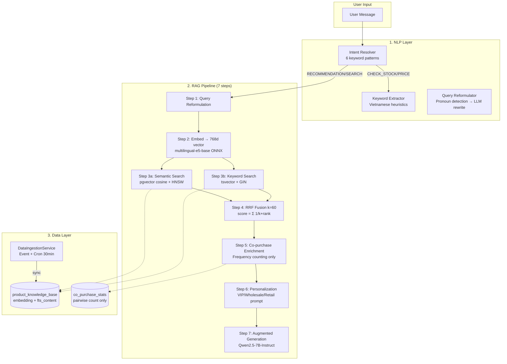
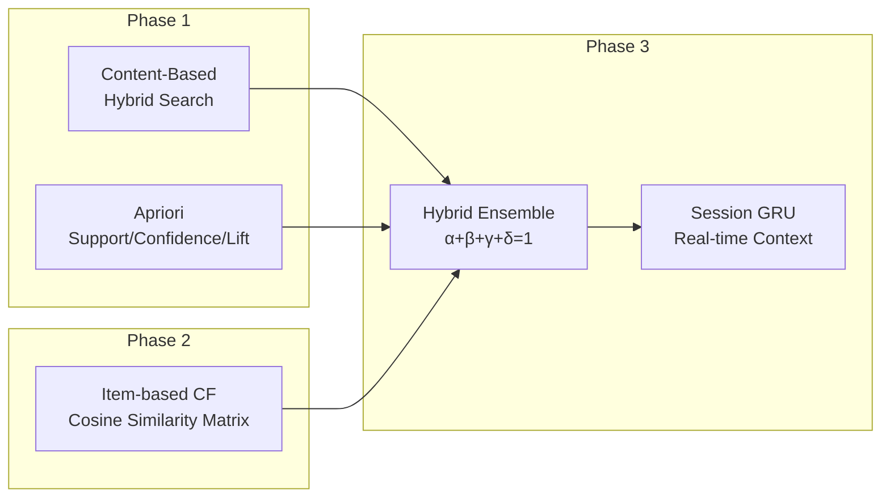

# Kế hoạch Cải tiến Thuật toán Chatbot — 3 Phases

> **Dự án**: POSMART Chatbot AI  
> **Dữ liệu hiện có**: 60 products (seed.sql) + 500 mock orders (mock-orders.js)  
> **Clusters mồi**: LẩuBò(35%), BữaSáng(35%), GiảiKhát(15%), Random(15%)

---

## Deep Scan Summary — Flow hiện tại



### Gaps đã xác định (từ Deep Scan)

| Component | Hiện tại | Gap |
|---|---|---|
| **Co-purchase** | `co_purchase_count` only | Thiếu `support`, `confidence`, `lift` |
| **Batch job** | Real-time per-event only | Không có nightly aggregation |
| **FTS** | `'simple'` config (no stemming) | Chưa tối ưu cho Vietnamese tokenization |
| **Personalization** | 3 static roles | Không học từ behavior |
| **CF** | Không có | Thiếu user-item interaction matrix |
| **Scoring** | RRF alone | Chưa có ensemble scoring |

---

## Phase 1: Enhanced Content-Based + Apriori ⚡

> **Mục tiêu**: Tối ưu hóa search quality + implement Apriori đúng chuẩn  
> **Effort**: 1-2 tuần  
> **Tác động**: Trực tiếp cải thiện test cases TC 1.x và TC 2.x

### 1A. Content-Based Search Improvements

#### 1A.1 — Diacritics-Aware Tokenizer

**Vấn đề**: User gõ "sua" nhưng FTS chỉ match "sữa" nếu có keyword augmentation.

**Hiện tại** ([data-ingestion.service.js#L239-L249](file:///e:/UIT/backend/microservices/services/chatbot/src/services/data-ingestion.service.js#L239-L249)):
```js
_extractKeywords(name, vendor) {
    // Chỉ NFD strip diacritics từ tên sản phẩm
    const noDiacritics = name.normalize('NFD').replace(/[\u0300-\u036f]/g, '');
    // ...
}
```

**Cải tiến**: Thêm synonym expansion + category keywords vào content text.

```js
// TRƯỚC:
// "Sản phẩm "Mì Hảo Hảo", danh mục "Mì ăn liền", giá 4.500 VND..."
// Từ khóa: mì, hảo, hảo, mi, hao, hao

// SAU:
// "Sản phẩm "Mì Hảo Hảo", danh mục "Mì ăn liền", giá 4.500 VND..."
// Từ khóa: mì, hảo, hảo, mi, hao, hao, ăn liền, instant noodle, mì gói
// Ngữ cảnh: bữa sáng, sinh viên, nhanh, tiện lợi
```

**File thay đổi**: [data-ingestion.service.js](file:///e:/UIT/backend/microservices/services/chatbot/src/services/data-ingestion.service.js)

```diff
+ // Context keywords map — enriches FTS matching
+ const CONTEXT_KEYWORDS = {
+     'Mì ăn liền': ['instant noodle', 'bữa sáng', 'sinh viên', 'mì gói', 'ăn nhanh'],
+     'Bia': ['nhậu', 'giải khát', 'tiệc', 'cuối tuần', 'beer'],
+     'Rau lá': ['nấu canh', 'salad', 'rau sống', 'luộc', 'xào'],
+     'Thịt bò': ['nấu lẩu', 'bít tết', 'phở bò', 'bò kho', 'steak'],
+     'Gia vị tẩm ướp': ['nêm nếm', 'đậm vị', 'nấu ăn', 'gia vị', 'seasoning'],
+     // ... thêm cho tất cả 25 subcategories
+ };
```

**Tác động test case**: TC 1.1 ("đồ nêm nếm cho đậm vị") → match context keyword "nêm nếm" → Hạt nêm Knorr, Bột ngọt.

---

#### 1A.2 — Hybrid Search Weight Tuning

**Hiện tại**: RRF k=60 cố định, semantic và keyword có weight bằng nhau.

**Cải tiến**: Thêm weighted RRF — ưu tiên semantic cho queries mơ hồ, keyword cho queries chính xác.

**File thay đổi**: [rag.service.js#L130-L152](file:///e:/UIT/backend/microservices/services/chatbot/src/services/rag.service.js#L130-L152)

```diff
- _reciprocalRankFusion(semanticList, keywordList, k = 60) {
+ _reciprocalRankFusion(semanticList, keywordList, k = 60, weights = { semantic: 0.6, keyword: 0.4 }) {
      const scoreMap = new Map();

      semanticList.forEach((item, rank) => {
          const key = `${item.product_id}_${item.store_id}`;
          if (!scoreMap.has(key)) scoreMap.set(key, { score: 0, item });
-         scoreMap.get(key).score += 1 / (k + rank + 1);
+         scoreMap.get(key).score += weights.semantic * (1 / (k + rank + 1));
      });

      keywordList.forEach((item, rank) => {
          const key = `${item.product_id}_${item.store_id}`;
          if (!scoreMap.has(key)) scoreMap.set(key, { score: 0, item });
-         scoreMap.get(key).score += 1 / (k + rank + 1);
+         scoreMap.get(key).score += weights.keyword * (1 / (k + rank + 1));
      });
```

**Công thức toán học:**

```
RRF_weighted(d) = w_s × Σ(1 / (k + rank_semantic)) + w_k × Σ(1 / (k + rank_keyword))

Mặc định: w_s = 0.6, w_k = 0.4
→ Ưu tiên semantic (hiểu "đồ nêm nếm" ≈ gia vị) hơn keyword exact match
```

---

### 1B. Apriori Algorithm — Full Implementation

#### 1B.1 — Công thức toán học

```
Cho tập giao dịch T = {t1, t2, ..., tn}, mỗi ti là tập sản phẩm

1. SUPPORT(A → B):
   support(A ∪ B) = count(A ∪ B) / |T|
   = Số đơn chứa cả A VÀ B / Tổng số đơn

2. CONFIDENCE(A → B):
   confidence(A → B) = support(A ∪ B) / support(A)
   = P(B | A) = "Xác suất mua B nếu đã mua A"

3. LIFT(A → B):
   lift(A → B) = confidence(A → B) / support(B)
   > 1: Tương quan dương (mua A tăng xác suất mua B)
   = 1: Không tương quan
   < 1: Tương quan âm
```

#### 1B.2 — Ví dụ với Seed Data

Với 500 đơn hàng, cluster LẩuBò có 35% = ~175 đơn:

```
Cluster LAU_BO = [1(Bò), 2(Nấm), 3(Rau), 4(GiaVị), 5(Bún)]
Mỗi đơn lấy ≥3/5 items (getRandomSubset min=3)

Giả sử thống kê thực tế:
- Đơn chứa {1,4}: 140/500 = support = 0.28 (28%)
- Đơn chứa {1}:   175/500 = support(1) = 0.35
- Đơn chứa {4}:   165/500 = support(4) = 0.33

confidence(1→4) = 0.28 / 0.35 = 0.80 (80%) ✅ > 60% threshold
lift(1→4) = 0.80 / 0.33 = 2.42 → Tương quan MẠNH

→ TC 2.1 PASS: "Khách mua Ba chỉ bò → gợi ý Gia vị lẩu Thái"
   với confidence 80% > 60% threshold
```

#### 1B.3 — Schema Migration

**File mới**: `services/chatbot/src/db/migration-apriori.sql`

```sql
-- Thêm cột metrics cho co_purchase_stats
ALTER TABLE co_purchase_stats
    ADD COLUMN IF NOT EXISTS support NUMERIC DEFAULT 0,
    ADD COLUMN IF NOT EXISTS confidence_ab NUMERIC DEFAULT 0,
    ADD COLUMN IF NOT EXISTS confidence_ba NUMERIC DEFAULT 0,
    ADD COLUMN IF NOT EXISTS lift NUMERIC DEFAULT 0,
    ADD COLUMN IF NOT EXISTS total_orders INT DEFAULT 0;

-- Index cho query nhanh theo confidence
CREATE INDEX IF NOT EXISTS idx_copurchase_confidence
    ON co_purchase_stats(product_id_a, store_id)
    WHERE confidence_ab >= 0.3;

-- Bảng lưu single-item support (frequency mỗi SP)
CREATE TABLE IF NOT EXISTS product_order_frequency (
    product_id BIGINT NOT NULL,
    store_id BIGINT NOT NULL,
    order_count INT DEFAULT 0,
    last_computed_at TIMESTAMPTZ DEFAULT NOW(),
    PRIMARY KEY (product_id, store_id)
);
```

#### 1B.4 — Batch Aggregation Job

**File mới**: `services/chatbot/src/services/apriori.service.js`

```js
class AprioriService {
    constructor(pool) { this.pool = pool; }

    /**
     * Nightly batch job: Tính support, confidence, lift
     * từ co_purchase_stats + product_order_frequency
     *
     * Schedule: Chạy mỗi đêm lúc 2:00 AM
     * Trigger: cron.schedule('0 2 * * *', ...)
     */
    async computeMetrics(storeId) {
        // Step 1: Tính tổng số đơn hàng (|T|)
        const { rows: [{ total }] } = await this.pool.query(
            `SELECT COUNT(DISTINCT order_id) AS total 
             FROM order_items WHERE store_id = $1`, [storeId]
        );

        // Step 2: Tính support(A) cho từng sản phẩm
        await this.pool.query(`
            INSERT INTO product_order_frequency (product_id, store_id, order_count, last_computed_at)
            SELECT product_id, $1, COUNT(DISTINCT order_id), NOW()
            FROM order_items WHERE store_id = $1
            GROUP BY product_id
            ON CONFLICT (product_id, store_id)
            DO UPDATE SET order_count = EXCLUDED.order_count,
                          last_computed_at = NOW()
        `, [storeId]);

        // Step 3: Tính confidence + lift cho mỗi cặp
        await this.pool.query(`
            UPDATE co_purchase_stats cs
            SET 
                total_orders = $2,
                support = cs.co_purchase_count::numeric / $2,
                confidence_ab = cs.co_purchase_count::numeric / NULLIF(fa.order_count, 0),
                confidence_ba = cs.co_purchase_count::numeric / NULLIF(fb.order_count, 0),
                lift = CASE 
                    WHEN fa.order_count > 0 AND fb.order_count > 0 
                    THEN (cs.co_purchase_count::numeric * $2) / (fa.order_count::numeric * fb.order_count)
                    ELSE 0 
                END,
                last_updated_at = NOW()
            FROM product_order_frequency fa, product_order_frequency fb
            WHERE cs.product_id_a = fa.product_id AND fa.store_id = $1
              AND cs.product_id_b = fb.product_id AND fb.store_id = $1
              AND cs.store_id = $1
        `, [storeId, total]);
    }
}
```

#### 1B.5 — Cập nhật Co-purchase Query (sử dụng Confidence)

**File thay đổi**: [copurchase.repository.js#L47-L61](file:///e:/UIT/backend/microservices/services/chatbot/src/repositories/copurchase.repository.js#L47-L61)

```diff
  async getRelatedProducts(productId, storeId, minCount = 3) {
      const { rows } = await this.pool.query(`
-         SELECT product_id_b, co_purchase_count
+         SELECT product_id_b, co_purchase_count, confidence_ab, lift
          FROM co_purchase_stats
-         WHERE product_id_a = $1 AND store_id = $2 AND co_purchase_count >= $3
+         WHERE product_id_a = $1 AND store_id = $2 
+           AND co_purchase_count >= $3
+           AND confidence_ab >= 0.3
          UNION ALL
-         SELECT product_id_a, co_purchase_count
+         SELECT product_id_a, co_purchase_count, confidence_ba, lift
          FROM co_purchase_stats
-         WHERE product_id_b = $1 AND store_id = $2 AND co_purchase_count >= $3
-         ORDER BY co_purchase_count DESC
+         WHERE product_id_b = $1 AND store_id = $2 
+           AND co_purchase_count >= $3
+           AND confidence_ba >= 0.3
+         ORDER BY lift DESC, co_purchase_count DESC
          LIMIT 3
      `, [productId, storeId, minCount]);
```

#### 1B.6 — Test Cases Phase 1

| TC | Input | Algorithm | Expected | Metric |
|---|---|---|---|---|
| TC 1.1 | "đồ nêm nếm cho đậm vị" | Semantic + Context Keywords | Hạt nêm Knorr(52), Bột ngọt(53), Nước mắm(49,50) | cosine > 0.75 |
| TC 1.2 | "trời nóng, giải khát mát lạnh" | Semantic Search | Coca-Cola(19), Bia Heineken(17), Trà ÔLong(40) | cosine > 0.70 |
| TC 2.1 | Cart: [1,2] → "mua thêm gì?" | Apriori confidence | Gia vị lẩu(4), Rau muống(3), Bún tươi(5) | confidence(1,2→4) > 60% |
| TC 2.2 | Xem Bánh mì(7) | Apriori co-purchase | Sữa Vinamilk(8), Trứng(10), Xúc xích(11) | lift > 1.5 |

---

## Phase 2: Item-based Collaborative Filtering 📊

> **Mục tiêu**: Gợi ý dựa trên hành vi mua tương tự giữa các user  
> **Điều kiện tiên quyết**: ≥500 users + ≥2000 đơn thực  
> **Effort**: 2-3 tuần

### 2A. Thuật toán Item-based CF

#### 2A.1 — Nguyên lý

```
Item-based CF: "Users who bought item A also bought item B"

Khác với Apriori (frequency-based), CF tính SIMILARITY giữa items
dựa trên VECTOR hành vi mua của tất cả users.

Apriori: count(A∩B)  → "A và B thường xuất hiện cùng nhau"
CF:      sim(A,B)     → "Users đánh giá A và B tương tự nhau"
```

#### 2A.2 — Công thức toán học

```
1. Xây dựng User-Item Matrix R:
   R[u][i] = rating/interaction score của user u với item i

   Trong POSMART (không có rating), dùng implicit feedback:
   R[u][i] = frequency(u bought i) × recency_weight

2. Item Similarity (Adjusted Cosine):
   sim(i, j) = Σ_u (R[u,i] - R̄u)(R[u,j] - R̄u) / 
               √(Σ_u (R[u,i] - R̄u)²) × √(Σ_u (R[u,j] - R̄u)²)

   R̄u = trung bình rating của user u

3. Prediction:
   pred(u, i) = Σ_j∈N(i) sim(i,j) × R[u,j] / Σ_j∈N(i) |sim(i,j)|
   
   N(i) = k items tương tự nhất với i (k=20)
```

#### 2A.3 — Schema mới

```sql
-- Bảng interaction matrix (built from order history)
CREATE TABLE IF NOT EXISTS user_product_interaction (
    user_id BIGINT NOT NULL,
    product_id BIGINT NOT NULL,
    store_id BIGINT NOT NULL,
    purchase_count INT DEFAULT 0,         -- Số lần mua
    total_quantity INT DEFAULT 0,          -- Tổng SL đã mua
    last_purchased_at TIMESTAMPTZ,
    interaction_score NUMERIC DEFAULT 0,   -- Computed: count × recency
    PRIMARY KEY (user_id, product_id, store_id)
);

-- Bảng item similarity (pre-computed nightly)
CREATE TABLE IF NOT EXISTS item_similarity (
    item_a BIGINT NOT NULL,
    item_b BIGINT NOT NULL,
    store_id BIGINT NOT NULL,
    similarity NUMERIC NOT NULL,          -- Adjusted Cosine [-1, 1]
    common_users INT DEFAULT 0,           -- Số users mua cả 2
    computed_at TIMESTAMPTZ DEFAULT NOW(),
    PRIMARY KEY (item_a, item_b, store_id)
);

CREATE INDEX IF NOT EXISTS idx_item_sim_lookup
    ON item_similarity(item_a, store_id)
    WHERE similarity >= 0.3;
```

#### 2A.4 — Implementation Overview

**File mới**: `services/chatbot/src/services/cf.service.js`

```js
class CollaborativeFilteringService {
    /**
     * Nightly job: Build user-item matrix + compute similarities
     * Schedule: cron.schedule('0 3 * * *', ...) — 3:00 AM, sau Apriori
     */
    async buildInteractionMatrix(storeId) {
        // Step 1: Aggregate từ order_items → user_product_interaction
        // Step 2: Tính interaction_score = purchase_count × recency_weight
        //    recency_weight = exp(-λ × days_since_purchase), λ = 0.01
    }

    async computeItemSimilarities(storeId) {
        // Step 1: Lấy matrix R[user][item] từ user_product_interaction
        // Step 2: Tính adjusted cosine cho mỗi cặp items
        // Step 3: Lưu vào item_similarity (chỉ lưu sim >= 0.1)
    }

    async getRecommendations(userId, storeId, limit = 5) {
        // Step 1: Lấy items user đã mua
        // Step 2: Tìm similar items chưa mua
        // Step 3: Tính prediction score → sort → top K
    }
}
```

#### 2A.5 — Tích hợp vào RAG Pipeline

```diff
  // rag.service.js — Step 5.5 (mới)
  // Sau Co-purchase, trước Personalization

+ // Step 5.5: CF Enrichment (nếu có đủ data)
+ if (this.cfService && customerId) {
+     const cfRecs = await this.cfService.getRecommendations(customerId, storeId, 3);
+     if (cfRecs.length > 0) {
+         metadata.steps.cf = { recommendations: cfRecs.length };
+         // Inject CF suggestions vào generation prompt
+     }
+ }
```

#### 2A.6 — Test Cases Phase 2

| TC | Scenario | Expected | Metric |
|---|---|---|---|
| TC-CF-1 | User A mua [Bò, Nấm, GiaVị] 5 lần. User B mua [Bò, Nấm, ?] | Gợi ý GiaVị cho B | sim(GiaVị, Bò) > 0.5 |
| TC-CF-2 | User thường mua BữaSáng cluster → hỏi "gợi ý" | Ưu tiên SP trong cluster BữaSáng chưa mua | prediction > 0.3 |
| TC-CF-3 | New user (cold start, 0 orders) | Fallback về Apriori + Content-Based | Graceful degradation |

---

## Phase 3: Hybrid Model + Session-based DL 🧠

> **Mục tiêu**: Ensemble scoring + real-time context-aware recommendations  
> **Điều kiện tiên quyết**: Phase 1 + Phase 2 stable  
> **Effort**: 3-4 tuần

### 3A. Hybrid Recommendation Model

#### 3A.1 — Ensemble Scoring

```
final_score(user, item) = 
    α × content_score(RAG RRF)     → Ngữ nghĩa câu hỏi
  + β × cf_score(Item-CF)           → Hành vi mua tương tự
  + γ × apriori_score(Confidence)   → Sản phẩm hay mua kèm
  + δ × personalization_bonus       → VIP/Wholesale boost

Trọng số mặc định:
α = 0.40 (Content-Based dominates — chatbot là search-first)
β = 0.25 (CF có weight trung bình)
γ = 0.25 (Apriori cho cross-sell)
δ = 0.10 (Personalization nhẹ — tránh filter bubble)

Tổng: α + β + γ + δ = 1.0
```

#### 3A.2 — Adaptive Weight Learning

```
Sau mỗi conversion (user mua SP được gợi ý):
→ Tăng weight của channel đã generate SP đó

Ví dụ: User hỏi "gợi ý bia" → Chatbot gợi ý Heineken (từ Content-Based)
→ User mua Heineken → α += 0.01 (Content-Based reward)

Cần tracking table:
CREATE TABLE recommendation_feedback (
    id BIGSERIAL PRIMARY KEY,
    user_id BIGINT,
    product_id BIGINT,
    source TEXT,          -- 'content', 'cf', 'apriori'
    action TEXT,          -- 'clicked', 'added_to_cart', 'purchased'
    created_at TIMESTAMPTZ DEFAULT NOW()
);
```

#### 3A.3 — Implementation

**File mới**: `services/chatbot/src/services/hybrid.service.js`

```js
class HybridRecommendationService {
    constructor({ ragService, cfService, aprioriService }) { ... }

    async recommend(userId, storeId, query, chatHistory) {
        // Run all 3 engines in parallel
        const [contentResults, cfResults, aprioriResults] = await Promise.all([
            this.ragService.recommend(query, storeId, userId, chatHistory),
            this.cfService?.getRecommendations(userId, storeId, 10),
            this.aprioriService?.getRelatedFromCart(userId, storeId)
        ]);

        // Merge + weighted ensemble scoring
        return this._ensembleScore(contentResults, cfResults, aprioriResults);
    }

    _ensembleScore(content, cf, apriori) {
        const scoreMap = new Map();
        // Normalize each source to [0,1] → weighted sum
        // ... α, β, γ, δ application
    }
}
```

---

### 3B. Session-based Deep Learning (GRU/Transformer)

#### 3B.1 — Nguyên lý

```
Traditional CF: Dựa trên toàn bộ lịch sử mua → STATIC profile
Session-based: Dựa trên chuỗi actions TRONG PHIÊN hiện tại → DYNAMIC

Ví dụ:
Session: [xem Bò → xem Nấm → hỏi gia vị lẩu]
GRU hidden state h₃ encodes: "User đang lên kế hoạch nấu lẩu"
→ Gợi ý: Bún tươi, Rau muống (với confidence cao hơn)

vs. Nếu session: [xem Bò → xem Phô mai → hỏi bánh mì]
GRU hidden state: "User đang chuẩn bị bữa sáng kiểu Tây"
→ Gợi ý: Xúc xích, Trứng
```

#### 3B.2 — Kiến trúc Model

```
Input: Chuỗi product IDs trong session [p1, p2, ..., pt]
         ↓
Product Embedding Layer (64d, trainable)
         ↓
GRU (hidden_size=128, num_layers=2, dropout=0.2)
         ↓
Attention Layer (self-attention over all timesteps)
         ↓
Output: Score vector cho tất cả products
         ↓
Top-K items (k=5) → Gợi ý
```

**Training data**: Từ chat sessions + order history
- Positive: items user mua/click sau khi xem
- Negative: random sampling

#### 3B.3 — Tích hợp vào Chatbot Flow

```diff
  // chat.service.js — _handleRecommendation
  
  async _handleRecommendation(session, userMessage) {
      const chatHistory = await this._getRecentHistory(session.id);
      
+     // Extract product sequence from session
+     const sessionProducts = this._extractProductSequence(chatHistory);
+     
+     if (this.sessionModel && sessionProducts.length >= 2) {
+         // GRU prediction cho next items
+         const sessionPredictions = await this.sessionModel.predict(sessionProducts);
+         // Merge with hybrid results
+     }
      
      const result = await this.hybridService.recommend(...);
      return result;
  }
```

#### 3B.4 — Test Cases Phase 3

| TC | Session Sequence | Expected | Metric |
|---|---|---|---|
| TC-DL-1 | [Bò(1) → Nấm(2) → "mua gì nữa?"] | GiaVị(4), Bún(5), Rau(3) | Cluster precision > 80% |
| TC-DL-2 | [BánhMì(7) → Sữa(8) → "thiếu gì?"] | Trứng(10), XúcXích(11) | Cluster recall > 70% |
| TC-DL-3 | [Bia(17) → Snack(20) → "thêm gì nhé"] | KhôGà(21), Coca(19) | Context coherence |
| TC-DL-4 | Mixed session [Bò(1) → Sữa(8)] | Hybrid: cả LẩuBò + BữaSáng items | Diversity > 0.5 |

---

## Tổng kết — So sánh 3 Phases



| Aspect | Phase 1 | Phase 2 | Phase 3 |
|---|---|---|---|
| **Thuật toán** | Content-Based + Apriori | Item-based CF | Hybrid + Session DL |
| **Data cần** | 60 products, 500 orders ✅ | ≥500 users, ≥2000 orders | ≥5000 sessions |
| **Compute** | SQL batch (PostgreSQL) | Matrix computation (nightly) | GPU/large CPU (training) |
| **Latency** | ~200ms (existing) | +50ms (pre-computed) | +100ms (GRU inference) |
| **Cold-start** | ✅ Hoạt động ngay | ⚠️ Cần user history | ⚠️ Cần session data |
| **Files thay đổi** | 3 modify + 2 new | 2 new + 1 modify | 2 new + 2 modify |

## Verification Plan

### Phase 1 Verification
```bash
# 1. Chạy seed data
psql $CATALOG_DATABASE_URL -f docs/chatbot/seed-product/seed.sql

# 2. Chạy mock-orders.js để populate co_purchase_stats
node docs/chatbot/seed-product/mock-orders.js

# 3. Chạy Apriori batch job
# (sẽ thêm CLI command hoặc API endpoint)

# 4. Verify metrics
psql $DATABASE_URL -c "
  SELECT product_id_a, product_id_b, co_purchase_count, 
         confidence_ab, confidence_ba, lift
  FROM co_purchase_stats 
  WHERE store_id = 1 AND confidence_ab >= 0.6
  ORDER BY lift DESC LIMIT 10;
"

# 5. Test chatbot TC 2.1
# Input: "Tôi đã mua ba chỉ bò và nấm kim châm, cần mua thêm gì?"
# Expected: Gia vị lẩu Thái, Rau muống, Bún tươi
```

### Manual Validation
- Chạy tất cả test cases trong [algorithm-testcases.md](file:///e:/UIT/backend/microservices/docs/chatbot/algorithm-testcases.md)
- Verify semantic search scores qua RAG metadata response
- Verify Apriori metrics qua SQL queries trực tiếp
