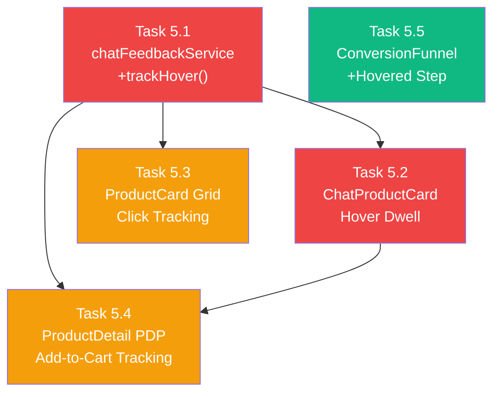

# Phase 5: Frontend Conversion Funnel Tracking

> **Dự án**: POSMART Microservices — Chatbot AI Recommendation  
> **Ngày**: 2026-05-09  
> **Walkthrough Phase**: Phase 5 (tiếp nối Phase 4B — Customer Frontend Integration)  
> **Phạm vi**: `customer/src/` (Frontend) — Không sửa Backend  
> **Mục tiêu**: Áp dụng toàn bộ tracking cho phễu chuyển đổi 5 bước lên Customer Frontend

---

## Bối Cảnh: Hiện Trạng vs. Mục Tiêu

### ❌ Hiện trạng — Tracking rất hạn chế

| Vị trí tracking | Hành động | Trạng thái | File |
|---|---|---|---|
| ChatProductCard | `clicked` | ✅ Có | `ChatWidget/components/ChatProductCard.jsx:30` |
| ChatProductCard | `added_to_cart` | ✅ Có | `ChatWidget/components/ChatProductCard.jsx:46` |
| ChatProductCard | `hovered` | ❌ **Chưa có** | — |
| ProductCard (Grid) | `clicked` | ❌ **Chưa có** | `Product/ProductCard.jsx` |
| ProductCard (Grid) | `hovered` | ❌ **Chưa có** | `Product/ProductCard.jsx` |
| ProductDetail Page | `added_to_cart` | ❌ **Chưa có** | `pages/ProductDetail.jsx` |
| CheckoutPage | `purchased` (intent) | ❌ **Chưa có** | `pages/CheckoutPage.jsx` |

**Kết quả**: Backend nhận gần như toàn bộ tín hiệu từ ORDER_CONFIRMED event (purchased) + auto-track (recommended), nhưng **bỏ lỡ hover, click từ grid, add-to-cart từ PDP** → Weight Learner thiếu dữ liệu trung gian → trọng số không chính xác.

### ✅ Mục tiêu — Full Funnel Tracking (5 bước)

```
recommended (auto-track by backend)
    → hovered (≥1.5s dwell on ChatProductCard)
        → clicked (ChatProductCard + ProductCard grid)
            → added_to_cart (ChatProductCard + ProductDetail PDP)
                → purchased (ORDER_CONFIRMED backend subscriber)
```

Mỗi bước cần ghi nhận `productId`, `storeId`, `source` → `POST /chatbot/feedback`.

---

## Backend API (Đã sẵn sàng — Không cần sửa)

```
POST /api/chatbot/feedback
Body: {
  productId: number,    // required
  storeId: number,      // required
  source: string,       // required — 'content' | 'cf' | 'apriori' | 'session'
  action: string,       // required — 'recommended' | 'hovered' | 'clicked' | 'added_to_cart' | 'purchased'
  userId?: number,      // optional
  sessionId?: string,   // optional
  score?: number,       // optional
  dwellTimeMs?: number  // optional — for hover events
}
Response: 201 { success: true }
```

**Xác nhận**: `feedback.routes.js` đã accept `action: 'hovered'` + `dwellTimeMs`. ✅

---

## Task Breakdown — 5 Tasks

### Task 5.1: 🔴 chatFeedbackService — Thêm `trackHover()`

> **Priority**: Critical — Foundation cho hover tracking  
> **File**: `customer/src/services/chatFeedbackService.js` [MODIFY]

#### Thay đổi

Thêm method `trackHover` vào service:

```diff
  const chatFeedbackService = {
    trackClick: (productId, storeId, source) => { ... },
    trackAddToCart: (productId, storeId, source) => { ... },

+   /**
+    * Track hover dwell (≥1.5s) on recommended product
+    * @param {number} productId
+    * @param {number} storeId
+    * @param {string} source - recommendation source
+    * @param {number} dwellTimeMs - actual dwell duration in ms
+    */
+   trackHover: (productId, storeId, source, dwellTimeMs) => {
+     api.post('/chatbot/feedback', {
+       productId,
+       storeId,
+       source,
+       action: 'hovered',
+       dwellTimeMs
+     }).catch(() => {}) // Fire-and-forget
+   }
  }
```

**INPUT**: productId, storeId, source, dwellTimeMs  
**OUTPUT**: POST request fire-and-forget  
**VERIFY**: Gọi `chatFeedbackService.trackHover(1, 1, 'content', 2000)` → check DB có record mới

---

### Task 5.2: 🔴 ChatProductCard — Hover Dwell Tracking

> **Priority**: Critical — Tracking tín hiệu implicit feedback quan trọng nhất  
> **File**: `customer/src/components/ChatWidget/components/ChatProductCard.jsx` [MODIFY]

#### Yêu cầu chức năng

1. **Start timer** khi `onMouseEnter` trên card
2. **Track hover** khi dwell ≥ 1500ms (threshold)
3. **Cancel timer** khi `onMouseLeave` sớm hơn threshold
4. **Deduplicate**: Set cờ `isHoverTracked` → chỉ ghi nhận **1 lần/product/session** (tránh inflate data)
5. **Mobile safe**: Touch devices không trigger `mouseEnter` → graceful degradation tự động

#### Implementation chi tiết

```diff
- import { useNavigate } from 'react-router-dom'
+ import { useNavigate } from 'react-router-dom'
+ import { useRef, useCallback } from 'react'

  export const ChatProductCard = ({ product }) => {
    const navigate = useNavigate()
    const { addToCart } = useCart()
    const { selectedStore } = useStore()
+   const hoverTimerRef = useRef(null)
+   const hoverStartRef = useRef(0)
+   const isHoverTrackedRef = useRef(false)

+   const DWELL_THRESHOLD_MS = 1500

    // ... existing code ...

+   const handleMouseEnter = useCallback(() => {
+     if (isHoverTrackedRef.current) return // Already tracked this product
+     hoverStartRef.current = Date.now()
+     hoverTimerRef.current = setTimeout(() => {
+       const dwellMs = Date.now() - hoverStartRef.current
+       chatFeedbackService.trackHover(product.id, selectedStore?.id, source, dwellMs)
+       isHoverTrackedRef.current = true
+     }, DWELL_THRESHOLD_MS)
+   }, [product.id, selectedStore?.id, source])

+   const handleMouseLeave = useCallback(() => {
+     if (hoverTimerRef.current) {
+       clearTimeout(hoverTimerRef.current)
+       hoverTimerRef.current = null
+     }
+   }, [])

    return (
      <div
        onClick={handleCardClick}
+       onMouseEnter={handleMouseEnter}
+       onMouseLeave={handleMouseLeave}
        className="..."
      >
```

#### Tại sao dùng `useRef` thay vì `useState`?

- `useRef` không gây re-render → timer logic nhanh hơn, không flicker UI
- `isHoverTrackedRef` persist qua re-renders trong cùng 1 component lifecycle
- Khi user rời trang chat và quay lại → component unmount/remount → ref reset → track lại OK

#### Edge Cases

| Case | Xử lý |
|---|---|
| Mouse vào rồi ra nhanh (<1.5s) | `clearTimeout` → không track |
| Mouse vào, ở lại >1.5s, ra, vào lại | `isHoverTrackedRef = true` → skip lần 2+ |
| Component unmount khi đang hover | Timer auto-cleared by browser GC |
| Touch device (mobile) | `mouseenter` không fire → no track (by design) |

**INPUT**: Mouse hover ≥ 1.5s trên ChatProductCard  
**OUTPUT**: 1 record `action='hovered'` + `dwellTimeMs` trong `recommendation_feedback`  
**VERIFY**: Hover card >2s → check Network tab → POST /chatbot/feedback → 201

---

### Task 5.3: 🟡 ProductCard (Grid) — Click Tracking

> **Priority**: Medium — Mở rộng tracking ra ngoài phạm vi chatbot  
> **File**: `customer/src/components/Product/ProductCard.jsx` [MODIFY]

#### Bối cảnh

`ProductCard` hiện **không có tracking nào**. Khi user click sản phẩm trên trang Home/Category, hệ thống không biết sản phẩm đó đến từ recommendation nào.

#### Thiết kế: Optional tracking via props

ProductCard trên grid **KHÔNG phải lúc nào cũng** là kết quả recommendation. Chỉ track khi có prop `trackingSource`:

```diff
- export const ProductCard = ({ product, onAddToCart }) => {
+ export const ProductCard = ({ product, onAddToCart, trackingSource }) => {

    const handleCardClick = () => {
      navigate(`/product/${product.id}`);
+     if (trackingSource) {
+       chatFeedbackService.trackClick(product.id, selectedStore?.id, trackingSource);
+     }
    };
```

#### Tại sao KHÔNG track mặc định?

- Sản phẩm trên trang category/search **không phải** recommendation AI
- Track mù sẽ gây **noise** cho Weight Learner → trọng số bị sai
- Chỉ truyền `trackingSource` khi sản phẩm đến từ chatbot recommendation hoặc AI suggestion

#### Khi nào truyền `trackingSource`?

Hiện tại: **Không có grid nào nhận trực tiếp từ AI** → Task này chuẩn bị sẵn prop cho tương lai (ví dụ: "Gợi ý cho bạn" section trên Home page).

**INPUT**: User click ProductCard có `trackingSource` prop  
**OUTPUT**: POST /chatbot/feedback `action='clicked'`  
**VERIFY**: Truyền `trackingSource="content"` → click card → check Network tab

---

### Task 5.4: 🟡 ProductDetail — Add-to-Cart Tracking

> **Priority**: Medium — Bắt tín hiệu `added_to_cart` từ PDP  
> **File**: `customer/src/pages/ProductDetail.jsx` [MODIFY]

#### Bối cảnh

Hiện tại khi user click "Add to Cart" trên trang Product Detail (PDP), **không có tracking** nào được gửi. Tín hiệu `added_to_cart` chỉ được bắt khi user click trên `ChatProductCard` (trong khung chat).

#### Thiết kế: URL-based attribution

Khi user click từ `ChatProductCard` → navigate đến `/product/:id`, ta cần "mang theo" context recommendation:

```diff
  // ChatProductCard.jsx — khi navigate
  const handleCardClick = () => {
-   navigate(`/product/${product.id}`)
+   navigate(`/product/${product.id}?ref=chat&src=${encodeURIComponent(source)}`)
    chatFeedbackService.trackClick(product.id, selectedStore?.id, source)
  }
```

```diff
  // ProductDetail.jsx — đọc context từ URL
+ import { useSearchParams } from 'react-router-dom'
+ import chatFeedbackService from '../services/chatFeedbackService'

  export default function ProductDetail() {
    const { productId } = useParams()
+   const [searchParams] = useSearchParams()
+   const chatRef = searchParams.get('ref') // 'chat' nếu đến từ chatbot
+   const chatSource = searchParams.get('src') || 'content'

    const handleAddToCart = () => {
      addToCart(...)
+     if (chatRef === 'chat') {
+       chatFeedbackService.trackAddToCart(Number(productId), selectedStore?.id, chatSource)
+     }
    }
  }
```

#### Tại sao dùng URL params?

| Phương án | Ưu | Nhược |
|---|---|---|
| **URL params** (`?ref=chat&src=content`) | ✅ Đơn giản, stateless, dễ debug | URL dài hơn |
| Global state (Context/Redux) | Giữ qua nhiều pages | ❌ Phức tạp, race condition |
| localStorage | Persist | ❌ Stale data nếu quên clear |

→ URL params là phương án **đơn giản nhất** và đủ cho use case (ChatProductCard → PDP → Add to Cart).

**INPUT**: User navigate từ ChatProductCard → PDP → click "Add to Cart"  
**OUTPUT**: POST /chatbot/feedback `action='added_to_cart'` với đúng source  
**VERIFY**: Click product từ chat → PDP → Add to Cart → check DB có record

---

### Task 5.5: 🟢 ConversionFunnel Widget — Hiển thị "Hovered" step

> **Priority**: Low — UI update trên POS Admin Dashboard  
> **File**: `frontend/src/components/Dashboard/widgets/ConversionFunnel.jsx` [MODIFY]

#### Bối cảnh

ConversionFunnel hiện hiển thị **4 bước**: Recommended → Clicked → Added to Cart → Purchased.

Backend **đã trả** `totalHovered` trong `/stats/recommendations` response (line 80 trong `stats.routes.js`), nhưng frontend widget **không render** bước Hovered.

#### Thay đổi

```diff
  const STEPS = [
    { key: 'totalRecommended', label: 'Recommended', color: 'bg-gray-400', textColor: 'text-gray-700', icon: '📤' },
+   { key: 'totalHovered', label: 'Hovered', color: 'bg-indigo-400', textColor: 'text-indigo-700', icon: '👁️' },
    { key: 'totalClicked', label: 'Clicked', color: 'bg-blue-500', textColor: 'text-blue-700', icon: '🔵' },
    { key: 'totalAddedToCart', label: 'Added to Cart', color: 'bg-amber-500', textColor: 'text-amber-700', icon: '🟡' },
    { key: 'totalPurchased', label: 'Purchased', color: 'bg-emerald-500', textColor: 'text-emerald-700', icon: '🟢' },
  ];

  const rateLabels = [
    null,
+   rates.hoverRate ? `${(rates.hoverRate * 100).toFixed(1)}% Hover` : null,
    rates.clickThroughRate ? `${(rates.clickThroughRate * 100).toFixed(1)}% CTR` : null,
    rates.addToCartRate ? `${(rates.addToCartRate * 100).toFixed(1)}% A2C` : null,
    rates.conversionRate ? `${(rates.conversionRate * 100).toFixed(1)}% CVR` : null,
  ];
```

**INPUT**: `/stats/recommendations` response (đã có `totalHovered` + `hoverRate`)  
**OUTPUT**: Funnel widget hiển thị 5 bước thay vì 4  
**VERIFY**: Mở Dashboard → AI Insights tab → Funnel hiển thị "Hovered" giữa Recommended và Clicked

---

## Dependency Graph



**Thứ tự triển khai**:
1. **T1** (Service method) — Foundation
2. **T2** (ChatProductCard hover) + **T5** (Funnel UI) — Song song
3. **T3** (ProductCard grid) + **T4** (PDP tracking) — Song song, phụ thuộc T1

---

## File Structure (New/Modified)

```
customer/src/
  ├── services/
  │   └── chatFeedbackService.js        [MODIFY] +trackHover method
  ├── components/
  │   ├── ChatWidget/components/
  │   │   └── ChatProductCard.jsx        [MODIFY] +hover dwell tracking
  │   └── Product/
  │       └── ProductCard.jsx            [MODIFY] +optional click tracking prop
  └── pages/
      └── ProductDetail.jsx              [MODIFY] +URL-based add-to-cart attribution

frontend/src/
  └── components/Dashboard/widgets/
      └── ConversionFunnel.jsx           [MODIFY] +Hovered step
```

**Tổng**: 5 files sửa, 0 files mới, 0 backend changes.

---

## Verification Plan

### Functional Tests

| # | Test | Steps | Expected |
|---|---|---|---|
| F1 | Hover tracking fire | Hover ChatProductCard >2s | Network: POST /chatbot/feedback 201, action='hovered', dwellTimeMs≈2000 |
| F2 | Hover threshold guard | Hover ChatProductCard <1s rồi rời | Không có POST request |
| F3 | Hover dedup | Hover cùng 1 sản phẩm 3 lần liên tiếp | Chỉ 1 POST request (lần đầu) |
| F4 | Click tracking (ChatProductCard) | Click sản phẩm trong chat | POST action='clicked' (đã có, regression check) |
| F5 | PDP add-to-cart attribution | ChatProductCard → PDP → Add to Cart | POST action='added_to_cart' với đúng source |
| F6 | PDP no-track (direct visit) | Navigate trực tiếp /product/1 → Add to Cart | Không có POST (vì không có ?ref=chat) |
| F7 | Funnel widget 5 steps | Mở Dashboard → AI Insights | Funnel hiển thị: Recommended → Hovered → Clicked → Cart → Purchased |
| F8 | Mobile graceful degradation | Truy cập customer web trên mobile emulator | Không có hover event → funnel vẫn hoạt động với 4 bước |

### Database Verification

```sql
-- Check hover records exist after testing
SELECT action, COUNT(*), 
       AVG((metadata->>'dwellTimeMs')::int) AS avg_dwell_ms
FROM recommendation_feedback
WHERE store_id = 1 
  AND created_at > NOW() - INTERVAL '1 hour'
GROUP BY action
ORDER BY 
  CASE action 
    WHEN 'recommended' THEN 1 
    WHEN 'hovered' THEN 2 
    WHEN 'clicked' THEN 3 
    WHEN 'added_to_cart' THEN 4 
    WHEN 'purchased' THEN 5 
  END;
```

### Weight Learner Integration

Sau khi có đủ hover data (≥20 feedbacks):
1. Gọi Force Learn trên Dashboard
2. Kiểm tra `ensemble_weights_history` → `feedback_count` tăng
3. Xác nhận công thức `hovered × 0.1` có đóng góp vào weighted conversion score

---

## Design Decisions

| Quyết định | Lý do |
|---|---|
| **Fire-and-forget (no await)** | Tracking không được block UX. Nếu API fail → bỏ qua, không hiển thị error |
| **useRef cho timer/flag** | Tránh re-render không cần thiết khi cập nhật trạng thái hover |
| **1500ms threshold** | Nghiên cứu UX cho thấy <500ms là noise (lướt qua), 500-1000ms là scanning, ≥1500ms là attention thật sự |
| **1 track/product/session** | Dedup bằng ref. Tránh inflate dữ liệu khi user hover lại cùng sản phẩm |
| **URL params cho attribution** | Stateless, đơn giản, debug bằng mắt thường trên address bar |
| **Optional `trackingSource` prop** | Chỉ track khi sản phẩm có context AI recommendation, tránh noise từ browsing bình thường |
| **Không sửa backend** | Backend đã accept đầy đủ 5 actions + dwellTimeMs + metadata. Phase 5 chỉ là frontend wiring |

---

## Lưu Ý Quan Trọng

> [!IMPORTANT]
> **Không track sản phẩm browsing thông thường.** Chỉ track khi có context rõ ràng rằng sản phẩm đến từ AI recommendation (chatbot). Tracking mù sẽ làm tăng noise → Weight Learner cho kết quả sai.

> [!WARNING]
> **Hover tracking chỉ hoạt động trên Desktop/Laptop.** Mobile/tablet không có `mouseenter` event. Đây là by-design — phễu trên mobile tự động rút gọn về 4 bước. Weight Learner xử lý trường hợp `hovered = 0` bình thường (thành phần `0.1 × 0 = 0`).

> [!NOTE]
> **Phase 6 (AI Dashboard Testing)** sẽ được lên plan riêng sau khi Phase 5 hoàn thành và có đủ dữ liệu tracking để verify các thuật toán trên Dashboard.
