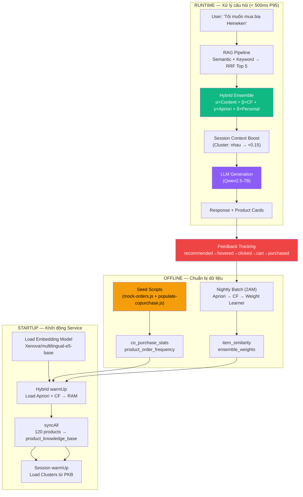
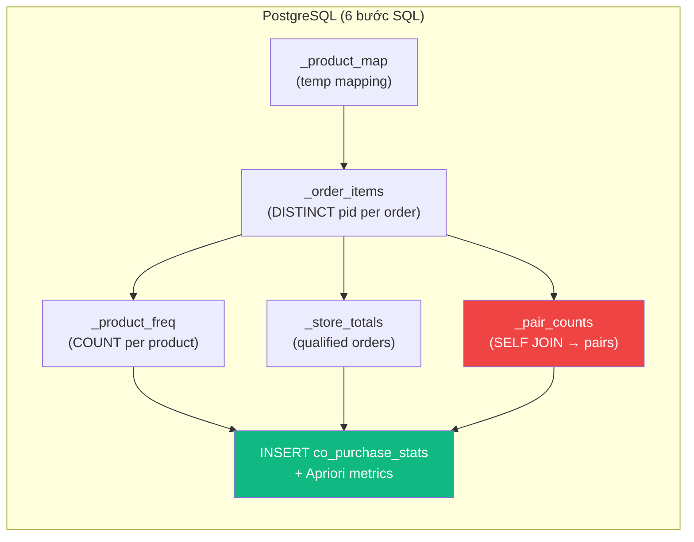
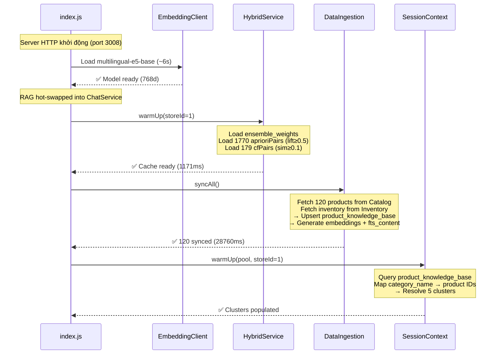
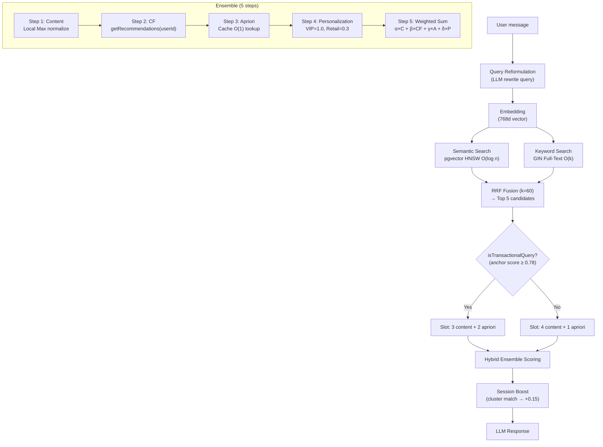
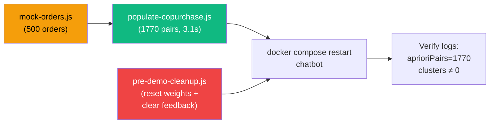

# BÁO CÁO TỔNG QUAN TRIỂN KHAI: Hybrid Recommendation Engine — POSMART

> **Mục đích**: Tài liệu kỹ thuật chi tiết cách hệ thống gợi ý lai (Hybrid Ensemble) được triển khai trong thực tế — từ khâu chuẩn bị dữ liệu, luồng xử lý runtime, đến vòng lặp tự học.
>
> **Đối tượng**: Hội đồng bảo vệ, người đánh giá kỹ thuật

---

## 1. KIẾN TRÚC TRIỂN KHAI TỔNG QUAN

### 1.1 Sơ đồ kiến trúc End-to-End



### 1.2 Các File Quan Trọng

| Tầng | File | Chức Năng |
|------|------|-----------|
| **Data Seeding** | `docs/chatbot/seed-product/mock-orders.js` | Tạo 500 đơn hàng giả lập với phân bổ cluster |
| **Data Seeding** | `docs/chatbot/seed-product/populate-copurchase.js` | Tính Apriori metrics (SQL SELF JOIN push-down) |
| **Startup** | `services/chatbot/src/index.js` | Orchestrator: load model → warmup → sync → cluster |
| **Core Engine** | `services/chatbot/src/services/hybrid.service.js` | Ensemble scoring: α×Content + β×CF + γ×Apriori + δ×Personal |
| **RAG** | `services/chatbot/src/services/rag.service.js` | Query reformulation + RRF fusion + slot partitioning |
| **CF** | `services/chatbot/src/services/cf.service.js` | Item-based Cosine Similarity predictions |
| **Session** | `services/chatbot/src/services/session-context.service.js` | Rule-based cluster detection (lau_bo, nhau, an_vat...) |
| **Weight Learning** | `services/chatbot/src/jobs/nightly-batch.js` | Exponential Smoothing weight adjustment |
| **Pre-demo** | `docs/script/pre-demo-cleanup.js` | Reset weights + clear feedback cho demo |

---

## 2. KHÂU CHUẨN BỊ DỮ LIỆU (DATA SEEDING)

### 2.1 Pipeline Seed

```
mock-orders.js → populate-copurchase.js → docker compose restart chatbot
```

### 2.2 mock-orders.js — Tạo Đơn Hàng Giả Lập

**Mục đích**: Tạo 500 đơn hàng với phân bổ sản phẩm theo cluster để đảm bảo Apriori tìm ra luật kết hợp có ý nghĩa.

**Cơ chế phân bổ xác suất**:

| Cluster | Tỷ Trọng | Số Đơn (~) | Sản Phẩm Đại Diện |
|---------|----------|------------|-------------------|
| `GIAI_KHAT` (Nhậu) | **30%** | ~150 | Heineken, Coca, Snack, Khô gà |
| `LAU_BO` (Nấu ăn) | 25% | ~125 | Bò Mỹ, Nấm, Rau, Gia vị |
| `BUA_SANG` | 25% | ~125 | Bánh mì, Sữa, Trứng, Xúc xích |
| `GIA_DINH` | 15% | ~75 | Gạo ST25, Dầu ăn, Nước mắm |
| Random noise | 5% | ~25 | Ngẫu nhiên (nhiễu tự nhiên) |

**Quy trình kỹ thuật**:

1. **DELETE** tất cả mock orders cũ (`source LIKE 'mock-seed%'`) → tránh tích lũy dữ liệu sai
2. **INSERT** 500 đơn mới: mỗi đơn chọn cluster theo phân bổ → chọn 3-5 products primary + 1-2 random 
3. Tính **weighted probability** cho sản phẩm trong cluster: item[0] cao nhất, giảm dần → Heineken luôn xuất hiện ~90% trong cluster GIAI_KHAT

### 2.3 populate-copurchase.js — Tính Apriori Metrics (v4 – SQL Push-down)

**Cải tiến quan trọng**: Toàn bộ tính toán pair generation + metrics được đẩy xuống PostgreSQL thay vì xử lý O(N²) trong Node.js.



**Step 4 (SELF JOIN)** — Bước nặng nhất, thay thế O(N²) Node.js loop:

```sql
-- PostgreSQL SELF JOIN: tạo tất cả cặp co-purchase + đếm
CREATE TEMP TABLE _pair_counts AS
SELECT
  a.store_id,
  LEAST(a.product_id, b.product_id)    AS pid_a,
  GREATEST(a.product_id, b.product_id) AS pid_b,
  COUNT(DISTINCT a.order_id)::int       AS co_count
FROM _order_items a
JOIN _order_items b
  ON a.order_id = b.order_id                 -- cùng đơn hàng
  AND a.store_id = b.store_id               -- cùng chi nhánh
  AND a.product_id < b.product_id           -- tránh trùng (A,B) = (B,A)
GROUP BY a.store_id, pid_a, pid_b;
```

**Apriori Metrics** — Tính trực tiếp trong SQL:

```sql
INSERT INTO co_purchase_stats (...)
SELECT
  pc.pid_a, pc.pid_b, pc.store_id, pc.co_count,
  ROUND(pc.co_count::numeric / st.total_orders, 4)                     AS support,
  ROUND(pc.co_count::numeric / fa.freq, 4)                             AS confidence_ab,
  ROUND(pc.co_count::numeric / fb.freq, 4)                             AS confidence_ba,
  ROUND((pc.co_count::numeric * st.total_orders) / (fa.freq * fb.freq), 2) AS lift,
  st.total_orders, NOW()
FROM _pair_counts pc
JOIN _store_totals st ON st.store_id = pc.store_id
JOIN _product_freq fa ON fa.product_id = pc.pid_a
JOIN _product_freq fb ON fb.product_id = pc.pid_b;
```

**Kết quả thực tế sau seed**:

| Metric | Giá trị |
|--------|---------|
| Thời gian chạy | **3.1 giây** (trước đó: bị treo/hanging) |
| Unique pairs | 1,770 |
| Max lift | 4.68 |
| Heineken ↔ Coca-Cola | count=165, **lift=1.90** |
| Heineken ↔ Khô gà | count=146, **lift=1.74** |
| Heineken ↔ Snack Lay's | count=140, **lift=1.66** |

---

## 3. KHỞI ĐỘNG SERVICE (STARTUP SEQUENCE)

### 3.1 Thứ Tự Khởi Động — Rất Quan Trọng



> **Thiết kế quan trọng**: `SessionContext.warmUp()` chạy **SAU** `syncAll()` vì cần dữ liệu `product_knowledge_base` đã được sync. Nếu chạy trước → tất cả clusters = 0 (bảng trống).

### 3.2 Hybrid Cache Warmup — Chi Tiết SQL

**Load Apriori pairs vào RAM**:

```sql
SELECT product_id_a, product_id_b, co_purchase_count,
       confidence_ab, confidence_ba, lift
FROM co_purchase_stats
WHERE store_id = $1::bigint AND lift::numeric >= 0.5
ORDER BY lift::numeric DESC
```

- `::bigint` và `::numeric` — ép kiểu tường minh vì cột `lift` lưu dạng `text` trong DB
- `>= 0.5` (thay vì `> 1`) — bắt cả intra-cluster pairs (Heineken ↔ Nấm kim châm có lift ≈ 0.97)
- Kết quả: `Map<"productId_storeId", relatedProducts[]>` — O(1) lookup runtime

---

## 4. LUỒNG XỬ LÝ RUNTIME — HYBRID ENSEMBLE

### 4.1 Sơ Đồ Luồng Chi Tiết



### 4.2 Ensemble Scoring — Từng Bước Trong Code

**File**: `hybrid.service.js` → `score()`

#### Step 1: Content Score (Local Max Normalization)

```javascript
const maxRRF = Math.max(...contentResults.map(r => r.rrf_score || 0));
const normalizedContent = maxRRF > 0 ? Math.max(0, rrf_score / maxRRF) : 0;
// Clamp [0,1] — anchor penalty có thể tạo rrf_score âm
```

**Tại sao Local Max thay vì Global?** Vì RRF score phụ thuộc vào query — cùng sản phẩm có thể có score 0.03 cho query A nhưng 0.01 cho query B. Normalize theo max hiện tại giúp so sánh tương đối trong 1 request.

#### Step 2: CF Score

```javascript
if (userId && beta > 0) {
    cfResults = await this.cfService.getRecommendations(userId, storeId, 10);
}
const normalizedCF = prediction_score / maxCF; // Local Max normalize
```

**Cold-start handling**: Nếu user chưa có interaction data → `cfResults = []` → Weight redistribute `α += β; β = 0`. Content nhận trọng số **65%** thay vì 40%.

#### Step 3: Apriori Score (O(1) Cache Lookup)

```javascript
const cacheKey = `${productId}_${storeId}`;
let related = this._aprioriCache.get(cacheKey); // O(1) Map lookup

for (const rel of related) {
    // Chỉ giữ confidence cao nhất cho mỗi candidate
    if (rel.confidence > existingConf) {
        aprioriCandidates.set(rel.product_id, rel.confidence);
    }
}
```

**Apriori score = `confidence(A→B)`** — đã nằm trong [0,1], không cần normalize thêm.

#### Step 4: Personalization Bonus

```javascript
const personalBonus = customerType === 'vip' ? 1.0
    : customerType === 'wholesale' ? 0.8
    : 0.3; // retail
```

#### Step 5: Content-Relevance Gate + Final Score

```javascript
const finalScore = w.alpha * content + w.beta * cf + w.gamma * apriori + w.delta * personal;

// Products KHÔNG có content score (CF-only/Apriori-only injections)
// bị phạt để products khớp câu hỏi luôn xếp trên
const penalty = entry.apriori > 0 ? 0.75 : 0.5;
const adjustedScore = entry.content > 0 ? finalScore : finalScore * penalty;
```

**Thiết kế penalty**: Apriori candidates không khớp câu hỏi nhưng có statistical backing (lift > 1) → phạt nhẹ hơn (×0.75) so với CF-only candidates (×0.5).

### 4.3 Transactional Query Detection — isTransactionalQuery

**File**: `rag.service.js` → `partitionedRanking()`

Khi user hỏi cụ thể về 1 sản phẩm (VD: "Bia Heineken"), hệ thống detect "anchor product" và mở rộng slot cho Apriori:

```javascript
const anchorScore = metadata.anchorRerank?.score ?? 0;
const hasAnchorIntent = anchorScore >= 0.78; // Transactional threshold

// Slot allocation
if (hasAnchorIntent) {
    withContent = 3; withApriori = 2;  // Bia → 3 content + 2 Apriori (Coca, Snack)
} else {
    withContent = 4; withApriori = 1;  // Đồ ăn vặt → 4 content + 1 Apriori
}
```

**Dual threshold design**:
- `hasStrongAnchor = 0.83` — Gate cho broad queries ("đồ ăn vặt") → bảo vệ Act 1
- `hasAnchorIntent = 0.78` — Gate cho specific queries ("bia Heineken") → kích hoạt Apriori slot mở rộng

---

## 5. VÒNG LẶP TỰ HỌC (FEEDBACK LOOP)

### 5.1 Phễu Chuyển Đổi 5 Bước

```
Recommended → Hovered (≥1.5s) → Clicked → Added to Cart → Purchased
     ↓              ↓              ↓            ↓             ↓
  auto-track    POST /feedback   POST       POST          ORDER_CONFIRMED
                (dwellTimeMs)                              (24h attribution)
```

### 5.2 Weight Learner — Nightly Batch (2AM)

```javascript
// Weighted Conversion Score per source
score(source) = purchased × 1.0 + added_to_cart × 0.5 + clicked × 0.2 + hovered × 0.1
rate(source)  = score(source) / recommended_count(source)

// New weight (proportional to conversion rate)
raw_weight(source) = rate(source) / SUM(rates) × (1.0 - delta)

// Exponential Smoothing (80% old + 20% new)
smoothed = 0.8 × current_weight + 0.2 × raw_weight

// Guard rails
clamped = CLAMP(smoothed, 0.05, 0.60)
```

### 5.3 Adaptive Behavior — Ví Dụ Thực Tế

Khi khách hàng mua Heineken theo gợi ý Apriori nhiều → Weight Learner nhận thấy `conversion_rate(apriori)` tăng → γ tăng dần từ 0.25 → 0.30 → Apriori candidates xếp cao hơn trong những lần gợi ý sau.

---

## 6. QUY TRÌNH CHUẨN BỊ DEMO

### 6.1 Checklist Trước Demo

```bash
# 1. Reset dữ liệu feedback + weights
cd backend
node -r dotenv/config docs/script/pre-demo-cleanup.js

# 2. (Nếu cần re-seed orders)
node -r dotenv/config docs/chatbot/seed-product/mock-orders.js
node -r dotenv/config docs/chatbot/seed-product/populate-copurchase.js

# 3. Restart chatbot để reload cache
docker compose restart chatbot

# 4. Verify
docker compose logs --tail=20 chatbot | grep "aprioriPairs\|Clusters"
# Kỳ vọng: aprioriPairs: 1770, clusters: { lau_bo: X, an_vat: X, nhau: X, ... }
```

### 6.2 Sơ Đồ Dependencies Giữa Các Script



---

## 7. VẤN ĐỀ ĐÃ GIẢI QUYẾT

### 7.1 Bảng Tổng Hợp Root Causes & Fixes

| # | Vấn Đề | Root Cause | Fix | File |
|---|--------|------------|-----|------|
| 1 | Lift = 0.01 cho tất cả pairs | `order_count` bị tích lũy từ nhiều lần seed (3228 thay vì 186) | DELETE old orders trước khi seed mới | `mock-orders.js` |
| 2 | populate-copurchase.js bị treo | O(N²) pair generation trong Node.js + không có progress logging | SQL SELF JOIN push-down + step-by-step progress | `populate-copurchase.js` v4 |
| 3 | aprioriPairs = 0 trong cache | `lift` lưu dạng `text`, SQL `WHERE lift > 1` fail; threshold quá cao | Type cast `::numeric` + hạ threshold `>= 0.5` | `hybrid.service.js` |
| 4 | isTransactionalQuery luôn false | Tham chiếu sai key: `anchorCategory` vs `anchorCategories` (plural) | Sửa thành `anchorCategories` | `rag.service.js` |
| 5 | Clusters = 0 khi khởi động | `sessionContext.warmUp()` chạy TRƯỚC `syncAll()` → PKB trống | Đổi thứ tự: warmUp AFTER syncAll | `index.js` |
| 6 | Weights bị drift (α=0.34) | Nightly batch + test runs thay đổi weights | `pre-demo-cleanup.js` reset về baseline | `pre-demo-cleanup.js` |

---

## 8. CÔNG NGHỆ & QUYẾT ĐỊNH THIẾT KẾ

| Quyết Định | Lựa Chọn | Lý Do |
|-------------|----------|-------|
| Embedding model | Xenova/multilingual-e5-base (768d) | Hỗ trợ tiếng Việt, chạy trên CPU |
| Vector index | HNSW (pgvector) | O(log n) lookup, tích hợp PostgreSQL |
| Keyword search | GIN (tsvector) | O(k) với k = tokens khớp |
| RRF constant k | 60 | Cormack et al., 2009 — balance rank influence |
| CF similarity | Plain Cosine (không Adjusted) | Implicit feedback — Adjusted triệt tiêu magnitude |
| Weight smoothing | Exponential (80/20) | Ổn định, tránh dao động mạnh |
| Compute strategy | SQL Push-down | 3.1s vs hanging — PostgreSQL optimizer nhanh hơn Node.js loop |
| Startup ordering | warmUp → syncAll → clusterWarmUp | Dependency: clusters cần PKB, PKB cần sync |
