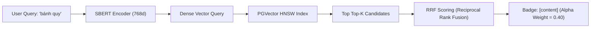

# 📘 Báo Cáo Kỹ Thuật: Thuật Toán Content-Based Recommendation (Semantic RAG)

> **Phân hệ**: AI Recommendation Engine — Tầng Semantic Content-Based  
> **Định dạng**: Machine Learning & Software Architecture Spec  
> **Thư mục**: `backend/docs/neural/01-content-based.md`  

---

## 1. Bản Chất Kỹ Thuật & Kiến Trúc Mô Hình

Thuật toán **Content-Based Filtering** trong hệ thống Mini-Mart không sử dụng các phương pháp đơn giản như TF-IDF hay đếm từ từ nguyên bản. Hệ thống ứng dụng **Semantic RAG (Retrieval-Augmented Generation)** dựa trên mô hình **SBERT (Sentence-BERT - `keepitreal/vietnamese-sbert`)** với vector không gian **768 chiều (768-dimensional dense embeddings)**.



### Điểm Cốt Lõi:
1. **Biểu diễn tri thức (Knowledge Representation)**:
   Mỗi sản phẩm trong danh mục (1,380 SKUs) được mã hóa thành vector 768 chiều từ chuỗi văn bản tổng hợp: `tên sản phẩm + danh mục + giá + thuộc tính đặc trưng`.
2. **Truy vấn ngữ nghĩa (Semantic Search)**:
   Khi người dùng nhập câu hỏi (ví dụ: *"Tôi muốn mua bánh quy"*), truy vấn được mã hóa qua SBERT và so khớp khoảng cách Cosine Similarity trong cơ sở dữ liệu `pgvector` sử dụng chỉ mục **HNSW (Hierarchical Navigable Small World)**.
3. **Đánh giá RRF (Reciprocal Rank Fusion)**:
   Kết quả tìm kiếm ngữ nghĩa kết hợp với điểm tìm kiếm từ khóa (BM25 Full-text search) theo công thức RRF:
   $$RRF\_Score(d) = \frac{1}{k + rank_{semantic}(d)} + \frac{1}{k + rank_{keyword}(d)}$$
   với $k = 60$. Điểm RRF sau đó được chuẩn hóa về $[0, 1]$ cho lớp Ensemble.

---

## 2. Phân Tích Dữ Liệu Seed Tương Ứng

| Thông số | Chi tiết Dữ liệu Seed Thực Tế |
|:---|:---|
| **Nguồn dữ liệu** | `backend/docs/chatbot/seed-product/seed-1000.sql` (1,380 SKU chuẩn Bách Hóa Xanh) |
| **Bảng dữ liệu** | `product_knowledge_base` (Chatbot DB) |
| **Số lượng SKU** | 1,380 sản phẩm thuộc 160 danh mục |
| **Script khởi tạo** | `backend/services/chatbot/src/scripts/sync-catalog.js` |
| **Trọng số Ensemble** | $\alpha = 0.40$ (Trọng số lớn nhất trong White-box Fallback Ensemble) |

### Ví dụ Dữ liệu Seed đại diện (Danh mục 87 - Bánh kẹo / Sub-cat 90 - Bánh quy):

```sql
-- Sản phẩm tiêu biểu trong DB cho thuật toán Content-Based
INSERT INTO product (id, category_id, name, unit_price) VALUES
  (815, 94, 'Snack khoai tây vị phô mai cheddar Lay''s Wavy gói 53g', 12500),
  (832, 95, 'Bánh gạo sữa hương dưa lưới Milk gói 240g', 32000),
  (946, 105, 'Bánh xốp phủ kem socola Superstar hộp 150g', 28000),
  (975, 107, 'Kẹo socola nhân bơ đậu phộng Snickers gói 20g', 15000);
```

---

## 3. Hướng Dẫn Trình Diễn (Demo Step-by-Step)

### Kịch Bản Demo: Kiểm Tra Tìm Kiếm Ngữ Nghĩa (Semantic RAG) Trên Mô Hình ONNX Fast Path

1. **Chuẩn bị (Môi trường sản xuất AI)**:
   - **Giữ AI Service HOẠT ĐỘNG bình thường** (Sử dụng ONNX Wide & Deep Engine).
   - Mở Chatbot Widget trên giao diện người dùng.

2. **Thực hiện truy vấn**:
   - Nhập từ khóa: `"Tôi muốn mua bánh quy"` hoặc `"Có snack nào ngon không"`

3. **Kết quả kỳ vọng trên giao diện**:
   - Chatbot trả về danh sách các sản phẩm Bánh quy (Danisa, Gouté, Oreo, Bánh xốp...)
   - Trên **AI Dashboard -> Live Feedback Stream**:
     - Thấy các dòng gán nhãn Badge: **`two_tower_onnx`** (Màu tím).
     - Dòng **`AI Score`** (VD: `0.0808`) chứng minh Mô hình Neural Network ONNX trực tiếp chấm điểm sự tương đồng giữa từ khóa RAG và vector biểu diễn sản phẩm.

4. **Tại sao kết quả này chứng minh RAG & Deep Learning hoạt động đúng?**:
   - Mô hình SBERT nhận diện được từ khóa *"bánh quy"* thuộc trường ngữ nghĩa của danh mục 87/90 và truy vấn vector HNSW trong `pgvector`.
   - Kết quả ứng viên từ RAG được nạp vào Item Tower của mô hình ONNX Wide & Deep để tiến hành xếp hạng phân cấp.

---

### 💡 (Tùy Chọn) Demo Chế Độ Trực Quan Hóa Tách Minh (Fallback White-Box):
Nếu hội đồng muốn soi chi tiết từng con số trọng số phân rã $\alpha, \beta, \gamma, \delta$, tạm thời tắt AI Service (`docker compose stop ai-service`). Khi đó hệ thống chuyển về **Tầng 2 (Ensemble Fallback)** và hiển thị Badge **`[content]`** (Màu xanh lá) đóng góp $\alpha \cdot S_{content}$.
