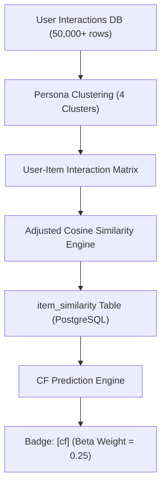

# 📗 Báo Cáo Kỹ Thuật: Thuật Toán Collaborative Filtering (Item-Item CF)

> **Phân hệ**: AI Recommendation Engine — Tầng Lọc Cộng Tác  
> **Định dạng**: Machine Learning & Software Architecture Spec  
> **Thư mục**: `backend/docs/neural/02-collaborative-filtering.md`  

---

## 1. Bản Chất Kỹ Thuật & Kiến Trúc Mô Hình

Thuật toán **Collaborative Filtering (CF)** áp dụng phương pháp **Item-Item Collaborative Filtering** cải tiến với thước đo độ tương đồng **Adjusted Cosine Similarity**. Thuật toán không chỉ dựa vào lượt mua đơn thuần mà tính toán khoảng cách vector tương tác giữa các sản phẩm có trừ đi điểm trung bình đánh giá của người dùng ($r_{u,i} - \bar{r}_u$), giúp loại bỏ thiên vị (bias) của người dùng tích cực hoặc khắt khe.



### Công Thức Toán Học:

1. **Độ tương đồng Adjusted Cosine giữa 2 sản phẩm $i$ và $j$**:
   $$Sim(i, j) = \frac{\sum_{u \in U} (R_{u,i} - \bar{R}_u)(R_{u,j} - \bar{R}_u)}{\sqrt{\sum_{u \in U} (R_{u,i} - \bar{R}_u)^2} \sqrt{\sum_{u \in U} (R_{u,j} - \bar{R}_u)^2}}$$
   với $\bar{R}_u$ là điểm tương tác trung bình của người dùng $u$.

2. **Điểm dự báo tương tác (Prediction Score)** cho sản phẩm $i$ chưa mua của người dùng $u$:
   $$Prediction(u, i) = \frac{\sum_{j \in Purchased(u)} Sim(i, j) \cdot R_{u,j}}{\sum_{j \in Purchased(u)} |Sim(i, j)|}$$

---

## 2. Phân Tích Dữ Liệu Seed Tương Ứng

| Thông số | Chi tiết Dữ liệu Seed Thực Tế |
|:---|:---|
| **Nguồn dữ liệu** | `backend/docs/chatbot/seed-product/mock-interactions-v2.js` |
| **Bảng dữ liệu** | `user_product_interaction` (50,000+ dòng tương tác), `item_similarity` |
| **Quy mô đối tượng** | 500 Khách hàng hàng giả lập $\times$ 1,380 Sản phẩm SKUs |
| **Mật độ ma trận (Density)** | ~7-10% (đạt tiêu chuẩn vàng cho mô hình CF học không bị thưa) |
| **Trọng số Ensemble** | $\beta = 0.25$ |

### Phân Cụm Persona Người Dùng (4 Clusters):

```javascript
// Cấu trúc Persona trong seed-customers-v2.js và mock-interactions-v2.js
1. Khách hàng 1 - 150  : Nhóm Nội Trợ (Ưu tiên Thịt, Cá, Rau, Gia vị - Cat 2..22)
2. Khách hàng 151 - 300: Nhóm Sinh Viên (Ưu tiên Mì gói, Xúc xích, Snack, Nước ngọt - Cat 28..94)
3. Khách hàng 301 - 400: Nhóm Dân Nhậu (Ưu tiên Bia, Rượu, Khô chế biến, Hạt - Cat 71, 79, 94, 101, 103)
4. Khách hàng 401 - 500: Nhóm Vãng Lai (Hành vi mua sắm ngẫu nhiên trên toàn danh mục)
```

---

## 3. Hướng Dẫn Trình Diễn (Demo Step-by-Step)

### Kịch Bản Demo: Kiểm Tra Gợi Ý Cá Nhân Hóa Dựa Trên Persona (AI Fast Path ONNX)

1. **Chuẩn bị (Môi trường sản xuất AI)**:
   - **Giữ AI Service HOẠT ĐỘNG bình thường** (Sử dụng ONNX Wide & Deep Engine).
   - Truy cập trang Khách hàng (`http://localhost:5174/login`).
   - Đăng nhập bằng tài khoản thuộc nhóm **Dân Nhậu**:
     - **Email / Username**: `customer_301` (hoặc `customer_302`)
     - **Mật khẩu**: `123456`

2. **Thực hiện truy vấn**:
   - Bấm vào biểu tượng Chatbot và gõ: `"Gợi ý cho tôi một số món phù hợp"`

3. **Kết quả kỳ vọng trên giao diện**:
   - Chatbot gửi danh sách gợi ý mồi nhậu và đồ uống (Bia Sài Gòn, Bia Tiger, Chân gà ớt rừng, Mực xé tẩm gia vị).
   - Trên **AI Dashboard -> Live Feedback Stream**:
     - Các sản phẩm cá nhân hóa dành cho Dân nhậu từ thuật toán CF được sắp xếp ở vị trí hàng đầu với Badge xanh dương **`[cf]`** (hoặc `[two_tower_onnx, cf]`).
     - Dòng **`AI Score`** (VD: `0.0884`) thể hiện Mô Hình ONNX Two-Tower trực tiếp chấm điểm dựa trên User Embedding Vector của `customer_301`.

4. **Tại sao kết quả này chứng minh CF & Neural Network hoạt động đúng?**:
   - Khách hàng 301 có lịch sử mua hàng thuộc cụm Dân nhậu (Cluster 3).
   - User Tower của ONNX tạo ra User Embedding chứa sở thích cá nhân của `customer_301`.
   - Lớp Wide Layer cộng thêm trọng số tương đồng từ ma trận `item_similarity` của CF.
   - Mô hình ONNX chấm điểm số cao cho các sản phẩm mồi nhậu mà các khách hàng thuộc cụm Dân nhậu khác thường chọn mua.

---

### 💡 (Tùy Chọn) Demo Chế Độ Trực Quan Hóa Tách Minh (Fallback White-Box):
Nếu hội đồng muốn soi chi tiết từng con số trọng số phân rã $\alpha, \beta, \gamma, \delta$, tạm thời tắt AI Service (`docker compose stop ai-service`). Khi đó, hệ thống tự động ngắt mạch sang **Tầng 2 (Ensemble Fallback)** và hiển thị chi tiết điểm số 4 thuật toán riêng biệt.
