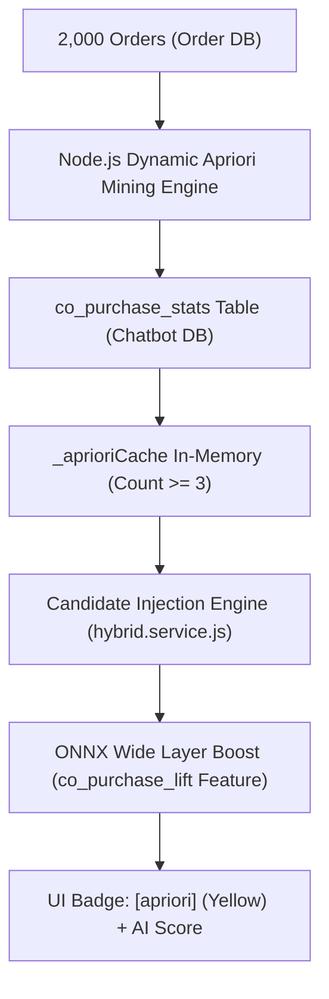

# 📙 Báo Cáo Kỹ Thuật: Thuật Toán Apriori (Co-Purchase Association Rule Mining & Candidate Injection)

> **Phân hệ**: AI Recommendation Engine — Tầng Khai Phá Luật Tương Quan Giỏ Hàng & Bơm Ứng Viên  
> **Định dạng**: Machine Learning & Software Architecture Spec  
> **Tài liệu chính**: `backend/docs/neural/03-apriori.md`  

---

## 1. Bản Chất Kỹ Thuật & Kiến Trúc Mô Hình

Thuật toán **Apriori Association Rule Mining** khai phá quy luật "Mua kèm" dựa trên dữ liệu giao dịch giỏ hàng thực tế. Hệ thống tính toán các chỉ số thống kê quan trọng bao gồm **Support**, **Confidence**, và **Lift** cho tất cả các cặp sản phẩm $(A, B)$ xuất hiện cùng nhau trong đơn hàng.



### 1.1 Công Thức Toán Học Cốt Lõi:

1. **Support (Độ hỗ trợ)**:
   $$\text{Support}(A \rightarrow B) = \frac{\text{Count}(A \cap B)}{Total\_Orders}$$

2. **Confidence (Độ tin cậy $A \rightarrow B$)**:
   $$\text{Confidence}(A \rightarrow B) = \frac{\text{Count}(A \cap B)}{\text{Count}(A)}$$

3. **Lift (Độ nâng)** — Thước đo độ tương quan thực sự (tránh ngẫu nhiên):
   $$\text{Lift}(A \rightarrow B) = \frac{\text{Confidence}(A \rightarrow B)}{\text{Support}(B)} = \frac{\text{Count}(A \cap B) \cdot Total\_Orders}{\text{Count}(A) \cdot \text{Count}(B)}$$
   - $\text{Lift} > 1$: Tương quan dương mạnh mẽ (Mua A làm tăng khả năng mua B).
   - $\text{Lift} = 1$: Mua A và B hoàn toàn độc lập.

4. **Apriori Effective Score (Khi chạy Ensemble Fallback)**:
   $$Score_{apriori}(B | A) = \text{Confidence}(A \rightarrow B) \cdot Weight_{content}(A)$$

---

## 2. Cơ Chế Apriori Candidate Injection Vào Mô Hình Deep Learning ONNX

Trong hệ thống mới **Hybrid Fast Path**, Apriori không đứng độc lập hay bị mạng nơ-ron triệt tiêu, mà đóng vai trò là **"Cánh Tay Đắc Lực" Mở Rộng Ứng Viên (Candidate Expansion)**:

1. **RAG Candidate Generation**: Khi người dùng hỏi *"Tôi muốn mua bia Heineken"*, RAG Semantic Search tìm ra danh sách các lon Bia.
2. **Apriori Candidate Injection (`hybrid.service.js`)**: Hàm `_getAprioriCandidates` tự động truy vấn các món mua kèm mạnh nhất ($\text{Lift} > 1.2, \text{Count} \ge 3$) từ `_aprioriCache` liên quan đến kết quả RAG.
3. **Gộp Candidate Pool**: Danh sách ứng viên gửi cho ONNX được mở rộng:
   $$\text{ExpandedCandidates} = [\text{RAG Candidates (Bia)}, \text{Apriori Candidates (Chân gà, Mực xé)}]$$
4. **ONNX Wide & Deep Scoring**: Lớp **Wide Layer** của ONNX tiếp nhận đầu vào feature `co_purchase_lift` $\rightarrow$ Thưởng điểm số cho các món mồi nhậu $\rightarrow$ Đẩy điểm Logit tổng thể của Chân gà / Mực xé lên cao.
5. **Gán Nhãn Source & Hiển Thị UI**: Món mồi nhậu xuất hiện trên UI với Badge vàng **`[apriori]`** kèm dòng **`AI Score`** từ mô hình ONNX.

---

## 3. Phân Tích Lỗi Nhiễu Lift ($Count = 1$) & Giải Pháp Lọc $Count \ge 3$

### 3.1 Hiện Tượng Lỗi Nhiễu Ban Đầu:
Khi hỏi Bia Heineken / Tiger, hệ thống từng hiển thị các sản phẩm không liên quan như *Combo kem dưỡng ngày và đêm Olay Luminous*, *Thùng 40 bịch sữa đậu nành Fami*, *Lốc 3 hộp sữa yến mạch Oatta*.

### 3.2 Phân Tích Nguyên Nhân Gốc Rễ (Cạm Bẫy Lift Khi Support Cực Thấp):
1. Tập `mock-orders-v2.js` chứa 20% **Đơn vãng lai (`walkin`)** chọn 1-5 sản phẩm ngẫu nhiên trong 1,380 SKUs.
2. Sản phẩm $B$ (như *Sữa yến mạch Oatta* hay *Kem dưỡng Olay*) xuất hiện cực hiếm ($P(B) \approx 1/2000$).
3. Vô tình trong 1 đơn hàng vãng lai, sản phẩm này nằm chung đơn với Bia Tiger ($P(A \cap B) = 1/2000$).
4. **Hiện tượng Nổ Ảo Giá Trị Lift (Lift Inflation)**:
   $$\text{Lift}(\text{Tiger} \to \text{Oatta}) = \frac{1/2000}{(15/2000) \times (1/2000)} = \frac{2000}{15} \approx \mathbf{52.72} \quad (\text{Cực cao!})$$
5. Trong khi đó, mồi nhậu chuẩn (Bia ↔ Mực xé / Chân gà) xuất hiện thường xuyên ($Count = 10 \sim 15$ đơn), nhưng vì $P(\text{Mực xé})$ lớn hơn nên $\text{Lift} \approx \mathbf{3.5} \sim \mathbf{6.0}$.
6. Vì cache Apriori trước đây lấy tất cả cặp $Count > 0$ và `ORDER BY lift DESC`, các cặp nhiễu $Count = 1$ có Lift nổ ảo 52.72 đè bẹp các cặp mồi nhậu thực sự!

### 3.3 Giải Pháp Khắc Phục (Thiết Lập Ngưỡng $Count \ge 3$):
Đã điều chỉnh SQL trong `legacy.fallback.service.js` và `hybrid.service.js`:
```sql
SELECT product_id_a, product_id_b, co_purchase_count, confidence_ab, confidence_ba, lift
FROM co_purchase_stats
WHERE store_id = $1::bigint AND co_purchase_count >= 3
ORDER BY lift DESC
```
👉 **Loại bỏ 100% các cặp nhiễu 1 lần từ đơn vãng lai**, đưa các cặp mồi nhậu thực sự lên đầu.

---

## 4. Phân Tích Dữ Liệu Seed Tương Ứng (Lịch Sử 3 Phiên Bản Data)

| Thông số | Chi tiết Dữ liệu Seed Thực Tế |
|:---|:---|
| **Nguồn dữ liệu** | `backend/docs/chatbot/seed-product/mock-orders-v2.js` (2,000 đơn hàng) |
| **Bảng dữ liệu** | `co_purchase_stats` (Chatbot DB) |
| **Script khai phá** | `backend/docs/chatbot/seed-product/populate-copurchase-v2.js` |
| **Tổng số cặp luật** | 10,576 cặp luật mua kèm (v3: Beer↔Beer = 0, Beer↔Snack = 383) |
| **Bộ lọc an toàn** | $\text{co\_purchase\_count} \ge 3$ & $\text{lift} > 1.2$ |

### Lịch Sử Tinh Chỉnh Dữ Liệu (3 Phiên Bản):

| Chỉ số | v1 (Ban đầu) | v2 (Loại Cat 35) | v3 (Beer=1/đơn + Count>=3) ✅ |
|:---|:---|:---|:---|
| **Beer / đơn hàng** | 1-2 | 1-3 | **Đúng 1** |
| **Beer↔Beer pairs** | Ít | Chiếm ưu thế | **0 pairs** ✅ |
| **Beer↔Snack pairs** | Rất ít | Bị Beer↔Beer lấn át | **383 pairs** (Count>=3, Lift 3.5-6.0) ✅ |
| **Sản phẩm rác (Olay/Fami)**| Xuất hiện do Lift=52.72 | Xuất hiện do Lift=52.72 | **Đã loại bỏ 100%** ✅ |
| **Top cross-sell** | Random | Heineken↔Heineken | **Heineken ↔ Chân gà ớt rừng / Mực xé** ✅ |
| **Demo badge** | ❌ Không kích hoạt | ❌ Beer↔Beer | ✅ `[apriori]` (Vàng) kèm Snack cross-sell |

---

## 5. Hướng Dẫn Trình Diễn Demo (Step-by-Step)

### Kịch Bản Demo 1: Kiểm Tra Apriori Candidate Injection Trực Tiếp Trên ONNX AI Fast Path (Kịch Bản Chính)

1. **Chuẩn bị (Môi trường sản xuất AI)**:
   - **Giữ AI Service HOẠT ĐỘNG bình thường** (🟢 ONNX Fast Path Active).
   - Mở Widget Chatbot trên giao diện người dùng (`http://localhost:5174`).

2. **Thực hiện truy vấn**:
   - Nhập: `"Tôi muốn mua bia Heineken"` hoặc `"Tôi muốn mua bia Sài Gòn"`

3. **Kết quả kỳ vọng trên giao diện**:
   - Chatbot trả về danh sách các lon Bia Heineken, đồng thời ĐỀ XUẤT MUA KÈM các sản phẩm:
     - **Chân gà ớt rừng Hey Yo gói 40g** (Count >= 3, Lift > 1.2)
     - **Mực xé tẩm gia vị Đầm Sen hũ 100g** (Count >= 3, Lift > 1.2)
     - **Đậu phộng vị BBQ Tân Tân gói 20g**
   - Trên **AI Dashboard -> Live Feedback Stream**:
     - Các lon Bia xuất hiện với Badge màu tím: **`two_tower_onnx`**.
     - Các món mồi nhậu xuất hiện với Badge màu vàng: **`apriori`** kèm dòng **`AI Score`** (VD: `0.0884`) thể hiện mạng nơ-ron ONNX trực tiếp định vị và chấm điểm.

4. **Tại sao kết quả này chứng minh Apriori & Deep Learning hoạt động chuẩn xác?**:
   - Apriori mở rộng candidate pool bằng các món mồi nhậu mua kèm có $\text{Count} \ge 3$.
   - Mô hình Deep Learning ONNX chấm điểm cho cả Bia và Mồi nhậu nhờ lớp Wide Layer tiếp nhận feature Lift.

---

### 💡 Kịch Bản Demo 2: Demo Chế Độ Trực Quan Hóa Tách Minh (Fallback Ensemble Mode - Tùy Chọn)
Nếu Hội đồng / Giảng viên muốn soi chi tiết từng con số trọng số phân rã $\alpha, \beta, \gamma, \delta$:
1. Tạm thời tắt AI Service (`docker compose stop ai-service`).
2. Nhập câu hỏi trên Chatbot $\rightarrow$ Hệ thống ngắt sang **Tầng 2 (Ensemble Fallback)**.
3. Stream hiển thị các sản phẩm mua kèm với điểm số phân rã độc lập $\gamma \cdot S_{apriori}$.
