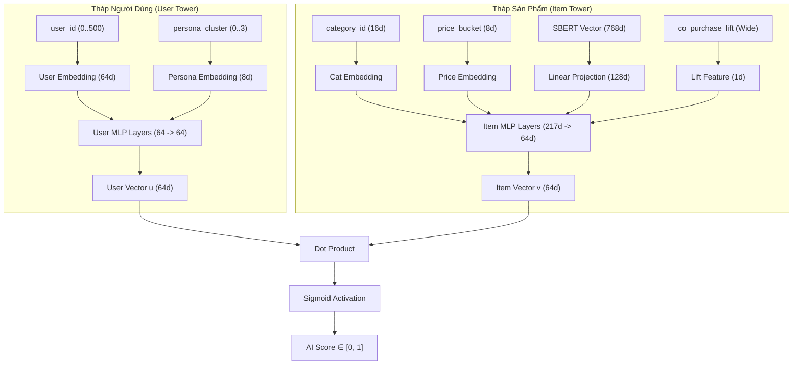

# 🔮 Báo Cáo Kỹ Thuật: Mô Hình Wide & Deep Two-Tower Neural Network (ONNX Runtime)

> **Phân hệ**: AI Recommendation Engine — Tầng Mạng Nơ-ron Hai Tháp Tốc Độ Cao  
> **Định dạng**: Deep Learning Architecture & Production Deployment Spec  
> **Thư mục**: `backend/docs/neural/04-two-tower.md`  

---

## 1. Bản Chất Kỹ Thuật & Kiến Trúc Mô Hình Wide & Deep Two-Tower

Mô hình **Two-Tower Wide & Deep Neural Network** là hạt nhân của hệ thống AI Recommendation thế hệ mới. Mô hình tách biệt quá trình tính toán ngữ cảnh người dùng (**User Tower**) và thông tin sản phẩm (**Item Tower**) thành hai tháp song song, cho phép suy luận (Inference) thời gian thực với độ trễ siêu thấp **< 1ms** thông qua định dạng **ONNX Runtime C++**.



### Điểm Cốt Lõi Kiến Trúc:

1. **Wide & Deep Integration**:
   - **Deep Component**: Tháp User & Item học biểu diễn ngữ nghĩa ẩn (Latent Semantic Embeddings) từ SBERT 768 chiều và thuộc tính phân cấp sản phẩm/người dùng.
   - **Wide Component**: Nhúng trực tiếp chỉ số $Lift$ từ Apriori vào tháp Item (`co_purchase_lift`), giúp mạng nơ-ron học ngay lập tức các luật tương quan mua kèm mạnh mà không bị hiện tượng "quên" (Catastrophic Forgetting).

2. **Dự Đoán Tốc Độ Siêu Tốc (Fast-Path Inference)**:
   - Mô hình PyTorch được export sang chuẩn **ONNX (`two_tower_model.onnx`)**.
   - Phân hệ `ai-service` chạy trên **ONNX Runtime (Python / C++ backend)**, tải sẵn dữ liệu đặc trưng vào bộ nhớ RAM (`product_features.parquet` ~ 4.2MB).
   - Tốc độ tính toán điểm số cho hàng trăm ứng viên candidate sản phẩm chỉ mất **< 1ms**.

3. **Cơ Chế Phòng Thủ (Defensive ID Clamping)**:
   - Trong `ai-service/app.py`, mã nguồn chủ động ép dải `user_id` không bị lỗi out-of-bounds:
     `safe_user_id = min(max(0, req.user_id), config.NUM_USERS)`
   - Đảm bảo an toàn tuyệt đối với mọi ID người dùng mới hoặc người dùng khách.

4. **Cơ Chế Apriori Candidate Injection (Bơm Ứng Viên)**:
   - Trước khi gửi danh sách ứng viên cho ONNX, `hybrid.service.js` thực hiện bước **Candidate Expansion (Mở rộng ứng viên)**.
   - Tìm kiếm các sản phẩm bán kèm mạnh nhất (Lift > 1.2) trong cache Apriori liên quan đến các sản phẩm tìm được từ RAG.
   - Gộp và loại bỏ trùng lặp: `expandedCandidates = [...ragCandidates, ...aprioriCandidates]`.
   - ONNX score cho TẤT CẢ ứng viên → Wide Layer áp dụng `co_purchase_lift` boost → Đẩy sản phẩm bán kèm (Snack) lên vị trí cao.
   - Sản phẩm bán kèm được gán nhãn source `[two_tower_onnx, apriori]` minh bạch.

---

## 2. Phân Tích Dữ Liệu Seed Tương Ứng

| Thông số | Chi tiết Dữ liệu Seed & Model Specs |
|:---|:---|
| **Nguồn dữ liệu huấn luyện** | `product_features.parquet`, `user_product_interaction`, `co_purchase_stats` |
| **Số lượng Parameter** | `NUM_USERS = 500`, `NUM_PRODUCTS = 1,380`, `NUM_CATEGORIES = 160` |
| **Kích thước Embedding** | `USER_EMB_DIM = 64`, `PERSONA_EMB_DIM = 8`, `SBERT_DIM = 768` |
| **Độ dài Output Vector** | 64 chiều (`TOWER_OUTPUT_DIM = 64`) |
| **Mô hình xuất bản** | `ai-service/models/two_tower_model.onnx` |
| **Badge hiển thị UI** | `[two_tower_onnx]` (Màu tím nhạt / Purple) |

---

## 3. Hướng Dẫn Trình Diễn (Demo Step-by-Step)

### Kịch Bản 1: Trình Diễn Mạng Two-Tower ONNX Độc Quyền (Chế Độ Bình Thường)

1. **Chuẩn bị**:
   - Đảm bảo dịch vụ `ai-service` đang hoạt động (Container Docker `ai-service` đang RUNNING).
   - Trên AI Dashboard: Nút **AI Tier Status Indicator** có màu xanh lá (🟢 **AI Fast Path Active (ONNX)**).

2. **Thực hiện truy vấn**:
   - Nhập bất kỳ câu hỏi nào trên Chatbot (ví dụ: `"Tư vấn cho tôi mặt hàng ăn sáng"`).

3. **Kết quả kỳ vọng**:
   - Mọi sản phẩm trả về trên Stream Dashboard đều gắn nhãn Badge tím: `[two_tower_onnx]`.
   - **Đặc trưng nhận diện**: Biểu đồ **Ensemble Weight Evolution** trên Dashboard sẽ **đứng yên (Flat Line)** vì ở chế độ Two-Tower, hệ thống bỏ qua phương trình tuyến tính $\alpha, \beta, \gamma, \delta$ cũ để sử dụng điểm số Dot-Product trực tiếp từ Mạng Nơ-ron!

---

### Kịch Bản 2: Trình Diễn Bộ Ngắt Mạch (Circuit Breaker) & Graceful Fallback (Cao Trào ACT 5)

1. **Thao tác hành động dũng cảm (Show, Don't Tell)**:
   - Ngay trên màn hình thuyết minh, mở Terminal và gõ lệnh dừng AI Service:
     ```bash
     docker compose stop ai-service
     ```
   - Hoặc click trực tiếp nút **AI Status Toggle** trên AI Dashboard.

2. **Kết quả tức thì**:
   - AI Dashboard chuyển trạng thái sang 🔴 **Fallback Ensemble Active (α/β/γ/δ)**.
   - Khi tiếp tục gửi câu hỏi trên Chatbot:
     - Chatbot **KHÔNG HỆ BỊ LỖI (Zero Downtime)**.
     - Hệ thống tự động lùi về Tầng 2 Fallback Ensemble trong **< 1ms**.
     - Các badge kết quả lập tức chuyển sang màu `[content]`, `[cf]`, `[apriori]` phân rã theo công thức White-box.

3. **Ý Nghĩa Bảo Vệ Đồ Án**:
   - Minh chứng cho Hội đồng thấy hệ thống đạt tiêu chuẩn **Enterprise Production-Ready**: có bộ ngắt mạch linh hoạt, chịu lỗi cao (Fault-tolerant), không bao giờ làm gián đoạn trải nghiệm người dùng cuối.
