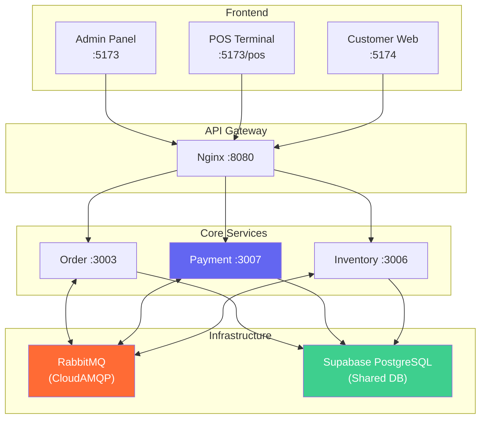
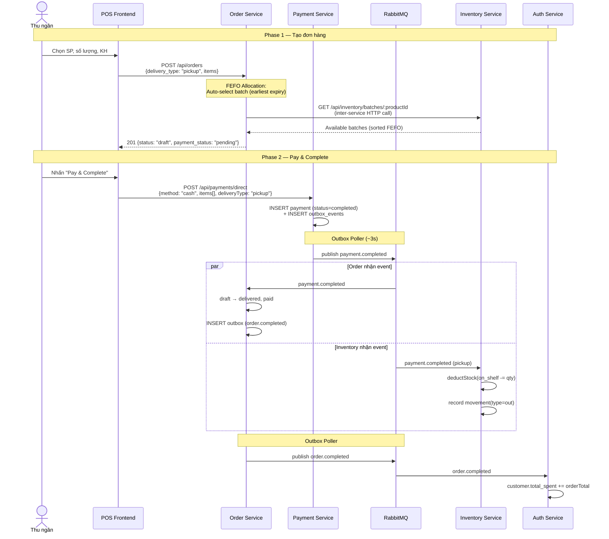
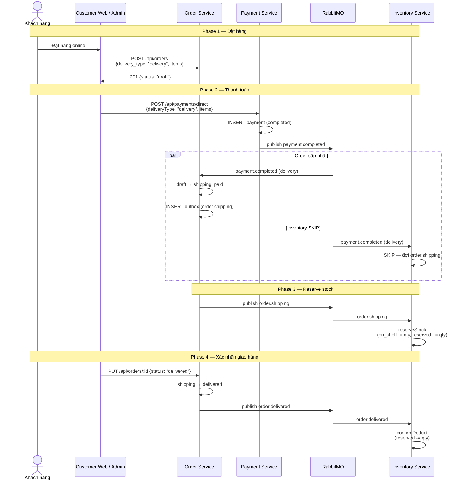
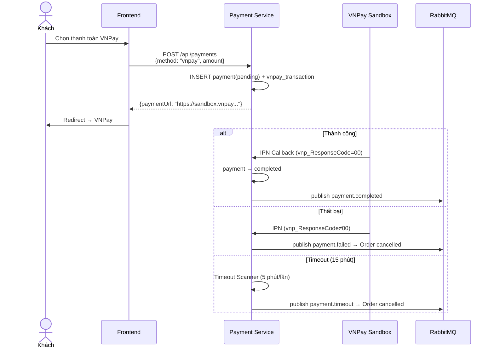
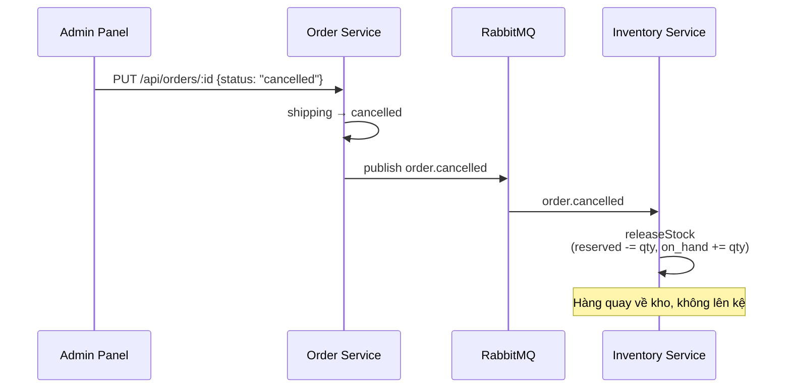
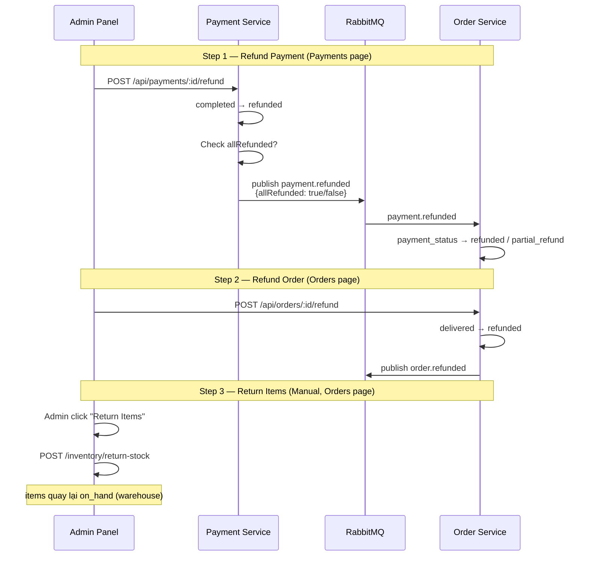
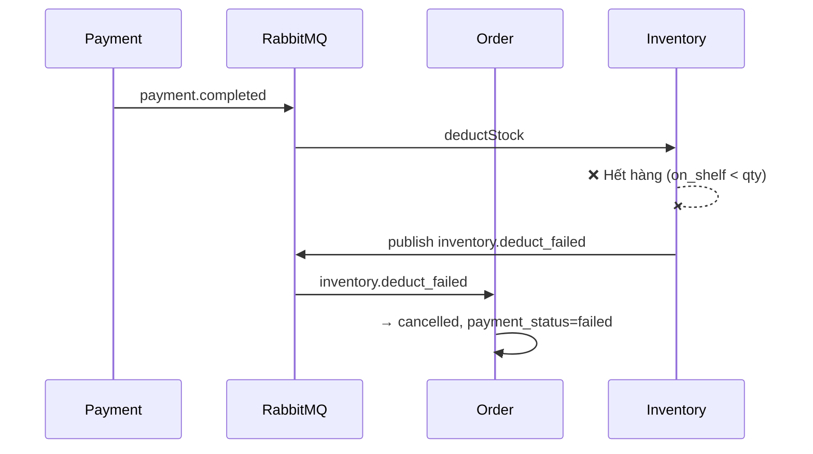
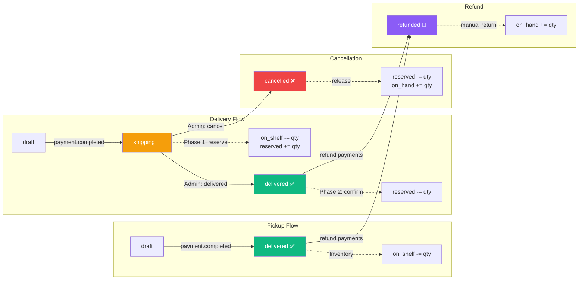

# Báo cáo Nghiệp vụ: Luồng Order → Payment → Inventory

> **Hệ thống**: POSMART Microservices  
> **Ngày rà soát**: 2026-04-24  
> **Phạm vi**: 3 Core Services (Order, Payment, Inventory) + Admin Frontend + POS Frontend

---

## 1. Tổng quan Kiến trúc

Hệ thống sử dụng **Saga Choreography** — không có orchestrator trung tâm. Các service giao tiếp qua **RabbitMQ** events với đảm bảo **at-least-once delivery** thông qua **Transactional Outbox Pattern**.

| Service | Port | Vai trò | Vai trò Saga |
|---------|------|---------|-------------|
| **Order Service** | 3003 | CRUD đơn hàng, status machine | Consumer + Producer |
| **Payment Service** | 3007 | Thanh toán, VNPay, hoàn tiền | **Saga Trigger** (Producer chính) |
| **Inventory Service** | 3006 | Tồn kho, reserve, deduct, release | Consumer + Compensation Producer |



> [!IMPORTANT]
> **Payment Service** là **Saga Trigger** — mọi luồng nghiệp vụ đều bắt đầu từ event `payment.completed`.

---

## 2. Hai Luồng Bán Hàng Chính

### 2.1. POS / Pickup Flow (Bán tại quầy)

**Đặc điểm**: Đồng bộ, khách nhận hàng ngay, thanh toán tại quầy.



**Kết quả cuối cùng (POS)**:

| Entity | Trạng thái |
|--------|-----------|
| Order | `status=delivered`, `payment_status=paid` |
| Payment | `status=completed` |
| Inventory | `on_shelf -= qty`, movement type `out` |
| Customer | `total_spent += orderTotal` (via Auth Service) |

---

### 2.2. Online / Delivery Flow (Giao hàng)

**Đặc điểm**: Bất đồng bộ, 2-phase inventory (reserve → confirm).



**Inventory thay đổi theo 2 pha (Delivery)**:

| Pha | Event | `on_shelf` | `reserved` | Ý nghĩa |
|-----|-------|-----------|-----------|---------|
| Phase 1 | `order.shipping` | −qty | +qty | Hàng rời kệ, đánh dấu tạm giữ |
| Phase 2 | `order.delivered` | — | −qty | Xác nhận đã bán, giải phóng reserved |

---

## 3. Luồng Bổ trợ

### 3.1. VNPay Payment Gateway



### 3.2. Hủy đơn (Delivery đang giao)



### 3.3. Hoàn tiền (Refund)



> [!NOTE]
> **Refund tách 3 bước**: Hoàn tiền (Payment) → Đổi status order (Order) → Hoàn hàng (Inventory). Đây là thiết kế chủ đích để tách biệt nghiệp vụ tài chính và logistics.

### 3.4. Saga Compensation (Xử lý lỗi)



---

## 4. Event Catalog

### 4.1. Payment Service → Publish

| Event | Trigger | Key Payload | Consumers |
|-------|---------|------------|-----------|
| `payment.completed` | Payment thành công | `orderId, storeId, items[], deliveryType, totalPaidSoFar` | Order, Inventory |
| `payment.failed` | VNPay thất bại | `orderId, storeId, reason` | Order, Inventory |
| `payment.timeout` | VNPay hết hạn (15m) | `orderId, storeId` | Order, Inventory |
| `payment.refunded` | Admin hoàn tiền | `orderId, allRefunded` | Order |

### 4.2. Order Service → Publish

| Event | Trigger | Key Payload | Consumers |
|-------|---------|------------|-----------|
| `order.shipping` | draft → shipping | `orderId, storeId, items[], deliveryType` | Inventory |
| `order.delivered` | shipping → delivered | `orderId, storeId, items[]` | Inventory |
| `order.cancelled` | shipping → cancelled | `orderId, storeId, items[]` | Inventory |
| `order.completed` | → delivered (any type) | `orderId, customerId, items[]` | Auth (total_spent) |
| `order.refunded` | → refunded | `orderId, items[]` | Inventory |

### 4.3. Inventory Service → Publish

| Event | Trigger | Key Payload | Consumers |
|-------|---------|------------|-----------|
| `inventory.deduct_failed` | Stock operation lỗi | `orderId, reason` | Order |
| `inventory.updated` | Bất kỳ stock change | `storeId` | Statistics |

---

## 5. Frontend Integration

### 5.1. Admin Panel — Orders Page

| Component | File | Chức năng |
|-----------|------|----------|
| `Orders.jsx` | Page wrapper | Fetch orders + Client-Side Join (resolve customer/employee names) |
| `OrderList.jsx` | Table | Hiển thị danh sách đơn hàng |
| `OrderListHeader.jsx` | Toolbar | Filter: status, payment, delivery type |
| `AddOrderModal.jsx` | Modal | Tạo đơn draft (FEFO allocation) |
| `EditOrderModal.jsx` | Modal | Sửa đơn + cập nhật status |
| `ViewOrderPaymentsModal.jsx` | Modal | Xem payment history + Add Payment / Pay & Complete |
| `InvoiceOrderModal.jsx` | Modal | Xuất hóa đơn |

**Client-Side Join Pattern**:
```
Orders.jsx → GET /api/orders (headers only)
           → Promise.allSettled(customerService.getCustomerById(id))
           → Promise.allSettled(employeeService.getEmployeeById(id))
           → Enrich orders with _customerName, _customerPhone, _createdByName
```

### 5.2. Admin Panel — Payments Page

| Component | File | Chức năng |
|-----------|------|----------|
| `Payments.jsx` | Page wrapper | Fetch all payments + client-side filter/sort |
| `PaymentList.jsx` | Table | Hiển thị giao dịch |
| `PaymentListHeader.jsx` | Toolbar | Filter: method, reference, status |
| `AddPaymentModal.jsx` | Modal | Tạo payment mới |
| `EditPaymentModal.jsx` | Modal | Sửa payment pending |

### 5.3. POS Frontend (posDataService)

POS sử dụng **isolated Axios instance** (`posApi.js`) với token riêng:

```
POS Flow:
  usePOSOrder → posDataService.createOrder()
  usePOSPayment → posDataService.createDirectPayment()
  
  All POS calls go through posApi (posToken)
  All Admin calls go through api (adminToken)
```

### 5.4. ViewOrderPaymentsModal — Điểm nối quan trọng

Modal này là **cầu nối Order ↔ Payment**, xử lý:

1. **Fetch order details** (GET `/api/orders/:id`) để lấy `items[]`
2. **Submit payment** với `items[]` đầy đủ cho inventory deduction
3. Hỗ trợ 2 mode:
   - **Save as Pending**: Tạo payment chờ duyệt
   - **Pay & Complete**: Tạo + hoàn thành ngay (trigger Saga)

> [!WARNING]
> Nếu `items[]` rỗng khi submit payment → Inventory handler sẽ **SKIP** silently (không trừ kho). Đây là guard có chủ đích, nhưng frontend phải đảm bảo luôn fetch order details trước khi tạo payment.

---

## 6. Bảng So sánh Tổng hợp: Pickup vs Delivery

| Bước | Pickup (POS) | Delivery (Online) |
|------|-------------|-------------------|
| **Tạo đơn** | `draft` | `draft` |
| **Thanh toán** | `payment.completed` → **delivered** | `payment.completed` → **shipping** |
| **Inventory @ payment** | `deductStock` (on_shelf -= qty) | **SKIP** |
| **Inventory @ shipping** | — | `reserveStock` (on_shelf → reserved) |
| **Giao hàng** | Ngay tại quầy | Admin xác nhận → `delivered` |
| **Inventory @ delivered** | **SKIP** (đã trừ) | `confirmDeduct` (reserved -= qty) |
| **Hủy đơn** | ❌ Không thể (đã delivered) | ✅ `releaseStock` (reserved → on_shelf) |
| **Hoàn tiền** | Payment → Order → Manual Inventory | Payment → Order → Manual Inventory |

---

## 7. Reliability & Safety Mechanisms

### 7.1. Transactional Outbox

```
Business Write + Event Insert = 1 Transaction (atomic)
Poller reads unpublished events every 3s → publish to RabbitMQ → mark published_at
```

### 7.2. Idempotency (processed_events)

```sql
-- Mỗi service track riêng, không xung đột
UNIQUE(event_id, service_name)
```

### 7.3. Shared-DB Isolation

```sql
-- Outbox: mỗi poller chỉ đọc events của service mình
WHERE published_at IS NULL AND service_name = $1
```

### 7.4. FEFO Batch Allocation

Order Service gọi HTTP tới Inventory Service để lấy batches, tự động chọn lô **hết hạn sớm nhất** (First Expired, First Out). Hỗ trợ **multi-batch split** nếu 1 lô không đủ số lượng.

### 7.5. VNPay Timeout Scanner

Payment Service chạy scanner mỗi **5 phút**, quét VNPay payments pending quá **15 phút** → publish `payment.timeout` → Order cancelled.

---

## 8. Sơ đồ Tổng hợp Event Flow


