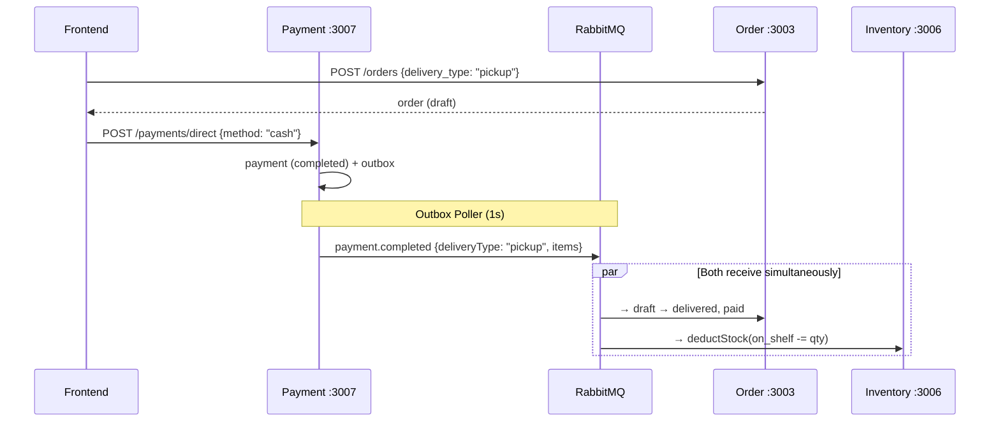
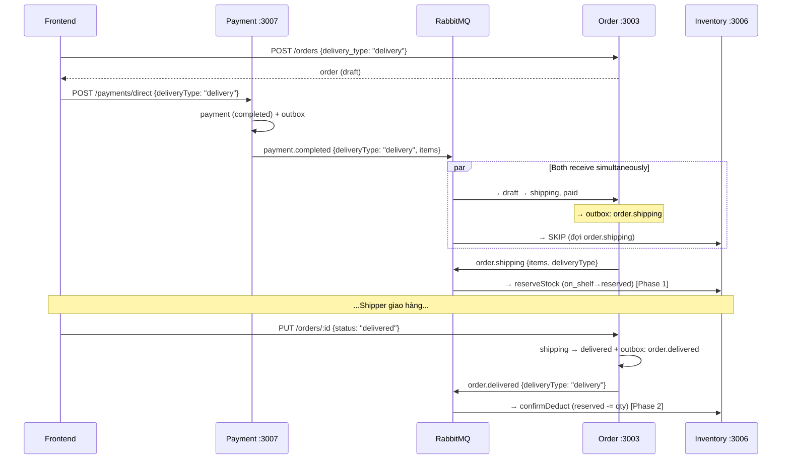
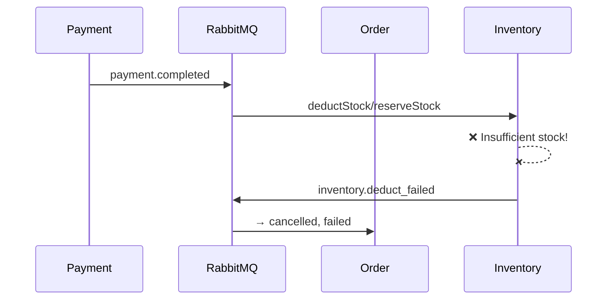

# 🔍 POSMART Microservices — Survey Report (Order, Payment, Inventory)

> **Date**: 2026-04-03 | **Phase**: Monolithic → Microservices (Saga Choreography stabilized)

---

## 📋 System Overview

**Project**: `@posmart/microservices` — Hệ thống quản lý cửa hàng tiện lợi (Mini-Mart POS)

| Metric           | Value                                                              |
| ---------------- | ------------------------------------------------------------------ |
| **Runtime**       | Node.js + Express.js                                              |
| **Database**      | PostgreSQL (Supabase Cloud — single DB, shared schema)            |
| **Message Broker**| RabbitMQ (CloudAMQP — topic exchange `posmart.events`)            |
| **Gateway**       | Nginx (reverse proxy, rate limiting)                              |
| **Total Services**| 9 (Auth, Catalog, **Order**, Settings, Supplier, **Inventory**, **Payment**, Chatbot, Statistics) |
| **Architecture**  | npm workspaces monorepo, shared libraries, Transactional Outbox + Saga Choreography |

### Port Map

| Service     | Port  | Gateway Path                                    |
| ----------- | ----- | ----------------------------------------------- |
| Gateway     | 8080  | Entry point                                     |
| Auth        | 3001  | `/api/auth`, `/api/customers`, `/api/employees` |
| Catalog     | 3002  | `/api/products`, `/api/categories`              |
| **Order**   | 3003  | `/api/orders`, `/api/order-details`             |
| Settings    | 3004  | `/api/settings`, `/api/config`                  |
| Supplier    | 3005  | `/api/suppliers`, `/api/purchase-orders`         |
| **Inventory**| 3006 | `/api/inventory`, `/api/batches`, `/api/stock-out`, `/api/warehouse` |
| **Payment** | 3007  | `/api/payments`                                 |
| Chatbot     | 3008  | `/api/chat`, `/ws/chat`                         |
| Statistics  | 3009  | `/api/statistics`                               |

---

## 🏗️ Shared Libraries

Tất cả service dùng chung 5 module trong `shared/`:

| Module           | File                      | Purpose                                         |
| ---------------- | ------------------------- | ----------------------------------------------- |
| `db`             | [index.js](file:///e:/UIT/backend/microservices/shared/db/index.js) | PostgreSQL pool (hỗ trợ Supabase SSL + local Docker) |
| `event-bus`      | [index.js](file:///e:/UIT/backend/microservices/shared/event-bus/index.js) | RabbitMQ topical pub/sub (connect, publish, subscribe, close) |
| `event-bus`      | [eventTypes.js](file:///e:/UIT/backend/microservices/shared/event-bus/eventTypes.js) | ~30 event constants (chống typo) |
| `auth-middleware` | [index.js](file:///e:/UIT/backend/microservices/shared/auth-middleware/index.js) | JWT verify + permission RBAC |
| `outbox`         | [index.js](file:///e:/UIT/backend/microservices/shared/outbox/index.js) | Transactional Outbox Pattern (insertEvent in TX + startPoller with `service_name` isolation) |
| `common`         | errors, logger, response, constants | Custom AppError hierarchy + pino logger |

### Shared-DB Isolation Pattern

> [!IMPORTANT]
> Tất cả services dùng chung 1 Supabase PostgreSQL. Để tránh xung đột, 2 bảng hệ thống sử dụng **`service_name` isolation**:

| Table | UNIQUE Constraint | Purpose |
|-------|------------------|---------|
| `outbox_events` | — (filtered by `service_name` WHERE clause) | Poller chỉ đọc event của service mình |
| `processed_events` | `UNIQUE(event_id, service_name)` | Cho phép cùng 1 event xử lý ở nhiều service |

---

## 🟢 Service 1: ORDER (`:3003`)

### Architecture

```
services/order/src/
├── index.js                    # Startup + 5 event subscriptions
├── app.js                      # Express app factory
├── db/init.sql                 # Schema: sale_order, sale_order_detail + migrations
├── repositories/
│   ├── order.repository.js     # CRUD with client (transaction-safe)
│   └── order-detail.repository.js
├── services/
│   └── order.service.js        # Business logic (457 LOC)
└── routes/
    ├── order.routes.js          # REST API (166 LOC)
    ├── order-detail.routes.js
    └── health.routes.js
```

### DB Schema

| Table                | Key Columns                                   | Notes                              |
| -------------------- | --------------------------------------------- | ---------------------------------- |
| `sale_order`         | id, store_id, customer_id, status, payment_status, delivery_type, total_amount | Multi-tenant (store_id)           |
| `sale_order_detail`  | order_id, product_name, batch_id, quantity, unit_price | Snapshot from Catalog + Inventory |
| `processed_events`   | event_id, event_type, **service_name** (UNIQUE composite) | Saga idempotency (shared-DB safe) |
| `outbox_events`      | event_type, payload, **service_name**, published_at | Transactional outbox (shared-DB safe) |

**Order Status Machine** (simplified — `pending`/`reserved` REMOVED):
```
draft → shipping     (payment.completed, delivery order)
draft → delivered    (payment.completed, pickup order)
draft → cancelled   (payment.failed / timeout)

shipping → delivered (shipper confirm)
shipping → cancelled (cancel while shipping)

delivered → refunded (full refund)
```

**Payment Status**: `pending → partial → paid → failed → partial_refund → refunded`

### API Endpoints

| Method  | Path                     | Purpose                               |
| ------- | ------------------------ | ------------------------------------- |
| GET     | `/api/orders`            | List orders (filtered, tenant-scoped) |
| GET     | `/api/orders/:id`        | Order detail + items                  |
| POST    | `/api/orders`            | Create draft (ALL orders start here) |
| PUT     | `/api/orders/:id/items`  | Replace draft items (FEFO re-allocate)|
| PUT     | `/api/orders/:id`        | General update (incl. status transition → publishes events) |
| PATCH   | `/api/orders/:id/status` | Status-only update                    |
| DELETE  | `/api/orders/:id`        | Delete draft only                     |
| DELETE  | `/api/orders/bulk/draft` | Bulk delete all drafts                |
| POST    | `/api/orders/:id/refund` | Refund order                          |

> [!NOTE]
> `POST /api/orders/online` đã bị **XÓA**. Tất cả orders giờ tạo qua `POST /api/orders` với `delivery_type: 'pickup' | 'delivery'`.

### Event Subscriptions (Consumer — 5 events)

| Event                       | Action                                          |
| --------------------------- | ----------------------------------------------- |
| `payment.completed`         | Pickup: `draft → delivered, paid`; Delivery: `draft → shipping, paid` |
| `payment.failed`            | → `status = cancelled, payment_status = failed` |
| `payment.timeout`           | → `status = cancelled` (VNPay expired)          |
| `payment.refunded`          | → `payment_status = refunded` or `partial_refund` |
| `inventory.deduct_failed`   | → `status = cancelled` (saga compensation)      |

> ~~`stock.reserved`~~ và ~~`stock.reservation_failed`~~ đã bị **XÓA** — luồng mới không cần trung gian.

### Event Emissions (Producer via Outbox — 3 events)

| Event              | Trigger                              | Payload includes |
| ------------------ | ------------------------------------ | ---------------- |
| `order.shipping`   | Status: `draft → shipping` (delivery only) | orderId, storeId, items, **deliveryType** |
| `order.delivered`  | Status: `shipping → delivered`       | orderId, storeId, items, **deliveryType** |
| `order.cancelled`  | Status: `shipping → cancelled`       | orderId, storeId, items, **deliveryType** |

> ~~`order.created`~~ đã bị **XÓA** — Order không còn trigger reservation flow trực tiếp.

### Key Business Logic

- **FEFO Batch Allocation**: Inter-service call to Inventory (`GET /api/inventory/batches/:productId`) with 2s timeout + JWT forwarding
- **All orders start as `draft`**: No separate online order creation
- **Event payload includes `deliveryType`**: Cho Inventory Service phân biệt pickup vs delivery

---

## 🟡 Service 2: PAYMENT (`:3007`)

### Architecture

```
services/payment/src/
├── index.js                     # Startup + VNPay timeout scanner
├── app.js                       # Express app factory
├── db/init.sql                  # Schema: payment, vnpay_transaction + migrations
├── repositories/
│   ├── payment.repository.js    # CRUD
│   └── vnpay.repository.js      # VNPay transaction log
├── services/
│   └── payment.service.js       # Business logic (377 LOC)
└── routes/
    ├── payment.routes.js         # REST API (245 LOC)
    └── health.routes.js
```

### DB Schema

| Table               | Key Columns                                         | Notes                          |
| ------------------- | --------------------------------------------------- | ------------------------------ |
| `payment`           | store_id, amount, method, status, reference_type, reference_id, **items** (JSONB), **delivery_type** | Polymorphic (SaleOrder/PurchaseOrder) |
| `vnpay_transaction` | payment_id, vnp_txn_ref, vnp_amount, status, payment_url, ipn_verified | VNPay gateway session log      |
| `processed_events`  | event_id, event_type, **service_name** | Saga idempotency (shared-DB safe) |
| `outbox_events`     | event_type, payload, **service_name** | Transactional outbox (shared-DB safe) |

**Payment Methods**: `cash`, `card`, `bank_transfer`, `vnpay`
**Payment Status**: `pending → completed → refunded` | `pending → expired` (VNPay timeout)

### API Endpoints

| Method | Path                         | Purpose                         |
| ------ | ---------------------------- | ------------------------------- |
| GET    | `/api/payments`              | List payments (filtered)        |
| GET    | `/api/payments/:id`          | Get single payment              |
| POST   | `/api/payments`              | Create pending payment (admin)  |
| POST   | `/api/payments/direct`       | **Direct cash/bank payment (auto-complete → triggers saga)** |
| PUT    | `/api/payments/:id`          | Update pending → completed (triggers event) |
| DELETE | `/api/payments/:id`          | Delete pending/cancelled        |
| POST   | `/api/payments/:id/refund`   | Refund completed payment        |
| POST   | `/api/payments/vnpay/create-url` | Create VNPay URL            |
| GET    | `/api/payments/vnpay/ipn`    | VNPay IPN Webhook (public)      |

### Event Emissions (Producer — 4 events, NO subscriptions)

| Event               | Trigger                           | Payload key fields |
| ------------------- | --------------------------------- | ------------------ |
| `payment.completed` | Direct payment / pending→completed / VNPay IPN success | paymentId, orderId, storeId, referenceType, amount, method, **items**, **deliveryType**, totalPaidSoFar |
| `payment.failed`    | VNPay IPN failure                 | paymentId, orderId, storeId, reason |
| `payment.timeout`   | VNPay timeout scanner (5 min interval, 15 min TTL) | paymentId, orderId, storeId, reason |
| `payment.refunded`  | Refund completed payment          | paymentId, orderId, storeId, referenceType, amount, **allRefunded** |

### Key Business Logic

- **Dual Payment Flow**: 
  1. **Direct** (cash/bank_transfer): Insert as `completed` + outbox event immediately → saga trigger
  2. **VNPay**: Insert as `pending` → generate URL → await IPN webhook → complete/fail
- **VNPay Timeout Scanner**: `setInterval` every 5 min, marks payments pending > 15 min as expired, publishes `payment.timeout`
- **Polymorphic Reference**: `reference_type` supports both `SaleOrder` (orders) and `PurchaseOrder` (supplier POs)
- **Items stored in JSONB**: Payment carries `items` array (batchId, locationId, quantity) for Inventory deduction
- **`deliveryType` forwarded**: Payment passes `deliveryType` from frontend to event payload

> [!WARNING]
> **Payment routes thiếu `verifyToken`**: Only `req.user ? ... : 1` fallback — cần thêm middleware. VNPay IPN route (`/vnpay/ipn`) đúng là public, nhưng các route khác cần bảo vệ.

---

## 🔵 Service 3: INVENTORY (`:3006`)

### Architecture

```
services/inventory/src/
├── index.js                      # Startup + 6 event subscriptions
├── app.js                        # Express app factory
├── db/init.sql                   # Schema: 8 tables + 1 view + migrations
├── repositories/
│   ├── inventory.repository.js   # Core inventory CRUD
│   ├── batch.repository.js       # Product batch management
│   ├── warehouse.repository.js   # Warehouse blocks + locations
│   └── stock-out.repository.js   # Stock-out orders
├── services/
│   ├── inventory.service.js      # Core inventory logic (477 LOC, 18.6KB)
│   ├── warehouse.service.js      # Warehouse management (16.3KB)
│   └── stock-out.service.js      # Stock-out logic (9.8KB)
└── routes/
    ├── inventory.routes.js        # 13.6KB — largest route file
    ├── warehouse.routes.js        # 13.9KB
    ├── batch.routes.js
    ├── stock-out.routes.js
    └── health.routes.js
```

### DB Schema

| Table               | Key Columns                                                | Notes                         |
| ------------------- | ---------------------------------------------------------- | ----------------------------- |
| `product_batch`     | store_id, product_id, cost_price, unit_price, expiry_date, status | Multi-tenant, links to Catalog |
| `warehouse_block`   | store_id, name, type (`warehouse`/`store_shelf`), rows, cols | Grid-based warehouse layout   |
| `location`          | block_id, name, position, max_capacity                     | Individual shelves/slots       |
| `inventory_item`    | batch_id, location_id, **quantity_on_hand**, **quantity_on_shelf**, **quantity_reserved** | 3-tier quantity tracking      |
| `inventory_movement`| item_id, movement_type, quantity, reason                   | Audit trail (in/out/adjust/transfer/reserve/release) |
| `stock_out_order`   | store_id, reason, status, total_price                      | Stock-out workflow             |
| `stock_out_detail`  | so_id, batch_id, quantity, unit_price                      |                               |
| `v_product_inventory` (VIEW) | store_id, product_id → totals                      | Aggregated view per product    |

**3-Tier Quantity Model**:
```
quantity_on_hand   → Tồn trong kho (warehouse)
quantity_on_shelf  → Trưng bày trên kệ (sellable)
quantity_reserved  → Đã tạm giữ cho đơn giao (delivery orders)
```

### Event Subscriptions (Consumer — 6 events)

| Event                | Action                                         | Delivery Flow | Pickup Flow |
| -------------------- | ---------------------------------------------- | ------------- | ----------- |
| `payment.completed`  | Pickup → `deductStock(on_shelf -= qty)`; Delivery → **SKIP** (đợi shipping) | ⏭️ Skip | ✅ Deduct |
| `order.shipping`     | `reserveStock(on_shelf -= qty, reserved += qty)` — Phase 1 | ✅ Reserve | — |
| `order.delivered`    | `confirmDeduct(reserved -= qty)` — Phase 2 (delivery only; pickup skipped) | ✅ Confirm | ⏭️ Skip |
| `order.cancelled`    | `releaseStock(reserved -= qty, on_shelf += qty)` — Rollback | ✅ Release | — |
| `payment.failed`     | Release reserved stock                         | ✅ Release | — |
| `payment.timeout`    | Release reserved stock                         | ✅ Release | — |

> ~~`order.created`~~ subscription đã bị **XÓA** — thay bằng `order.shipping`.
> ~~`stock.reserved`~~ và ~~`stock.reservation_failed`~~ emissions đã bị **XÓA**.

### Event Emissions (Producer — 1 event)

| Event                       | Trigger                              |
| --------------------------- | ------------------------------------ |
| `inventory.deduct_failed`   | Failed deduction/reservation (saga compensation) |

### Key Business Logic

- **FEFO (First Expired, First Out)**: Inventory batches sorted by `expiry_date` for auto-allocation
- **3-Tier Quantity**: `on_hand` (warehouse) / `on_shelf` (sellable) / `reserved` (committed for delivery)
- **Two-Phase Delivery Flow**: Phase 1 = `reserveStock` (on `order.shipping`), Phase 2 = `confirmDeduct` (on `order.delivered`)
- **Pickup = Instant**: Deduct `on_shelf` directly on `payment.completed`, no reservation
- **Manual refund policy**: `payment.refunded` does NOT auto-return stock; inventory return is manual

---

## 🔄 Saga Choreography (Event-Driven)

### Flow 1: POS Sale (Pickup — Instant)


### Flow 2: Online Order (Delivery — Two-Phase Saga)


### Flow 3: Saga Compensation (Error Handling)


### Idempotency Pattern (ALL services, shared-DB safe)
```javascript
// Every event handler starts with:
await pool.query(
  'INSERT INTO processed_events (event_id, event_type, service_name) VALUES ($1, $2, $3)',
  [eventId, eventType, SERVICE_NAME]  // SERVICE_NAME isolates per-service
);
// Catches PostgreSQL unique violation (code 23505) → skip duplicate
```

---

## ⚠️ Key Observations & Status

### 🟢 Working / Verified
1. ✅ **Transactional Outbox** — atomic DB commit + event publish with `service_name` isolation
2. ✅ **Idempotency** — `processed_events` with composite unique `(event_id, service_name)` — shared-DB safe
3. ✅ **Simplified Order Lifecycle** — `draft → shipping → delivered` (no more `pending`/`reserved` intermediates)
4. ✅ **Two-Phase Delivery Inventory** — Phase 1: reserve on `order.shipping`, Phase 2: confirm on `order.delivered`
5. ✅ **Pickup Instant Deduction** — `on_shelf -= qty` directly on `payment.completed`
6. ✅ **Saga Compensation** — `inventory.deduct_failed` reverts Order, cancellation releases reserved stock
7. ✅ **Event payloads include `deliveryType`** — Inventory correctly distinguishes pickup vs delivery

### 🟡 Known Issues (Non-Critical)
1. ~~**Customer data is placeholder**: Order's `formatOrder()` returns `Customer #ID`~~ → **FIXED** — Backend returns raw `customerId`, frontend resolves via Client-Side Join (same pattern as StockOut employee resolution)
2. ~~**Response format inconsistency**~~ → ✅ **FIXED** — All services now use `{ status: 'success', data }`
3. ~~**Event type string literals**~~ → ✅ **FIXED** — All handlers migrated to `eventTypes.js` constants
4. ~~**Statistics deprecated event**~~ → ✅ **FIXED** — Now subscribes to `ORDER_SHIPPING` instead of `order.created`

### ~~🔴 Security Issues~~ → ✅ ALL FIXED
1. ~~**Payment routes thiếu `verifyToken`**~~ → ✅ **FIXED** — 8 routes protected, `/vnpay/ipn` remains public
2. ~~**CORS wildcard**~~ → ✅ **FIXED** — Multi-domain via `CORS_ORIGINS` env var

---

## 📊 Inventory Behavior Matrix

| Scenario | `on_shelf` | `reserved` | `on_hand` | Movement |
|----------|-----------|-----------|----------|----------|
| **Pickup: payment.completed** | −qty | — | — | `out` |
| **Delivery: order.shipping** (Phase 1) | −qty | +qty | — | `reserve` |
| **Delivery: order.delivered** (Phase 2) | — | −qty | — | `out` |
| **Delivery: order.cancelled** (Rollback) | +qty | −qty | — | `release` |
| **payment.failed/timeout** | +qty | −qty | — | `release` |
| **order.refunded** (NEW) | — | — | **+qty** | `in` (refund_return) |

---

## 📁 File Map (3 Services Focus)

### Order Service
| File | Size | LOC | Purpose |
|------|------|-----|---------|
| [index.js](file:///e:/UIT/backend/microservices/services/order/src/index.js) | 9.9KB | 259 | Bootstrap + 5 event subscriptions |
| [order.service.js](file:///e:/UIT/backend/microservices/services/order/src/services/order.service.js) | 17.5KB | 457 | Core logic: FEFO, status transitions, outbox events |
| [order.routes.js](file:///e:/UIT/backend/microservices/services/order/src/routes/order.routes.js) | 4.7KB | 166 | REST endpoints (9 routes) |
| [init.sql](file:///e:/UIT/backend/microservices/services/order/src/db/init.sql) | 5.5KB | 126 | Schema + 3 migrations |

### Payment Service
| File | Size | LOC | Purpose |
|------|------|-----|---------|
| [index.js](file:///e:/UIT/backend/microservices/services/payment/src/index.js) | 3.0KB | 94 | Bootstrap + VNPay scanner |
| [payment.service.js](file:///e:/UIT/backend/microservices/services/payment/src/services/payment.service.js) | 15.5KB | 377 | VNPay, Direct, Refund logic |
| [payment.routes.js](file:///e:/UIT/backend/microservices/services/payment/src/routes/payment.routes.js) | 9.1KB | 245 | REST + VNPay webhook |
| [init.sql](file:///e:/UIT/backend/microservices/services/payment/src/db/init.sql) | 4.1KB | 114 | Schema + 3 migrations |

### Inventory Service
| File | Size | LOC | Purpose |
|------|------|-----|---------|
| [index.js](file:///e:/UIT/backend/microservices/services/inventory/src/index.js) | 12.5KB | 311 | Bootstrap + 6 event subscriptions |
| [inventory.service.js](file:///e:/UIT/backend/microservices/services/inventory/src/services/inventory.service.js) | 18.7KB | 477 | FEFO, reserve, deduct, release, confirmDeduct |
| [warehouse.service.js](file:///e:/UIT/backend/microservices/services/inventory/src/services/warehouse.service.js) | 16.3KB | ~350 | Block/location management |
| [stock-out.service.js](file:///e:/UIT/backend/microservices/services/inventory/src/services/stock-out.service.js) | 9.8KB | ~200 | Stock-out workflow |
| [init.sql](file:///e:/UIT/backend/microservices/services/inventory/src/db/init.sql) | 8.5KB | 207 | 8 tables + 1 view + 3 migrations |

### Shared Libraries
| File | Size | Purpose |
|------|------|---------|
| [outbox/index.js](file:///e:/UIT/backend/microservices/shared/outbox/index.js) | 4.0KB | Transactional Outbox with `service_name` isolation |
| [event-bus/index.js](file:///e:/UIT/backend/microservices/shared/event-bus/index.js) | ~4KB | RabbitMQ topic pub/sub |

---

## 📝 Change Log (vs Previous Survey)

| Item | Before (2026-04-02) | After (2026-04-03) |
|------|--------------------|--------------------|
| Order status machine | `draft → pending → reserved → shipping → delivered` | `draft → shipping → delivered` |
| `POST /orders/online` | Existed (Saga trigger) | **REMOVED** |
| `order.created` event | Published by Order | **REMOVED** |
| `stock.reserved` / `stock.reservation_failed` | Published by Inventory, consumed by Order | **REMOVED** |
| `processed_events` UNIQUE | `UNIQUE(event_id)` ❌ cross-service collision | `UNIQUE(event_id, service_name)` ✅ |
| `outbox_events` poller | No filter → cross-service pollution | Filtered by `service_name` ✅ |
| Inventory on `payment.completed` (delivery) | `reserveStock` (double reserve bug) | **SKIP** (waits for `order.shipping`) ✅ |
| Inventory on `order.delivered` | Always `confirmDeduct` | Skip for pickup, `confirmDeduct` for delivery only ✅ |
| Event payloads | Missing `deliveryType` | All order events include `deliveryType` ✅ |
| Order subscriptions | 7 events | 5 events (removed 2 deprecated) |
| Inventory subscriptions | `order.created` + 5 others | `order.shipping` + 5 others (6 total) |
