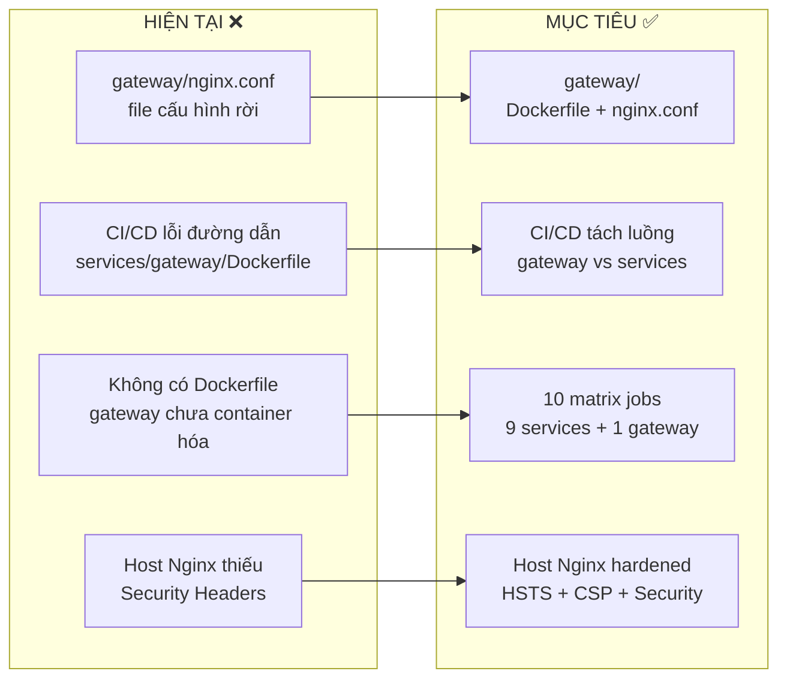

# Kế Hoạch Chuẩn Hóa API Gateway — POSMART Mini-Mart

> **Mục tiêu**: Đưa Nginx Gateway từ một file cấu hình nằm rời rạc thành một **Service Container chuẩn mực**, sửa lỗi CI/CD, bảo mật hardening, và sẵn sàng cho bước deploy lên DigitalOcean.

---

## 📊 Gap Analysis — Hiện Trạng vs. Mục Tiêu



### Bảng So Sánh Chi Tiết

| Hạng mục | Hiện trạng | Vấn đề | Mục tiêu |
|----------|-----------|--------|----------|
| **Gateway Dockerfile** | ❌ Không tồn tại | CI/CD build **thất bại 100%** cho gateway | ✅ `backend/gateway/Dockerfile` |
| **CI/CD Build Path** | `./backend/services/${{ matrix.service }}/Dockerfile` | Sai đường dẫn — gateway nằm ở `backend/gateway/`, không phải `backend/services/gateway/` | ✅ Logic IF/ELSE tách luồng |
| **nginx.conf** | ✅ Đã có CORS, gzip, rate limiting, tracing | Đã hoàn chỉnh từ Phase 1.3 | ✅ Giữ nguyên + thêm hardening nhỏ |
| **Host Nginx** | Chỉ có proxy_pass + WebSocket | Thiếu Security Headers (HSTS, X-Content-Type, etc.) | ✅ Hardened host config |
| **docker-compose.prod.yml** | ✅ Đã có, dùng GHCR image | Gateway `depends_on` chỉ auth + catalog | ✅ Cân nhắc bổ sung depends_on |
| **Healthcheck (Gateway)** | ✅ `/health` endpoint trả JSON | Chỉ return 200, không check upstream | ✅ Đủ cho Nginx proxy |

---

## ⚠️ User Review Required

> [!CAUTION]
> ### BUG NGHIÊM TRỌNG — CI/CD Sẽ Fail Cho Gateway
> File [deploy-backend.yml](file:///e:/UIT/backend/.github/workflows/deploy-backend.yml) dòng **43** đang hardcode đường dẫn:
> ```yaml
> file: ./backend/services/${{ matrix.service }}/Dockerfile
> ```
> Khi `matrix.service = gateway`, nó sẽ tìm `./backend/services/gateway/Dockerfile` — **file không tồn tại**.
> Gateway thực tế nằm tại `./backend/gateway/`. Đây là lỗi **chặn deploy hoàn toàn**.

> [!WARNING]
> ### docker-compose.prod.yml — Gateway depends_on
> Hiện tại gateway chỉ `depends_on: [auth, catalog]`. Nếu các service khác chưa sẵn sàng khi gateway start, Nginx sẽ trả **502 Bad Gateway** cho các route đó. Tuy nhiên, với `restart: always`, container sẽ tự khôi phục. **Bạn có muốn thêm depends_on cho tất cả 9 services hay giữ nguyên?**

> [!IMPORTANT]
> ### Security Headers trên Host Nginx
> File cấu hình Nginx trên Droplet (`/etc/nginx/sites-available/api.mini-mart.dev`) hiện chỉ có proxy_pass cơ bản. Bạn có muốn bổ sung các Security Headers (HSTS, X-Frame-Options, X-Content-Type-Options, Referrer-Policy) không? Đây là best practice cho production.

---

## Open Questions

1. **Rate Limiting nâng cao**: Gateway hiện dùng `$binary_remote_addr`. Sau khi đi qua Host Nginx, IP thực có thể bị thay bằng `127.0.0.1`. Cần set `real_ip_header` trong container Nginx để lấy đúng IP từ `X-Forwarded-For`. **Bạn đã test thử rate limiting chưa?**

2. **Gateway Logging Volume**: Nginx access log + error log trong container sẽ tích dần. Trên Droplet 2GB RAM, disk space cũng hạn chế. **Bạn có muốn thêm log rotation hoặc tắt access log cho health check endpoints?**

3. **Graceful Shutdown**: Khi deploy image mới, container gateway cũ sẽ bị kill. Các request đang xử lý có thể bị cắt ngang. **Có cần cấu hình `stop_signal: SIGQUIT` cho nginx để graceful shutdown?**

---

## Proposed Changes

### Phase A: Tạo Gateway Dockerfile (Ưu Tiên Cao Nhất ⭐)

> **Lý do**: Không có Dockerfile = không build được image = CI/CD fail = **KHÔNG DEPLOY ĐƯỢC**.

#### [NEW] [Dockerfile](file:///e:/UIT/backend/backend/gateway/Dockerfile)

```dockerfile
# ============================================================
# POSMART API GATEWAY — Nginx Alpine Container
# Chỉ ~25MB, chứa sẵn rules rate-limiting + CORS + routing
# ============================================================
FROM nginx:alpine

# Xóa config mặc định
RUN rm /etc/nginx/nginx.conf

# Copy cấu hình chuẩn của dự án
COPY nginx.conf /etc/nginx/nginx.conf

# Container lắng nghe port 80
EXPOSE 80

# Health check cho Docker
HEALTHCHECK --interval=30s --timeout=5s --start-period=10s --retries=3 \
    CMD wget -qO- http://localhost/health || exit 1

# Chạy Nginx foreground
CMD ["nginx", "-g", "daemon off;"]
```

**Cấu trúc thư mục sau khi tạo:**

```
backend/
└── gateway/
    ├── Dockerfile    ← MỚI
    └── nginx.conf    ← Đã có (370 dòng)
```

**Điểm khác so với `gateway.md`:**
- Thêm `HEALTHCHECK` instruction → Docker tự kiểm tra container có sống hay không
- Dùng `wget` thay `curl` vì Alpine mặc định có `wget`

---

### Phase B: Fix CI/CD Build Path (Ưu Tiên Cao ⚡)

> **Lý do**: Sửa bug chặn deploy. Gateway nằm khác đường dẫn so với 9 services.

#### [MODIFY] [deploy-backend.yml](file:///e:/UIT/backend/.github/workflows/deploy-backend.yml)

**Thay đổi 1 — Thêm step "Set build context path":**

```diff
     steps:
       - name: Checkout repository
         uses: actions/checkout@v4

       - name: Lowercase repo name
         id: repo
         run: echo "name=$(echo '${{ github.repository }}' | tr '[:upper:]' '[:lower:]')" >> $GITHUB_OUTPUT

+      - name: Set build context path
+        id: set-context
+        run: |
+          if [ "${{ matrix.service }}" == "gateway" ]; then
+            echo "context=./backend/gateway" >> $GITHUB_OUTPUT
+            echo "dockerfile=./backend/gateway/Dockerfile" >> $GITHUB_OUTPUT
+          else
+            echo "context=./backend" >> $GITHUB_OUTPUT
+            echo "dockerfile=./backend/services/${{ matrix.service }}/Dockerfile" >> $GITHUB_OUTPUT
+          fi
+
       - name: Set up Docker Buildx
         uses: docker/setup-buildx-action@v3
```

**Thay đổi 2 — Cập nhật Build step:**

```diff
       - name: Build and push Docker image
         uses: docker/build-push-action@v5
         with:
-          context: ./backend
-          file: ./backend/services/${{ matrix.service }}/Dockerfile
+          context: ${{ steps.set-context.outputs.context }}
+          file: ${{ steps.set-context.outputs.dockerfile }}
           push: true
           tags: ghcr.io/${{ steps.repo.outputs.name }}/${{ matrix.service }}:latest
```

**Giải thích logic:**

| Service | context | dockerfile |
|---------|---------|------------|
| `gateway` | `./backend/gateway` | `./backend/gateway/Dockerfile` |
| `auth` | `./backend` | `./backend/services/auth/Dockerfile` |
| `catalog` | `./backend` | `./backend/services/catalog/Dockerfile` |
| ... (7 services khác) | `./backend` | `./backend/services/*/Dockerfile` |

> [!IMPORTANT]
> **Tại sao Gateway context khác?** Gateway Dockerfile dùng `COPY nginx.conf /etc/nginx/nginx.conf`. File `nginx.conf` nằm cùng thư mục `gateway/`. Nếu context là `./backend`, lệnh `COPY` sẽ không tìm thấy file → build fail.

---

### Phase C: Hardening Nginx — Container + Host Level

#### C.1 — [MODIFY] [nginx.conf](file:///e:/UIT/backend/backend/gateway/nginx.conf) (Container Nginx)

**Thêm `real_ip` để rate limiting hoạt động đúng qua Host Nginx:**

```diff
 http {
     # Logging
     access_log /var/log/nginx/access.log;
     error_log  /var/log/nginx/error.log;
 
+    # ==========================================
+    # Real IP — Lấy IP thực từ Host Nginx
+    # ==========================================
+    set_real_ip_from 172.16.0.0/12;   # Docker bridge network
+    set_real_ip_from 10.0.0.0/8;      # Docker overlay network
+    real_ip_header X-Real-IP;
+
     # ==========================================
     # GZIP Compression
     # ==========================================
```

**Tại sao cần?** Khi request đi qua Host Nginx → Container Nginx, `$binary_remote_addr` sẽ là IP của Docker bridge (172.x.x.x), không phải IP thực của client. Rate limiting sẽ áp dụng chung cho **mọi** request → vô nghĩa. `set_real_ip_from` + `real_ip_header` giải quyết vấn đề này.

**Thêm tắt access log cho health check (tiết kiệm disk):**

```diff
     server {
         listen 80;
 
+        # Tắt log cho health check (giảm noise)
+        location /health {
+            access_log off;
+            return 200 '{"status":"ok","service":"gateway"}';
+            add_header Content-Type application/json;
+        }
+
         # ==========================================
         # CORS Headers (Centralized)
```

> [!NOTE]
> Cần di chuyển block `/health` hiện tại (dòng 364-367) lên đầu server block và thêm `access_log off;`. Health check endpoint được gọi mỗi 30s bởi Docker HEALTHCHECK → tạo rất nhiều log thừa.

---

#### C.2 — [NEW] [api.mini-mart.dev.conf](file:///e:/UIT/backend/infra/nginx/api.mini-mart.dev.conf)

File cấu hình Nginx host-level trên Droplet (lưu trong repo để version control):

```nginx
# ============================================================
# POSMART — Host-level Nginx Configuration
# Đặt tại: /etc/nginx/sites-available/api.mini-mart.dev
# ============================================================

# Redirect HTTP → HTTPS
server {
    listen 80;
    server_name api.mini-mart.dev;
    return 301 https://$host$request_uri;
}

server {
    listen 443 ssl http2;
    server_name api.mini-mart.dev;

    # SSL (Managed by Certbot)
    ssl_certificate /etc/letsencrypt/live/api.mini-mart.dev/fullchain.pem;
    ssl_certificate_key /etc/letsencrypt/live/api.mini-mart.dev/privkey.pem;
    include /etc/letsencrypt/options-ssl-nginx.conf;
    ssl_dhparam /etc/letsencrypt/ssl-dhparams.pem;

    # ==========================================
    # Security Headers
    # ==========================================
    add_header Strict-Transport-Security "max-age=31536000; includeSubDomains" always;
    add_header X-Content-Type-Options "nosniff" always;
    add_header X-Frame-Options "DENY" always;
    add_header Referrer-Policy "strict-origin-when-cross-origin" always;

    # ==========================================
    # Request Size Limit (ngăn upload quá lớn)
    # ==========================================
    client_max_body_size 10m;

    # ==========================================
    # Proxy → Docker Gateway Container (:8080)
    # ==========================================
    location / {
        proxy_pass http://127.0.0.1:8080;
        proxy_set_header Host $host;
        proxy_set_header X-Real-IP $remote_addr;
        proxy_set_header X-Forwarded-For $proxy_add_x_forwarded_for;
        proxy_set_header X-Forwarded-Proto $scheme;

        # WebSocket support (Socket.IO Chatbot)
        proxy_http_version 1.1;
        proxy_set_header Upgrade $http_upgrade;
        proxy_set_header Connection "upgrade";

        # Timeout (giữ WebSocket alive)
        proxy_read_timeout 86400s;
        proxy_send_timeout 86400s;
    }
}
```

**So với config hiện tại trên Droplet:**

| Feature | Hiện tại | Sau khi cập nhật |
|---------|---------|-----------------|
| HTTP → HTTPS redirect | ❌ (Certbot tự thêm nhưng không rõ ràng) | ✅ Explicit redirect block |
| Security Headers | ❌ Không có | ✅ HSTS, X-Content-Type, X-Frame, Referrer |
| HTTP/2 | ❌ | ✅ `listen 443 ssl http2` |
| Body size limit | ❌ Mặc định 1MB | ✅ 10MB (cho upload ảnh sản phẩm) |
| WebSocket | ✅ | ✅ Giữ nguyên |

---

### Phase D: Đồng Bộ Docker Compose + Deploy Workflow

#### D.1 — [MODIFY] [docker-compose.prod.yml](file:///e:/UIT/backend/backend/docker-compose.prod.yml)

**Thêm `healthcheck` cho gateway container:**

```diff
   gateway:
     <<: *common-config
     image: ghcr.io/phatnguyentt2/mini-mart/gateway:latest
     container_name: minimart-gateway
     ports:
       - "8080:80"
     mem_limit: 150m
+    healthcheck:
+      test: ["CMD", "wget", "-qO-", "http://localhost/health"]
+      interval: 30s
+      timeout: 5s
+      start-period: 10s
+      retries: 3
     depends_on:
       - auth
       - catalog
```

> [!NOTE]
> `healthcheck` trong Compose bổ sung cho `HEALTHCHECK` trong Dockerfile. Nếu cả hai cùng tồn tại, Compose sẽ override Dockerfile. Ở đây giữ cả hai để đảm bảo hoạt động dù build từ Dockerfile hay dùng image pull.

#### D.2 — [MODIFY] [deploy-backend.yml](file:///e:/UIT/backend/.github/workflows/deploy-backend.yml)

**Thêm `--remove-orphans` vào deploy step (đã có sẵn, verify lại):**

```yaml
script: |
  cd /opt/minimart
  docker compose -f docker-compose.prod.yml pull
  docker compose -f docker-compose.prod.yml up -d --remove-orphans
  docker system prune -f
```

✅ Đã có — không cần thay đổi.

---

## Luồng Deploy Hoàn Chỉnh Sau Fix

```mermaid
sequenceDiagram
    participant Dev as Developer
    participant GH as GitHub Actions
    participant GHCR as Container Registry
    participant DO as DigitalOcean Droplet

    Dev->>GH: git push main (backend/**)
    
    Note over GH: Matrix: 10 jobs parallel
    
    rect rgb(40, 44, 52)
        GH->>GH: gateway → context=backend/gateway
        GH->>GH: auth → context=backend, file=services/auth/Dockerfile
        GH->>GH: catalog → context=backend, file=services/catalog/Dockerfile
        GH->>GH: ... (7 services khác)
    end
    
    GH->>GHCR: Push 10 Docker Images
    
    GH->>DO: SSH → cd /opt/minimart
    DO->>GHCR: docker compose pull (10 images)
    DO->>DO: docker compose up -d
    
    Note over DO: Host Nginx (443) → Docker Gateway (8080:80) → Microservices
```



---

## Verification Plan

### Automated Tests

```bash
# 1. Build Dockerfile locally
cd backend/gateway
docker build -t minimart-gateway:test .
docker run -d -p 8080:80 --name gw-test minimart-gateway:test

# 2. Verify health check
curl -s http://localhost:8080/health
# Expected: {"status":"ok","service":"gateway"}

# 3. Verify CORS (allowed origin)
curl -sI -H "Origin: https://admin.mini-mart.dev" http://localhost:8080/api/products
# Expected: Access-Control-Allow-Origin: https://admin.mini-mart.dev

# 4. Verify CORS (blocked origin)
curl -sI -H "Origin: https://evil.com" http://localhost:8080/api/products
# Expected: NO Access-Control-Allow-Origin header

# 5. Verify gzip
curl -sI -H "Accept-Encoding: gzip" http://localhost:8080/api/products
# Expected: Content-Encoding: gzip

# 6. Cleanup
docker stop gw-test && docker rm gw-test
```

### CI/CD Verification

1. Push thay đổi lên nhánh `main`
2. Mở tab **Actions** trên GitHub
3. Verify **10 matrix jobs** đều xanh ✅ (9 services + 1 gateway)
4. SSH vào Droplet → `docker ps` → confirm `minimart-gateway` status **Up**

### Manual Verification (Post-Deploy)

| # | Kiểm tra | Kết quả mong đợi |
|---|----------|-----------------|
| 1 | `curl -I https://api.mini-mart.dev/health` | 200 OK + Security Headers |
| 2 | `curl -I https://api.mini-mart.dev/health/auth` | 200 OK (proxy qua gateway) |
| 3 | Browser → `https://admin.mini-mart.dev` → DevTools Network | API calls thành công, CORS headers present |
| 4 | `docker inspect minimart-gateway` → `Health.Status` | `healthy` |
| 5 | `docker stats minimart-gateway --no-stream` | MEM < 150m |

---

## Tóm Tắt File Thay Đổi

| Phase | Hành động | File | Mức độ |
|-------|-----------|------|--------|
| **A** | **NEW** | `backend/gateway/Dockerfile` | 🔴 Critical |
| **B** | **MODIFY** | `.github/workflows/deploy-backend.yml` | 🔴 Critical |
| **C.1** | **MODIFY** | `backend/gateway/nginx.conf` (thêm real_ip + tắt health log) | 🟡 Important |
| **C.2** | **NEW** | `infra/nginx/api.mini-mart.dev.conf` | 🟡 Important |
| **D.1** | **MODIFY** | `backend/docker-compose.prod.yml` (thêm healthcheck) | 🟢 Nice-to-have |

**Thứ tự thực hiện:** A → B → C → D (Phase A+B là **blockers**, không deploy được nếu thiếu)

---

## Risk Assessment

| Rủi ro | Xác suất | Ảnh hưởng | Phòng ngừa |
|--------|----------|-----------|------------|
| Gateway image quá lớn | Thấp | Tốn disk trên Droplet 2GB | Dùng `nginx:alpine` (~25MB) |
| Rate limiting vô hiệu (IP Docker bridge) | **Cao** | Mọi request bị rate limit chung | Phase C.1 — `set_real_ip_from` |
| CI/CD vẫn fail sau fix | Thấp | Chặn deploy | Test local build trước khi push |
| Health check false positive | Trung bình | Container "healthy" nhưng upstream DOWN | Gateway `/health` chỉ check nginx, không check upstream — đây là behavior đúng |
| Disk đầy do Nginx log | Trung bình | Container crash | Phase C.1 — tắt access log cho health check |
