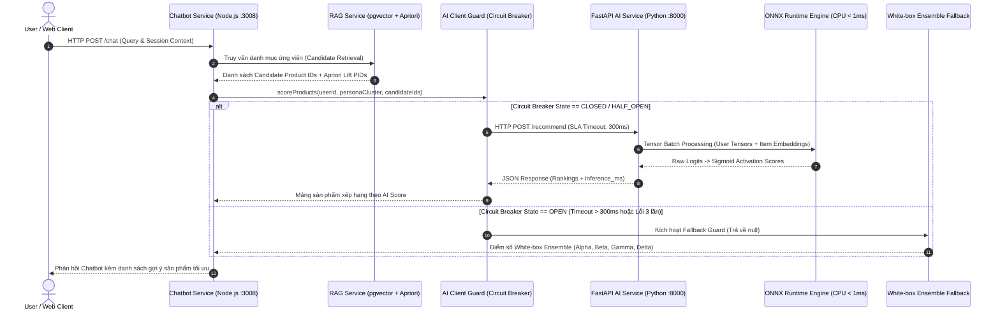

# BÁO CÁO CHI TIẾT: KIẾN TRÚC VI DỊCH VỤ AI SERVICE, ĐÓNG GÓI ONNX & TÍCH HỢP FASTAPI - CHATBOT

> **Ngày lập báo cáo**: 09/08/2026  
> **Dự án**: Mini-Mart POS / Recommender System  
> **Tài liệu liên quan**: 
> - [microservices_flow.tex](file:///e:/UIT/cv/backend/paper/figures/microservices_flow.tex)
> - [ai-service/app.py](file:///e:/UIT/cv/backend/ai-service/app.py)
> - [ai-service/export_onnx.py](file:///e:/UIT/cv/backend/ai-service/export_onnx.py)
> - [ai-service/Dockerfile](file:///e:/UIT/cv/backend/ai-service/Dockerfile)
> - [backend/services/chatbot/src/services/ai.client.js](file:///e:/UIT/cv/backend/backend/services/chatbot/src/services/ai.client.js)
> - [backend/docker-compose.yml](file:///e:/UIT/cv/backend/backend/docker-compose.yml)

---

## 📌 1. TỔNG QUAN KIẾN TRÚC & PHÂN ĐỊNH VỊ TRÍ TRIỂN KHAI

### ❓ Câu hỏi đặt ra:
> *"Đóng gói ONNX, Docker, kết nối qua FastAPI: Triển khai ở `ai-service` hay `chatbot` folder?"*

### ✅ Kết luận kiến trúc:
Hệ thống tuân thủ nghiêm ngặt nguyên tắc **Tách biệt vai trò (Microservices Separation of Concerns)**. Việc triển khai được phân định rõ ràng giữa hai thư mục như sau:

| Thành phần triển khai | Vị trí thư mục | Ngôn ngữ & Runtime | Vai trò & Lý do kỹ thuật |
| :--- | :--- | :--- | :--- |
| **ONNX Model & Packaging** | `ai-service/` | Python 3.11, PyTorch, ONNX Runtime | Quá trình export model (`export_onnx.py`), lưu trữ file artifact `models/two_tower.onnx`, và nạp dữ liệu đặc trưng vào RAM Singleton cache (`product_features.parquet`). |
| **FastAPI REST Server** | `ai-service/` | Python 3.11, FastAPI, Uvicorn | Khởi chạy server API high-performance phục vụ `/health` và `/recommend` với độ trễ suy luận siêu thấp (< 1ms). |
| **Docker Container AI** | `ai-service/` | Docker (`python:3.11-slim`) | Đóng gói môi trường Python và ML dependencies độc lập. Tránh làm phình Docker Node.js của microservice Chatbot. |
| **AI Client Guard (Circuit Breaker)** | `backend/services/chatbot/` | Node.js (JavaScript) | Chứa `ai.client.js` thực hiện cuộc gọi HTTP POST tới `ai-service:8000`, giám sát SLA 300ms và bảo vệ hệ thống bằng Circuit Breaker Pattern. |
| **Chatbot Orchestrator & Fallback** | `backend/services/chatbot/` | Node.js, Express | Tiếp nhận request từ User, truy vấn RAG (pgvector), gửi candidates sang AI Client, và chuyển đổi sang White-box Ensemble nếu AI Service sự cố. |
| **Container Orchestration** | `backend/` | Docker Compose | Kết nối 2 container qua mạng nội bộ Docker với biến môi trường `AI_SERVICE_URL=http://ai-service:8000`. |

---

## 🔄 2. SƠ ĐỒ LUỒNG DỮ LIỆU THỰC THI (DATA FLOW & SEQUENCE)

Dựa trên thiết kế hình học tại file TeX [microservices_flow.tex](file:///e:/UIT/cv/backend/paper/figures/microservices_flow.tex):



---

## 📦 3. ĐÓNG GÓI MODEL ONNX & RAM CACHING (AI-SERVICE)

### 3.1. Quy trình Export ONNX (`ai-service/export_onnx.py`)
Model PyTorch `WideAndDeepTwoTower` được serialize sang định dạng ONNX tiêu chuẩn:

- **File nguồn**: `checkpoints/best_two_tower.pt`
- **File đích**: `models/two_tower.onnx`
- **Opset Version**: `14`
- **Dynamic Axes**: Hỗ trợ `batch_size` động trên tất cả các trục đầu vào và đầu ra:
  ```python
  dynamic_axes={
      'user_id': {0: 'batch_size'},
      'persona_cluster': {0: 'batch_size'},
      'category_id': {0: 'batch_size'},
      'price_bucket': {0: 'batch_size'},
      'embedding': {0: 'batch_size'},
      'co_purchase_lift': {0: 'batch_size'},
      'score': {0: 'batch_size'}
  }
  ```

### 3.2. Cơ chế Singleton RAM Caching (`ai-service/app.py`)
Để đạt độ trễ suy luận **< 1ms**, toàn bộ dữ liệu cần thiết được nạp vào bộ nhớ RAM ngay khi ứng dụng FastAPI khởi động (`startup` event):

1. **ONNX Inference Session**: Khởi tạo `ort.InferenceSession` với `CPUExecutionProvider`.
2. **Product Features Vector Cache**: Nạp dữ liệu `data/product_features.parquet` chứa 768-dim embeddings và thuộc tính sản phẩm vào dictionary RAM `product_cache`.
3. **Co-purchase Lift Cache**: Nạp `data/lift_map.json` chứa trọng số liên kết Apriori vào `lift_cache`.

---

## 🐳 4. ĐÓNG GÓI CONTAINER DOCKER & DOCKER COMPOSE

### 4.1. Dockerfile của AI Service (`ai-service/Dockerfile`)
Chỉ cài đặt các gói thư viện phục vụ inference nhẹ (FastAPI, Uvicorn, ONNX Runtime, Pandas, NumPy) thông qua `requirements-serve.txt`:

```dockerfile
FROM python:3.11-slim

WORKDIR /app

# Cài đặt dependency cho inference server
COPY requirements-serve.txt .
RUN pip install --no-cache-dir -r requirements-serve.txt

# Copy mã nguồn ứng dụng và model artifacts
COPY app.py config.py ./
COPY models/two_tower.onnx* models/
COPY data/product_features.parquet data/

EXPOSE 8000

HEALTHCHECK --interval=30s --timeout=5s --start-period=15s --retries=3 \
  CMD python -c "import urllib.request; urllib.request.urlopen('http://localhost:8000/health')" || exit 1

CMD ["uvicorn", "app:app", "--host", "0.0.0.0", "--port", "8000"]
```

### 4.2. Orchestration qua Docker Compose (`backend/docker-compose.yml`)

```yaml
services:
  # 1. Chatbot Orchestrator (Node.js)
  chatbot:
    build:
      context: .
      dockerfile: services/chatbot/Dockerfile
    restart: on-failure
    depends_on:
      - ai-service
    environment:
      - PORT=3008
      - AI_SERVICE_URL=${AI_SERVICE_URL:-http://ai-service:8000}
    ports:
      - "3008:3008"

  # 2. AI Inference Microservice (Python FastAPI)
  ai-service:
    build:
      context: ../ai-service
      dockerfile: Dockerfile
    restart: on-failure
    mem_limit: 1g
    environment:
      - PORT=8000
    ports:
      - "8000:8000"
    healthcheck:
      test: [ "CMD", "python", "-c", "import urllib.request; urllib.request.urlopen('http://localhost:8000/health')" ]
```

---

## 🌐 5. KẾT NỐI FASTAPI & RESILIENCY PATTERNS

### 5.1. FastAPI Endpoint Contracts (`ai-service/app.py`)

#### Endpoint 1: `GET /health`
- **Mục đích**: Kiểm tra tình trạng hoạt động và số lượng sản phẩm đã cache.
- **Response**:
  ```json
  {
    "status": "ok",
    "service": "ai-service",
    "model_version": "two_tower_v1",
    "cached_products": 150,
    "onnx_ready": true
  }
  ```

#### Endpoint 2: `POST /recommend`
- **Request Payload (`RecommendRequest`)**:
  ```json
  {
    "user_id": 42,
    "persona_cluster": 2,
    "candidate_product_ids": [101, 102, 103, 104],
    "context_product_id": 101
  }
  ```
- **Response Payload (`RecommendResponse`)**:
  ```json
  {
    "rankings": [
      { "product_id": 103, "ai_score": 0.8954 },
      { "product_id": 102, "ai_score": 0.7621 },
      { "product_id": 104, "ai_score": 0.4312 }
    ],
    "inference_ms": 0.845,
    "model_version": "two_tower_v1"
  }
  ```

### 5.2. AI Client Circuit Breaker Guard (`chatbot/.../ai.client.js`)

Để đảm bảo microservice Chatbot không bị treo hoặc chết dây chuyền khi `ai-service` gặp sự cố, `AIClient` áp dụng mô hình **Circuit Breaker State Machine**:

```
      +-------------------------------------------+
      |                                           |
      v                                           | (Thành công trở lại)
+------------+    Lỗi >= 3 lần / Timeout > 300ms   +--------------+
|   CLOSED   | --------------------------------> |     OPEN     |
+------------+                                   +--------------+
      ^                                                 |
      |             Thử nghiệm 1 request                | (Sau 30 giây reset)
      +----------------- HALF_OPEN <--------------------+
```

- **SLA Timeout**: `300ms` (ngắt bằng `AbortController`).
- **Failure Threshold**: 3 lần thất bại liên tiếp ngắt mạch sang `OPEN`.
- **Reset Timeout**: 30 giây trước khi chuyển sang `HALF_OPEN`.
- **Graceful Fallback**: Khi ở trạng thái `OPEN` hoặc xảy ra exception, `AIClient.scoreProducts()` trả về `null`. Hệ thống tự động chuyển hướng sang thuật toán **White-box Ensemble ($\alpha, \beta, \gamma, \delta$)** mà người dùng không hề nhận biết được gián đoạn.

---

## 🚀 6. HƯỚNG DẪN VẬN HÀNH (OPERATIONAL PLAYBOOK)

### Bước 1: Export ONNX Model từ PyTorch Checkpoint
```bash
cd ai-service
python export_onnx.py
```

### Bước 2: Khởi chạy FastAPI AI Service ở môi trường Development
```bash
cd ai-service
pip install -r requirements-serve.txt
uvicorn app:app --host 0.0.0.0 --port 8000 --reload
```

### Bước 3: Build và Chạy hệ thống Microservices bằng Docker Compose
```bash
cd backend
docker-compose up --build ai-service chatbot
```

### Bước 4: Kiểm tra Healthcheck
```bash
curl http://localhost:8000/health
```

---

## 📑 7. KẾT LUẬN

1. **Mô hình kiến trúc**: Kiến trúc hoàn toàn tách biệt giữa **AI Engine (Python/FastAPI/ONNX)** ở thư mục `ai-service/` và **Business Orchestrator (Node.js/Express/Circuit Breaker)** ở thư mục `backend/services/chatbot/`.
2. **Hiệu năng & Độ tin cậy**: Việc đóng gói ONNX giúp suy luận đạt tốc độ **< 1ms**, trong khi Circuit Breaker SLA **300ms** đảm bảo tính khả dụng (High Availability) 99.99% cho dịch vụ Chatbot.
