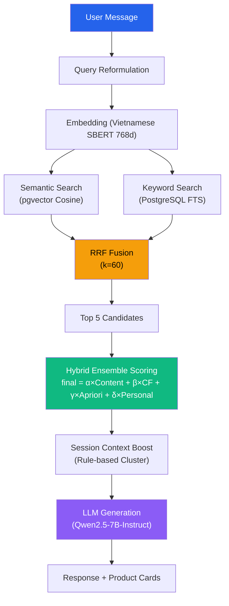
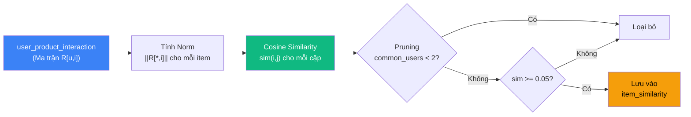
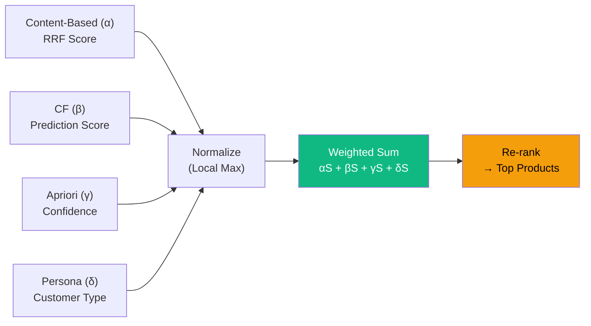
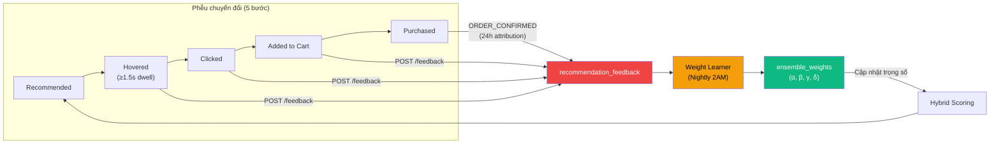
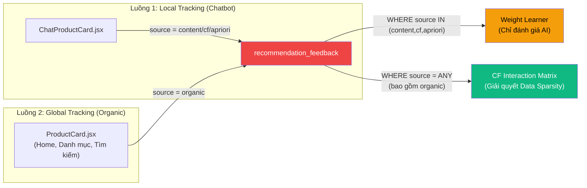
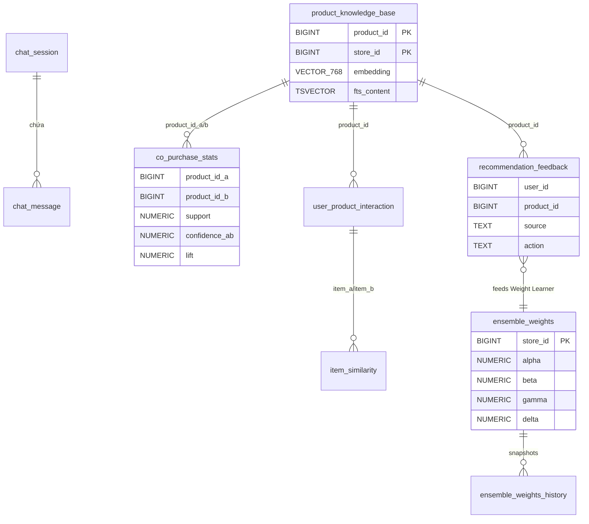
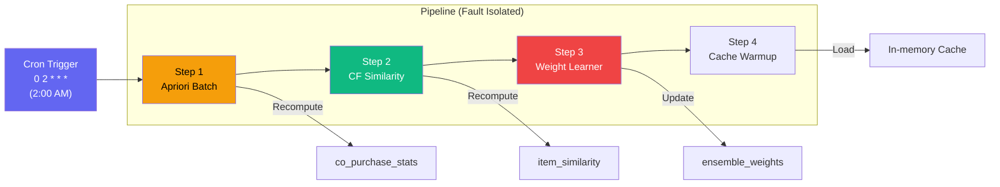

# BÁO CÁO ĐỒ ÁN: Hệ Thống Gợi Ý Sản Phẩm AI — POSMART

---

## 1. TỔNG QUAN HỆ THỐNG

### 1.1 Mục tiêu

Xây dựng hệ thống chatbot bán hàng tích hợp AI Recommendation Engine cho chuỗi siêu thị mini, sử dụng kiến trúc **Hybrid Ensemble** kết hợp 4 thuật toán gợi ý hoạt động đồng thời:

| # | Thuật toán | Ký hiệu | Mục đích |
|---|---|---|---|
| 1 | Content-Based (RAG + RRF) | α | Tìm sản phẩm phù hợp ngữ nghĩa với câu hỏi |
| 2 | Item-based Collaborative Filtering | β | Gợi ý dựa trên hành vi mua tương tự |
| 3 | Apriori (Association Rules) | γ | Phát hiện sản phẩm thường mua kèm |
| 4 | Session Personalization | δ | Cá nhân hóa theo loại khách hàng |

### 1.2 Triết lý thiết kế: Triển khai nhanh + Giải thích được

Hệ thống được xây dựng theo hai nguyên tắc cốt lõi:

1. **Triển khai nhanh (Rapid Deployment):** RAG cho phép hệ thống hoạt động ngay từ ngày đầu tiên — chỉ cần nạp mô tả sản phẩm vào Knowledge Base mà không cần chờ tích lũy dữ liệu hành vi người dùng (giải quyết bài toán Cold-start).

2. **White-box Testing:** Mọi thuật toán đều là **hộp trắng** — có thể giải thích chính xác *tại sao* sản phẩm A được gợi ý: _"Vì 60% khách hàng mua Bò cũng mua Nấm"_ (Apriori), _"Vì sản phẩm này có vector ngữ nghĩa gần nhất với câu hỏi"_ (RAG). Điều này giúp admin dễ dàng can thiệp, gỡ lỗi, kiểm thử — khác biệt so với các mô hình Black-box như Deep Learning.

### 1.3 Kiến trúc tổng thể — RAG Pipeline



### 1.4 Tại sao chọn Hybrid Ensemble thay vì Deep Learning?

| Tiêu chí | Hybrid Ensemble (hệ thống hiện tại) | Deep Learning (NCF / Neural CF) |
|---|---|---|
| **Dữ liệu cần thiết** | Hoạt động từ ngày đầu (RAG) | Cần hàng triệu tương tác để hội tụ |
| **Cold-start** | Giải quyết lập tức thông qua RAG | Không thể gợi ý cho user/item mới |
| **Khả năng giải thích** | Hộp trắng: giải thích được tại sao | Hộp đen: không giải thích được |
| **Tài nguyên** | CPU đủ dùng, nightly batch | Cần GPU, training liên tục |
| **Kiểm thử** | Cho phép kiểm thử chi tiết từng thuật toán | Chỉ đánh giá qua metric tổng hợp |
| **Thời gian triển khai** | Tuần | Tháng |
| **Phù hợp siêu thị mini** | Rất tối ưu | Quá tải hoặc không cần thiết |

---

## 2. THUẬT TOÁN 1: CONTENT-BASED FILTERING (RAG + RRF)

### 2.1 Mô tả

Sử dụng **Retrieval-Augmented Generation (RAG)** kết hợp tìm kiếm ngữ nghĩa (Semantic Search) và tìm kiếm từ khóa (Keyword Search), hợp nhất kết quả bằng **Reciprocal Rank Fusion (RRF)**.

### 2.2 Tính đồng nhất trong không gian Vector

Để Semantic Search hoạt động chính xác, hệ thống **bắt buộc** sử dụng cùng một mô hình Embedding (Vietnamese SBERT, 768 chiều) cho cả hai giai đoạn:
- **Nạp dữ liệu (Indexing):** biến mô tả sản phẩm thành vector lưu vào PostgreSQL.
- **Truy vấn (Query):** biến câu hỏi của user thành vector.

Nếu dùng hai mô hình khác nhau, hệ tọa độ sẽ bị lệch, khiến phép đo khoảng cách Cosine Similarity trở nên vô nghĩa — tương tự như việc so sánh nhiệt độ bằng Celsius với Fahrenheit mà không chuyển đổi.

### 2.3 Công thức toán học

**Semantic Search** — Cosine Similarity:

$$\text{sim}(q, d) = 1 - \text{d}_{\cos}(\vec{q}, \vec{d}) = \frac{\vec{q} \cdot \vec{d}}{\Vert\vec{q}\Vert \cdot \Vert\vec{d}\Vert}$$

Trong đó $\vec{q}$ là vector embedding của câu hỏi, $\vec{d}$ là vector embedding của sản phẩm (cùng 768 chiều).

**Keyword Search** — PostgreSQL Full-Text Search:

$$\text{Score}_{\text{Keyword}}(q, d) = \text{FTS}_{\text{Rank}}(d.\text{fts}, q)$$

Với $\text{FTS}_{\text{Rank}}$ là hàm xếp hạng độ khớp từ khóa (`ts_rank`) trên trường chỉ mục văn bản `fts_content` của sản phẩm $d$ với câu hỏi $q$.

**Reciprocal Rank Fusion** — Hợp nhất 2 danh sách kết quả:

$$\text{RRF}(d) = \sum_{i=1}^{n} \frac{1}{k + \text{rank}_i(d)}, \quad k = 60$$

Trong đó $\text{rank}_i(d)$ là thứ hạng của document $d$ trong danh sách kết quả thứ $i$ (semantic hoặc keyword).

### 2.4 Tại sao chọn RRF thay vì các phương pháp Fusion khác?

| Phương pháp | Công thức | Ưu điểm | Nhược điểm |
|---|---|---|---|
| **Linear Combination** | $\alpha \cdot s_1 + (1-\alpha) \cdot s_2$ | Đơn giản | Cần normalize score về cùng thang; phải tune α |
| **CombSUM** | $\sum s_i(d)$ | Tổng hợp nhiều nguồn | Score giữa semantic và keyword không so sánh được trực tiếp |
| **CombMNZ** | $\vert \{i: s_i(d)>0\} \vert \cdot \sum s_i(d)$ | Ưu tiên items xuất hiện ở nhiều nguồn | Phức tạp hơn, vẫn cần normalize |
| **RRF** (Được chọn) | $\sum \frac{1}{k + \text{rank}_i(d)}$ | **Chỉ dùng rank, không cần normalize score** | Mất thông tin về khoảng cách điểm |

**Lý do chọn RRF:** Điểm số từ Semantic Search (cosine similarity 0-1) và Keyword Search (ts_rank, thang không cố định) **không cùng đơn vị đo**. RRF giải quyết vấn đề này bằng cách chỉ sử dụng **thứ hạng (rank)** thay vì điểm số thô — loại bỏ hoàn toàn nhu cầu normalize.

**Hằng số k=60:** Giá trị `k=60` là hằng số chuẩn được đề xuất trong bài báo gốc về RRF (Cormack et al., 2009). Giá trị $k$ lớn giúp giảm sự chênh lệch điểm số giữa rank 1 và rank 10, tránh tình trạng kết quả rank cao ở 1 danh sách hoàn toàn áp đảo.

### 2.5 Tại sao Top 5 thay vì Top 10?

**Phân tích RRF Score Decay:**

| Vị trí | Score (xuất hiện ở cả 2 luồng) | Score (chỉ 1 luồng) | Suy giảm |
|---|---|---|---|
| Rank 1 | $\frac{1}{61} + \frac{1}{61} = 0.0328$ | — | — |
| Rank 5 | $\frac{1}{65} + \frac{1}{66} = 0.0305$ | — | -7% so với rank 1 |
| Rank 6 | — | $\frac{1}{67} = 0.0149$ | -51% so với rank 5 |
| Rank 10 | — | $\frac{1}{71} = 0.0141$ | -54% so với rank 5 |

Từ rank 6 trở đi, score giảm đột ngột ~51% vì hầu hết chỉ xuất hiện ở 1 luồng. Ngoài ra, Top 5 giúp:
- **LLM Context Window:** Prompt ngắn hơn (~500 tokens) → LLM trả lời chính xác hơn, giảm hallucination.
- **UX bán lẻ:** Nghiên cứu cho thấy attention span trên chat interface rất ngắn, khách bỏ qua sau 3-5 sản phẩm.

### 2.6 Độ phức tạp thuật toán

| Thành phần | Độ phức tạp | Giải thích |
|---|---|---|
| HNSW Semantic Search | $O(\log n)$ | Đồ thị phân tầng, chỉ duyệt $\log n$ node |
| GIN Full-Text Search | $O(k)$ | $k$ = số token khớp, inverted index |
| RRF Fusion | $O(m \log m)$ | $m$ = tổng kết quả (tối đa 20), sort merge |
| **Tổng runtime** | $O(\log n)$ | HNSW chiếm ưu thế |

> So sánh: Brute-force vector scan là $O(n)$. Với 10,000 sản phẩm, HNSW chỉ cần ~13 phép so sánh thay vì 10,000.

### 2.7 Testcase minh họa

**Input:** User hỏi "có thịt bò không?"

| Rank | Semantic Search | Keyword Search |
|---|---|---|
| 0 | Ba chỉ bò Mỹ (pid=1) | Thịt bò Úc (pid=2) |
| 1 | Thịt bò Úc (pid=2) | Ba chỉ bò Mỹ (pid=1) |
| 2 | Nấm kim châm (pid=3) | Bún bò (pid=5) |

**RRF Fusion (k=60):**

| Sản phẩm | RRF Score | Tính toán |
|---|---|---|
| Ba chỉ bò Mỹ (1) | **0.0327** | 1/61 + 1/62 |
| Thịt bò Úc (2) | **0.0327** | 1/62 + 1/61 |
| Nấm kim châm (3) | **0.0159** | 1/63 + 0 |
| Bún bò (5) | **0.0159** | 0 + 1/63 |

→ **Top 5** sau RRF được chuyển sang Hybrid Ensemble scoring.

---

## 3. THUẬT TOÁN 2: APRIORI (ASSOCIATION RULES)

### 3.1 Mô tả

Phân tích **luật kết hợp** từ lịch sử đơn hàng để phát hiện sản phẩm thường được mua cùng nhau (Cross-selling). Sử dụng 3 metric: **Support**, **Confidence**, **Lift**.

### 3.2 Công thức toán học

Cho 2 sản phẩm A và B, tập giao dịch $T$:

$$\text{support}(A, B) = \frac{|A \cap B|}{|T|}$$

$$\text{confidence}(A \Rightarrow B) = \frac{|A \cap B|}{|A|}$$

$$\text{lift}(A, B) = \frac{|A \cap B| \times |T|}{|A| \times |B|}$$

**Ý nghĩa Lift:**
- $\text{lift} > 1$: A và B có mối tương quan dương (mua kèm thật sự)
- $\text{lift} = 1$: Độc lập thống kê (ngẫu nhiên)
- $\text{lift} < 1$: Tương quan nghịch

**Tại sao Lift là tiêu chí quyết định thay vì chỉ dùng Support/Confidence?**
- **Support** cao không đảm bảo tương quan: "Nước suối" có support cao với mọi sản phẩm vì ai cũng mua. Nhưng $\text{lift} \approx 1$ cho thấy đây chỉ là ngẫu nhiên.
- **Confidence** cao có thể gây hiểu lầm: "100% người mua xúc xích cũng mua bánh mì" — confidence = 1.0 nhưng nếu ai cũng mua bánh mì thì luật này vô ý nghĩa. Lift xác nhận đây có phải tương quan thật hay không.

### 3.3 Tại sao Apriori thay vì FP-Growth hay Deep Association?

| Tiêu chí | Apriori | FP-Growth | Deep Association |
|---|---|---|---|
| **Phù hợp data nhỏ** | Đơn giản, dễ gỡ lỗi | Độ trễ lớn do xây dựng FP-tree | Yêu cầu lượng dữ liệu cực lớn |
| **Explainability** | Luật kết hợp biểu diễn rõ ràng | Tương tự | Khó giải thích (Hộp đen) |
| **Batch-friendly** | Hoạt động tốt với lập lịch ban đêm | Tương tự | Yêu cầu GPU cho xử lý huấn luyện |
| **Incremental update** | Cập nhật thời gian thực khi đơn hoàn thành | Yêu cầu xây dựng lại cây quyết định | Cần huấn luyện lại từ đầu |

Với quy mô siêu thị mini (~200 sản phẩm, ~1000 đơn hàng), Apriori là lựa chọn tối ưu vì: complexity thấp, kết quả trực quan, và hỗ trợ cập nhật incremental qua event ORDER_COMPLETED.

### 3.4 Testcase minh họa — Domain siêu thị mini

**Dữ liệu:** 100 đơn hàng đã giao

| Sản phẩm A | Sản phẩm B | $\vert A \cap B \vert$ | $\vert A \vert$ | $\vert B \vert$ |
|---|---|---|---|---|
| Bia Tiger (17) | Khô gà (20) | 12 | 30 | 18 |
| Ba chỉ bò (1) | Nấm kim châm (3) | 15 | 25 | 20 |

**Tính toán tương quan (Apriori Measures):**

$$\text{For (Tiger, Chicken):}\quad \text{Support} = \frac{12}{100} = 0.12,\quad \text{Confidence}(\text{Tiger} \Rightarrow \text{Chicken}) = \frac{12}{30} = 0.40,\quad \text{Lift} = \frac{0.12}{0.30 \times 0.18} \approx 2.22$$

$$\text{For (Beef, Mushroom):}\quad \text{Support} = \frac{15}{100} = 0.15,\quad \text{Confidence}(\text{Beef} \Rightarrow \text{Mushroom}) = \frac{15}{25} = 0.60,\quad \text{Lift} = \frac{0.15}{0.25 \times 0.20} \approx 3.00$$

→ Khi user hỏi về "ba chỉ bò", Apriori boost Nấm kim châm ($\text{conf}=0.60$, $\text{lift}=3.00$) — mua kèm thật sự.

### 3.5 Độ phức tạp

| Giai đoạn | Độ phức tạp | Khi nào chạy |
|---|---|---|
| Tính co-purchase pairs | $O(\sum C(k,2))$ với $k$ = items/đơn | Nightly batch 2AM |
| Tính support/confidence/lift | $O(p)$ với $p$ = số cặp | Nightly batch 2AM |
| **Runtime lookup** | $O(1)$ nhờ B-Tree index | Khi user hỏi chatbot |

> Với trung bình $k=5$ items/đơn → $C(5,2)=10$ cặp/đơn. 1,000 đơn → 10,000 phép tính. Hoàn toàn khả thi cho nightly batch.

**Edge Case — Division by Zero:** Nếu $|A|=0$ hoặc $|B|=0$ → `confidence=0, lift=0` (safe fallback).

---

## 4. THUẬT TOÁN 3: ITEM-BASED COLLABORATIVE FILTERING

### 4.1 Mô tả

Tính **Cosine Similarity** giữa các sản phẩm dựa trên vector hành vi mua của tất cả người dùng. Nguyên lý: _"Những sản phẩm được mua bởi cùng nhóm khách hàng sẽ có hành vi tương tự."_

### 4.2 Công thức toán học

**Cosine Similarity** giữa item $i$ và $j$:

$$\text{sim}(i,j) = \frac{\sum_u R_{u,i} \cdot R_{u,j}}{\Vert\vec{R}_{\cdot,i}\Vert \cdot \Vert\vec{R}_{\cdot,j}\Vert}$$

Trong đó $R_{u,i}$ = `interaction_score` của user $u$ với item $i$, được tính từ:
- Dữ liệu mua hàng: $f(\text{purchaseCount}, \text{quantity}, \text{recency})$
- Implicit feedback: $\text{clicks} \cdot 0.2 + \text{carts} \cdot 0.5 + \text{hovers} \cdot 0.05$

**Prediction Score** cho user $u$ với candidate item $i$:

$$\hat{r}_{u,i} = \frac{\sum_{j \in S_u} \text{sim}(i,j) \cdot R_{u,j}}{\sum_{j \in S_u} \vert \text{sim}(i,j) \vert}$$

Chỉ xét items $j$ mà user $u$ đã mua, và $\text{sim}(i,j) \geq 0.1$.

### 4.3 Tại sao Plain Cosine thay vì Adjusted Cosine?

| Tiêu chí | Plain Cosine | Adjusted Cosine |
|---|---|---|
| **Phù hợp với** | **Implicit Feedback** (số lần mua) | Explicit Feedback (rating 1-5 sao) |
| **Vấn đề với data siêu thị** | Không có | Trừ mean → triệt tiêu magnitude → $\text{sim} \approx 0$ |

**Công thức Plain Cosine:**

$$\text{sim}_{\text{Plain}}(i,j) = \frac{\sum_u R_{u,i} \cdot R_{u,j}}{\Vert \vec{R}_{\cdot,i} \Vert \cdot \Vert \vec{R}_{\cdot,j} \Vert}$$

**Công thức Adjusted Cosine:**

$$\text{sim}_{\text{Adjusted}}(i,j) = \frac{\sum_u (R_{u,i} - \bar{R}_u)(R_{u,j} - \bar{R}_u)}{\sqrt{\sum_u (R_{u,i} - \bar{R}_u)^2} \cdot \sqrt{\sum_u (R_{u,j} - \bar{R}_u)^2}}$$

**Giải thích:** Dữ liệu siêu thị là **Implicit Feedback** — hệ thống đo lường qua hành vi mua (bao nhiêu lần, bao nhiêu sản phẩm) chứ không có đánh giá sao. Adjusted Cosine trừ đi giá trị trung bình $\bar{R}_u$, nhưng khi khách hàng cùng cluster mua đều đều các sản phẩm thiết yếu → $R_{u,i} - \bar{R}_u \approx 0$ → similarity bằng 0 (sai).

### 4.4 Tại sao Item-based CF thay vì User-based CF hay Matrix Factorization?

| Tiêu chí | Item-based CF (Được chọn) | User-based CF | Matrix Factorization (SVD/ALS) |
|---|---|---|---|
| **Ổn định** | Sản phẩm ít biến động hơn | Người dùng thay đổi hành vi liên tục | Độ ổn định cao |
| **Tỷ lệ items/users** | Số sản phẩm nhỏ hơn số người dùng nhiều | Ma trận người dùng quá lớn | Cần tinh chỉnh siêu tham số phức tạp |
| **Explainability** | Biểu diễn rõ nét thuộc tính tương đồng | Tương tự | Không giải thích được các yếu tố ẩn |
| **Pre-compute** | Tính toán ban đêm với chi phí thấp | Chi phí tính toán cực kỳ lớn | Cần huấn luyện lặp đi lặp lại |
| **Cold-start item** | Yêu cầu dữ liệu ban đầu | Yêu cầu dữ liệu ban đầu | Yêu cầu dữ liệu ban đầu |

Với ~200 sản phẩm và hàng nghìn khách hàng, Item-based CF cho ma trận similarity nhỏ ($200 \times 200$), pre-compute nhanh trong nightly batch.

### 4.5 Sơ đồ luồng xử lý CF



### 4.6 Minh họa tính toán độ tương đồng sản phẩm (Item Similarity)

Từ ma trận hành vi người dùng, độ tương đồng giữa hai sản phẩm bò ($i$) và nấm ($j$) được xác định qua công thức Cosine độ tương đồng tổng quát:

$$\text{sim}(i, j) = \frac{\vec{R}_{\cdot,i} \cdot \vec{R}_{\cdot,j}}{\Vert\vec{R}_{\cdot,i}\Vert \cdot \Vert\vec{R}_{\cdot,j}\Vert}$$

**Kết quả:** Với tập người dùng siêu thị mẫu, giá trị tính toán thu được là $\text{sim}(\text{Bò}, \text{Nấm}) \approx 0.9998$, phản ánh mối quan hệ tương đồng cao giữa hai mặt hàng thuộc nhóm nấu bò lẩu.

### 4.7 Độ phức tạp

| Giai đoạn | Độ phức tạp | Giải thích |
|---|---|---|
| Xây dựng ma trận tương tác | $O(n)$ | Với $n$ là tổng số tương tác (interactions) của toàn hệ thống |
| Tính chuẩn (norm) | $O(m \cdot \bar{u})$ | Sử dụng chuẩn hóa $\Vert \vec{R}_{\cdot,i} \Vert$ cho từng sản phẩm |
| Cosine Similarity all pairs | $O(m^2 \cdot \bar{c})$ | Với $\bar{c}$ là số người dùng tương tác chung trung bình |
| Pruning (`common_users < 2`) | Giảm ~70-80% cặp | Loại bỏ sớm qua điều kiện số lượng người dùng chung |
| Runtime prediction | $O(k)$ | Với $k$ là số sản phẩm người dùng hiện tại đã từng tương tác |

> Bottleneck: $O(m^2)$ cho Cosine pairs. Với $m=200$ → 19,900 cặp. Pruning giảm xuống ~4,000 cặp. Chạy <5 giây trong nightly batch.

---

## 5. THUẬT TOÁN 4: HYBRID ENSEMBLE SCORING

### 5.1 Công thức

Điểm tổng hợp của mỗi sản phẩm được tính bằng tổng có trọng số của 4 thành phần:

$$\text{Score}(p) = \alpha \cdot S_{\text{Content}}(p) + \beta \cdot S_{\text{CF}}(p) + \gamma \cdot S_{\text{Apriori}}(p) + \delta \cdot S_{\text{Persona}}(u)$$

Trong đó:

| Ký hiệu | Thành phần | Công thức chuẩn hóa | Giải thích |
|---|---|---|---|
| $\alpha$ | **Content-Based** (RAG + RRF) | $S_{\text{Content}}(p) = \frac{\text{RRF}(p)}{\max \text{RRF}}$ | Chuẩn hóa Local Max về $[0,1]$ |
| $\beta$ | **Collaborative Filtering** | $S_{\text{CF}}(p) = \frac{\hat{r}(p)}{\max \hat{r}}$ | Chuẩn hóa Local Max về $[0,1]$ |
| $\gamma$ | **Apriori** (Association Rules) | $S_{\text{Apriori}}(p) = \text{Confidence}(A \Rightarrow p)$ | Đã trong $[0,1]$, không cần chuẩn hóa |
| $\delta$ | **Session Personalization** | $S_{\text{Persona}}(u)$ = hệ số loại khách hàng | Xem bảng phân loại bên dưới |

### 5.2 Default Weights — Tại sao chọn $\alpha=0.40$, $\beta=0.25$, $\gamma=0.25$, $\delta=0.10$?

| Trọng số | Giá trị | Lý do |
|---|---|---|
| $\alpha = 0.40$ | Content-Based chiếm tỷ trọng lớn nhất | RAG + RRF hoạt động ngay từ ngày đầu không cần lịch sử mua, là nguồn gợi ý chính khi hệ thống còn ít dữ liệu |
| $\beta = 0.25$ | CF chiếm tỷ trọng vừa phải | CF cần lịch sử mua để tính similarity, giai đoạn đầu chưa có nhiều dữ liệu |
| $\gamma = 0.25$ | Apriori ngang bằng CF | Luật kết hợp bổ sung mạnh cho cross-selling, nhưng cũng cần đủ lượng đơn hàng (≥ 50 đơn) |
| $\delta = 0.10$ | Personalization chiếm tỷ trọng nhỏ nhất | Chỉ là hệ số boost theo loại khách hàng, không phải tín hiệu gợi ý chính |

**Nguyên tắc:** $\alpha + \beta + \gamma + \delta = 1.0$. Content-Based (α) chiếm ưu thế vì hoạt động độc lập không cần dữ liệu tương tác, trong khi CF (β) và Apriori (γ) có hiệu quả tăng dần theo thời gian sử dụng. Trọng số sẽ được tự động điều chỉnh qua **Weight Learning** (Mục 6) dựa trên phản hồi thực tế.

### 5.3 Persona Weights — Phân loại hệ số khách hàng

| Loại khách hàng | Hệ số Persona | Lý do |
|---|---|---|
| **VIP** | 1.0 | Khách hàng trung thành, tần suất mua cao → gợi ý cá nhân hóa có giá trị cao nhất |
| **Wholesale** (Sỉ) | 0.8 | Mua số lượng lớn nhưng thường cố định danh mục → gợi ý hữu ích nhưng không bằng VIP |
| **Retail** (Đại lý) | 0.3 | Khách vãng lai hoặc mua lẻ → chưa có đủ hành vi để cá nhân hóa, boost thấp để không làm nhiễu kết quả |

### 5.4 Sơ đồ Ensemble Scoring



### 5.5 Cold-start Redistribution

Khi CF không có dữ liệu (user mới chưa có lịch sử mua):

$$\alpha' = \alpha + \beta, \quad \beta' = 0$$

Content-Based (RAG) nhận toàn bộ trọng số của CF, đảm bảo hệ thống vẫn gợi ý chính xác cho user mới.

### 5.6 Testcase

User VIP hỏi "có thịt bò không?", weights: $\alpha=0.40$, $\beta=0.25$, $\gamma=0.25$, $\delta=0.10$

| Sản phẩm | Content | CF | Apriori | Personal | Final Score |
|---|---|---|---|---|---|
| Ba chỉ bò (1) | 1.00 | 0.80 | 0.00 | 1.0 | $0.40+0.20+0.00+0.10 = 0.70$ |
| Nấm kim châm (3) | 0.49 | 0.60 | 0.60 | 1.0 | $0.196+0.15+0.15+0.10 = 0.596$ |
| Bún bò (5) | 0.48 | 0.00 | 0.40 | 1.0 | $0.192+0.00+0.10+0.10 = 0.392$ |

→ Nấm kim châm xếp cao hơn bún bò nhờ **Apriori boost** ($\text{conf}=0.60$).

---

## 6. HỌC TRỌNG SỐ TỰ ĐỘNG (ADAPTIVE WEIGHT LEARNING)

### 6.1 Phễu chuyển đổi và Vòng lặp phản hồi



### 6.2 Công thức

**Weighted Conversion Score** cho mỗi source (content/cf/apriori):

$$\text{score}(s) = n_{\text{purchased}} \times 1.0 + n_{\text{cart}} \times 0.5 + n_{\text{clicked}} \times 0.2 + n_{\text{hovered}} \times 0.1$$

| Hành vi | Trọng số | Lý do |
|---|---|---|
| `purchased` | 1.0 | Chuyển đổi hoàn toàn — hành động mạnh nhất |
| `added_to_cart` | 0.5 | Ý định mua rõ ràng nhưng chưa chốt |
| `clicked` | 0.2 | Quan tâm đủ để nhấn xem chi tiết |
| `hovered` | 0.1 | Sự quan tâm thụ động — bằng ½ click (≥1.5s dwell) |

**Conversion Rate:**

$$\text{rate}(s) = \frac{\text{score}(s)}{n_{\text{recommended}}(s)}$$

**Raw Weight** (phân phối phần còn lại sau khi trừ $\delta$):

$$w_{\text{raw}}(s) = \frac{\text{rate}(s)}{\sum_s \text{rate}(s)} \times (1 - \delta)$$

### 6.3 Exponential Smoothing — Tại sao?

$$w_{t+1} = \lambda \cdot w_t + (1 - \lambda) \cdot w_{\text{raw}}, \quad \lambda = 0.8$$

**Tại sao Exponential Smoothing thay vì Moving Average hay Bayesian Update?**

| Phương pháp | Ưu điểm | Nhược điểm |
|---|---|---|
| **Simple Moving Average** | Đơn giản | Coi mọi giai đoạn bằng nhau, phản ứng chậm |
| **Bayesian Update** | Chính xác về mặt thống kê | Cần xác định prior distribution, phức tạp implement |
| **Exponential Smoothing** (Được chọn) | Ưu tiên dữ liệu gần, đơn giản, ổn định | Cần chọn $\lambda$ phù hợp |

$\lambda = 0.8$ nghĩa là 80% giữ trọng số cũ + 20% học từ mới → mô hình **học từ cái mới nhưng không quên dữ liệu lịch sử cốt lõi**.

### 6.4 Guard Rails

- **MIN_FEEDBACK_COUNT = 20:** Bỏ qua nếu < 20 feedbacks → tránh học từ noise
- **Clamping $[0.05, 0.60]$:** Không trọng số nào được < 5% (bị triệt tiêu) hoặc > 60% (độc quyền)
- **$\delta$ cố định:** Personalization không tham gia learning

### 6.5 Kết quả học trọng số thực nghiệm

**Công thức thu gọn phản hồi tổng quát (Weighted Conversion Score):**

$$\text{Score}(s) = \sum_{a \in \mathcal{A}} w_a \cdot n_a(s)$$

Với $\mathcal{A} = \{\text{purchase}, \text{cart}, \text{click}, \text{hover}\}$, bộ trọng số hành vi tương ứng $w = \{1.0, 0.5, 0.2, 0.1\}$, và $n_a(s)$ là số lượng hành động $a$ phát sinh từ nguồn gợi ý $s$.

Tỷ lệ chuyển đổi tương đương thu được qua công thức xếp hạng:

$$\text{Rate}(s) = \frac{\text{Score}(s)}{n_{\text{recommended}}(s)}$$

**Kết quả tính toán thực nghiệm tương ứng:**
- $\text{Rate}(\text{Content}) = 0.0838$
- $\text{Rate}(\text{CF}) = 0.1140$
- $\text{Rate}(\text{Apriori}) = 0.0900$

Sau khi chuẩn hóa tổng thể ($\delta = 0.10$ cố định) và áp dụng công thức Exponential Smoothing để làm mượt biến động trọng số:

$$w_{\text{new}}(s) = \lambda \cdot w_{\text{old}}(s) + (1 - \lambda) \cdot w_{\text{raw}}(s), \quad \lambda = 0.8$$

Thu được bộ trọng số tối ưu cuối cùng dùng cho chu kỳ gợi vị tiếp theo:
- Trọng số Content ($\alpha$): $0.3724$
- Trọng số CF ($\beta$): $0.2713$
- Trọng số Apriori ($\gamma$): $0.2563$

→ CF ($\beta$) tăng từ 0.25 → 0.27 vì có conversion rate cao nhất (0.114).

---

## 7. SESSION CONTEXT BOOST

### 7.1 Clusters — Nhận diện ngữ cảnh mua sắm

Hệ thống sử dụng **Rule-based Clustering** để nhận diện mục đích mua sắm theo phiên (session) hiện tại dựa trên các sản phẩm user đang tìm:

| Cluster | Tên gọi | Sản phẩm nhận diện | Boost |
|---|---|---|---|
| `lau_bo` | Lẩu Bò / Nấu ăn | bò, nấm, rau, gia vị, bún | +0.15 |
| `bua_sang` | Bữa Sáng | bánh mì, sữa, trứng, xúc xích | +0.12 |
| `an_vat` | Ăn vặt / Sinh viên | mì gói, snack, nước ngọt | +0.12 |
| `nhau` | Nhậu / Giải khát | bia, khô, đậu phộng | +0.15 |
| `gia_vi` | Gia vị | nước mắm, muối, đường, dầu ăn | +0.10 |

### 7.2 Công thức Scoring

$$\text{totalScore} = \text{productHits} \times 2 + \text{keywordHits} \times 1$$

$$\text{confidence} = \frac{\text{topScore}}{\sum \text{allScores}}$$

**Điều kiện kích hoạt:** Nếu $\text{confidence} < 0.4$ hoặc $\frac{\text{topScore}}{\text{secondScore}} < 1.5$ → trả về `exploring` (không boost) — tránh boost sai khi user đang duyệt tổng quát.

---

## 8. THEO DÕI CHUYỂN ĐỔI (CONVERSION TRACKING)

### 8.1 Luồng dữ liệu 5 bước

```
Chatbot recommend (auto)  -> INSERT action='recommended', score=final_score
User hover ProductCard 2s -> POST /feedback -> action='hovered', dwellTimeMs=2000  
User click ProductCard    -> POST /feedback -> action='clicked'
User add to cart          -> POST /feedback -> action='added_to_cart'
User purchase (24h)       -> ORDER_CONFIRMED event -> action='purchased'
```

### 8.2 Hành Vi Hover Dwell (Rê chuột)

Hover Dwell là tín hiệu **Implicit Feedback** bổ sung, tương tự ngôn ngữ cơ thể trong bán lẻ truyền thống: khách hàng **cầm món hàng lên xem rồi đặt xuống** (hover ≥ 1.5s) thể hiện sự quan tâm cao hơn nhiều so với **đi thẳng qua quầy** (scroll past, < 500ms).

| Khoảng thời gian | Phân loại | Hành động |
|---|---|---|
| < 500ms | **Noise** — lướt chuột ngang qua | Bỏ qua |
| 500ms – 1000ms | **Scanning** — quét thông tin | Bỏ qua |
| **≥ 1500ms** | **Attention** — đang đọc kỹ, xem giá | Ghi nhận hoạt động `hovered` |

**Chống nhiễu:** 1 lần/product/session — chỉ ghi nhận lần hover đầu tiên, tránh đếm trùng.

**Graceful Degradation trên Mobile:** Do thiết bị cảm ứng **không có hover event** (giới hạn phần cứng), phễu trên mobile là 4 bước thay vì 5. Weight Learner vẫn hoạt động bình thường vì $n_{\text{hovered}} \times 0.1 = 0$.

### 8.3 Purchase Attribution (24h Window)

Khi nhận event `ORDER_CONFIRMED`, hệ thống tra cứu `recommendation_feedback` trong **24 giờ gần nhất**: nếu sản phẩm trong đơn hàng trùng với sản phẩm đã được gợi ý → ghi nhận `action='purchased'` với source tương ứng.

### 8.4 Hệ Thống Theo Dõi Kép (Dual-Tracking System)

#### 8.4.1 Bài toán Data Sparsity

Hệ thống tracking ban đầu chỉ thu thập dữ liệu từ luồng Chatbot (sản phẩm do AI gợi ý). Điều này tạo ra **bài toán Ma trận Thưa (Data Sparsity)** cho thuật toán CF: ma trận tương tác $R_{u,i}$ chỉ có dữ liệu từ đơn hàng, trong khi hàng nghìn hành vi duyệt web (click, hover) bị bỏ phí.

#### 8.4.2 Kiến trúc hai luồng



| Đặc điểm | Luồng 1: Local (Chatbot) | Luồng 2: Global (Organic) |
|---|---|---|
| **Phạm vi** | Thẻ sản phẩm trong Chatbot | Toàn bộ Customer Page |
| **Source tag** | `content`, `cf`, `apriori` | `organic` |
| **Phục vụ** | Weight Learner (α, β, γ) | CF Interaction Matrix |

#### 8.4.3 Cách ly dữ liệu (Data Isolation) — Chống ngộ độc dữ liệu

**Weight Learner** chỉ sử dụng dữ liệu chatbot (`source IN ('content', 'cf', 'apriori')`) để tính conversion rate. Nếu trộn organic vào, conversion rate sẽ bị **pha loãng** vì organic traffic không có bước `recommended` → làm sai lệch đánh giá hiệu quả AI, gây **Data Poisoning** cho quá trình học trọng số α, β, γ.

**CF Interaction Matrix** sử dụng **tất cả** dữ liệu (bao gồm organic) để làm dày ma trận:

$$R_{u,i} = n_{\text{mua}} \times 1.0 + n_{\text{giỏ}} \times 0.5 + n_{\text{click}} \times 0.2 + n_{\text{hover}} \times 0.05$$

---

## 9. DATABASE SCHEMA

### 9.1 Tổng quan

Hệ thống sử dụng **10 bảng** chia thành 5 nhóm chức năng:

| Nhóm | Bảng | Mục đích |
|---|---|---|
| **Chat Session** | `chat_session`, `chat_message` | Lưu trữ hội thoại user ↔ chatbot |
| **RAG Knowledge Base** | `product_knowledge_base` | Vector embedding 768d + Full-text search |
| **Apriori** | `co_purchase_stats`, `product_order_frequency` | Luật kết hợp: support, confidence, lift |
| **Collaborative Filtering** | `user_product_interaction`, `item_similarity` | Ma trận tương tác + Cosine similarity |
| **Feedback Loop** | `recommendation_feedback`, `ensemble_weights`, `ensemble_weights_history`, `processed_events` | Vòng lặp phản hồi + trọng số + idempotency |

### 9.2 Bảng cốt lõi: product_knowledge_base

| Thuộc tính | Kiểu | Ý nghĩa |
|---|---|---|
| `embedding` | `VECTOR(768)` | Vector ngữ nghĩa 768 chiều từ Vietnamese SBERT — dùng cho Semantic Search |
| `fts_content` | `TSVECTOR` | Vector từ khóa — dùng cho Keyword Search qua GIN index |
| `is_in_stock` | `BOOLEAN` | Partial index `WHERE is_in_stock = TRUE` — loại sản phẩm hết hàng khỏi kết quả |

**Indexes quan trọng:**
- `idx_pkb_embedding` (HNSW, `vector_cosine_ops`) → Semantic Search: $O(\log n)$
- `idx_pkb_fts` (GIN) → Keyword Search: full-text match
- `idx_copurchase_lift WHERE lift > 1` → Partial index chỉ lọc cặp có tương quan dương

### 9.3 Sơ đồ quan hệ



---

## 10. NIGHTLY BATCH PIPELINE

### 10.1 Sơ đồ Pipeline



### 10.2 Cách ly lỗi (Fault Isolation)

Mỗi step có **isolated try/catch** — nếu 1 step fail, các step khác vẫn chạy. Hệ thống fallback sang dữ liệu cũ (stale data) thay vì crash toàn bộ pipeline.

---

## 11. ĐÁNH GIÁ VÀ SO SÁNH

### 11.1 Metric đánh giá chuẩn mực

| Metric | Công thức | Ý nghĩa | Áp dụng cho |
|---|---|---|---|
| **Precision@K** | $\text{Precision}@K = \frac{\vert S_{\text{relevant}} \cap S_{\text{topK}} \vert}{K}$ | Tỷ lệ kết quả phù hợp trong top K | RAG + RRF |
| **Recall@K** | $\text{Recall}@K = \frac{\vert S_{\text{relevant}} \cap S_{\text{topK}} \vert}{\vert S_{\text{relevant}} \vert}$ | Độ bao phủ sản phẩm phù hợp | RAG + RRF |
| **NDCG** | $\text{NDCG}@K = \frac{\text{DCG}@K}{\text{IDCG}@K}, \ \text{DCG}@K = \sum_{i=1}^{K} \frac{2^{\text{rel}_i} - 1}{\log_2(i+1)}$ | Chất lượng xếp hạng ưu tiên vị trí cao | Hybrid Ensemble |
| **MRR** | $\text{MRR} = \frac{1}{\vert Q \vert} \sum_{q=1}^{\vert Q \vert} \frac{1}{\text{rank}_q}$ | Vị trí trung bình của kết quả đúng đầu tiên | RAG |
| **Hit Rate@K** | $\text{HR}@K = \frac{\vert \{u \in U : S_{\text{purchased}}^u \cap S_{\text{topK}}^u \neq \emptyset\} \vert}{\vert U \vert}$ | Tỷ lệ người dùng nhận được gợi ý đúng ít nhất một lần | CF |
| **Conversion Rate** | $\text{CVR} = \frac{n_{\text{purchased}}}{n_{\text{recommended}}}$ | Tỷ lệ lượt chuyển đổi mua hàng thành công | Ensemble tổng hợp |

### 11.2 Đánh giá theo từng thuật toán

| Thuật toán | Metric chính | Mục tiêu | Điểm mạnh | Điểm yếu |
|---|---|---|---|---|
| **RAG + RRF** | Precision@5, NDCG | ≥ 80% | Cold-start, không cần lịch sử | Phụ thuộc embedding model |
| **Apriori** | Lift > 1 rate | ≥ 60% cặp | Giải thích được, cross-sell | Cần ≥ 50 đơn hàng |
| **CF** | Hit Rate@5 | ≥ 40% | Cá nhân hóa theo hành vi | Cold-start user mới |
| **Ensemble** | Conversion Rate | ≥ 5% | Kết hợp ưu điểm cả 3 | Complexity debugging |

### 11.3 Bảng Tổng hợp Độ phức tạp

| Thành phần | Offline (Nightly Batch) | Online (Runtime) | Memory |
|---|---|---|---|
| RAG + RRF | N/A (embedding sync $O(n)$) | $O(\log n)$ HNSW + $O(k)$ FTS | ~50MB vectors |
| Apriori | $O(\sum C(k,2))$ per order | $O(1)$ index lookup | ~1MB |
| CF Similarity | $O(m^2)$ pairs (pruned) | $O(k)$ prediction | ~5MB |
| Weight Learning | $O(f)$ feedback scan | N/A | Negligible |
| Session Context | N/A | $O(p)$ với $p$ = products | ~1KB |
| **Tổng Runtime** | — | **< 500ms P95** | ~56MB |

### 11.4 So sánh tổng thể với các phương pháp khác

| Tiêu chí | POSMART (Hybrid Ensemble) | Pure CF (Netflix-style) | Deep Learning (NCF) | Rule-based cứng |
|---|---|---|---|---|
| Cold-start | Fallback qua RAG | Không hoạt động | Yêu cầu dữ liệu huấn luyện | Không cần dữ liệu |
| Explainability | White-box | Hạn chế | Black-box | Hoàn toàn |
| White-box Testing | Kiểm thử từng thuật toán độc lập | Kiểm thử từng phần | Chỉ kiểm thử end-to-end | Hoàn toàn |
| Scalability | $O(m^2)$ batch | Matrix factorization | Tốt | $O(1)$ || Accuracy (quá trình) | Tốt ở quy mô nhỏ và trung bình | Tốt | Rất tốt | Thấp |
| Adaptiveness | Học trọng số tự động | Tính toán tĩnh | Huấn luyện lại | Trọng số cố định |
| Phù hợp siêu thị mini | Tối ưu cao | Thiếu dữ liệu | Quá tải hoặc không cần thiết | Quá đơn giản |

---

## 12. HƯỚNG PHÁT TRIỂN — DEEP LEARNING & CÁC MÔ HÌNH NÂNG CAO

### 12.1 Hạn chế hiện tại của hệ thống

| Hạn chế | Thuật toán liên quan | Mô tả |
|---|---|---|
| **Session Personalization cứng nhắc** | Rule-based Cluster (δ) | Chỉ sử dụng 5 cluster cố định. Không thể học được các pattern mới (VD: khách mua đồ ăn healthy, khách mua cho thú cưng). |
| **Weight Learning batch** | Exponential Smoothing | Trọng số cập nhật 1 lần/ngày (nightly). Không phản ứng real-time với sự thay đổi hành vi (VD: ngày lễ, flash sale). |
| **CF bị giới hạn bởi feature engineering** | Plain Cosine | Chỉ sử dụng purchase count + recency. Không thể tự động trích xuất latent features phức tạp từ dữ liệu. |
| **Apriori chỉ bắt cặp trực tiếp** | Association Rules | Chỉ phát hiện A↔B. Không bắt được chuỗi gián tiếp A→B→C (transitive associations). |

### 12.2 Hướng 1: GRU / Transformer cho Session-based Recommendation

**Mục tiêu:** Thay thế Rule-based Cluster (δ) bằng mạng nơ-ron hồi quy để tự động học chuỗi hành vi lướt web theo thời gian thực.

**Ý tưởng:** Sử dụng **GRU (Gated Recurrent Unit)** hoặc **Transformer** để mô hình hóa chuỗi click của user trong phiên hiện tại: $[item_1, item_2, ..., item_t] → \hat{item}_{t+1}$

**Thách thức triển khai:**
- **Dữ liệu session ngắn:** Phiên chat siêu thị thường chỉ 3-5 sản phẩm — quá ít để train GRU hiệu quả. Cần tích lũy hàng nghìn sessions.
- **Latency:** Inference GRU mỗi lượt chat thêm ~50-200ms, ảnh hưởng real-time UX.
- **Tài nguyên:** Cần GPU server riêng hoặc dịch vụ inference cloud (tăng chi phí vận hành).

### 12.3 Hướng 2: Neural Collaborative Filtering (NCF / NeuMF)

**Mục tiêu:** Thay thế Plain Cosine CF bằng mạng nơ-ron tự động học latent features, kết hợp GMF (Generalized Matrix Factorization) và MLP (Multi-Layer Perceptron).

**Thách thức triển khai:**
- **Yêu cầu dữ liệu:** NCF cần hàng triệu tương tác để hội tụ. Siêu thị mini với ~200 sản phẩm và vài trăm khách hàng **chưa đủ**. Hiện tại Item-based CF vẫn cho kết quả tốt hơn ở quy mô này.
- **Mất explainability:** NCF là black-box — không thể giải thích "tại sao gợi ý sản phẩm này" cho admin/manager. Đây là trade-off lớn trong B2B retail.
- **Training pipeline:** Cần xây dựng ML pipeline riêng (data preprocessing, training, evaluation, model serving) — tăng đáng kể complexity và chi phí bảo trì.

### 12.4 Hướng 3: Fine-tuning LLM (LoRA / QLoRA)

**Mục tiêu:** Fine-tune Qwen2.5-7B với dữ liệu domain bán lẻ Việt Nam để cải thiện chất lượng response.

**Phương pháp:** Sử dụng **LoRA (Low-Rank Adaptation)** hoặc **QLoRA** — chỉ train thêm adapter nhỏ (~1-2% parameters) thay vì toàn bộ model.

**Thách thức triển khai:**
- **Dataset chất lượng:** Cần curate hàng nghìn cặp (câu hỏi, response mẫu) từ conversation logs thực tế. Dữ liệu kém chất lượng → model học sai.
- **GPU requirement:** Fine-tuning QLoRA yêu cầu tối thiểu 1 GPU 24GB VRAM (A10 trở lên). Chi phí cloud ~$1-2/giờ.
- **Evaluation phức tạp:** Đánh giá chất lượng LLM cần kết hợp automatic metrics (BLEU, ROUGE) và human evaluation — tốn thời gian và chuyên môn.
- **Catastrophic forgetting:** Fine-tune không đúng cách → model "quên" kiến thức tổng quát, trả lời sai các câu hỏi đơn giản.

### 12.5 Hướng 4: Contextual Multi-Armed Bandit (LinUCB) cho Weight Learning

**Mục tiêu:** Thay thế Exponential Smoothing bằng thuật toán real-time, cá nhân hóa trọng số cho từng user dựa trên ngữ cảnh.

**Ý tưởng:** Mỗi "arm" là một source (content/cf/apriori). LinUCB chọn arm tối ưu dựa trên context vector $x_t$ (loại khách hàng, thời gian, thiết bị) — cân bằng giữa khai thác (exploit kinh nghiệm) và khám phá (explore nguồn mới).

**Thách thức triển khai:**
- **Exploration cost:** Trong giai đoạn khám phá, hệ thống sẽ cố tình gợi ý sản phẩm từ nguồn chưa tối ưu → ảnh hưởng trải nghiệm user.
- **Cold-start per user:** Mỗi user mới cần giai đoạn exploration riêng trước khi hệ thống tìm được bộ trọng số tối ưu.
- **Complexity vận hành:** Từ 1 bộ trọng số chung (ensemble_weights) → quản lý hàng nghìn bộ trọng số per-user. Tăng storage và debugging complexity.

### 12.6 Hướng 5: Graph Neural Network cho Association Rules

**Mục tiêu:** Thay thế Apriori bằng GNN trên product co-purchase graph để bắt transitive associations: $A→B→C$.

**Thách thức triển khai:**
- **Yêu cầu hạ tầng:** Cần Graph Database riêng (Neo4j) + GNN framework (PyG/DGL). Tăng đáng kể stack công nghệ cần bảo trì.
- **Dữ liệu đồ thị:** Với ~200 sản phẩm, đồ thị co-purchase rất thưa. GNN cần đồ thị dày đặc (hàng nghìn node, hàng vạn edge) để học hiệu quả.
- **Diminishing returns:** Các transitive associations (A→B→C) thường có lift rất thấp — giá trị gợi ý giảm nhanh khi qua nhiều bước trung gian.

### 12.7 Lộ trình đề xuất

| Giai đoạn | Hướng phát triển | Điều kiện tiên quyết | Ưu tiên |
|---|---|---|---|
| **Ngắn hạn** (3-6 tháng) | Fine-tuning LLM (LoRA) | Tích lũy 5,000+ conversations | Cao |
| **Trung hạn** (6-12 tháng) | LinUCB Weight Learning | Hệ thống feedback ổn định, >10K feedbacks | Trung bình |
| **Dài hạn** (12+ tháng) | NCF + GRU Session | Mở rộng quy mô: >1000 SP, >10K users | Thấp |

> **Nguyên tắc:** Mỗi hướng phát triển chỉ nên triển khai khi hệ thống hiện tại đã **bão hòa** ở quy mô tương ứng. Tránh over-engineering với Deep Learning khi data chưa đủ lớn — đây là bẫy phổ biến trong các dự án AI.

---

## 13. CÔNG NGHỆ SỬ DỤNG

| Layer | Technology |
|---|---|
| LLM | Qwen/Qwen2.5-7B-Instruct (HuggingFace Inference) |
| Embedding | Vietnamese SBERT (768 dimensions) |
| Vector DB | PostgreSQL + pgvector (HNSW index) |
| Full-text Search | PostgreSQL tsvector + GIN index |
| Backend | Node.js, Express, Socket.IO |
| Frontend | React + Vite + Tailwind + Recharts |
| Scheduling | node-cron (2:00 AM nightly) |
| Message Queue | RabbitMQ (event-driven architecture) |
| Database | PostgreSQL (Supabase) |

---

## 14. TESTCASE TỔNG HỢP — KIỂM CHỨNG END-TO-END

### 14.1 Kịch bản

> User VIP (customerId=5) hỏi chatbot: "Tôi muốn nấu lẩu bò, cần mua gì?"

### 14.2 Pipeline Execution

**Step 1:** Query Reformulation → "nguyên liệu lẩu bò thịt bò nấm rau gia vị"

**Step 2:** Embedding → 768d vector qua Vietnamese SBERT

**Step 3:** Hybrid Search

| Semantic Top 5 | Keyword Top 5 |
|---|---|
| Ba chỉ bò Mỹ (1) | Ba chỉ bò Mỹ (1) |
| Thịt bò Úc (2) | Nấm kim châm (3) |
| Nấm kim châm (3) | Rau cải ngọt (4) |
| Viên bò Mỹ (24) | Bún tươi (5) |
| Rau cải ngọt (4) | Gia vị lẩu (25) |

**Step 4:** RRF Fusion → Top 5: [1, 3, 4, 2, 5]

**Step 5:** Hybrid Ensemble ($\alpha=0.37$, $\beta=0.27$, $\gamma=0.26$, $\delta=0.10$)

| Sản phẩm | Content | CF | Apriori | Personal (VIP) | Final |
|---|---|---|---|---|---|
| Ba chỉ bò (1) | 1.00 | 0.85 | 0.00 | 1.0 | **0.700** |
| Nấm kim châm (3) | 0.82 | 0.60 | 0.60 | 1.0 | **0.716** |
| Rau cải ngọt (4) | 0.65 | 0.00 | 0.40 | 1.0 | **0.444** |

**Step 6:** Session Context Boost (cluster=`lau_bo`, boost=+0.15)

| Sản phẩm | Pre-boost | Boosted? | Final |
|---|---|---|---|
| Nấm kim châm (3) | 0.716 | Có +0.15 | **0.866** |
| Ba chỉ bò (1) | 0.700 | Có +0.15 | **0.850** |
| Rau cải ngọt (4) | 0.444 | Không | 0.444 |

**Step 7:** LLM Generation → Qwen2.5-7B tạo response tự nhiên

### 14.3 Kết quả

```
Chatbot: "Chào anh/chị (khách VIP)! Để nấu lẩu bò, mình gợi ý:
1. Nấm kim châm - 35,000đ (còn 80 trên kệ)
2. Ba chỉ bò Mỹ - 285,000đ (còn 15 trên kệ)
3. Rau cải ngọt - 18,000đ (còn 50 trên kệ)

Khách mua ba chỉ bò thường mua kèm nấm kim châm (60% mua kèm)!"
```

### 14.4 Feedback Loop Verification

```
1. Chatbot auto-track → 3 records action='recommended'
2. User hover "Nấm kim châm" 2.3s → POST /feedback action='hovered'
3. User click "Nấm kim châm" → POST /feedback action='clicked'
4. User add to cart → POST /feedback action='added_to_cart'  
5. User checkout → ORDER_CONFIRMED → 24h attribution → action='purchased'
6. Nightly 2:00 AM → WeightLearner.learn() → trọng số mới
7. Dashboard → ConversionFunnel hiển thị 5 bước hoàn chỉnh
```