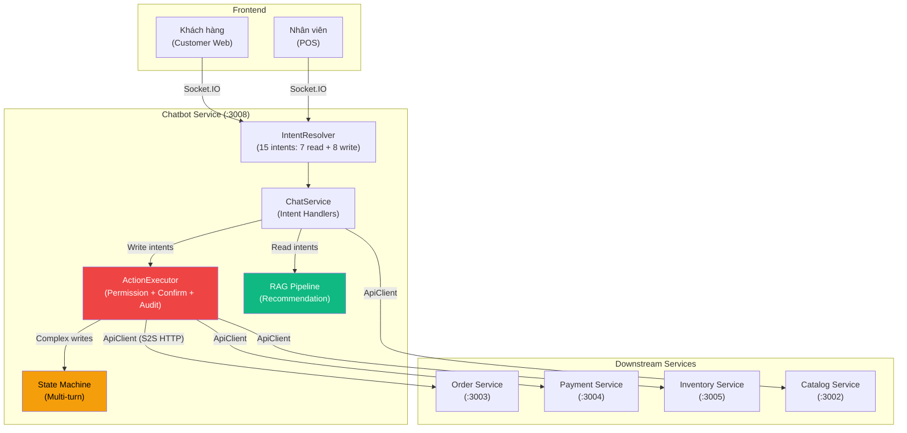
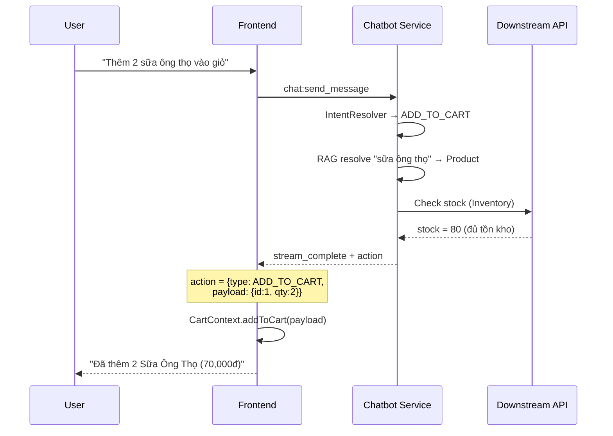
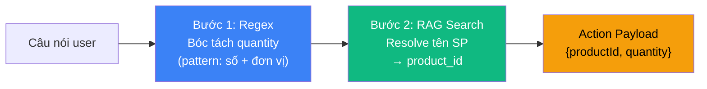
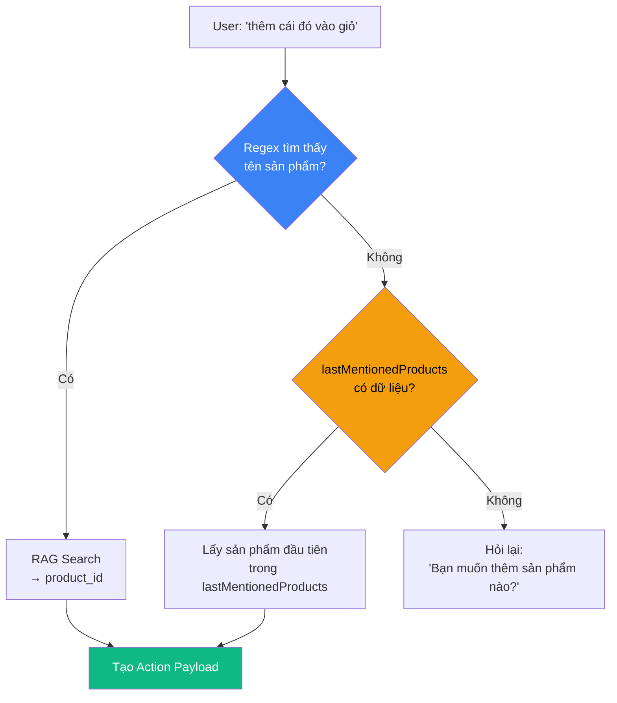
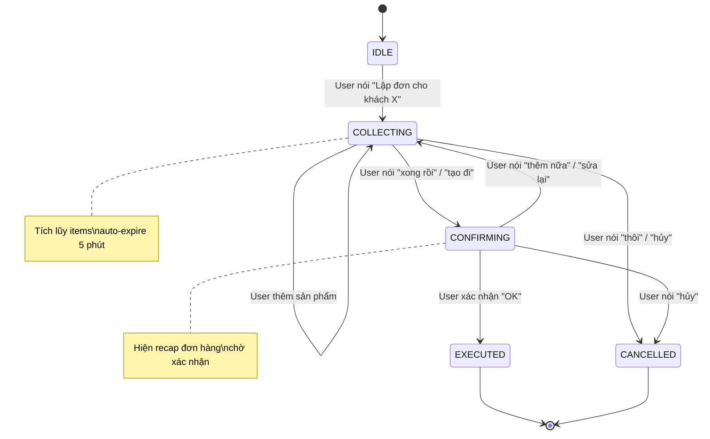
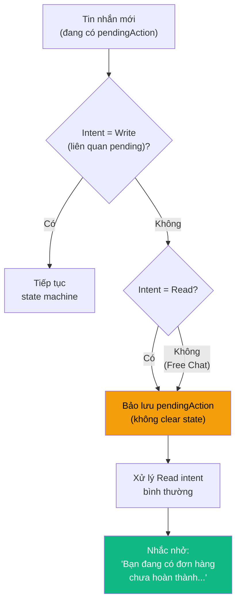
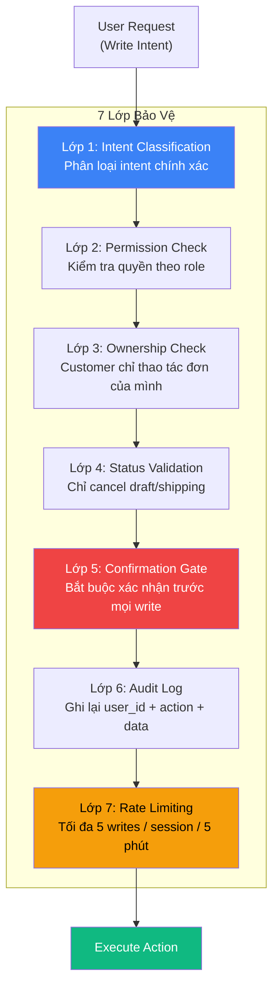
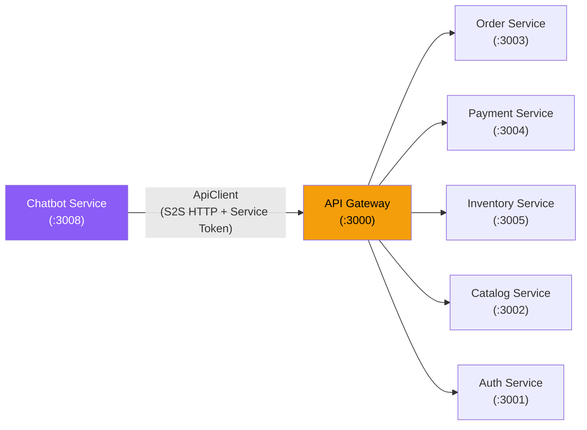

# BÁO CÁO BỔ SUNG: Chatbot Assistant — Trợ Lý Thao Tác Hệ Thống

---

## 1. TỔNG QUAN & ĐỘNG LỰC

### 1.1 Bối cảnh

Hệ thống chatbot POSMART trước nâng cấp hoạt động ở chế độ **Read-only** — chỉ tra cứu thông tin (tồn kho, giá, đơn hàng) và gợi ý sản phẩm thông qua RAG Pipeline (đã trình bày trong Báo cáo Recommendation). Tuy nhiên, khi khách hàng thấy một sản phẩm hấp dẫn, họ phải **rời khỏi chatbot**, tìm lại sản phẩm trên trang web, rồi mới thêm vào giỏ được.

Điều này tạo ra **ma sát trải nghiệm (UX Friction)** — mỗi bước rời khỏi chatbot là một cơ hội mất khách hàng.

### 1.2 Bài toán UX Friction — Định lượng

| Luồng | Số bước | Chi tiết |
|---|---|---|
| **Trước nâng cấp** | 6 bước | Hỏi chatbot → Xem gợi ý → Đóng chat → Tìm sản phẩm → Thêm giỏ → Checkout |
| **Sau nâng cấp** | 3 bước | Hỏi chatbot → "Thêm vào giỏ" → Checkout |

Giảm **50% số bước thao tác** → giảm tỷ lệ bỏ giỏ (cart abandonment), tăng conversion rate.

### 1.3 Mục tiêu: Từ Read-only sang Action Assistant

Nâng cấp chatbot thành **Trợ lý thao tác (Action Assistant)** có khả năng **write** vào hệ thống, phục vụ 2 đối tượng:

| Đối tượng | Khả năng mới |
|---|---|
| **Khách hàng** (Customer Web) | Thêm/xóa/sửa giỏ hàng, hủy đơn, theo dõi giao hàng |
| **Nhân viên** (POS) | Thêm vào giỏ POS, lập đơn hàng, kiểm tra thanh toán |

### 1.4 Nguyên tắc thiết kế — 5 trụ cột

| # | Nguyên tắc | Ý nghĩa | Tại sao quan trọng? |
|---|---|---|---|
| 1 | **Confirmation Protocol** | Mọi write action bắt buộc xác nhận trước khi thực thi | LLM có thể phân loại sai intent → Human-in-the-loop chặn lỗi |
| 2 | **Data from API, Text from LLM** | LLM chỉ format văn bản, dữ liệu luôn đến từ API thật | Tránh LLM hallucination bịa số liệu (giá, tồn kho) |
| 3 | **Least Privilege** | Chatbot chỉ có quyền tối thiểu cho từng role | Employee ≠ Customer → permission matrix riêng |
| 4 | **Audit Trail** | Mọi write được log: user_id + action + data + session_id | Truy vết khi có sự cố, đáp ứng compliance |
| 5 | **Graceful Degradation** | Nếu API downstream lỗi → thông báo rõ, không crash | Microservices có thể offline bất kỳ lúc nào |

### 1.5 Kiến trúc tổng thể sau nâng cấp



---

## 2. ACTION PROTOCOL — GIAO THỨC THAO TÁC

### 2.1 Mô tả

Khi chatbot phát hiện **write intent** (ý định thao tác), response không chỉ chứa văn bản trả lời mà còn chứa thêm trường `action` — chỉ thị cho frontend biết phải thực thi hành động gì.

### 2.2 Phân loại Action

| Loại | Xử lý tại | Confirm? | Ví dụ |
|---|---|---|---|
| **Client-side Action** | Frontend (CartContext) | Không | Thêm/xóa/sửa giỏ hàng |
| **Navigation Action** | Frontend (Router) | Không | Điều hướng đến /checkout, /order-status |
| **Server-side Action** | Backend (ApiClient → Microservice) | Bắt buộc | Tạo đơn hàng, hủy đơn, thanh toán |

### 2.3 Sơ đồ luồng Action Protocol



### 2.4 Tại sao giỏ hàng xử lý ở Client-side thay vì gọi API?

| Tiêu chí | Client-side (CartContext) | Server-side (API Call) |
|---|---|---|
| **Latency** | Tức thì (~0ms) | Thêm 100-300ms round-trip |
| **Offline capability** | Giỏ hàng vẫn hoạt động khi mất mạng tạm thời | Phụ thuộc server |
| **Consistency** | Đồng bộ với nút "Thêm giỏ" trên web (cùng CartContext) | Cần sync 2 nguồn state |
| **Backend load** | Không tạo thêm request | Mỗi thao tác giỏ = 1 API call |
| **Rollback** | User tự undo (xóa khỏi giỏ) | Cần API cancel |

**Kết luận:** Giỏ hàng là **client state** — chatbot chỉ trả về `action` chỉ thị, frontend tự xử lý giống hệt khi user bấm nút "Thêm vào giỏ" trên trang web. Chỉ các thao tác **mutate database** (tạo đơn, hủy đơn) mới gọi API qua server.

---

## 3. HỆ THỐNG PHÂN LOẠI Ý ĐỊNH (INTENT CLASSIFICATION)

### 3.1 Bảng Intent tổng hợp

#### Các Intent tra cứu đã có

| Intent | Triggers (mẫu) | Mô tả |
|---|---|---|
| `CHECK_STOCK` | "còn hàng không", "tồn kho" | Kiểm tra tồn kho |
| `CHECK_PRICE` | "giá bao nhiêu", "bao nhiêu tiền" | Kiểm tra giá |
| `ORDER_STATUS` | "đơn hàng #5", "tình trạng đơn" | Trạng thái đơn hàng |
| `RECOMMENDATION` | "gợi ý", "có gì ngon" | Gợi ý sản phẩm (RAG Pipeline) |
| `SEARCH_PRODUCT` | "tìm [SP]", "có [SP] không" | Tìm kiếm sản phẩm |
| `FREE_CHAT` | câu hỏi chung | Trò chuyện tự do |
| `HELP` | "trợ giúp", "hướng dẫn" | Hướng dẫn sử dụng |

#### Các Intent thao tác mới

| Intent | Triggers | Role | Loại Action |
|---|---|---|---|
| `ADD_TO_CART` | "thêm vào giỏ", "mua [SP]", "lấy [SP]" | Customer + Employee | Client-side |
| `REMOVE_FROM_CART` | "bỏ ra", "xóa khỏi giỏ" | Customer + Employee | Client-side |
| `UPDATE_CART_ITEM` | "giảm xuống", "đổi số lượng" | Customer + Employee | Client-side |
| `VIEW_CART` | "xem giỏ hàng", "trong giỏ có gì" | Customer + Employee | Client-side |
| `TRACK_ORDER` | "đơn đang ở đâu", "theo dõi đơn" | Customer | Navigation |
| `CANCEL_ORDER` | "hủy đơn", "cancel đơn" | Customer + Employee | Server-side |
| `POS_ADD_ITEM` | "thêm [SP]", "tính tiền [SP]" | Employee only | Client-side |
| `CREATE_ORDER` | "lập đơn", "tạo hóa đơn" | Employee only | Server-side |

### 3.2 Tại sao Keyword-based Intent Resolution?

| Phương pháp | Accuracy | Latency | Complexity | Phù hợp |
|---|---|---|---|---|
| **Keyword/Regex** | ~85-90% (domain hẹp) | < 1ms | Thấp | Phù hợp với 15 intents cố định |
| **NLU Model (Rasa/Dialogflow)** | ~92-95% | 50-200ms | Trung bình | Cần training data |
| **LLM Function Calling** | ~95-98% | 500-2000ms | Cao | Tăng độ trễ và chi phí |

**Lý do chọn Keyword/Regex:**
1. **Domain hẹp:** Siêu thị mini có vocabulary giới hạn — "thêm vào giỏ", "mua", "lấy" đã bao phủ ~90% cách diễn đạt.
2. **Latency ưu tiên:** Chatbot cần phản hồi < 2 giây. NLU thêm 50-200ms, LLM Function Calling thêm 500-2000ms — không cần thiết cho 15 intents.
3. **White-box testing:** Mỗi regex pattern có thể unit test riêng biệt, dễ debug khi intent bị phân loại sai.
4. **Fallback graceful:** Intent không khớp → chuyển sang `FREE_CHAT` → LLM tự trả lời.

### 3.3 Entity Extraction — Bóc tách tham số

Khi Intent đã được phân loại (VD: `ADD_TO_CART`), hệ thống cần **bóc tách tham số** từ câu nói tự nhiên.

**Ví dụ:** _"Thêm 2 lốc bò húc vào giỏ"_
- Intent: `ADD_TO_CART` (Keyword match: "thêm...vào giỏ")
- Entity cần trích xuất: `quantity = 2`, `product = "bò húc"`

**Quy trình 2 bước:**



| Bước | Phương pháp | Vai trò |
|---|---|---|
| **Bóc tách quantity** | Regex: `(\d+)\s*(hộp|lốc|gói|chai|kg|thùng)?` | Trích xuất số lượng + đơn vị |
| **Resolve tên sản phẩm** | RAG Semantic Search (cùng pipeline với Recommendation) | Ánh xạ "bò húc" → Product #15 "Nước tăng lực Bò Húc" |
| **Default quantity** | Nếu không tìm thấy số → `quantity = 1` | Xử lý "thêm sữa vào giỏ" (ngầm hiểu = 1) |

**Tại sao dùng RAG thay vì exact match?** Khách hàng gọi tên sản phẩm bằng nhiều cách: "sữa ông thọ", "ông thọ", "sữa đặc", "sữa hộp đỏ" → exact match không cover được. RAG Semantic Search tìm sản phẩm gần nhất về mặt ngữ nghĩa, tận dụng chung pipeline embedding đã có.

### 3.4 Contextual Pronoun Resolution — Xử lý đại từ chỉ định

Trong hội thoại tự nhiên, khách hàng thường **không gõ lại tên sản phẩm**:

```
Chatbot: "Mình có Ba chỉ bò Mỹ giá 125,000đ, còn 15 trên kệ."
Khách:   "Ok, thêm cái đó vào giỏ đi"
                    Đại từ chỉ định → sản phẩm nào?
```

**Giải pháp:** Hệ thống lưu `lastMentionedProducts` trong session metadata — danh sách sản phẩm được đề cập/gợi ý gần nhất. Khi câu nói chứa đại từ ("cái đó", "lấy 2 hộp", "bỏ nó đi") mà **không tìm thấy tên sản phẩm** → tra cứu `lastMentionedProducts`.



**Tại sao session-based context thay vì full conversation history?**
- **Session-based:** Chỉ lưu sản phẩm cuối cùng được đề cập → gọn nhẹ, chính xác.
- **Full conversation:** Phải parse toàn bộ lịch sử chat → chậm, dễ bị nhiễu bởi sản phẩm đã nhắc từ 10 tin nhắn trước.

---

## 4. MULTI-TURN STATE MACHINE — HỘI THOẠI NHIỀU VÒNG

### 4.1 Bài toán

Các thao tác phức tạp (VD: `CREATE_ORDER` — lập đơn hàng) **không thể hoàn thành trong 1 tin nhắn**. Nhân viên cần:
1. Chỉ định khách hàng
2. Thêm sản phẩm (có thể nhiều lượt)
3. Xác nhận và tạo đơn

Đây là bài toán **Multi-turn Conversation** — hệ thống cần duy trì trạng thái (state) xuyên suốt nhiều lượt hội thoại.

### 4.2 State Machine



| Trạng thái | Mô tả | Hành vi chatbot |
|---|---|---|
| `IDLE` | Không có pending action | Xử lý intent bình thường |
| `COLLECTING` | Đang thu thập dữ liệu | Mỗi tin nhắn mới → parse thêm items |
| `CONFIRMING` | Hiện recap, chờ xác nhận | Chỉ chấp nhận "OK", "xác nhận", "hủy" |
| `EXECUTED` | Đã thực thi thành công | Clear state → về IDLE |
| `CANCELLED` | Đã hủy bỏ | Clear state → về IDLE |

### 4.3 Lưu trữ State — Session Metadata (JSONB)

State được lưu trong cột `metadata` (JSONB) của bảng `chat_session`:

| Trường | Kiểu | Ý nghĩa |
|---|---|---|
| `pendingAction.type` | TEXT | Loại action đang chờ: `CREATE_ORDER`, `CANCEL_ORDER` |
| `pendingAction.state` | TEXT | Trạng thái hiện tại: `COLLECTING`, `CONFIRMING` |
| `pendingAction.data` | JSONB | Dữ liệu tích lũy: `{customerId, items: [...]}` |
| `pendingAction.expiresAt` | TIMESTAMP | Tự hủy sau 5 phút không tương tác |
| `lastMentionedProducts` | JSONB[] | Sản phẩm vừa đề cập (cho Pronoun Resolution) |

**Tại sao Session Metadata (JSONB) thay vì Redis/Memory?**

| Tiêu chí | Session Metadata (JSONB) | Redis | In-memory |
|---|---|---|---|
| **Persistence** | Duy trì sau khi khởi động lại | Duy trì sau khi khởi động lại | Mất khi khởi động lại |
| **Complexity** | Không thêm hạ tầng | Cần Redis server | Không thêm hạ tầng |
| **Debugging** | Truy vấn SQL trực tiếp | Cần Redis CLI | Không kiểm tra trực quan được |
| **Auto-cleanup** | Chạy định kỳ hoặc dùng cấu trúc hết hạn | Hỗ trợ thời gian sống tự nhiên | Cần tự xây dựng cơ chế |
| **Multi-instance** | Chia sẻ cơ sở dữ liệu chung | Chia sẻ bộ nhớ Redis chung | Không chia sẻ được giữa các bản sao |

Với quy mô hiện tại (1 instance chatbot service), JSONB trong PostgreSQL đủ đáp ứng mà không cần thêm infrastructure.

### 4.4 Xử lý State Interruption — Ngắt quãng trạng thái

**Kịch bản Edge Case:** User đang ở trạng thái `COLLECTING` (tạo đơn), bất ngờ hỏi chen ngang:

```
NV: "Lập đơn cho khách An"             → State = COLLECTING
NV: "2 sữa ông thọ"                    → items += [Sữa Ông Thọ x2]
NV: "À khoan, còn nấm kim châm không?" → Read Intent (CHECK_STOCK)!
```

**Chiến lược: Bảo lưu State + Trả lời + Nhắc lại**



Hệ thống **không hủy** đơn hàng đang tạo chỉ vì user hỏi chen ngang. Sau khi trả lời câu hỏi read, chatbot nhắc nhở: _"Bạn đang có đơn hàng chưa hoàn thành (Sữa Ông Thọ x2, tổng 70,000đ). Tiếp tục thêm sản phẩm hay tạo đơn?"_

### 4.5 Testcase: Luồng CREATE_ORDER nhiều vòng

```
NV: "Lập đơn cho khách Nguyễn Văn An"
CB: → IntentResolver → CREATE_ORDER
    → Search customer "Nguyễn Văn An" → Found (VIP)
    → State = COLLECTING
    → "Tìm thấy KH: Nguyễn Văn An (VIP). Thêm sản phẩm gì?"

NV: "2 thùng sữa ông thọ, 1 gói mì hảo hảo"
CB: → State = COLLECTING → Parse entities:
    → RAG resolve "sữa ông thọ" → Product #1 (35,000đ)
    → RAG resolve "mì hảo hảo" → Product #7 (5,500đ)
    → items = [{#1, qty:2}, {#7, qty:1}]
    → "Đã thêm 2 sản phẩm. Còn gì nữa không, hay tạo đơn?"

NV: "À khoan, còn nấm kim châm không?"    ← Interruption!
CB: → Read intent (CHECK_STOCK) → Bảo lưu pendingAction
    → Check stock: Nấm kim châm còn 80 trên kệ
    → "Nấm kim châm còn 80 trên kệ, giá 35,000đ.
       Bạn đang có đơn chưa hoàn thành. Tiếp tục?"

NV: "Thêm 1 gói nấm nữa rồi tạo đi"
CB: → State = COLLECTING → items += [{#3, qty:1}]
    → State = CONFIRMING
    → "Xác nhận đơn hàng:
       1. Sữa Ông Thọ x2 — 70,000đ
       2. Mì Hảo Hảo x1 — 5,500đ
       3. Nấm kim châm x1 — 35,000đ
       Tổng: 110,500đ. KH: Nguyễn Văn An (VIP).
       Xác nhận tạo?"

NV: "OK tạo đi"
CB: → Confirmation Gate đã thông qua
    → ApiClient.createOrder(orderData)
    → State = EXECUTED → clear pendingAction
    → "Đã tạo đơn ORD-0042 (Nháp). Tổng: 110,500đ."
```

---

## 5. BẢO MẬT — 7 LỚP BẢO VỆ (DEFENSE IN DEPTH)

### 5.1 Mô hình bảo mật

Khi chatbot có khả năng **write** vào hệ thống, bảo mật trở nên cực kỳ quan trọng. Hệ thống áp dụng nguyên tắc **Defense in Depth** — không phụ thuộc vào 1 lớp duy nhất, mà xếp chồng 7 lớp bảo vệ:



### 5.2 Permission Matrix

| Action | Employee | Customer | Validation Logic |
|---|---|---|---|
| Thêm/xóa/sửa giỏ hàng | Cho phép | Cho phép | Stock check |
| Tạo đơn hàng | Cho phép (`manage_orders`) | Từ chối (redirect checkout) | Permission + stock |
| Hủy đơn | Cho phép (draft/shipping) | Cho phép (chỉ đơn mình, chỉ draft) | Ownership + status |
| Cập nhật đơn | Cho phép (chỉ draft) | Từ chối | Permission + status |
| Kiểm tra payment | Cho phép (tất cả đơn store) | Cho phép (chỉ đơn mình) | Ownership filter |
| Hoàn tiền | Cho phép (`manage_payments`) | Từ chối (yêu cầu qua NV) | Permission |

### 5.3 Confirmation Gate — Tại sao bắt buộc cho write?

**Vấn đề LLM Hallucination:** LLM có thể phân loại sai intent. Ví dụ: user nói _"Tôi muốn biết quy trình hủy đơn"_ (câu hỏi thông tin) → LLM có thể hiểu nhầm thành `CANCEL_ORDER` (hành động hủy).

**Giải pháp Human-in-the-loop:** Chatbot luôn hỏi xác nhận trước mọi server-side write:

```
CB: "Bạn muốn hủy đơn ORD-0005 (125,500đ). Xác nhận?"
    [Nút: Xác nhận] [Nút: Hủy bỏ]
```

Ngay cả khi AI hiểu sai intent, hệ thống **không thực thi** cho đến khi người dùng bấm xác nhận rõ ràng → loại bỏ hoàn toàn rủi ro sai lệch dữ liệu.

### 5.4 Rate Limiting

Tối đa **5 write actions / session / 5 phút** → chặn spam tạo/hủy đơn. Nếu vượt ngưỡng → chatbot phản hồi: _"Bạn đã thực hiện quá nhiều thao tác. Vui lòng thử lại sau vài phút."_

---

## 6. KIẾN TRÚC CROSS-SERVICE (API ORCHESTRATION)

### 6.1 Sơ đồ giao tiếp



### 6.2 API Endpoints — Read + Write

| Service | Các chức năng đọc trước nâng cấp | Các chức năng ghi sau nâng cấp |
|---|---|---|
| **Order** | `GET /orders`, `GET /orders/:id` | `POST /orders`, `PATCH /orders/:id/status`, `DELETE /orders/:id` |
| **Payment** | `GET /payments/status/:ref` | `POST /payments/direct`, `POST /payments/vnpay/create-url` |
| **Inventory** | `GET /inventory/summary` | — (chỉ read, stock update qua Order event) |
| **Catalog** | `GET /products/search` | — (chỉ read) |

> **Điểm quan trọng:** Backend APIs cho Order, Payment, Inventory **đã có sẵn** từ kiến trúc microservices. Chatbot chỉ cần gọi qua ApiClient, không cần tạo API mới.

### 6.3 Internal Service Token — Phân quyền API

ApiClient sử dụng **Internal Service Token** với quyền hạn mở rộng:

| Quyền | Chức năng đọc trước nâng cấp | Chức năng ghi sau nâng cấp |
|---|---|---|
| `products.read` | Có | Có |
| `inventory.read` | Có | Có |
| `orders.read` | Có | Có |
| `customers.read` | Có | Có |
| `orders.write` | Không | Có |
| `payments.write` | Không | Có |

**Tại sao Internal Service Token thay vì User Token Forwarding?**

| Tiêu chí | Service Token | User Token Forwarding |
|---|---|---|
| **Đơn giản** | 1 token cố định | Phải forward JWT từ user → chatbot → API |
| **Permission** | Chatbot tự enforce permission (Layer 2) | API enforce, nhưng chatbot cần pass-through |
| **Audit** | Chatbot ghi audit log riêng | API ghi log, khó phân biệt chatbot vs web |

Token có quyền rộng → **Confirmation Gate (Lớp 5)** đảm bảo không lạm dụng.

### 6.4 Graceful Degradation — Xử lý lỗi downstream

**Kịch bản:** Chatbot tạo đơn thành công (Order Service), nhưng Payment Service trả về lỗi.

| Tình huống | Hành vi hệ thống |
|---|---|
| Order API timeout | "Hệ thống đang bận, vui lòng thử lại." (không tạo đơn) |
| Order created, Payment failed | Đơn ở trạng thái `draft` (chưa thanh toán) → NV thanh toán sau |
| Inventory API lỗi | Fallback: tạo đơn không check stock → cảnh báo NV kiểm tra thủ công |

**Nguyên tắc:** Chatbot **không crash** khi downstream service lỗi. Mỗi API call có timeout (5s) + try/catch → thông báo rõ ràng cho user.

---

## 7. TESTCASE TỔNG HỢP — E2E FLOWS

### 7.1 Customer Flow: Gợi ý → Thêm giỏ → Hủy đơn

| # | Câu test | Expected | Action |
|---|---|---|---|
| 1 | "Có thịt bò không?" | RAG Pipeline → gợi ý sản phẩm | RECOMMENDATION |
| 2 | "Thêm cái đó vào giỏ" | Pronoun Resolution → thêm Ba chỉ bò Mỹ | ADD_TO_CART |
| 3 | "Lấy thêm 2 hộp sữa" | RAG resolve + quantity = 2 | ADD_TO_CART |
| 4 | "Giảm sữa xuống 1 hộp" | Update quantity = 1 | UPDATE_CART_ITEM |
| 5 | "Xem giỏ hàng" | Hiện danh sách items | VIEW_CART |
| 6 | "Thanh toán đi" | Hướng dẫn → redirect /checkout | NAVIGATE |
| 7 | "Hủy đơn #5" | Quyền sở hữu hợp lệ + Trạng thái nháp → xác nhận | CANCEL_ORDER |
| 8 | "Hủy đơn #5" (đã giao) | Thông báo không thể hủy đơn đã giao | None |

### 7.2 Employee Flow: POS → Lập đơn → Thanh toán

| # | Câu test | Expected | Action |
|---|---|---|---|
| 1 | "Thêm 3 mì hảo hảo" | RAG resolve → thêm POS cart | POS_ADD_ITEM |
| 2 | "Lập đơn cho khách An" | Multi-turn → State = COLLECTING | CREATE_ORDER |
| 3 | "2 sữa ông thọ, 1 bò húc" | Parse entities → items += 2 SP | (COLLECTING) |
| 4 | "Tạo đi" | Recap → confirm → POST /orders | (CONFIRMING → EXECUTED) |
| 5 | "Đơn #42 thanh toán chưa?" | Payment status check | PAYMENT_CHECK |
| 6 | "Hủy đơn #42" (đã giao) | Thông báo không thể hủy đơn đã giao | None |

### 7.3 Edge Cases

| # | Kịch bản | Xử lý |
|---|---|---|
| 1 | "Thêm abc123 vào giỏ" (SP không tồn tại) | "Không tìm thấy sản phẩm 'abc123'" |
| 2 | "Thêm nước mắm vào giỏ" (hết hàng) | "Sản phẩm tạm hết hàng. Kiểm tra lại sau!" |
| 3 | "Thêm cái đó" (không có context) | "Bạn muốn thêm sản phẩm nào? Hãy cho mình biết tên." |
| 4 | Interruption khi COLLECTING | Bảo lưu state → trả lời read → nhắc lại pending |
| 5 | Timeout 5 phút không tương tác | Clear pendingAction → "Đơn đã hết hạn tạo." |
| 6 | > 5 writes trong 5 phút | Rate limit: "Vui lòng thử lại sau." |

---

## 8. SO SÁNH TRƯỚC/SAU & ĐÁNH GIÁ

### 8.1 So sánh hệ thống trước và sau nâng cấp

| Khía cạnh | Hệ thống trước nâng cấp | Hệ thống sau nâng cấp |
|---|---|---|
| **Chế độ** | Chỉ tra cứu | Tra cứu và thao tác |
| **Intents** | 7 (tra cứu) | 15 (tra cứu + thao tác) |
| **Cart Management** | Không | Cả hai chiều (Thêm/Xóa/Cập nhật) |
| **Conversation** | Một vòng (hỏi và đáp) | Nhiều vòng (Máy trạng thái) |
| **Pronoun Resolution** | Không | Hỗ trợ tốt nhất (ví dụ: "cái đó", "lấy 2 hộp") |
| **Frontend** | Text + Product Cards | + Action buttons + Cart integration |
| **Bảo mật** | JWT auth | 7 lớp (Permission → Audit → Rate Limit) |
| **ApiClient** | 8 read methods | 8 read + 5 write methods |
| **WebSocket events** | 5 events | 7 events (+confirm_action, +action) |
| **Trải nghiệm KH** | "Xem rồi tự tìm mua" | "Xem → Thêm giỏ → Checkout" |
| **Trải nghiệm NV** | "Tra cứu rồi thao tác thủ công" | "Nói → Chatbot làm → Xác nhận" |

### 8.2 Metric đánh giá Action Assistant

| Metric | Định nghĩa | Mục tiêu |
|---|---|---|
| **Task Success Rate** | % thao tác write hoàn thành thành công (không lỗi, không timeout) | ≥ 95% |
| **Intent Accuracy** | % intent phân loại đúng (so với ground truth) | ≥ 90% |
| **UX Friction Reduction** | Số bước giảm: 6 → 3 | -50% |
| **Error Rate** | % write bị fail do lỗi data/permission/stock | ≤ 5% |
| **Entity Extraction Accuracy** | % tham số (quantity, product) trích xuất đúng | ≥ 85% |
| **Pronoun Resolution Accuracy** | % đại từ "cái đó" resolve đúng sản phẩm | ≥ 80% |

### 8.3 Kết luận

Chatbot POSMART nâng cấp chuyển đổi từ **công cụ tra cứu thụ động** thành **trợ lý ảo chủ động** — kết hợp khả năng gợi ý sản phẩm AI (Recommendation Engine từ báo cáo chính) với khả năng thao tác trực tiếp vào hệ thống (Action Assistant). Kiến trúc 7 lớp bảo mật + Confirmation Protocol đảm bảo an toàn cho mọi write action, trong khi Multi-turn State Machine và Pronoun Resolution mang lại trải nghiệm hội thoại tự nhiên như với một nhân viên bán hàng thực thụ.
