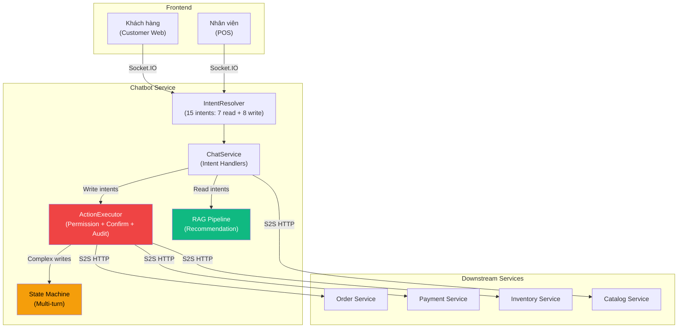
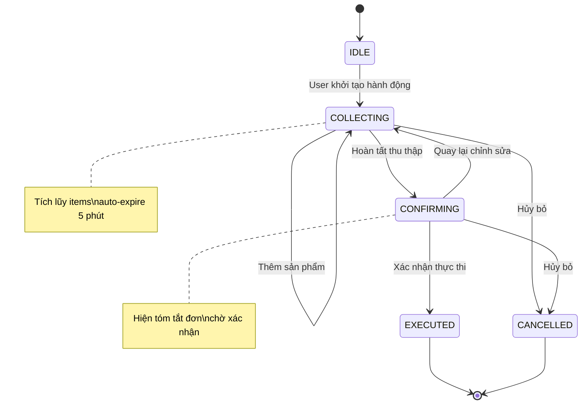

# BÁO CÁO BỔ SUNG: Chatbot Assistant — Trợ Lý Thao Tác Hệ Thống

---

## 1. TỔNG QUAN & ĐỘNG LỰC

### 1.1 Bối cảnh

Hệ thống chatbot POSMART trước nâng cấp hoạt động ở chế độ **Read-only** — chỉ tra cứu thông tin (tồn kho, giá, đơn hàng) và gợi ý sản phẩm thông qua RAG Pipeline (đã trình bày trong Báo cáo Recommendation). Tuy nhiên, khi khách hàng thấy một sản phẩm hấp dẫn, họ phải **rời khỏi chatbot**, tìm lại sản phẩm trên trang web, rồi mới thêm vào giỏ được.

Điều này tạo ra **ma sát trải nghiệm (UX Friction)** — mỗi bước rời khỏi chatbot là một cơ hội mất khách hàng.

### 1.2 Bài toán UX Friction — Định lượng

| Luồng | Số bước | Chi tiết |
|---|---|---|
| **Trước nâng cấp** | 6 bước | Hỏi chatbot → Xem gợi ý → Đóng chat → Tìm sản phẩm → Thêm giỏ → Checkout |
| **Sau nâng cấp** | 3 bước | Hỏi chatbot → "Thêm vào giỏ" → Checkout |

Giảm **50% số bước thao tác** → giảm tỷ lệ bỏ giỏ (cart abandonment), tăng conversion rate.

### 1.3 Mục tiêu: Từ Read-only sang Action Assistant

Nâng cấp chatbot thành **Trợ lý thao tác (Action Assistant)** có khả năng **write** vào hệ thống, phục vụ 2 đối tượng:

| Đối tượng | Khả năng mới |
|---|---|
| **Khách hàng** (Customer Web) | Thêm/xóa/sửa giỏ hàng, hủy đơn, theo dõi giao hàng |
| **Nhân viên** (POS) | Thêm vào giỏ POS, lập đơn hàng, kiểm tra thanh toán |

### 1.4 Nguyên tắc thiết kế — 5 trụ cột

| # | Nguyên tắc | Ý nghĩa |
|---|---|---|
| 1 | **Confirmation Protocol** | Mọi write action bắt buộc xác nhận trước khi thực thi — chặn lỗi do LLM phân loại sai intent |
| 2 | **Data from API, Text from LLM** | LLM chỉ format văn bản, dữ liệu luôn đến từ API thật — tránh hallucination bịa số liệu |
| 3 | **Least Privilege** | Chatbot chỉ có quyền tối thiểu cho từng role — Employee và Customer có ma trận quyền riêng |
| 4 | **Audit Trail** | Mọi write được ghi nhận chi tiết: user_id, action, data, session_id |
| 5 | **Graceful Degradation** | Nếu API downstream lỗi → thông báo rõ, không crash toàn bộ hệ thống |

### 1.5 Kiến trúc tổng thể sau nâng cấp

---

## 2. ACTION PROTOCOL — GIAO THỨC THAO TÁC

### 2.1 Mô tả

Khi chatbot phát hiện **write intent** (ý định thao tác), response không chỉ chứa văn bản trả lời mà còn chứa thêm trường `action` — chỉ thị cho frontend biết phải thực thi hành động gì. Quy trình tổng quát được thực hiện theo 3 bước cốt lõi:
1. **Phân loại intent** — IntentResolver xác định loại hành động.
2. **Tra cứu dữ liệu thực** — Kiểm tra tồn kho, giá, quyền sở hữu qua API downstream.
3. **Trả về chỉ thị hành động** — Frontend nhận action payload và thực thi client-side hoặc hiển thị xác nhận cho server-side.

### 2.2 Phân loại Action

| Loại | Xử lý tại | Xác nhận? | Ví dụ |
|---|---|---|---|
| **Client-side Action** | Frontend (CartContext) | Không | Thêm/xóa/sửa giỏ hàng |
| **Navigation Action** | Frontend (Router) | Không | Điều hướng đến trang thanh toán, theo dõi đơn |
| **Server-side Action** | Backend (API downstream) | Bắt buộc | Tạo đơn hàng, hủy đơn, thanh toán |

### 2.3 Tại sao giỏ hàng xử lý ở Client-side thay vì gọi API?

| Tiêu chí | Client-side (CartContext) | Server-side (API Call) |
|---|---|---|
| **Latency** | Tức thì (~0ms) | Thêm 100-300ms round-trip |
| **Đồng bộ UI** | Dùng chung CartContext với nút "Thêm giỏ" trên web | Cần đồng bộ 2 nguồn state |
| **Backend load** | Không tạo thêm request | Mỗi thao tác giỏ = 1 API call |
| **Rollback** | User tự undo (xóa khỏi giỏ) | Cần API cancel |

**Kết luận:** Giỏ hàng là **client state** — chatbot chỉ trả về `action` chỉ thị, frontend tự xử lý giống hệt khi user bấm nút "Thêm vào giỏ" trên trang web. Chỉ các thao tác **mutate database** (tạo đơn, hủy đơn) mới gọi API qua server.

---

## 3. HỆ THỐNG PHÂN LOẠI Ý ĐỊNH (INTENT CLASSIFICATION)

### 3.1 Bảng Intent tổng hợp

#### Các Intent tra cứu (Read)

| Intent | Triggers (mẫu) | Mô tả |
|---|---|---|
| CHECK_STOCK | "còn hàng không", "tồn kho" | Kiểm tra tồn kho |
| CHECK_PRICE | "giá bao nhiêu", "bao nhiêu tiền" | Kiểm tra giá |
| ORDER_STATUS | "đơn hàng #5", "tình trạng đơn" | Trạng thái đơn hàng |
| RECOMMENDATION | "gợi ý", "có gì ngon" | Gợi ý sản phẩm (RAG Pipeline) |
| SEARCH_PRODUCT | "tìm [SP]", "có [SP] không" | Tìm kiếm sản phẩm |
| FREE_CHAT | câu hỏi chung | Trò chuyện tự do |
| HELP | "trợ giúp", "hướng dẫn" | Hướng dẫn sử dụng |

#### Các Intent thao tác (Write)

| Intent | Triggers | Role | Loại Action |
|---|---|---|---|
| ADD_TO_CART | "thêm vào giỏ", "mua [SP]" | Customer + Employee | Client-side |
| REMOVE_FROM_CART | "bỏ ra", "xóa khỏi giỏ" | Customer + Employee | Client-side |
| UPDATE_CART_ITEM | "giảm xuống", "đổi số lượng" | Customer + Employee | Client-side |
| VIEW_CART | "xem giỏ hàng", "trong giỏ có gì" | Customer + Employee | Client-side |
| TRACK_ORDER | "đơn đang ở đâu", "theo dõi đơn" | Customer | Navigation |
| CANCEL_ORDER | "hủy đơn", "cancel đơn" | Customer + Employee | Server-side |
| POS_ADD_ITEM | "thêm [SP]", "tính tiền [SP]" | Employee only | Client-side |
| CREATE_ORDER | "lập đơn", "tạo hóa đơn" | Employee only | Server-side |

### 3.2 Tại sao Keyword-based Intent Resolution?

| Phương pháp | Accuracy | Latency | Phù hợp |
|---|---|---|---|
| **Keyword/Regex** | ~85-90% (domain hẹp) | < 1ms | 15 intents cố định, vocabulary giới hạn |
| **NLU Model (Rasa/Dialogflow)** | ~92-95% | 50-200ms | Cần training data, triển khai phức tạp |
| **LLM Function Calling** | ~95-98% | 500-2000ms | Tăng độ trễ và chi phí vận hành |

**Lý do chọn Keyword/Regex:**
1. **Domain hẹp:** Siêu thị mini có vocabulary giới hạn — "thêm vào giỏ", "mua", "lấy" đã bao phủ ~90% cách diễn đạt.
2. **Latency ưu tiên:** Chatbot cần phản hồi < 2 giây. Thêm NLU hoặc LLM Function Calling tăng độ trễ đáng kể mà không cần thiết.
3. **White-box testing:** Mỗi regex pattern có thể unit test riêng biệt, dễ debug khi intent bị phân loại sai.
4. **Fallback graceful:** Intent không khớp → chuyển sang FREE_CHAT → LLM tự trả lời.

### 3.3 Entity Extraction — Bóc tách tham số

Khi Intent đã được phân loại, hệ thống cần **bóc tách tham số** từ câu nói tự nhiên theo quy trình 2 bước:

| Bước | Phương pháp | Vai trò |
|---|---|---|
| **Bóc tách quantity** | Regex pattern số | Trích xuất số lượng (mặc định = 1 nếu không có) |
| **Resolve tên sản phẩm** | RAG Semantic Search (cùng pipeline với Recommendation) | Ánh xạ tên gọi tự nhiên → product_id chính xác |

**Tại sao dùng RAG thay vì exact match cho tên sản phẩm?** Khách hàng gọi tên sản phẩm bằng nhiều cách khác nhau (ví dụ: "sữa ông thọ", "ông thọ", "sữa đặc", "sữa hộp đỏ") → exact match không cover hết. RAG Semantic Search tìm sản phẩm gần nhất về mặt ngữ nghĩa, tận dụng chung pipeline embedding đã có.

### 3.4 Contextual Pronoun Resolution — Xử lý đại từ chỉ định

Trong hội thoại tự nhiên, khách hàng thường **không gõ lại tên sản phẩm** mà dùng đại từ ("cái đó", "lấy 2 cái", "bỏ nó đi").

**Giải pháp:** Hệ thống lưu `lastMentionedProducts` trong session metadata — danh sách sản phẩm được đề cập gần nhất. Khi phát hiện đại từ chỉ định mà **không tìm thấy tên sản phẩm cụ thể**, hệ thống tra cứu danh sách này để xác định mục tiêu. Nếu danh sách trống → hỏi lại user để xác nhận.

**Tại sao session-based context thay vì full conversation history?**
- **Session-based:** Chỉ lưu sản phẩm cuối cùng được đề cập → gọn nhẹ, chính xác.
- **Full conversation:** Phải parse toàn bộ lịch sử chat → chậm, dễ bị nhiễu bởi sản phẩm đã nhắc từ nhiều tin nhắn trước.

---

## 4. MULTI-TURN STATE MACHINE — HỘI THOẠI NHIỀU VÒNG

### 4.1 Bài toán

Các thao tác phức tạp (ví dụ: `CREATE_ORDER` — lập đơn hàng) **không thể hoàn thành trong 1 tin nhắn**. Nhân viên cần chỉ định khách hàng, thêm sản phẩm (có thể nhiều lượt), rồi xác nhận và tạo đơn. Đây là bài toán **Multi-turn Conversation** — hệ thống cần duy trì trạng thái (state) xuyên suốt nhiều lượt hội thoại.

### 4.2 State Machine

| Trạng thái | Mô tả | Hành vi chatbot |
|---|---|---|
| IDLE | Không có pending action | Xử lý intent bình thường |
| COLLECTING | Đang thu thập dữ liệu | Mỗi tin nhắn mới → parse thêm items |
| CONFIRMING | Hiện bản tóm tắt, chờ xác nhận | Chỉ chấp nhận xác nhận hoặc hủy |
| EXECUTED | Đã thực thi thành công | Clear state → về IDLE |
| CANCELLED | Đã hủy bỏ | Clear state → về IDLE |

### 4.3 Lưu trữ State — Session Metadata (JSONB)

State được lưu trong cột `metadata` (JSONB) của bảng `chat_session`, gồm các trường chính: loại action đang chờ, trạng thái hiện tại, dữ liệu tích lũy (danh sách sản phẩm), thời gian hết hạn (tự hủy sau 5 phút không tương tác), và danh sách sản phẩm vừa đề cập dùng cho Pronoun Resolution.

**Tại sao Session Metadata (JSONB) thay vì Redis/Memory?**

| Tiêu chí | Session Metadata (JSONB) | Redis | In-memory |
|---|---|---|---|
| **Persistence** | Duy trì sau khởi động lại | Duy trì sau khởi động lại | Mất khi khởi động lại |
| **Complexity** | Không thêm hạ tầng | Cần Redis server | Không thêm hạ tầng |
| **Debugging** | Truy vấn SQL trực tiếp | Cần Redis CLI | Không kiểm tra trực quan được |
| **Multi-instance** | Chia sẻ cơ sở dữ liệu chung | Chia sẻ bộ nhớ Redis chung | Không chia sẻ được giữa các bản sao |

Với quy mô hiện tại (1 instance chatbot service), JSONB trong PostgreSQL đủ đáp ứng mà không cần thêm infrastructure.

### 4.4 Xử lý State Interruption — Ngắt quãng trạng thái

Khi user đang trong trạng thái COLLECTING (đang thu thập dữ liệu cho đơn hàng), nếu gửi một tin nhắn không liên quan (câu hỏi tra cứu hoặc trò chuyện tự do), hệ thống **bảo lưu pending state** thay vì hủy bỏ. Sau khi trả lời câu hỏi chen ngang, chatbot nhắc nhở user về hành động chưa hoàn thành và gợi ý tiếp tục.

### 4.5 Testcase tổng quát: Luồng CREATE_ORDER

Kịch bản kiểm thử luồng tạo đơn nhiều vòng bao gồm 4 giai đoạn:
1. **Khởi tạo:** Nhân viên nói "Lập đơn cho khách X" → hệ thống tra cứu khách hàng, chuyển sang COLLECTING.
2. **Thu thập:** Nhân viên liệt kê sản phẩm qua nhiều tin nhắn → Entity Extraction bóc tách quantity + RAG Resolve product → tích lũy vào danh sách items.
3. **Ngắt quãng (edge case):** Nhân viên hỏi chen ngang "còn hàng không?" → bảo lưu state, trả lời read, nhắc lại pending.
4. **Xác nhận và thực thi:** Nhân viên nói "tạo đi" → chuyển sang CONFIRMING (hiển thị tóm tắt) → xác nhận → gọi API tạo đơn → EXECUTED.

---

## 5. BẢO MẬT — 7 LỚP BẢO VỆ (DEFENSE IN DEPTH)

### 5.1 Mô hình bảo mật

Khi chatbot có khả năng **write** vào hệ thống, bảo mật trở nên cực kỳ quan trọng. Hệ thống áp dụng nguyên tắc **Defense in Depth** — không phụ thuộc vào 1 lớp duy nhất, mà xếp chồng 7 lớp bảo vệ cho mỗi write request:

| Lớp | Tên gọi | Mô tả |
|---|---|---|
| 1 | **Intent Classification** | Phân loại intent chính xác trước khi xử lý |
| 2 | **Permission Check** | Kiểm tra quyền theo role (Employee vs Customer) |
| 3 | **Ownership Check** | Customer chỉ thao tác trên đơn của chính mình |
| 4 | **Status Validation** | Chỉ cho phép hủy/cập nhật đơn ở trạng thái hợp lệ (draft, shipping) |
| 5 | **Confirmation Gate** | Bắt buộc xác nhận trước mọi server-side write |
| 6 | **Audit Log** | Ghi lại toàn bộ: user_id + action + data + session_id |
| 7 | **Rate Limiting** | Tối đa 5 writes / session / 5 phút |

### 5.2 Permission Matrix

| Action | Employee | Customer | Validation |
|---|---|---|---|
| Thêm/xóa/sửa giỏ hàng | Cho phép | Cho phép | Kiểm tra tồn kho |
| Tạo đơn hàng | Cho phép | Từ chối (redirect checkout) | Permission + tồn kho |
| Hủy đơn | Cho phép (draft/shipping) | Cho phép (chỉ đơn mình, chỉ draft) | Ownership + status |
| Cập nhật đơn | Cho phép (chỉ draft) | Từ chối | Permission + status |
| Kiểm tra payment | Cho phép (tất cả đơn cửa hàng) | Cho phép (chỉ đơn mình) | Ownership filter |
| Hoàn tiền | Cho phép | Từ chối (yêu cầu qua nhân viên) | Permission |

### 5.3 Confirmation Gate

**Vấn đề LLM Hallucination:** LLM có thể phân loại sai intent. Ví dụ: user nói _"Tôi muốn biết quy trình hủy đơn"_ (câu hỏi thông tin) → LLM có thể hiểu nhầm thành CANCEL_ORDER (hành động hủy).

**Giải pháp Human-in-the-loop:** Chatbot luôn hỏi xác nhận trước mọi server-side write. Ngay cả khi AI hiểu sai intent, hệ thống **không thực thi** cho đến khi người dùng bấm xác nhận rõ ràng → loại bỏ hoàn toàn rủi ro sai lệch dữ liệu.

### 5.4 Rate Limiting

Tối đa **5 write actions / session / 5 phút** → chặn spam tạo/hủy đơn. Nếu vượt ngưỡng → chatbot phản hồi: _"Bạn đã thực hiện quá nhiều thao tác. Vui lòng thử lại sau vài phút."_

---

## 6. KIẾN TRÚC CROSS-SERVICE (API ORCHESTRATION)

### 6.1 Nguyên tắc giao tiếp

Chatbot Service giao tiếp với các Downstream Services thông qua **ApiClient** sử dụng giao thức S2S HTTP kết hợp Internal Service Token, đi qua API Gateway trung tâm. Mọi API endpoint cần thiết cho cả chức năng đọc (tra cứu) và ghi (thao tác) **đã có sẵn** từ kiến trúc microservices — chatbot chỉ cần gọi qua ApiClient, không cần tạo API mới.

### 6.2 Internal Service Token — Phân quyền API

ApiClient sử dụng **Internal Service Token** với quyền hạn mở rộng sau nâng cấp:

| Quyền | Trước nâng cấp | Sau nâng cấp |
|---|---|---|
| Đọc sản phẩm, tồn kho, đơn hàng, khách hàng | Có | Có |
| Ghi đơn hàng (tạo/cập nhật/hủy) | Không | Có |
| Ghi thanh toán (tạo URL, thanh toán trực tiếp) | Không | Có |

**Tại sao Internal Service Token thay vì User Token Forwarding?**

| Tiêu chí | Service Token | User Token Forwarding |
|---|---|---|
| **Đơn giản** | 1 token cố định | Forward JWT từ user qua chatbot đến API |
| **Permission** | Chatbot tự enforce (Lớp 2) | API enforce, chatbot cần pass-through |
| **Audit** | Chatbot ghi audit log riêng | API ghi log, khó phân biệt nguồn gốc |

Token có quyền rộng → **Confirmation Gate (Lớp 5)** đảm bảo không lạm dụng.

### 6.3 Graceful Degradation — Xử lý lỗi downstream

| Tình huống | Hành vi hệ thống |
|---|---|
| API downstream timeout | Thông báo hệ thống đang bận, không tạo đơn |
| Tạo đơn thành công, thanh toán thất bại | Đơn ở trạng thái draft (chưa thanh toán) → nhân viên xử lý sau |
| Service kiểm tra tồn kho lỗi | Fallback: tạo đơn không kiểm tra → cảnh báo kiểm tra thủ công |

**Nguyên tắc:** Chatbot **không crash** khi downstream service lỗi. Mỗi API call có timeout + xử lý ngoại lệ → thông báo rõ ràng cho user.

---

## 7. TESTCASE TỔNG HỢP — E2E FLOWS

### 7.1 Customer Flow: Gợi ý → Thêm giỏ → Hủy đơn

| Kịch bản | Expected | Loại intent |
|---|---|---|
| Hỏi về sản phẩm (VD: "Có thịt bò không?") | RAG Pipeline → gợi ý danh sách sản phẩm | RECOMMENDATION |
| Thêm sản phẩm bằng đại từ ("Thêm cái đó") | Pronoun Resolution → thêm sản phẩm vừa đề cập | ADD_TO_CART |
| Thêm sản phẩm kèm số lượng ("Lấy thêm 2 sữa") | RAG resolve + Entity Extraction quantity | ADD_TO_CART |
| Cập nhật giỏ ("Giảm sữa xuống 1") | Cập nhật số lượng trong giỏ | UPDATE_CART_ITEM |
| Thanh toán ("Thanh toán đi") | Điều hướng đến trang checkout | NAVIGATE |
| Hủy đơn hợp lệ (trạng thái draft) | Kiểm tra quyền sở hữu → xác nhận → hủy | CANCEL_ORDER |
| Hủy đơn không hợp lệ (đã giao) | Thông báo không thể hủy đơn đã hoàn thành | Từ chối |

### 7.2 Employee Flow: POS → Lập đơn → Thanh toán

| Kịch bản | Expected | Loại intent |
|---|---|---|
| Thêm sản phẩm vào POS | RAG resolve → thêm vào giỏ POS | POS_ADD_ITEM |
| Khởi tạo đơn hàng cho khách | Tìm khách hàng → chuyển sang COLLECTING | CREATE_ORDER |
| Liệt kê sản phẩm nhiều lượt | Entity Extraction → tích lũy items | (COLLECTING) |
| Xác nhận tạo đơn | Hiển thị tóm tắt → xác nhận → gọi API | (CONFIRMING → EXECUTED) |
| Kiểm tra thanh toán đơn | Tra cứu trạng thái payment | PAYMENT_CHECK |

### 7.3 Edge Cases

| Kịch bản | Xử lý |
|---|---|
| Sản phẩm không tồn tại trong hệ thống | "Không tìm thấy sản phẩm yêu cầu" |
| Sản phẩm hết hàng | "Sản phẩm tạm hết hàng. Vui lòng kiểm tra lại sau!" |
| Dùng đại từ khi không có ngữ cảnh sản phẩm | "Bạn muốn thêm sản phẩm nào? Hãy cho mình biết tên." |
| Ngắt quãng khi đang trong COLLECTING | Bảo lưu state → trả lời câu hỏi → nhắc lại hành động đang chờ |
| Hết thời gian chờ (5 phút không tương tác) | Clear pending state → thông báo hết hạn |
| Vượt ngưỡng rate limit (> 5 writes / 5 phút) | Từ chối thao tác → yêu cầu thử lại sau |

---

## 8. SO SÁNH TRƯỚC/SAU & ĐÁNH GIÁ

### 8.1 So sánh hệ thống trước và sau nâng cấp

| Khía cạnh | Trước nâng cấp | Sau nâng cấp |
|---|---|---|
| **Chế độ** | Chỉ tra cứu | Tra cứu + thao tác |
| **Intents** | 7 (tra cứu) | 15 (7 tra cứu + 8 thao tác) |
| **Cart Management** | Không | Thêm/Xóa/Cập nhật giỏ hàng |
| **Conversation** | Một vòng (hỏi-đáp) | Nhiều vòng (State Machine) |
| **Pronoun Resolution** | Không | Hỗ trợ đại từ chỉ định |
| **Frontend** | Text + Product Cards | + Action buttons + Cart integration |
| **Bảo mật** | JWT auth | 7 lớp (Permission → Audit → Rate Limit) |
| **Trải nghiệm KH** | "Xem rồi tự tìm mua" | "Xem → Thêm giỏ → Checkout" |
| **Trải nghiệm NV** | "Tra cứu rồi thao tác thủ công" | "Nói → Chatbot làm → Xác nhận" |

### 8.2 Metric đánh giá Action Assistant

| Metric | Định nghĩa | Mục tiêu |
|---|---|---|
| **Task Success Rate** | Tỷ lệ thao tác write hoàn thành thành công | $\geq 95\%$ |
| **Intent Accuracy** | Tỷ lệ intent phân loại đúng so với ground truth | $\geq 90\%$ |
| **UX Friction Reduction** | Số bước giảm: 6 bước → 3 bước | $-50\%$ |
| **Error Rate** | Tỷ lệ write bị fail do lỗi dữ liệu, quyền, hoặc tồn kho | $\leq 5\%$ |
| **Entity Extraction Accuracy** | Tỷ lệ tham số (quantity, product) trích xuất đúng | $\geq 85\%$ |
| **Pronoun Resolution Accuracy** | Tỷ lệ đại từ chỉ định resolve đúng sản phẩm | $\geq 80\%$ |

### 8.3 Kết luận

Chatbot POSMART nâng cấp chuyển đổi từ **công cụ tra cứu thụ động** thành **trợ lý ảo chủ động** — kết hợp khả năng gợi ý sản phẩm AI (Recommendation Engine từ báo cáo chính) với khả năng thao tác trực tiếp vào hệ thống (Action Assistant). Kiến trúc 7 lớp bảo mật cùng Confirmation Protocol đảm bảo an toàn cho mọi write action, trong khi Multi-turn State Machine và Pronoun Resolution mang lại trải nghiệm hội thoại tự nhiên.
