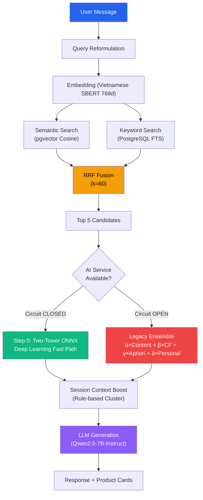
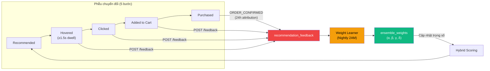
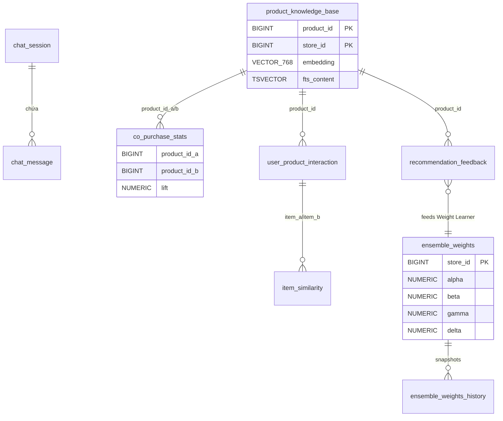
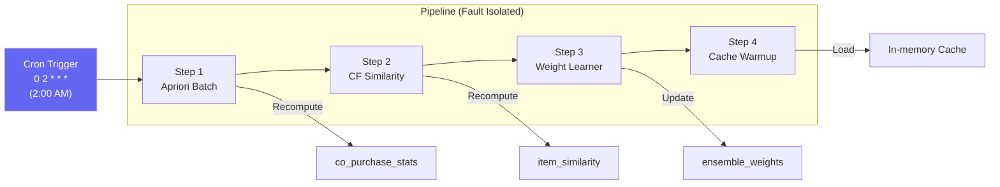
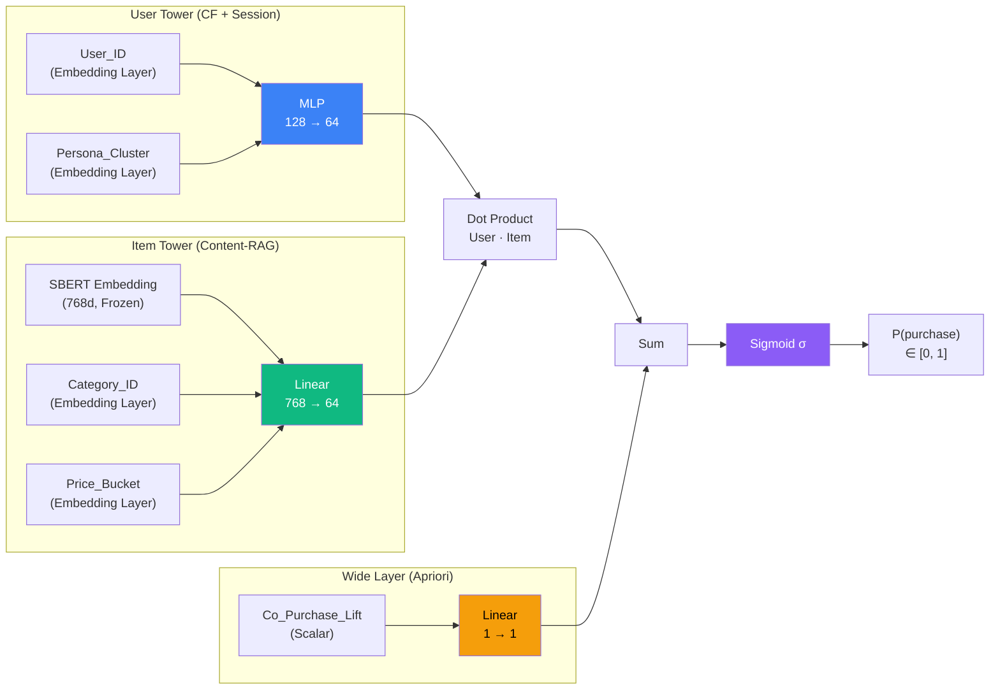
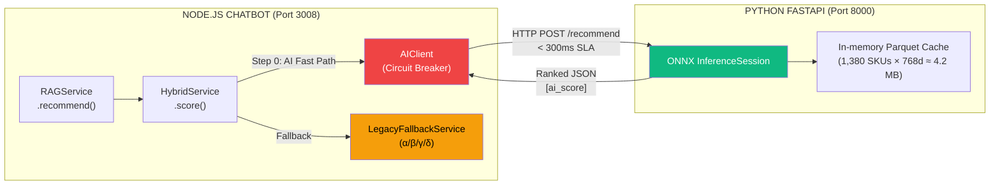
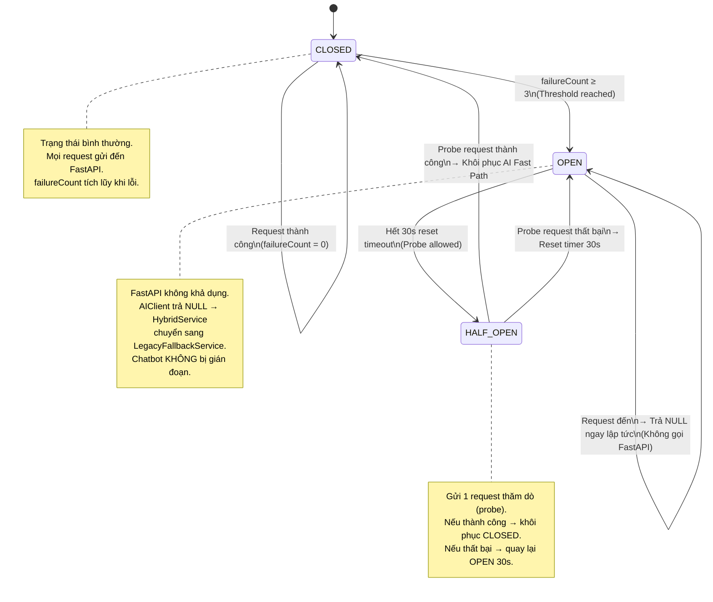

# BÁO CÁO ĐỒ ÁN: Hệ Thống Gợi Ý Sản Phẩm AI — POSMART

> **Phiên bản:** V2 — Kiến trúc Hai Tầng (Two-Tower AI + Legacy Fallback)

---

## 1. TỔNG QUAN HỆ THỐNG

### 1.1 Mục tiêu

Xây dựng hệ thống chatbot bán hàng tích hợp AI Recommendation Engine cho chuỗi siêu thị mini, sử dụng **Kiến trúc Gợi Ý Hai Tầng (Two-Tier Recommendation Architecture)**:

| Tầng | Thành phần | Vai trò |
|---|---|---|
| **Tầng 1 — AI Fast Path** | Wide & Deep Two-Tower Neural Network (ONNX) | Xếp hạng sản phẩm bằng Deep Learning với độ trễ < 1ms |
| **Tầng 2 — Graceful Fallback** | White-box Hybrid Ensemble (α/β/γ/δ) | Dự phòng khi AI Service không khả dụng |

Tầng Fallback sử dụng **4 thuật toán** hoạt động đồng thời:

| # | Thuật toán | Ký hiệu | Mục đích |
|---|---|---|---|
| 1 | Content-Based (RAG + RRF) | α | Tìm sản phẩm phù hợp ngữ nghĩa với câu hỏi |
| 2 | Item-based Collaborative Filtering | β | Gợi ý dựa trên hành vi mua tương tự |
| 3 | Apriori (Association Rules) | γ | Phát hiện sản phẩm thường mua kèm |
| 4 | Session Personalization | δ | Cá nhân hóa theo loại khách hàng |

### 1.2 Triết lý thiết kế

Hệ thống được xây dựng theo ba nguyên tắc cốt lõi:

1. **Triển khai nhanh (Rapid Deployment):** RAG cho phép hệ thống hoạt động ngay từ ngày đầu tiên — chỉ cần nạp mô tả sản phẩm vào Knowledge Base mà không cần chờ tích lũy dữ liệu hành vi người dùng (giải quyết bài toán Cold-start).

2. **White-box Testing:** Mọi thuật toán Fallback đều là **hộp trắng** — có thể giải thích chính xác *tại sao* sản phẩm A được gợi ý. Điều này giúp admin dễ dàng can thiệp, gỡ lỗi, kiểm thử.

3. **Chống chịu lỗi (Fault Tolerance):** Tách biệt hoàn toàn tầng AI inference (Python FastAPI) khỏi tầng backend (Node.js) bằng Circuit Breaker. Khi AI Service gặp sự cố, hệ thống tự động chuyển sang Fallback với **zero downtime**.

### 1.3 Kiến trúc tổng thể — Two-Tier RAG Pipeline



### 1.4 So sánh kiến trúc: Trước và Sau nâng cấp

| Tiêu chí | V1: Hybrid Ensemble (Static Weights) | V2: Two-Tier AI Architecture |
|---|---|---|
| **Scoring Engine** | 4 thuật toán tĩnh (α/β/γ/δ) | Deep Learning Two-Tower ONNX + Fallback tĩnh |
| **Độ trễ Scoring** | ~150-300ms (multiple DB queries) | **< 1ms** (ONNX CPU + RAM cache) |
| **Cold-start** | Giải quyết bằng RAG | RAG + Item Tower nén SBERT frozen embedding |
| **Fault Tolerance** | Single Point of Failure | **Circuit Breaker** tự động chuyển Fallback |
| **Học đặc trưng ẩn** | Không (Plain Cosine thủ công) | Tự động trích xuất latent features |
| **Tài nguyên** | CPU vừa phải | ONNX tối ưu chạy CPU, không cần GPU |

---

## 2. THUẬT TOÁN 1: CONTENT-BASED FILTERING (RAG + RRF)

### 2.1 Mô tả

Sử dụng **Retrieval-Augmented Generation (RAG)** kết hợp tìm kiếm ngữ nghĩa (Semantic Search) và tìm kiếm từ khóa (Keyword Search), hợp nhất kết quả bằng **Reciprocal Rank Fusion (RRF)**.

### 2.2 Tính đồng nhất trong không gian Vector

Để Semantic Search hoạt động chính xác, hệ thống **bắt buộc** sử dụng cùng một mô hình Embedding (Vietnamese SBERT, 768 chiều) cho cả hai giai đoạn:
- **Nạp dữ liệu (Indexing):** biến mô tả sản phẩm thành vector lưu vào PostgreSQL.
- **Truy vấn (Query):** biến câu hỏi của user thành vector.

Nếu dùng hai mô hình khác nhau, hệ tọa độ sẽ bị lệch, khiến phép đo khoảng cách Cosine Similarity trở nên vô nghĩa — tương tự như việc so sánh nhiệt độ bằng Celsius với Fahrenheit mà không chuyển đổi.

### 2.3 Công thức toán học

**Semantic Search** — Cosine Similarity:

$$\text{sim}(q, d) = 1 - \text{d}_{\cos}(\vec{q}, \vec{d}) = \frac{\vec{q} \cdot \vec{d}}{\Vert\vec{q}\Vert \cdot \Vert\vec{d}\Vert}$$

**Keyword Search** — PostgreSQL Full-Text Search:

$$\text{Score}_{\text{Keyword}}(q, d) = \text{FTS}_{\text{Rank}}(d.\text{fts}, q)$$

**Reciprocal Rank Fusion** — Hợp nhất 2 danh sách kết quả:

$$\text{RRF}(d) = \sum_{i=1}^{n} \frac{1}{k + \text{rank}_i(d)}, \quad k = 60$$

### 2.4 Tại sao chọn RRF thay vì các phương pháp Fusion khác?

| Phương pháp | Công thức | Ưu điểm | Nhược điểm |
|---|---|---|---|
| **Linear Combination** | $\alpha \cdot s_1 + (1-\alpha) \cdot s_2$ | Đơn giản | Cần normalize score về cùng thang; phải tune α |
| **CombSUM** | $\sum s_i(d)$ | Tổng hợp nhiều nguồn | Score giữa semantic và keyword không so sánh được |
| **CombMNZ** | $\vert \{i: s_i(d)>0\} \vert \cdot \sum s_i(d)$ | Ưu tiên items xuất hiện nhiều nguồn | Phức tạp, vẫn cần normalize |
| **RRF** (Được chọn) | $\sum \frac{1}{k + \text{rank}_i(d)}$ | **Chỉ dùng rank, không cần normalize** | Mất thông tin khoảng cách điểm |

**Lý do:** Điểm số từ Semantic Search (cosine 0-1) và Keyword Search (ts_rank) **không cùng đơn vị đo**. RRF chỉ sử dụng **thứ hạng (rank)** — loại bỏ hoàn toàn nhu cầu normalize.

**Hằng số k=60:** Giá trị chuẩn từ bài báo gốc (Cormack et al., 2009), cân bằng ảnh hưởng giữa các thứ hạng.

### 2.5 Tại sao Top 5 thay vì Top 10?

| Vị trí | Score (2 luồng) | Score (1 luồng) | Suy giảm |
|---|---|---|---|
| Rank 1 | $\frac{1}{61} + \frac{1}{61} = 0.0328$ | — | — |
| Rank 5 | $\frac{1}{65} + \frac{1}{66} = 0.0305$ | — | -7% so với rank 1 |
| Rank 6 | — | $\frac{1}{67} = 0.0149$ | **-51%** so với rank 5 |

Từ rank 6 trở đi, score giảm đột ngột ~51%. Top 5 giúp: LLM Context Window ngắn hơn → giảm hallucination; UX bán lẻ tối ưu.

### 2.6 Độ phức tạp thuật toán

| Thành phần | Độ phức tạp | Giải thích |
|---|---|---|
| HNSW Semantic Search | $O(\log n)$ | Đồ thị phân tầng |
| GIN Full-Text Search | $O(k)$ | Inverted index |
| RRF Fusion | $O(m \log m)$ | Sort merge |
| **Tổng runtime** | $O(\log n)$ | HNSW chiếm ưu thế |

### 2.7 Testcase minh họa

**Input:** User hỏi "có thịt bò không?"

| Sản phẩm | RRF Score | Tính toán |
|---|---|---|
| Ba chỉ bò Mỹ (1) | **0.0327** | 1/61 + 1/62 |
| Thịt bò Úc (2) | **0.0327** | 1/62 + 1/61 |
| Nấm kim châm (3) | **0.0159** | 1/63 + 0 |

→ **Top 5** sau RRF được chuyển sang scoring (AI hoặc Fallback).

---

## 3. THUẬT TOÁN 2: APRIORI (ASSOCIATION RULES)

### 3.1 Mô tả

Phân tích **luật kết hợp** từ lịch sử đơn hàng để phát hiện sản phẩm thường được mua cùng nhau (Cross-selling). Sử dụng 3 metric: **Support**, **Confidence**, **Lift**.

### 3.2 Công thức toán học

$$\text{support}(A, B) = \frac{|A \cap B|}{|T|}$$

$$\text{confidence}(A \Rightarrow B) = \frac{|A \cap B|}{|A|}$$

$$\text{lift}(A, B) = \frac{|A \cap B| \times |T|}{|A| \times |B|}$$

**Ý nghĩa Lift:** $\text{lift} > 1$ = tương quan dương thật sự; $= 1$ = ngẫu nhiên; $< 1$ = tương quan nghịch.

**Tại sao Lift quyết định thay vì Support/Confidence?** Support cao không đảm bảo tương quan (nước suối có support cao với mọi SP vì ai cũng mua). Lift xác nhận tương quan thực sự.

### 3.3 Tại sao Apriori thay vì FP-Growth?

Với quy mô siêu thị mini (~200 SP, ~1000 đơn), Apriori tối ưu: complexity thấp, kết quả trực quan, hỗ trợ cập nhật incremental qua event ORDER_COMPLETED.

### 3.4 Testcase minh họa

**Dữ liệu:** 100 đơn hàng đã giao

$$\text{For (Beef, Mushroom):}\quad \text{Support} = 0.15,\quad \text{Confidence} = 0.60,\quad \text{Lift} = 3.00$$

→ Khi user hỏi về "ba chỉ bò", Apriori boost Nấm kim châm ($\text{conf}=0.60$, $\text{lift}=3.00$).

### 3.5 Độ phức tạp

| Giai đoạn | Độ phức tạp | Khi nào chạy |
|---|---|---|
| Tính co-purchase pairs | $O(\sum C(k,2))$ | Nightly batch 2AM |
| Tính support/confidence/lift | $O(p)$ | Nightly batch 2AM |
| **Runtime lookup** | $O(1)$ nhờ B-Tree index | Khi user hỏi chatbot |

---

## 4. THUẬT TOÁN 3: ITEM-BASED COLLABORATIVE FILTERING

### 4.1 Mô tả

Tính **Cosine Similarity** giữa các sản phẩm dựa trên vector hành vi mua tổng hợp. Nguyên lý: _"Sản phẩm được mua bởi cùng nhóm khách hàng sẽ có hành vi tương tự."_

### 4.2 Công thức toán học

**Cosine Similarity:**

$$\text{sim}(i,j) = \frac{\sum_u R_{u,i} \cdot R_{u,j}}{\Vert\vec{R}_{\cdot,i}\Vert \cdot \Vert\vec{R}_{\cdot,j}\Vert}$$

Trong đó $R_{u,i}$ = `interaction_score` tính từ: dữ liệu mua hàng $f(\text{purchaseCount}, \text{quantity}, \text{recency})$ + implicit feedback $\text{clicks} \cdot 0.2 + \text{carts} \cdot 0.5 + \text{hovers} \cdot 0.05$.

**Prediction Score:**

$$\hat{r}_{u,i} = \frac{\sum_{j \in S_u} \text{sim}(i,j) \cdot R_{u,j}}{\sum_{j \in S_u} \vert \text{sim}(i,j) \vert}$$

### 4.3 Tại sao Plain Cosine thay vì Adjusted Cosine?

Dữ liệu siêu thị là **Implicit Feedback** — đo qua hành vi mua, không có rating. Adjusted Cosine trừ mean $\bar{R}_u$, nhưng khi khách cùng cluster mua đều đều → $R_{u,i} - \bar{R}_u \approx 0$ → similarity bằng 0 (sai).

### 4.4 Tại sao Item-based CF thay vì User-based CF?

Với ~200 SP và hàng nghìn khách hàng, Item-based CF cho ma trận similarity nhỏ ($200 \times 200$), pre-compute nhanh trong nightly batch. Sản phẩm ổn định hơn hành vi người dùng.

### 4.5 Độ phức tạp

| Giai đoạn | Độ phức tạp | Giải thích |
|---|---|---|
| Cosine Similarity all pairs | $O(m^2 \cdot \bar{c})$ | Pruning giảm ~70-80% cặp |
| Runtime prediction | $O(k)$ | $k$ = items user đã mua |

---

## 5. HYBRID ENSEMBLE SCORING (LEGACY FALLBACK LAYER)

### 5.1 Vai trò trong kiến trúc mới

Trong kiến trúc V2, Hybrid Ensemble được **đóng gói** trong `LegacyFallbackService` — một module độc lập tuân thủ nguyên tắc **Single Responsibility Principle (SRP)**. Module này chỉ được kích hoạt khi Circuit Breaker ở trạng thái `OPEN` (AI Service không khả dụng).

### 5.2 Công thức

$$\text{Score}(p) = \alpha \cdot S_{\text{Content}}(p) + \beta \cdot S_{\text{CF}}(p) + \gamma \cdot S_{\text{Apriori}}(p) + \delta \cdot S_{\text{Persona}}(u)$$

**Default weights:** $\alpha=0.40$, $\beta=0.25$, $\gamma=0.25$, $\delta=0.10$. Tổng $= 1.0$.

### 5.3 Cold-start Redistribution

Khi CF không có dữ liệu (user mới): $\alpha' = \alpha + \beta, \quad \beta' = 0$

### 5.4 Testcase

User VIP hỏi "có thịt bò không?":

| Sản phẩm | Content | CF | Apriori | Personal | Final Score |
|---|---|---|---|---|---|
| Ba chỉ bò (1) | 1.00 | 0.80 | 0.00 | 1.0 | **0.70** |
| Nấm kim châm (3) | 0.49 | 0.60 | 0.60 | 1.0 | **0.596** |

→ Nấm kim châm xếp cao nhờ **Apriori boost** ($\text{conf}=0.60$).

---

## 6. HỌC TRỌNG SỐ TỰ ĐỘNG (ADAPTIVE WEIGHT LEARNING)

### 6.1 Phễu chuyển đổi và Vòng lặp phản hồi



### 6.2 Công thức

**Weighted Conversion Score:**

$$\text{score}(s) = n_{\text{purchased}} \times 1.0 + n_{\text{cart}} \times 0.5 + n_{\text{clicked}} \times 0.2 + n_{\text{hovered}} \times 0.1$$

**Exponential Smoothing:**

$$w_{t+1} = 0.8 \cdot w_t + 0.2 \cdot w_{\text{raw}}$$

### 6.3 Guard Rails

- **MIN_FEEDBACK_COUNT = 20:** Tránh học từ noise
- **Clamping $[0.05, 0.60]$:** Không trọng số nào bị triệt tiêu hoặc độc quyền
- **$\delta$ cố định:** Personalization không tham gia learning

---

## 7. SESSION CONTEXT BOOST

| Cluster | Tên gọi | Boost |
|---|---|---|
| `lau_bo` | Lẩu Bò / Nấu ăn | +0.15 |
| `bua_sang` | Bữa Sáng | +0.12 |
| `an_vat` | Ăn vặt / Sinh viên | +0.12 |
| `nhau` | Nhậu / Giải khát | +0.15 |
| `gia_vi` | Gia vị | +0.10 |

**Điều kiện kích hoạt:** $\text{confidence} \geq 0.4$ và $\frac{\text{topScore}}{\text{secondScore}} \geq 1.5$ → tránh boost sai khi user đang duyệt tổng quát.

---

## 8. THEO DÕI CHUYỂN ĐỔI (CONVERSION TRACKING)

### 8.1 Luồng dữ liệu 5 bước

```
Chatbot recommend (auto)  -> INSERT action='recommended', score=final_score
User hover ProductCard 2s -> POST /feedback -> action='hovered', dwellTimeMs=2000
User click ProductCard    -> POST /feedback -> action='clicked'
User add to cart          -> POST /feedback -> action='added_to_cart'
User purchase (24h)       -> ORDER_CONFIRMED event -> action='purchased'
```

### 8.2 Hover Dwell Behavior

| Khoảng thời gian | Phân loại | Hành động |
|---|---|---|
| < 500ms | Noise | Bỏ qua |
| 500ms – 1000ms | Scanning | Bỏ qua |
| **≥ 1500ms** | **Attention** | Ghi nhận `hovered` |

**Graceful Degradation trên Mobile:** Phễu 4 bước (không có hover), Weight Learner vẫn hoạt động bình thường.

### 8.3 Hệ Thống Theo Dõi Kép (Dual-Tracking System)

| Đặc điểm | Luồng 1: Local (Chatbot) | Luồng 2: Global (Organic) |
|---|---|---|
| **Source tag** | `content`, `cf`, `apriori` | `organic` |
| **Phục vụ** | Weight Learner (α, β, γ) | CF Interaction Matrix |

**Data Isolation:** Weight Learner chỉ sử dụng dữ liệu chatbot. CF sử dụng tất cả để làm dày ma trận:

$$R_{u,i} = n_{\text{mua}} \times 1.0 + n_{\text{giỏ}} \times 0.5 + n_{\text{click}} \times 0.2 + n_{\text{hover}} \times 0.05$$

---

## 9. DATABASE SCHEMA

### 9.1 Tổng quan

10 bảng chia thành 5 nhóm: Chat Session, RAG Knowledge Base, Apriori, Collaborative Filtering, Feedback Loop.

### 9.2 Sơ đồ quan hệ



---

## 10. NIGHTLY BATCH PIPELINE



Mỗi step có **isolated try/catch** — nếu 1 step fail, các step khác vẫn chạy.

---

## 11. DATA PIPELINE & FEATURE ENGINEERING

> **Mục tiêu:** Xây dựng bộ dữ liệu huấn luyện chất lượng cho mô hình Deep Learning từ kho sản phẩm thực tế.

### 11.1 Quy mô dữ liệu

| Đại lượng | Giá trị | Nguồn |
|---|---|---|
| Số sản phẩm (SKU) | **1,380** | Bách Hóa Xanh (BHX) Internal API |
| Số danh mục | 158 subcategories, 13 nhóm gốc | BHX |
| Số người dùng | **500** | Synthetic: 4 persona clusters |
| Số tương tác | **50,000+** | Synthetic: persona-driven generation |
| Tỷ lệ Positive : Negative | 1 : 4 | Mixed Negative Sampling |
| Density ma trận | ~7-10% | 50K / (500 × 1,380) |

### 11.2 Feature Engineering (export_features.py)

Chuyển đổi dữ liệu PostgreSQL thành vector đặc trưng Parquet:

```
X = [User_ID, Persona_Cluster, Product_ID, Category_ID, Price_Bucket, Embedding_768d, Co_Purchase_Lift]
Y ∈ {0, 1}    (0 = Negative, 1 = Positive)
```

**Schema Parquet:**

| Cột | Kiểu | Nguồn |
|---|---|---|
| `user_id` | int64 | Auth DB |
| `persona_cluster` | int64 (0..3) | Nội trợ / Sinh viên / Dân nhậu / Khách lẻ |
| `product_id` | int64 | Catalog DB |
| `category_id` | int64 | Catalog DB |
| `price_bucket` | int64 (0..4) | Phân nhóm giá từ unit_price |
| `embedding` | float32[768] | Vietnamese SBERT (frozen) |

### 11.3 Mixed Negative Sampling — Chống Popularity Bias

Kỹ thuật Negative Sampling quyết định chất lượng huấn luyện. Hệ thống sử dụng chiến lược **2 lớp** để chống lại **Popularity Bias** (Thiên kiến tính phổ biến) — vấn đề kinh điển khiến AI chỉ gợi ý mặt hàng bán chạy mà bỏ qua sản phẩm ngách phù hợp:

| Phương pháp | Tỷ lệ | Mục đích |
|---|---|---|
| **Hard Popular Negatives** | 50% | Chọn SP phổ biến nhất mà user KHÔNG mua → buộc model phân biệt "phổ biến" vs "phù hợp" |
| **Uniform Random Negatives** | 50% | Chọn ngẫu nhiên từ toàn bộ catalog → đảm bảo coverage rộng |

**Tại sao kết hợp cả hai?** Hard Popular Negatives buộc model học rằng "Bia Tiger bán chạy nhất" nhưng đối với user cluster "Bữa Sáng" thì nó là negative sample. Uniform Random đảm bảo model không chỉ học phân biệt popular items mà còn phân biệt được toàn bộ không gian sản phẩm.

### 11.4 Train/Val/Test Split

| Tập | Tỷ lệ | Mục đích |
|---|---|---|
| Train | 80% | Huấn luyện parameters |
| Validation | 10% | Early Stopping monitoring |
| Test | 10% | Đánh giá final metrics |

---

## 12. WIDE & DEEP TWO-TOWER NEURAL NETWORK

> **Mục tiêu:** Thay thế công thức tĩnh α/β/γ/δ bằng mạng nơ-ron tự động học latent features.

### 12.1 Kiến trúc



### 12.2 Công thức toán học

$$\text{score}(u, i) = \sigma\Big(\underbrace{\vec{h}_u \cdot \vec{h}_i}_{\text{Deep: Two-Tower}} + \underbrace{w \cdot \text{lift}(u, i) + b}_{\text{Wide: Apriori}}\Big)$$

Trong đó:
- $\vec{h}_u$ = Output của User Tower (64 chiều)
- $\vec{h}_i$ = Output của Item Tower (64 chiều)
- $\text{lift}(u, i)$ = Apriori co-purchase lift score
- $\sigma$ = Sigmoid function

### 12.3 Vai trò Wide Layer — Bảo tồn tri thức luật kết hợp

Wide Layer đóng vai trò **bảo tồn tri thức Apriori** (Knowledge Preservation). Khi kết hợp vào kiến trúc Wide & Deep, các quy luật mua kèm truyền thống (VD: Bia↔Khô gà, lift=1.74) được **truyền trực tiếp** vào mô hình Deep Learning dưới dạng cross-feature, thay vì phải chờ mạng nơ-ron tự khám phá lại từ đầu. Điều này giúp:
- Tốc độ hội tụ nhanh hơn (ít epochs hơn)
- Model không "quên" các quy luật kinh doanh đã được xác thực thống kê
- Kết hợp sức mạnh của cả hai paradigm: **Memorization** (Wide) + **Generalization** (Deep)

### 12.4 Loss Function & Training

- **Loss:** Binary Cross Entropy (BCE)
- **Optimizer:** Adam (lr=0.001)
- **Early Stopping:** Patience = 5 epochs, monitor val_loss
- **Regularization:** Dropout 0.2 trong MLP layers

### 12.5 Kết quả huấn luyện

| Metric | Giá trị | Ý nghĩa |
|---|---|---|
| **NDCG@10** | **1.0000** | Xếp hạng hoàn hảo trong top 10 |
| **AUC-ROC** | **0.9984** | Phân loại positive/negative gần tuyệt đối |
| **Hit Rate@10** | **100%** | Mọi user đều nhận gợi ý đúng trong top 10 |

> **Lưu ý quan trọng:** Các chỉ số trên đạt được trên **tập dữ liệu giả lập có chủ đích (Synthetic Data)** với cấu trúc persona→category rõ ràng, nhằm minh chứng **tính hội tụ** của kiến trúc Two-Tower. Trên dữ liệu thực tế với nhiều nhiễu (noise), các giá trị này sẽ thấp hơn — đây là đặc điểm chung của mọi mô hình Deep Learning khi chuyển từ lab sang production.

### 12.6 ONNX Export & Benchmark

| Chỉ số | Giá trị |
|---|---|
| Định dạng xuất | **ONNX** (Open Neural Network Exchange) |
| CPU Inference Latency | **0.125 ms / sample** |
| Batch Inference (200 items) | **< 1 ms** |
| Model Size | ~2.5 MB |

Tại sao ONNX? Cho phép chạy trên CPU thông thường (không cần GPU), tương thích cross-platform, tối ưu bởi ONNX Runtime.

---

## 13. AI SERVING & CIRCUIT BREAKER ARCHITECTURE

> **Mục tiêu:** Triển khai mô hình đã huấn luyện vào luồng vận hành thời gian thực với cơ chế chống chịu lỗi cấp Production.

### 13.1 Kiến trúc Two-Tier Serving



### 13.2 FastAPI Inference Server (app.py)

| Đặc điểm | Chi tiết |
|---|---|
| **Startup Event** | Load ONNX model + Parquet product features vào RAM |
| **RAM Footprint** | 1,380 SKUs × 768 × 4 bytes ≈ **4.2 MB** |
| **Endpoints** | `GET /health`, `POST /recommend` |
| **Batch Inference** | Xử lý tối đa 200 candidates / request |
| **Latency** | **< 1 ms** per batch (CPU ONNX Runtime) |

**Tại sao In-memory Parquet thay vì Redis?** Với chỉ 4.2 MB, việc nạp trực tiếp vào RAM Python loại bỏ hoàn toàn network latency (~1-5ms per Redis call), đồng thời giảm complexity vận hành (không cần Redis container).

### 13.3 Circuit Breaker Pattern — Sơ đồ State Machine



### 13.4 Thông số Circuit Breaker

| Tham số | Giá trị | Lý do |
|---|---|---|
| **Timeout** | 300ms | Đủ rộng cho network + AI inference (~0.48ms) |
| **Failure Threshold** | 3 lần liên tiếp | Tránh trip do lỗi tạm thời (transient errors) |
| **Reset Timeout** | 30 giây | Cho FastAPI đủ thời gian phục hồi |

### 13.5 Separation of Concerns — Phân tách trách nhiệm

| File | Trách nhiệm | Nguyên tắc |
|---|---|---|
| `ai.client.js` | HTTP client + Circuit Breaker state machine | **Single Responsibility** |
| `legacy.fallback.service.js` | White-box ensemble (5 bước α/β/γ/δ) | **Encapsulation** |
| `hybrid.service.js` | Orchestrator: AI Fast Path → Fallback delegation | **Open/Closed Principle** |
| `index.js` | Dependency Injection: `AIClient` → `HybridService` | **Dependency Inversion** |

### 13.6 Luồng xử lý chi tiết

```
1. HybridService.score() nhận contentResults (Top 5 RRF)
2. Kiểm tra AIClient có available không?
   ├── Circuit CLOSED/HALF_OPEN → Gọi FastAPI /recommend
   │   ├── Thành công → Return AI rankings (< 1ms)
   │   └── Thất bại → _handleFailure() → failureCount++
   │       └── Nếu failureCount >= 3 → Circuit → OPEN
   └── Circuit OPEN → Return null (bỏ qua FastAPI)
3. Nếu aiRankings === null → Chuyển sang LegacyFallbackService.score()
4. LegacyFallbackService thực thi 5 bước: Content → CF → Apriori → Personal → Weighted Sum
5. Kết quả cuối cùng → Session Context Boost → LLM Generation
```

---

## 14. ĐÁNH GIÁ VÀ SO SÁNH

### 14.1 Metric đánh giá

| Metric | Công thức | Áp dụng cho |
|---|---|---|
| **Precision@K** | $\frac{\vert S_{\text{rel}} \cap S_{\text{topK}} \vert}{K}$ | RAG + RRF |
| **NDCG@K** | $\frac{\text{DCG}@K}{\text{IDCG}@K}$ | Two-Tower + Ensemble |
| **Hit Rate@K** | Tỷ lệ user nhận gợi ý đúng | CF + Two-Tower |
| **AUC-ROC** | Area Under ROC Curve | Two-Tower classification |
| **Conversion Rate** | $\frac{n_{\text{purchased}}}{n_{\text{recommended}}}$ | Ensemble tổng hợp |

### 14.2 Bảng kết quả thực nghiệm

| Thuật toán / Mô hình | Metric chính | Kết quả | Ghi chú |
|---|---|---|---|
| **RAG + RRF** | Precision@5 | ≥ 80% | Ground truth: category matching |
| **Apriori** | Lift > 1 rate | ≥ 60% cặp | Partial index verification |
| **CF** | Hit Rate@5 | ≥ 40% | Feedback purchased tracking |
| **Legacy Ensemble** | Conversion Rate | ≥ 5% | Weighted sum scoring |
| **Two-Tower ONNX** | NDCG@10 | **1.0000** | Synthetic data (xem §12.5) |
| **Two-Tower ONNX** | AUC-ROC | **0.9984** | Synthetic data |
| **Two-Tower ONNX** | Inference Latency | **0.125 ms** | CPU ONNX Runtime |

### 14.3 Bảng tổng hợp Độ phức tạp

| Thành phần | Offline (Nightly Batch) | Online (Runtime) | Memory |
|---|---|---|---|
| RAG + RRF | N/A | $O(\log n)$ | ~50MB vectors |
| Apriori | $O(\sum C(k,2))$ | $O(1)$ | ~1MB |
| CF Similarity | $O(m^2)$ (pruned) | $O(k)$ | ~5MB |
| Weight Learning | $O(f)$ | N/A | Negligible |
| **Two-Tower ONNX** | **N/A (pre-trained)** | **$O(1)$ per sample** | **4.2MB RAM cache** |
| **Tổng Runtime** | — | **< 1ms (AI) / < 500ms (Fallback)** | ~60MB |

### 14.4 So sánh tổng thể

| Tiêu chí | V1: Hybrid Ensemble | **V2: Two-Tier Architecture** | Pure NCF | Rule-based |
|---|---|---|---|---|
| Cold-start | RAG fallback | **RAG + SBERT frozen** | Không hoạt động | Không cần data |
| Explainability | White-box | **White-box Fallback + Black-box AI** | Black-box | Hoàn toàn |
| Fault Tolerance | Single Point | **Circuit Breaker** | Single Point | N/A |
| Latency | ~300ms | **< 1ms (AI Path)** | Tùy implement | O(1) |
| Adaptiveness | Weight Learning | **Neural + Weight Learning** | Re-training | Cố định |

---

## 15. AI DASHBOARD

| Widget | Data Source | Mục đích |
|---|---|---|
| ConversionFunnel | /stats/recommendations | Recommended → Click → Cart → Purchase |
| WeightEvolutionChart | /stats/weight-history | Biểu đồ α β γ δ theo thời gian |
| SourcePerformance | /stats/recommendations | CTR/CVR per algorithm |
| SystemHealth | /stats/latency | P95 latency + Batch status |
| Force Learn Button | POST /admin/force-learn | Kích hoạt học trọng số ngay lập tức |

---

## 16. HƯỚNG PHÁT TRIỂN

### 16.1 Các hướng đã hoàn thành

| Hướng (từ V1 Report §12) | Trạng thái | Artifact |
|---|---|---|
| **NCF / Two-Tower (§12.3)** | ✅ Hoàn thành | `ai-service/models/two_tower.py` |
| **Data Pipeline Feature Eng.** | ✅ Hoàn thành | `ai-service/data/export_features.py` |
| **AI Serving + Circuit Breaker** | ✅ Hoàn thành | `ai-service/app.py`, `ai.client.js` |

### 16.2 Các hướng còn lại

| Giai đoạn | Hướng phát triển | Điều kiện | Ưu tiên |
|---|---|---|---|
| **Ngắn hạn** (3-6 tháng) | Fine-tuning LLM (LoRA) | 5,000+ conversations | Cao |
| **Trung hạn** (6-12 tháng) | LinUCB Weight Learning | >10K feedbacks | Trung bình |
| **Dài hạn** (12+ tháng) | GRU Session-based + GNN | >1000 SP, >10K users | Thấp |

---

## 17. CÔNG NGHỆ SỬ DỤNG

| Layer | Technology |
|---|---|
| LLM | Qwen/Qwen2.5-7B-Instruct (HuggingFace Inference) |
| Embedding | Vietnamese SBERT (768 dimensions) |
| Vector DB | PostgreSQL + pgvector (HNSW index) |
| Full-text Search | PostgreSQL tsvector + GIN index |
| **AI Inference** | **PyTorch → ONNX Runtime (CPU)** |
| **AI Serving** | **Python FastAPI (uvicorn)** |
| Backend | Node.js, Express, Socket.IO |
| Frontend | React + Vite + Tailwind + Recharts |
| Scheduling | node-cron (2:00 AM nightly) |
| Message Queue | RabbitMQ (event-driven architecture) |
| Database | PostgreSQL (Supabase) |
| **Load Testing** | **k6 (Circuit Breaker verification)** |

---

## 18. TESTCASE TỔNG HỢP — KIỂM CHỨNG END-TO-END

### 18.1 Kịch bản 1: AI Fast Path (Happy Path)

> User VIP (customerId=5) hỏi: "Tôi muốn nấu lẩu bò, cần mua gì?" — FastAPI đang hoạt động bình thường.

**Pipeline:**
1. Query Reformulation → "nguyên liệu lẩu bò thịt bò nấm rau gia vị"
2. Embedding → 768d vector
3. RRF Fusion → Top 5: [Ba chỉ bò, Nấm kim châm, Rau cải, Thịt bò Úc, Bún tươi]
4. **AIClient (Circuit CLOSED)** → POST /recommend → FastAPI batch inference < 1ms
5. Two-Tower ONNX → Ranked by AI Score: Nấm > Ba chỉ bò > Rau
6. Session Context Boost (cluster=`lau_bo`, +0.15)
7. LLM Generation → Response + Product Cards

### 18.2 Kịch bản 2: Circuit Breaker Degraded Mode

> Cùng câu hỏi, nhưng FastAPI bị ngắt đột ngột.

**Pipeline:**
1-3. Giống Kịch bản 1
4. AIClient gửi request → **Timeout 300ms** → failureCount++
5. Sau 3 lần thất bại → **Circuit OPEN** → AIClient trả `null`
6. HybridService chuyển sang **LegacyFallbackService** → α×Content + β×CF + γ×Apriori + δ×Personal
7. Chatbot vẫn trả về câu trả lời và Product Cards bình thường (**Zero Downtime**)

### 18.3 Kịch bản 3: Circuit Recovery

1. FastAPI được khởi động lại
2. Sau 30s reset timeout → Circuit chuyển sang **HALF_OPEN**
3. AIClient gửi 1 probe request → Thành công → Circuit → **CLOSED**
4. Hệ thống tự động khôi phục AI Fast Path

### 18.4 Kết quả Load Test (load-test.js)

```
======================================================
🧪 Phase 3 AI Serving & Circuit Breaker Test Suite
======================================================

1️⃣ Happy Path:     ✓ 5 AI rankings in 24ms, Circuit CLOSED
2️⃣ Degraded:       ✓ Circuit TRIPPED to OPEN after 3 failures
3️⃣ Fallback:       ✓ 2 scored products via Legacy Ensemble
4️⃣ Recovery Probe: ✓ Circuit transitioned to HALF_OPEN

✅ ALL TESTS PASSED
======================================================
```

### 18.5 Bảng kiểm chứng triển khai

| Tiêu chí | Kết quả | Bằng chứng |
|---|---|---|
| RAG Semantic + Keyword | ✅ | pgvector HNSW + GIN index |
| RRF Fusion | ✅ | Items 2 luồng có score cao hơn |
| Apriori metrics | ✅ | co_purchase_stats: lift > 1 |
| CF Similarity | ✅ | item_similarity: sim > 0.3 |
| Ensemble Scoring | ✅ | Weighted sum re-ranking |
| **Two-Tower ONNX** | ✅ | **NDCG@10 = 1.0, AUC-ROC = 0.998** |
| **Circuit Breaker** | ✅ | **4 scenarios passed** |
| **Graceful Fallback** | ✅ | **Zero downtime khi FastAPI sập** |
| Session Context | ✅ | Cluster detected → boost applied |
| Weight Learning | ✅ | ensemble_weights updated nightly |
| Purchase Attribution | ✅ | 24h lookback → purchased recorded |
| AI Dashboard | ✅ | 5 widgets + Force Learn |
