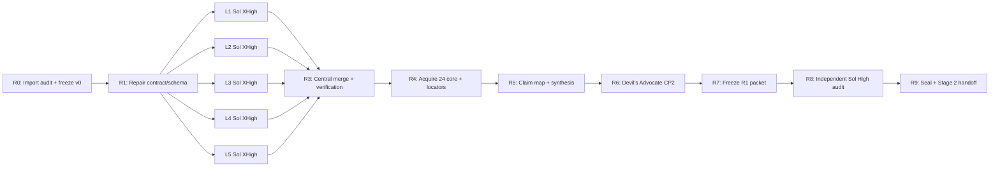

# Phase 1B Completion Plan — Sol XHigh Remediation Cycle R1

## 0. Trạng thái và quyết định điều phối

- Dự án: `hybrid-recsys-v5`.
- Phase: `1B — Targeted Literature Review`.
- Trạng thái đầu vào: independent audit đã trả `FAIL` với `0 fatal / 1 major / 4 minor / 3 advisory`.
- Packet cũ: còn nguyên vẹn `19/19` hash; được giữ làm bằng chứng `v0`, không sửa tại chỗ.
- Major blocker: H&M và Complete Journey bị gán năm vận hành vào trường publication year để thỏa schema.
- Citation blocker: `0/55` original sources được acquire/verify và `30/30` synthesis anchors là `anchor:none`.
- Quyết định model mới: tất cả `L1–L5` chạy lại bằng `gpt-5.6-sol`, reasoning `xhigh`.

Checkpoint `2026-08-21`: R3 đã `PASS`; R4 đã `PASS`, được nhập về workspace trung tâm và chạy lại validator `22/22 PASS`. Kết quả R4: core `24/24`, queue `13/13`, `22/22` conditional production candidates đủ acquisition + original-content + locator; R5 được phép bắt đầu, Stage 2 vẫn chưa được phép dùng production citations.

Model-policy override có hiệu lực từ R5: mọi stage/task chưa bắt đầu, gồm R5–R9 và các stage downstream, dùng `gpt-5.6-sol`, reasoning `high`. R4 giữ provenance `gpt-5.6-sol / xhigh`; không hồi tố thay nhãn model của L1–L5, R3 hoặc R4. R8 vẫn phải là fresh independent context dù dùng cùng model/reasoning với các stage khác.

Lưu ý provenance: `pipeline_state_stage1b_pre_audit.json` ghi L1–L4 dùng Tera XHigh và L5 đã dùng Sol XHigh. Tuy vậy, R1 vẫn chạy lại **đủ năm lane** bằng cùng model, cùng prompt contract và cùng gate để loại bỏ sai khác về model, schema và tiêu chuẩn kiểm chứng.

Kế hoạch này dùng định nghĩa hoàn thành mạnh hơn mức seal tối thiểu của audit:

1. Stage 1B phải được independent audit cho phép seal; và
2. bộ nguồn lõi phải locator-ready để Stage 2 có thể viết Introduction/Related Work mà không gặp lại citation gate.

## 1. Kết quả cuối cần đạt

Phase 1B chỉ được đánh dấu `COMPLETED` khi đồng thời đạt:

| Gate | Điều kiện bắt buộc |
|---|---|
| Corpus integrity | 45–55 scholarly sources canonical; operational resources được tách riêng; không placeholder metadata; không duplicate/ghost citation |
| Currency | Có tối thiểu 15 nguồn chất lượng cao giai đoạn 2022–2026; không tăng số lượng bằng nguồn ít liên quan |
| Identity | 100% nguồn accepted có source-of-record identity; DOI/venue/year/type/author được kiểm bằng nguồn chính thức hoặc authoritative metadata |
| Publication status | Peer-reviewed, preprint, editorial/essay, dataset/resource được phân loại có căn cứ; không suy từ uy tín venue |
| Source family | Amazon Reviews/RelBench, H&M/RelBench và mọi paper–repository–dataset lineage được ghi là phụ thuộc, không đếm như evidence độc lập |
| Core acquisition | 18–24 nguồn lõi; mục tiêu R1 là 24 nguồn theo audit shortlist; 100% được acquire hợp pháp hoặc có accepted-author/version-of-record artifact |
| Locator readiness | Mọi citation dự kiến dùng ở Introduction/Related Work có locator khác `none`; page locator chỉ dùng khi PDF preflight cho phép |
| Claim map | 100% claim rows có evidence scope, source key, locator, support verdict và forbidden extrapolation |
| Synthesis | Tích hợp theo assumption/signal/objective/evaluation; không serial summary; mọi convergence count phân biệt record count và independent source-family count |
| Empirical boundary | H1–H4 giữ `NOT_RUN`; không biến literature thành kết quả của hệ thống hiện tại |
| Independent audit | Fresh Sol High verdict `PASS` hoặc `PASS_WITH_MINOR`; `fatal=0`, `major=0`, `stage1b_seal_allowed=true`, `stage2_production_citations_authorized=true` |

Nếu seal research đạt nhưng locator gate chưa đạt, trạng thái chỉ được ghi:

`STAGE1B_RESEARCH_SEALED_STAGE2_CITATION_BLOCKED`

không được ghi `COMPLETED` theo kế hoạch R1 này.

## 2. Context và model topology

| Context/task | Model | Trách nhiệm | Không được làm |
|---|---|---|---|
| Chat trung tâm | Context hiện tại, điều phối | Khóa contract, dispatch, theo dõi, review handoff, quản lý state/checkpoint | Không tự đóng vai independent auditor |
| L1 | Sol XHigh | Evaluation, protocol, reproducibility | Không viết synthesis hoặc manuscript |
| L2 | Sol XHigh | Collaborative/deep/two-tower/wide/graph architectures | Không kết luận baseline nào thắng trên v5 |
| L3 | Sol XHigh | Basket, sequential, Apriori và hybrid precedent | Không dùng Wide & Deep để chứng minh Apriori hiệu quả |
| L4 | Sol XHigh | Cold-item, content, transfer | Không mở rộng cold-item thành cold-user |
| L5 | Sol XHigh | Vietnamese và external datasets/resources/rights | Không biến availability thành license hoặc H4 compatibility |
| Integration R1 | Sol XHigh, fresh context | Verification, deduplication, family map, corpus merge, claim map và synthesis | Không kế thừa confidence statement từ lane; chỉ đọc artifact/handoff |
| R5 synthesis | Sol High, fresh context | Rebuild claim map và Phase 3 synthesis từ frozen R3 + R4 | Không viết manuscript hoặc tự cấp quyền citation cho Stage 2 |
| Devil’s Advocate CP2 | Sol High, fresh context | Cherry-picking, contradiction, source-family dependence, strongest counterargument | Không sửa synthesis |
| R7 freeze | Sol High | Validate, hash và đóng băng packet R1 | Không audit hoặc tự seal |
| Independent re-audit | Sol High, fresh context | Audit packet, claim/source alignment, locator gate, verdict | Không sửa frozen R1 packet hoặc tự seal |
| R9 seal/handoff | Sol High, central context | Review machine verdict, seal và tạo handoff | Không override audit |

Mỗi lane giữ nguyên task xuyên suốt retrieval → follow-up → remediation để prompt cache và provenance không bị phân mảnh. Không hạ model giữa chừng.

## 3. Versioning và write scope

Không ghi đè các artifact `v0` hiện có. Toàn bộ R1 được tạo dưới:

```text
research/hybrid-recsys-v5/01_research/literature_review/remediation_r1/
├── 00_control/
│   ├── audit_import_manifest.json
│   ├── remediation_register.json
│   ├── lane_contract.md
│   ├── source_schema_r1.json
│   └── synthesis_invocation_ledger.json
├── phase2_investigation/
│   ├── lanes/
│   │   ├── L1/
│   │   ├── L2/
│   │   ├── L3/
│   │   ├── L4/
│   │   └── L5/
│   ├── source_registry_r1.json
│   ├── operational_resource_registry.json
│   ├── source_family_map.json
│   ├── deduplication_report_r1.md
│   ├── source_quality_matrix_r1.json
│   ├── source_verification_report_r1.md
│   ├── source_acquisition_manifest.json
│   ├── locator_registry.json
│   ├── literature_corpus_r1.json
│   ├── annotated_bibliography_r1.md
│   └── claim_source_map_r1.md
├── phase3_analysis/
│   ├── claim_intent_manifest_r1.json
│   ├── cross_paper_tensions_r1.json
│   ├── synthesis_report_r1.md
│   └── devils_advocate_checkpoint2_r1.md
├── audit/
│   ├── audit_packet_r1.md
│   ├── audit_manifest_r1.json
│   ├── independent_audit_report_r1.md
│   ├── audit_findings_r1.json
│   └── audit_verdict_r1.json
└── seal/
    ├── material_passport_stage1b_r1.json
    ├── pipeline_state_stage1b_r1.json
    └── stage1b_seal_r1.json
```

Original PDFs/HTML không được commit nếu license không cho phép. File nguồn có thể nằm trong local-only `source_artifacts/`; manifest, checksum, official URL, access date, license/terms và locator được lưu trong R1. Không vượt paywall hoặc né điều khoản truy cập.

## 4. Runbook theo thứ tự



### R0 — Import audit và đóng băng provenance

Hoạt động:

1. Copy ba output từ task audit độc lập vào audit directory chính.
2. Hash ba output và ghi task ID/model/runtime.
3. Tạo `remediation_register.json` với đủ tám finding IDs.
4. Đánh dấu packet cũ là `AUDITED_V0_SUPERSEDED_FOR_COMPLETION`, không xóa hoặc sửa.
5. Cập nhật pipeline state thành `stage1b_remediation_r1_planned`.

Gate:

- 8/8 findings có owner, remediation step, expected evidence và trạng thái `open`.
- Hash của 19 artifact cũ vẫn khớp audit manifest.
- Không có file v0 nào thay đổi.

### R1 — Sửa contract trước khi chạy lại lane

Quyết định schema:

1. `literature_corpus_r1.json` chỉ chứa scholarly works có publication year xác minh được.
2. H&M, Complete Journey, Coveo và các operational datasets/resources không có publication-year rõ ràng được đưa vào `operational_resource_registry.json`.
3. Không sửa schema ARS bằng cách phát minh nullable year nếu pipeline consumer vẫn yêu cầu numeric year.
4. Resource registry dùng các trường riêng: `resource_key`, `provider`, `resource_type`, `edition`, `release_year`, `operational_year`, `year_basis`, `official_url`, `accessed_at`, `terms_snapshot`, `dataset_rights`, `code_license`, `paper_license`, `redistribution_status`, `checksums`.
5. Khóa quy tắc đếm source family trước retrieval; record count và independent-family count luôn báo riêng.
6. Khóa encoding UTF-8 và cấm canonical strings chứa mojibake.

Gate:

- Không có trường year nào mang nghĩa “điền để qua schema”.
- Mọi field đều có provenance/basis hoặc `unknown`; không dùng giá trị suy đoán.
- `lane_contract.md` được hash trước khi dispatch L1–L5.

### R2 — Chạy lại năm lane bằng Sol XHigh

Năm task chạy song song sau khi R1 gate pass. Output cũ chỉ là candidate index, không phải ground truth.

#### Contract chung cho mỗi lane

Mỗi lane phải:

1. đọc ARS root skill, `deep-research/WORKFLOW.md`, `bibliography_agent.md` và `source_verification_agent.md`;
2. đọc Stage 1A RQ/estimand/methodology và lane contract R1;
3. disposition 100% nguồn lane cũ theo `RETAIN / REPLACE / REMOVE / MOVE_TO_RESOURCE_REGISTRY`;
4. chạy gap search đến ngày thực thi, ưu tiên primary/official sources;
5. kiểm DOI/title/authors/year/venue/document type/publication status bằng source-of-record;
6. phân biệt `identity_verified`, `metadata_verified`, `source_content_verified` và `locator_ready`;
7. acquire hợp pháp original/accepted-author artifact cho nguồn lõi có thể xác định ngay;
8. không dùng `et al.` trong canonical metadata;
9. ghi dependency/source-family và preprint→conference/journal version relation;
10. ghi counter-evidence, limitations và claims không được phép suy rộng;
11. không viết synthesis, Introduction, Related Work hoặc H1–H4 result;
12. chỉ ghi vào write scope của lane.

Mỗi lane tạo:

```text
lane_report.md
candidate_registry.json
disposition_log.json
claim_cards.json
source_acquisition_queue.json
exclusion_log.json
lane_handoff.json
```

Mỗi `claim_card` tối thiểu có:

```text
claim_id
claim_text_bounded
evidence_kind
source_keys
source_family_ids
support_scope
support_verdict
locator
locator_basis
forbidden_extrapolations
counter_evidence
planning_only
```

Lane không được PASS nếu claim dự kiến dùng trong production vẫn dựa duy nhất vào lane summary mà không có original-content locator.

#### L1 — Evaluation và reproducibility

Phải bao phủ:

- exact/full-catalog so với sampled metrics;
- temporal/random split và candidate-universe dependence;
- aggregation, tuning budget, negative sampling và reproducibility;
- official reproduction so với harmonized benchmark;
- Jannach–Chen 2026 phải được phân loại `editorial/essay`; peer review chỉ true khi có bằng chứng trực tiếp;
- Time to Split 2025 và các nguồn 2022–2026 liên quan.

Forbidden:

- raw metric từ hai dataset/pipeline khác nhau là comparison hợp lệ;
- public repository đồng nghĩa reproduced;
- Semantic Scholar 429 đồng nghĩa source không tồn tại.

#### L2 — Recommender architectures

Phải bao phủ:

- ItemCF/ItemKNN, BPR-MF, NCF/DeepFM;
- Two-Tower/candidate generation versus ranking;
- Wide & Deep: memorization/generalization boundary;
- LightGCN và graph/contrastive controls;
- architecture assumptions, input signals, objective và evaluation contract.

Forbidden:

- architecture paper ranking trực tiếp trên v5 khi chưa chạy harmonized benchmark;
- Wide & Deep chứng minh Apriori branch hiệu quả;
- graph sparse-edge improvement chứng minh zero-edge cold-item capability.

#### L3 — Basket, sequential và hybrid

Phải bao phủ:

- Apriori support/confidence và association-rule recommendation;
- SASRec/BERT4Rec/sequential objective;
- next-basket repeat/explore/novel-item behavior;
- Mask-Swap/BTBR hoặc các direct basket baselines phù hợp;
- hybrid precedent và ablation requirements.

Forbidden:

- Apriori là một ranking model nếu paper chỉ mô tả mining;
- literature plausibility là bằng chứng H3;
- aggregate basket gain đồng nghĩa novel-item gain;
- paper-native metric được chuyển thành benchmark hiện tại.

#### L4 — Cold-item, content và transfer

Phải bao phủ:

- item-side cold-start definition và cohort construction;
- DropoutNet/SBERT/UniSRec/VQ-Rec/AlphaRec;
- zero collaborative edge versus sparse edge;
- content encoder rationale versus recommender efficacy;
- transfer assumptions và target-domain adaptation.

Forbidden:

- cold-item = cold-user;
- SBERT quality = recommendation quality;
- architecture transfer = H4 replication;
- pretrain source và target dataset được coi là evidence độc lập nếu cùng lineage.

#### L5 — Vietnamese và external resources

Phải bao phủ:

- ViEcomRec, Vietnamese Food, ViHoRec và các nguồn Việt Nam thực sự liên quan;
- Amazon-M2, Complete Journey, Coveo, H&M/RelBench và external candidates;
- compatibility matrix: purchase outcome, persistent user, basket/session, timestamp, item content, split feasibility, candidate universe;
- bốn lớp quyền riêng biệt: availability, code/package license, paper license, dataset rights/redistribution;
- exact edition/revision/terms snapshot cho operational resources.

Forbidden:

- availability = redistribution permission;
- package CC0 = upstream provider grant;
- Amazon-M2 = strict H4 purchase replication;
- RelBench adapter = independent evidence so với upstream dataset;
- khẳng định prevalence ngoài tập candidates đã review.

### R3 — Central merge, verification và deduplication

Integration R1 chạy trong fresh Sol XHigh context sau khi cả năm lane pass local gate.

Thứ tự:

1. Validate toàn bộ lane JSON và lane handoff.
2. Merge candidate registries; không merge prose trước khi merge identities.
3. Deduplicate theo DOI, canonical title, source-of-record ID và version family.
4. Triangulate Semantic Scholar/OpenAlex/Crossref khi phù hợp; API degradation được ghi là degraded, không đổi thành unmatched.
5. Re-check thủ công mọi high-risk/non-Crossref/official-resource exception.
6. Tạo source-family map và báo cả canonical record count lẫn independent-family count.
7. Áp cùng inclusion/exclusion criteria lên nguồn cũ và nguồn mới.
8. Chốt corpus 45–55 scholarly sources; operational resources đứng ngoài corpus.
9. Recompute recent count, peer-reviewed count và grade distribution từ dữ liệu mới.
10. Chọn 18–24 core sources; mặc định giữ shortlist 24 của audit, chỉ thay khi source mới có coverage/chất lượng tốt hơn và ghi lý do.

Gate:

- duplicate canonical key/title/DOI = 0;
- dangling source key = 0;
- ghost citation = 0;
- placeholder year = 0;
- mojibake = 0;
- `peer_reviewed` có evidence basis cho 100% true values;
- source-family dependence được kiểm bằng invariant, không chỉ ghi trong prose.

### R4 — Acquire 24 nguồn lõi và tạo locator registry

Trạng thái: `PASS / COMPLETE` ngày `2026-08-21`. Bundle đã được nhập về context trung tâm; validator trung tâm đạt `22/22 PASS`. R5 được authorize, nhưng Stage 1B chưa seal và Stage 2 production citations vẫn bị khóa.

Baseline shortlist từ audit:

| Lane | Core sources |
|---|---|
| L1 | Krichene 2020; Li 2023 sampling; Zhao 2020 settings; Dacrema 2021; Jannach & Chen 2026 |
| L2 | Sarwar 2001; Rendle 2009; LightGCN 2020; YouTube Two-Tower 2016; Wide & Deep 2016 |
| L3 | SASRec 2018; Time to Split 2025; Apriori 1994; Multi-item Association Rules 2014; Hybrid Sequential Rules + CF 2009; Next Basket Reality Check 2023 |
| L4 | DropoutNet 2017; UniSRec 2022; AlphaRec 2025; Sentence-BERT 2019 |
| L5 | ViEcomRec 2024; Amazon-M2 2023; Coveo SIGIR eCom; Complete Journey |

Mỗi core source phải có record trong `source_acquisition_manifest.json`:

- official/version-of-record hoặc accepted-author URL;
- access date;
- local path hoặc lý do không thể lưu bản sao;
- SHA-256 nếu artifact ở local;
- publication/version status;
- full author list và production metadata;
- license/access/redistribution note;
- `source_acquired` và `source_verified_against_original` trung thực;
- verification method;
- PDF preflight sidecar nếu dùng page locator;
- locator list và claim IDs được hỗ trợ.

Locator hợp lệ:

- page/range nếu PDF read preflight = `PASS`;
- section/table/figure/paragraph từ original HTML/PDF;
- abstract locator chỉ khi claim thực sự nằm trong official abstract và được ghi rõ `abstract-level`;
- quote tối đa 25 từ nếu cần;
- không dùng `anchor:none` cho production claims.

Nếu một nguồn lõi không thể acquire hợp pháp:

1. tìm accepted-author/open version của cùng work;
2. nếu vẫn không có, thay bằng source có evidence coverage tương đương hoặc tốt hơn;
3. nếu không thể thay, giữ claim ở `planning_only` và Stage 2 citation gate tiếp tục đóng;
4. không vượt paywall và không tự tuyên bố human-read.

### R5 — Rebuild claim map và synthesis

Chỉ bắt đầu khi R3 và R4 pass.

Trạng thái: `PASS / COMPLETE` ngày `2026-08-21`. Central replay đạt `29/29 PASS`; 22 citation-ready candidates, 22 planning-only, 33/33 verified citation–locator pairs và 12 tension pairs đang chờ scholar confirmation. R6 được authorize; Stage 2 vẫn bị khóa.

1. Tạo claim-intent manifest đúng một lần trước prose.
2. Ghi write-once invocation ledger gồm manifest hash/time, synthesis start time và final synthesis hash.
3. Rebuild toàn bộ claim map từ original-content evidence, không copy verdict từ v0.
4. Mỗi production claim có non-null locator và bounded wording.
5. Thay “often” bằng wording giới hạn như “Among the reviewed candidates...” khi chỉ có targeted corpus.
6. Evidence convergence phải báo `canonical records` và `independent source families` riêng.
7. Rebuild tension inventory với legal `pair_assessment/resolution_status` combinations.
8. Giữ rõ các boundary:
   - cold-item ≠ cold-user;
   - Wide & Deep ≠ Apriori efficacy;
   - architecture transfer ≠ H4 replication;
   - literature rationale ≠ H1–H4 evidence;
   - official reproduction ≠ harmonized benchmark result.
9. Không viết manuscript; synthesis vẫn là Phase 3 research artifact.

Gate:

- 100% production-target claim rows source-content verified;
- 100% visible citations có `ref` + non-`none` anchor;
- 0 dangling refs;
- 0 forbidden extrapolation;
- 0 unqualified independent-evidence count;
- H1–H4 vẫn `NOT_RUN`.

### R6 — Devil’s Advocate Checkpoint 2

Trạng thái: vòng đầu `REVISE`; remediation overlay `33/33 PASS`; fresh independent re-audit ngày `2026-08-21` đạt `PASS_PENDING_SCHOLAR_CONFIRMATION` và central replay `26/26 PASS`. Severity hiện tại: `Critical=0 / Major=0 / Minor=1 / Observation=5`. `R6-MAJ-001` đã đóng, `R6-MIN-002` đã được xử lý; `R6-MIN-001/T-002` vẫn thuộc scholar checkpoint. R7 chưa được authorize cho đến khi người dùng adjudicate đủ 12 tension pairs.

Fresh Sol High context kiểm:

- confirmation bias và cherry-picking;
- nguồn mạnh nhất bị bỏ đi thì luận điểm còn đứng không;
- contradictions có thực sự được giải quyết hay chỉ giải thích xuôi;
- nguồn mới có làm thay đổi positioning không;
- source-family dependence có bị đếm lặp;
- external dataset compatibility có bị overclaim;
- strongest hostile-reviewer counterargument.

Gate:

- `Critical=0`, `Major=0` sau remediation;
- mọi concession tuân thủ DA threshold;
- người dùng review `cross_paper_tensions` và đặt từng `scholar_confirmation` thành `confirmed` hoặc `disputed`;
- dispute chưa giải quyết phải được ghi `flagged_unresolved`, không bị xóa.

### R7 — Freeze packet R1

Trạng thái: `AUTHORIZED` ngày `2026-08-21`. Scholar adjudication hoàn tất: confirm `T-001`, `T-003`–`T-012`; dispute `T-002` và phân loại lại thành `no_material_conflict/not_applicable`. Không còn pair pending hoặc dispute chưa giải quyết.

Kết quả: `PASS_READY_FOR_INDEPENDENT_AUDIT`; central replay `29/29 PASS` sau khi sửa portability của validator. Packet có 193 immutable members; canonical root SHA-256 `f0f2d56e42ce0f181f83182ddffe1060bf8994f50ababd4b0dbe563a942370dd`. R8 được authorize.

1. Chạy toàn bộ JSON/schema/phase-boundary/citation validators.
2. Hash từng artifact với path normalization và ordering được mô tả rõ.
3. Định nghĩa canonical root-hash algorithm trong manifest, tránh limitation của v0.
4. Tạo audit packet chỉ đọc.
5. Ghi state `READY_FOR_INDEPENDENT_REAUDIT`, chưa seal.

### R8 — Independent re-audit bằng Sol High

Trạng thái: `PASS_READY_TO_SEAL`; central replay `60/60 PASS`. Severity `Critical=0 / Major=0 / Minor=0 / Observation=5`; packet `193/193` và canonical root khớp. R9 được authorize.

Fresh task `gpt-5.6-sol / high`; không đưa confidence statements của central/lane vào prompt. Tính độc lập đến từ context mới, input packet bất biến và quyền read-only, không phải từ việc đổi model.

Audit phải kiểm:

- hash preflight fail-closed;
- 100% corpus identity và publication status;
- disposition của hai operational resources;
- 21/21 hoặc toàn bộ claim rows mới;
- 100% core acquisition/locator records;
- all tensions, family dependence và forbidden extrapolations;
- production citation gate;
- ARS phase scope và one-shot manifest ledger.

Pass condition:

```text
verdict ∈ {PASS, PASS_WITH_MINOR}
fatal = 0
major = 0
stage1b_seal_allowed = true
source_acquisition_required_before_stage2 = false
stage2_production_citations_authorized = true
```

Nếu có major/fatal: mở remediation round `R2`; không tự override audit và không seal.

### R9 — Seal và handoff sang Stage 2/1E-Plan

Central context chỉ seal sau khi review machine-readable audit verdict.

Trạng thái: `PASS_STAGE1B_SEALED` ngày `2026-08-21`; central replay `40/40 PASS`. Đã đóng `8/8` finding v0 mà vẫn giữ v0 `FAIL` làm lịch sử bất biến. Deterministic seal SHA-256: `5353afaf36fb7146d58ff8e461f9c1586f2a253231bf7d1b162d77ed97a2d3b7`. Stage 2 handoff cho phép đúng 22 citation-ready candidates, cấm 22 planning-only claims và giữ 33/33 verified citation–locator pairs. H1–H4 và benchmark/training/evaluation vẫn `NOT_RUN`.

Output cuối thực tế:

- `phase6_seal/r9_stage1b_seal/stage1b_r1_seal_manifest.json`;
- `phase6_seal/r9_stage1b_seal/stage2_literature_handoff.json`;
- `phase6_seal/r9_stage1b_seal/r9_seal_report.md`;
- `phase6_seal/r9_stage1b_seal/r9_validation_receipt.json`;
- `phase6_seal/r9_stage1b_seal/r9_handoff.json`;
- `phase6_seal/r9_stage1b_seal/validate_r9_seal.py`.

Checkpoint cuối là FULL/MANDATORY: người dùng xác nhận trước khi chuyển sang Stage 2 hoặc Stage 1E-Plan.

## 5. Remediation matrix theo audit finding

| Finding | Owner | Bước xử lý | Evidence đóng finding |
|---|---|---|---|
| ST1B-META-001 major | R1 + L5 + Integration | Tách operational resources; bỏ placeholder years; rebuild counts/corpus | Không placeholder year; schema pass; new audit major=0 |
| ST1B-META-002 minor | L1 + Integration | Jannach–Chen thành editorial/essay; peer review false/unknown nếu không có proof | Official type evidence + corrected peer-reviewed count |
| ST1B-META-003 minor | Tất cả lane + Integration | Normalize UTF-8 từ authoritative metadata | UTF-8 round-trip; zero mojibake scan |
| ST1B-SCOPE-001 minor | L5 + Synthesis | Bound prevalence wording vào reviewed candidates | Claim map/synthesis không còn unbounded “often” |
| ST1B-SYNTH-001 minor | Integration + Synthesis | Tách record count và independent-family count | Source-family map + qualified convergence prose |
| ST1B-LOCATOR-001 advisory/gate | L1–L5 + R4 | Acquire 24 core, verify claims, add locators | `source_verified_against_original=true`; no production `anchor:none` |
| ST1B-ARS-001 advisory | Synthesis | Write-once manifest/synthesis ledger | Hash/time chain independently auditable |
| ST1B-RIGHTS-001 advisory | L5 | Snapshot provider terms/revisions/checksums; legal caveat | Terms manifest; exact edition; execution/redistribution status |

## 6. Validator và kiểm chứng cuối

Central phải chạy và lưu log cho:

- JSON parse toàn bộ R1 artifacts;
- ARS `check_literature_corpus_schema.py`;
- ARS `check_pipeline_integrity.py`;
- ARS `check_v3_7_3_three_layer_citation.py`;
- PDF `pdf_read_preflight.py` cho mọi local PDF dùng page anchor;
- custom uniqueness check cho citation key, normalized title và DOI;
- custom dangling-ref/claim/source-family invariant check;
- UTF-8/mojibake scan;
- recomputation của recent/peer-reviewed/core-acquired counts;
- 100% artifact hash verification theo thuật toán root đã công bố.

Không coi validator syntax pass là content verification. Content gate chỉ pass khi claim đã được kiểm với original artifact.

## 7. Dispatch checkpoint

Kế hoạch này chưa tự mở task. Sau khi người dùng cho phép thực thi, thứ tự đầu tiên là:

1. hoàn tất R0/R1 trong chat trung tâm;
2. mở đồng thời năm task L1–L5 với `gpt-5.6-sol / xhigh`;
3. chờ đủ năm lane và publish lane acceptance matrix;
4. chỉ khi 5/5 pass mới mở Integration R1.

Không tạo auditor R8 cho đến khi packet R1 đã đóng băng.
