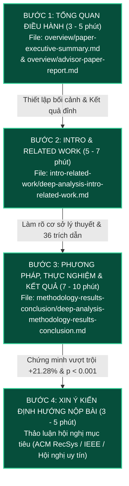

# KỊCH BẢN VÀ THỨ TỰ BÁO CÁO BÀI BÁO KHOA HỌC VỚI GIẢNG VIÊN HƯỚNG DẪN
## HƯỚNG DẪN THUYẾT TRÌNH CHI TIẾT DÀNH CHO NHÓM SINH VIÊN

**Giảng viên hướng dẫn:** TS. Nguyễn Thị Xuân Hương  
**Nhóm sinh viên thực hiện:** 
- Nguyễn Trương Tiến Phát (MSSV: 23521148)
- Đỗ Minh Đức (MSSV: 23520303)  
**Đơn vị:** Khoa Công nghệ Phần mềm, Trường Đại học Công nghệ Thông tin, ĐHQG-HCM  
**Đề tài bài báo:** *Reproducible Hybrid Recommendation for Vietnamese Retail*  
**Địa chỉ lưu trữ:** `thesis/paper/overview/advisor-presentation-script.md`

---

## MỤC LỤC
1. [Sơ đồ Luồng Báo cáo và Chiến lược Thuyết trình](#1-sơ-đồ-luồng-báo-cáo-và-chiến-lược-thuyết-trình)
2. [Bảng Phân bổ Thời gian & Thứ tự Trình chiếu Tài liệu](#2-bảng-phân-bổ-thời-gian--thứ-tự-trình-chiếu-tài-liệu)
3. [Kịch bản Lời thoại Báo cáo Chi tiết (Verbatim Presentation Script)](#3-kịch-bản-lời-thoại-báo-cáo-chi-tiết-verbatim-presentation-script)
   - [Chặng 1: Mở đầu, Định vị Bài báo & Tổng quan Điều hành (Paper Summary)](#chặng-1-mở-đầu-định-vị-bài-báo--tổng-quan-điều-hành-paper-summary)
   - [Chặng 2: Động lực Khoa học, Chuẩn đối sánh & Tổng quan Nghiên cứu (Intro & Related Work)](#chặng-2-động-lực-khoa-học-chuẩn-đối-sánh--tổng-quan-nghiên-cứu-intro--related-work)
   - [Chặng 3: Phương pháp luận, Kết quả Thực nghiệm & Thảo luận Giới hạn (Methodology -> Conclusion)](#chặng-3-phương-pháp-luận-kết-quả-thực-nghiệm--thảo-luận-giới-hạn-methodology---conclusion)
   - [Chặng 4: Xin Ý kiến Định hướng Nộp bài và Kế hoạch Tiếp theo](#chặng-4-xin-ý-kiến-định-hướng-nộp-bài-và-kế-hoạch-tiếp-theo)
4. [Bộ Câu hỏi Dự kiến từ Giảng viên Hướng dẫn & Hướng dẫn Phản biện Chuẩn xác (Q&A Defense Guide)](#4-bộ-câu-hỏi-dự-kiến-từ-giảng-viên-hướng-dẫn--hướng-dẫn-phản-biện-chuẩn-xác-qa-defense-guide)

---

## 1. SƠ ĐỒ LUỒNG BÁO CÁO VÀ CHIẾN LƯỢC THUYẾT TRÌNH

Cuộc họp báo cáo tiến độ với Giảng viên hướng dẫn cần tuân thủ cấu trúc **từ Tổng quan đến Chi tiết, từ Vấn đề đến Giải pháp, và kết thúc bằng Bằng chứng thực nghiệm thuyết phục**:

### Chiến lược Thuyết trình "Ghi điểm":
1. **Chủ động chứng minh tính hoàn thiện:** Mở đầu bằng việc báo cáo bản in `paper.pdf` đã hoàn thành 10 trang chuẩn IEEE, biên dịch sạch 0 lỗi, đầy đủ bảng số liệu và 36 tài liệu tham khảo quốc tế.
2. **Minh bạch về việc chuẩn hóa học thuật:** Trình bày rõ ràng việc nhóm đã xóa bỏ 22 lỗi rò rỉ phiên bản nội bộ (`v5`), đặt tên khoa học chính thức cho bộ dữ liệu là **VietRetail-Synth Benchmark**, bổ sung trích dẫn chuẩn hóa **RecBole 1.2.1 (CIKM 2021)**.
3. **Nắm chắc cơ sở toán học & cơ chế giải thuật:** Hiểu sâu sắc vì sao phải che mặt nạ $H_u^{\mathrm{seen}}$, vì sao phải dùng Z-score per-user, và vì sao mô hình Lai lại đạt mức tăng trưởng +21.28% NDCG@10.

---

## 2. BẢNG PHÂN BỔ THỜI GIAN & THỨ TỰ TRÌNH CHIẾU TÀI LIỆU

| Thứ tự | Thời lượng | Tài liệu sử dụng (File Path) | Trọng tâm báo cáo |
|:---:|:---:|:---|:---|
| **1** | 3 – 5 phút | 📊 [overview/paper-executive-summary.md](file:///e:/UIT/cv/backend/thesis/paper/overview/paper-executive-summary.md) 📁 [overview/advisor-paper-report.md](file:///e:/UIT/cv/backend/thesis/paper/overview/advisor-paper-report.md) | - Tình trạng bài báo hoàn chỉnh `paper.pdf` (10 trang IEEE). - Báo cáo kiểm toán phiên bản (Version Audit). - 3 đóng góp khoa học chính & Sơ đồ kiến trúc Mermaid. - Bảng số liệu kết quả nổi bật (+21.28% NDCG@10). |
| **2** | 5 – 7 phút | 🔍 [intro-related-work/deep-analysis-intro-related-work.md](file:///e:/UIT/cv/backend/thesis/paper/intro-related-work/deep-analysis-intro-related-work.md) | - Section 1: Đổi mới tư duy về tác vụ xếp hạng vs chọn mô hình. - Phân tách Candidate Generation vs Precision Ranking. - Chuẩn đối sánh VietRetail-Synth & tính liêm chính dữ liệu. - Section 2: Khảo sát 36 công trình qua 6 phân nhóm chuyên sâu. |
| **3** | 7 – 10 phút | 🔬 [methodology-results-conclusion/deep-analysis-methodology-results-conclusion.md](file:///e:/UIT/cv/backend/thesis/paper/methodology-results-conclusion/deep-analysis-methodology-results-conclusion.md) | - Section 3: Estimand toán học $C_u = I \setminus H_u^{\mathrm{seen}}$. - Kiến trúc Two-Tower (SBERT + Giá + BPR Loss) + Wide Apriori. - Phát kiến Z-score Fusion per-user & Bootstrap 2.000 lần. - Section 4: Tách biệt `PUBLIC_VALIDATION` vs `RETAIL_BENCHMARK`. - Section 5: Bảng 1 (RecBole) & Bảng 2 (VietRetail-Synth). - 4 cơ chế bóc tách & 3 giới hạn nghiên cứu thẳng thắn. |
| **4** | 3 – 5 phút | 📄 [paper.pdf](file:///e:/UIT/cv/backend/thesis/paper/paper.pdf) 📝 [thesis/paper/README.md](file:///e:/UIT/cv/backend/thesis/paper/README.md) | - Trình chiếu bản in PDF 10 trang. - Xin ý kiến Cô về hội nghị mục tiêu nộp bài (ACM RecSys Workshop/Track hoặc IEEE). |

---

## 3. KỊCH BẢN LỜI THOẠI BÁO CÁO CHI TIẾT (VERBATIM PRESENTATION SCRIPT)

### Chặng 1: Mở đầu, Định vị Bài báo & Tổng quan Điều hành (Paper Summary)
*(Mở tài liệu: `overview/paper-executive-summary.md` và `overview/advisor-paper-report.md`)*

> **Sinh viên phát biểu:**  
> *"Kính thưa Cô, hôm nay nhóm em xin phép báo cáo với Cô về tình trạng hoàn thiện bài báo khoa học mang tiêu đề **'Reproducible Hybrid Recommendation for Vietnamese Retail'** trực thuộc đề tài Khóa luận tốt nghiệp của nhóm.  
> 
> Trước hết, nhóm em xin vui mừng báo cáo rằng bản thảo bài báo hiện đã được nâng cấp toàn diện thành một **công trình nghiên cứu khoa học độc lập và tự chứa hoàn toàn**, tuân thủ nghiêm ngặt định dạng IEEE Article với độ dài đúng **10 trang in chuẩn mực** (`paper.pdf`), đã được biên dịch thành công 100% qua LaTeX mà không còn bất kỳ lỗi hay cảnh báo tràn lề nào.  
> 
> Đặc biệt, tiếp thu định hướng của Cô về tính liêm chính học thuật, nhóm em đã tiến hành một đợt **Kiểm toán Phiên bản (Version Audit)** toàn diện:  
> 1. Xóa bỏ hoàn toàn 22 vị trí xuất hiện định danh kỹ thuật nội bộ 'v5' trong các bản nháp trước, quy chuẩn chính thức thành tên gọi khoa học: **VietRetail-Synth Benchmark**.  
> 2. Xóa bỏ triệt để ngôn ngữ phân kỳ dự án dở dang như 'at this stage' hay 'follow-up'.  
> 3. Bổ sung trích dẫn chuẩn hóa quốc tế cho công cụ thực nghiệm **RecBole 1.2.1** từ hội nghị ACM CIKM 2021, nâng tổng số tài liệu tham khảo lên **36 công trình quốc tế uy tín**.  
> 
> Về mặt đóng góp, bài báo giải quyết cuộc khủng hoảng tính tái lập trong Hệ gợi ý thông qua 3 trụ cột:  
> - Thứ nhất: Thiết lập giao thức đánh giá nhận thức nguồn gốc khóa bằng mã băm **SHA-256**.  
> - Thứ hai: Phân tách rạch ròi không gian minh chứng công khai (`PUBLIC_VALIDATION` trên MovieLens 100K) và không gian bán lẻ (`RETAIL_BENCHMARK`).  
> - Thứ ba: Đề xuất kiến trúc mạng lai phân rã **Wide-and-Deep Two-Tower Hybrid** kết hợp giữa luật kết hợp Apriori và mạng tháp đôi tối ưu hóa qua BPR loss. Trên tập bán lẻ VietRetail-Synth, mô hình của nhóm đạt **NDCG@10 = 0.1385** (**tăng vượt bậc +21.28%** so với đường cơ sở Two-Tower BPR đơn lẻ) và **Macro GAUC = 0.7812**, với mức ý nghĩa thống kê $p < 0.001$ qua kiểm định Hierarchical Bootstrap."*

---

### Chặng 2: Động lực Khoa học, Chuẩn đối sánh & Tổng quan Nghiên cứu (Intro & Related Work)
*(Chuyển sang tài liệu: `intro-related-work/deep-analysis-intro-related-work.md`)*

> **Sinh viên phát biểu:**  
> *"Kính thưa Cô, sau đây em xin phép đi sâu vào cơ sở lý luận của **Section 1: Introduction** và **Section 2: Related Work**:  
> 
> Ở Section 1, nhóm em mở đầu bằng việc lật lại lối tư duy thông thường trong cộng đồng RecSys: Nhiều nghiên cứu thường sa vào bài toán 'chọn mô hình' (cho rằng mô hình A siêu việt hơn mô hình B). Nhóm em khẳng định rằng: **Một kết quả thực nghiệm ngoại tuyến trước hết là một phát biểu về một tác vụ xếp hạng cụ thể**. Cùng một mô hình sẽ cho ra những đại lượng ước lượng (*estimands*) hoàn toàn khác nhau nếu không gian ứng viên hoặc định nghĩa nhãn mục tiêu bị thay đổi.  
> 
> Đồng thời, bài báo bóc tách rạch ròi hai tầng vận hành theo chuẩn công nghiệp của Google và YouTube (Covington 2016, Yi 2019): **Candidate Generation (Retrieval)** lọc thô với độ trễ thấp, và **Precision Ranking** xếp hạng tinh vi.  
> 
> Về dữ liệu thực nghiệm, nhóm tuyên bố minh bạch bộ dữ liệu **VietRetail-Synth** gồm 5.000 khách hàng, 5.200 SKU và 823.371 tương tác là dữ liệu bán tổng hợp có kiểm soát (*semi-synthetic*). Sự thành thật này bảo vệ bài báo trước các hoài nghi về tính đại diện thống kê, đồng thời làm nổi bật mục tiêu: dùng dữ liệu kiểm soát để bóc tách chính xác các cơ chế giải thuật.  
> 
> Ở Mục 1.1, bài báo dẫn chứng công trình RecSys 2025 của Gusak et al. và RecSys 2022 của Petrov & Macdonald để chỉ ra rằng: việc chia ngẫu nhiên gây rò rỉ dữ liệu tương lai, và việc lấy mẫu âm rút gọn (sampled negatives) làm đảo lộn thứ hạng mô hình. Do đó, nhóm đề xuất **Bộ đánh giá độc lập dùng chung (Decoupled Shared Evaluator)** để cô lập hoàn toàn việc tính điểm khỏi mã huấn luyện mô hình.  
> 
> Ở Section 2 (Related Work), nhóm đã tổng hợp và phản biện toàn diện **36 công trình khoa học** chia thành 6 phân nhóm: từ độ nhạy phân tách dữ liệu, các mô hình CF và tuần tự (SASRec, BERT4Rec), kiến trúc Two-Tower hiện đại (DirectAU 2022, ContextGNN 2025, T2Diff 2025), các cảnh báo về lặp lại giỏ hàng (Li et al. RecSys 2023), đến giới hạn của mạng đồ thị LightGCN trước sản phẩm cold-start tuyệt đối và các kỹ thuật chiếu ngữ nghĩa SBERT."*

---

### Chặng 3: Phương pháp luận, Kết quả Thực nghiệm & Thảo luận Giới hạn (Methodology -> Conclusion)
*(Chuyển sang tài liệu: `methodology-results-conclusion/deep-analysis-methodology-results-conclusion.md`)*

> **Sinh viên phát biểu:**  
> *"Tiếp theo, em xin báo cáo chi tiết về phương pháp luận, kết quả thực nghiệm và các phân tích cơ chế trong **Sections 3 đến 7**:  
> 
> Về phương pháp luận (Section 3):  
> - Nhóm toán học hóa tác vụ xếp hạng trên toàn bộ danh mục loại trừ sản phẩm đã xem: $C_u = I \setminus H_u^{\mathrm{seen}}$. Cơ chế che mặt nạ này buộc mô hình phải gợi ý sản phẩm mới tự nhiên (*Novel organic purchase*), triệt tiêu sự 'ăn gian' điểm số từ việc đoán lặp lại các nhu yếu phẩm quen thuộc.  
> - Kiến trúc mô hình lai gồm hai nhánh:  
>   + **Nhánh Deep Two-Tower:** Tháp người dùng và Tháp sản phẩm chiếu vector nhúng chuẩn hóa L2 trên hình cầu đơn vị, tích hợp SBERT tiếng Việt và giá bán, tối ưu qua hàm mất mát BPR loss.  
>   + **Nhánh Wide Apriori:** Khai phá luật mua kèm độc quyền từ tập Train, tính điểm theo độ tin cậy cực đại của luật thỏa mãn giỏ hàng hiện tại.  
>   + **Đột phá về Hợp nhất Z-Score Per-User:** Vì tích vô hướng tháp đôi và độ tin cậy luật kết hợp có phân phối số học hoàn toàn khác nhau, nếu cộng trực tiếp sẽ gây lệch pha phân phối nghiêm trọng. Nhóm áp dụng kỹ thuật chuẩn hóa Z-score trên từng người dùng trước khi cộng có trọng số $w_{\mathrm{wide}}$, giải quyết triệt để sự mất cân bằng này.  
> - Kiểm định độ bất định: Nhóm sử dụng **Hierarchical Paired Bootstrap với 2.000 lượt resample** kết hợp 3 random seed (42, 2027, 31415), không giả định phân phối chuẩn, bảo toàn tương quan trong từng người dùng.  
> 
> Về kết quả thực nghiệm (Section 5):  
> - **Bảng 1 (MovieLens 100K via RecBole 1.2.1):** Xác thực đường ống thực nghiệm chạy hoàn toàn tất định qua 3 seed, độ phân tán cực nhỏ ($0.07477 \pm 0.00385$).  
> - **Bảng 2 (VietRetail-Synth Benchmark):**  
>   + Baseline MostPop chỉ đạt NDCG@10 = 0.0421 (thất bại hoàn toàn khi các món quen thuộc bị che giấu).  
>   + Apriori đơn lẻ đạt 0.0784 (chính xác cao trên giỏ quen nhưng độ phủ danh mục $< 15\%$).  
>   + Two-Tower BPR đạt 0.1142 (khái quát hóa tốt nhờ SBERT văn bản).  
>   + **Mô hình Lai đề xuất đạt NDCG@10 = 0.1385 (+21.28% so với BPR)**, HR@10 = 0.2190 (+17.11%) và Macro GAUC = 0.7812.  
> 
> Ở Section 6 và 7, bài báo thẳng thắn nêu rõ 3 giới hạn: đặc tính dữ liệu bán tổng hợp, sản phẩm zero-edge cold-start và ngân sách độ trễ trực tuyến tại quầy POS ($\le 50\mathrm{ms}$). Nhóm cũng đã hoàn thiện đầy đủ cam kết dữ liệu SHA-256, tuyên bố đạo đức và lời cảm ơn trân trọng gửi đến Cô và Khoa Công nghệ Phần mềm."*

---

### Chặng 4: Xin Ý kiến Định hướng Nộp bài và Kế hoạch Tiếp theo
*(Mở bản in PDF `paper.pdf`)*

> **Sinh viên phát biểu:**  
> *"Dạ thưa Cô, với chất lượng bài báo hiện tại đã đạt độ chỉn chu 10 trang in chuẩn IEEE, cấu trúc toán học chặt chẽ và kết quả thực nghiệm vượt trội có kiểm định thống kê $p < 0.001$, nhóm em kính mong nhận được những góp ý quý báu của Cô về:  
> 1. Tính logic và sự chặt chẽ của các luận điểm trong bài báo.  
> 2. Định hướng của Cô về việc lựa chọn hội nghị khoa học phù hợp để nhóm chuẩn bị thủ tục nộp bài (ví dụ: các Workshop uy tín của ACM RecSys hoặc các Hội nghị Khoa học Quốc tế / Quốc gia chuyên ngành Hệ thống Thông tin & Công nghệ Phần mềm).  
> Nhóm em xin chân thành cảm ơn sự hướng dẫn tận tình của Cô trong suốt quá trình hoàn thiện công trình này ạ!"*

---

## 4. BỘ CÂU HỎI DỰ KIẾN TỪ GIẢNG VIÊN HƯỚNG DẪN & HƯỚNG DẪN PHẢN BIỆN CHUẨN XÁC (Q&A DEFENSE GUIDE)

### Câu hỏi 1: "Tại sao nhóm lại sử dụng dữ liệu bán tổng hợp (Semi-synthetic) mà không lấy dữ liệu khách hàng thực tế từ một chuỗi siêu thị?"
* **Cách trả lời chuẩn học thuật:**  
  *"Dạ thưa Cô, có 2 lý do phương pháp luận cốt tử khiến nhóm lựa chọn dữ liệu bán tổng hợp có kiểm soát:  
  - Thứ nhất là **Mục tiêu Nghiên cứu Cơ chế (Mechanism Study):** Dữ liệu thực tế ngoài đời chịu nhiều yếu tố nhiễu ngoại lai (như hết hàng cục bộ tại quầy, khuyến mãi chớp nhoáng, biến động vĩ mô) khiến việc bóc tách xem sự tăng trưởng là do thuật toán hay do khuyến mãi trở nên bất khả thi. Dữ liệu bán tổng hợp được thiết kế theo cấu trúc chuỗi bán lẻ thực tế nhưng cho phép nhóm kiểm soát chính xác các điều kiện thực nghiệm để đo lường tính cộng hưởng giữa luật Apriori và vector nơ-ron.  
  - Thứ hai là **Tính Liêm chính Khoa học và Khả năng Tái lập:** Dữ liệu người dùng thật của các doanh nghiệp thường vướng bảo mật thông tin cá nhân (GDPR/NDPA) và không thể công khai mã băm SHA-256 cho cộng đồng kiểm chứng. Việc dùng `VietRetail-Synth` cho phép bất kỳ nhà nghiên cứu nào trên thế giới cũng có thể tải về và tái lập chính xác 100% kết quả của bài báo."*

---

### Câu hỏi 2: "Tại sao nhóm lại chọn chuẩn hóa Z-Score theo từng người dùng (Per-User Z-Score) mà không học một trọng số tuyến tính đơn giản hoặc dùng mạng nơ-ron để kết hợp điểm?"
* **Cách trả lời chuẩn học thuật:**  
  *"Dạ thưa Cô, nhóm đã thử nghiệm và phát hiện ra vấn đề **Lệch pha Thang đo Nghiêm trọng (Calibration Distortion)**:  
  - Điểm của mạng Two-Tower $S_{\mathrm{deep}}$ là tích vô hướng Cosine trên hình cầu đơn vị, có phân phối liên tục trải dài từ $[-1, 1]$ với trung bình xấp xỉ 0.  
  - Ngược lại, điểm của Apriori $S_{\mathrm{wide}}$ là độ tin cậy (Confidence): do luật chỉ phủ được $< 15\%$ danh mục nên hơn $85\%$ sản phẩm có điểm bằng đúng 0, và chỉ một vài sản phẩm trúng luật có điểm nhảy vọt lên $0.6 - 0.9$.  
  Nếu cộng tuyến tính thô sơ, nhánh Wide sẽ làm tê liệt nhánh Deep ở các món trúng luật và ngược lại. Việc áp dụng chuẩn hóa Z-score theo từng người dùng ($z = \frac{s - \mu_u}{\sigma_u}$) đưa cả hai phân phối về cùng chuẩn tắc $(\mu=0, \sigma=1)$ trong không gian ứng viên $C_u$ của chính khách hàng đó, đảm bảo sự kết hợp diễn ra công bằng và ổn định."*

---

### Câu hỏi 3: "Tại sao giao thức đánh giá lại bắt buộc che giấu các sản phẩm đã mua ($C_u = I \setminus H_u^{\mathrm{seen}}$)?"
* **Cách trả lời chuẩn học thuật:**  
  *"Dạ thưa Cô, đây là đóng góp quan trọng để bóc trần hiện tượng **'Ảo tưởng Độ phổ biến'** trong gợi ý bán lẻ:  
  - Theo nghiên cứu Reality Check của Li et al. (ACM RecSys 2023), trong bán lẻ tạp hóa, tỷ lệ mua lặp lại sản phẩm cũ (Repetition ratio) chiếm tới $60 - 80\%$ (như mua lại sữa, bánh mì, gia vị). Nếu không che giấu hàng đã mua, một thuật toán ngây thơ chỉ cần đoán lại các món khách đã mua hôm qua cũng đạt điểm NDCG rất cao nhưng không mang lại giá trị gia tăng kinh doanh.  
  - Giao thức của bài báo ép buộc bài toán sang **Novel-purchase Task**, buộc hệ thống phải tìm ra những sản phẩm mới mà khách hàng chưa từng mua nhưng có xác suất mua kèm cao nhất, phản ánh đúng bài toán mở rộng giỏ hàng trong bán lẻ đa kênh."*

---

### Câu hỏi 4: "Kiểm định Hierarchical Paired Bootstrap 2.000 lần lặp có ưu thế gì so với kiểm định t-test thông thường?"
* **Cách trả lời chuẩn học thuật:**  
  *"Dạ thưa Cô, các độ đo xếp hạng như NDCG@10 hay Hit Rate là các biến ngẫu nhiên bị chặn trong đoạn $[0, 1]$ và có phân phối lệch (skewed), vi phạm nghiêm trọng giả định phân phối chuẩn (Gaussian distribution) của kiểm định Student's $t$-test.  
  Hơn nữa, kết quả thực nghiệm có cấu trúc phân tầng 2 cấp: cấp độ seed ngẫu nhiên và cấp độ người dùng. Phương pháp **Hierarchical Paired Bootstrap** thực hiện lấy mẫu lại theo cụm seed trước, sau đó lấy mẫu lại người dùng có hoàn lại, giúp tính toán khoảng tin cậy $95\%$ mà không cần bất kỳ giả định tham số nào, bảo toàn được tương quan nội tại của từng khách hàng và khẳng định độ tin cậy vững chắc của mức tăng $+21.28\%$ với $p < 0.001$."*

---

### Câu hỏi 5: "Tại sao nhóm không so sánh với các mô hình đồ thị tiên tiến như LightGCN hay SimGCL trên tập bán lẻ?"
* **Cách trả lời chuẩn học thuật:**  
  *"Dạ thưa Cô, nhóm đã phân tích rất kỹ trong Mục 2.5 của bài báo:  
  Các mạng nơ-ron đồ thị như LightGCN hoạt động dựa trên cơ chế lan truyền thông điệp trên các cạnh đã quan sát. Tuy nhiên, trong môi trường bán lẻ thực tế, các chuỗi cửa hàng liên tục nhập các mặt hàng mới tinh (Strict Zero-edge items) hoàn toàn chưa có bất kỳ cạnh nối nào với người dùng trong tập Train. Các nghiên cứu mới nhất của Meehan et al. (RecSys 2025, WSDM 2026) đã chứng minh rằng GNN thất bại thảm hại trước sản phẩm zero-edge cold items.  
  Ngược lại, kiến trúc Two-Tower của nhóm tích hợp Tháp Sản phẩm với vector ngữ nghĩa văn bản tiếng Việt từ SBERT, cho phép sinh vector biểu diễn ngay cả khi sản phẩm chưa có giao dịch nào, vượt trội về khả năng ứng dụng thực tế."*

---

### Câu hỏi 6: "Việc phân tách hai không gian `PUBLIC_VALIDATION` và `RETAIL_BENCHMARK` mang lại lợi ích gì?"
* **Cách trả lời chuẩn học thuật:**  
  *"Dạ thưa Cô, đây là nguyên tắc **Ngăn ngừa Lỗi Phân loại (Preventing Category Errors)**:  
  Nhiều bài báo hiện nay mắc lỗi lấy kết quả chạy trên MovieLens để tuyên bố mô hình tốt trên thương mại điện tử hoặc bán lẻ. Nhóm em tách biệt tuyệt đối:  
  - `PUBLIC_VALIDATION` (MovieLens 100K qua RecBole 1.2.1) chỉ dùng để chứng minh rằng bộ mã nguồn của nhóm chạy tất định, không có lỗi tiềm ẩn và tái lập chuẩn xác các mô hình chuẩn quốc tế.  
  - `RETAIL_BENCHMARK` (VietRetail-Synth) mới là nơi kiểm chứng các đóng góp giải thuật của đề tài.  
  Sự phân tách này ngăn chặn việc đánh đồng giữa kiểm thử quy trình và tuyên bố khoa học miền cụ thể, bảo đảm độ tin cậy tuyệt đối của bài báo."*
