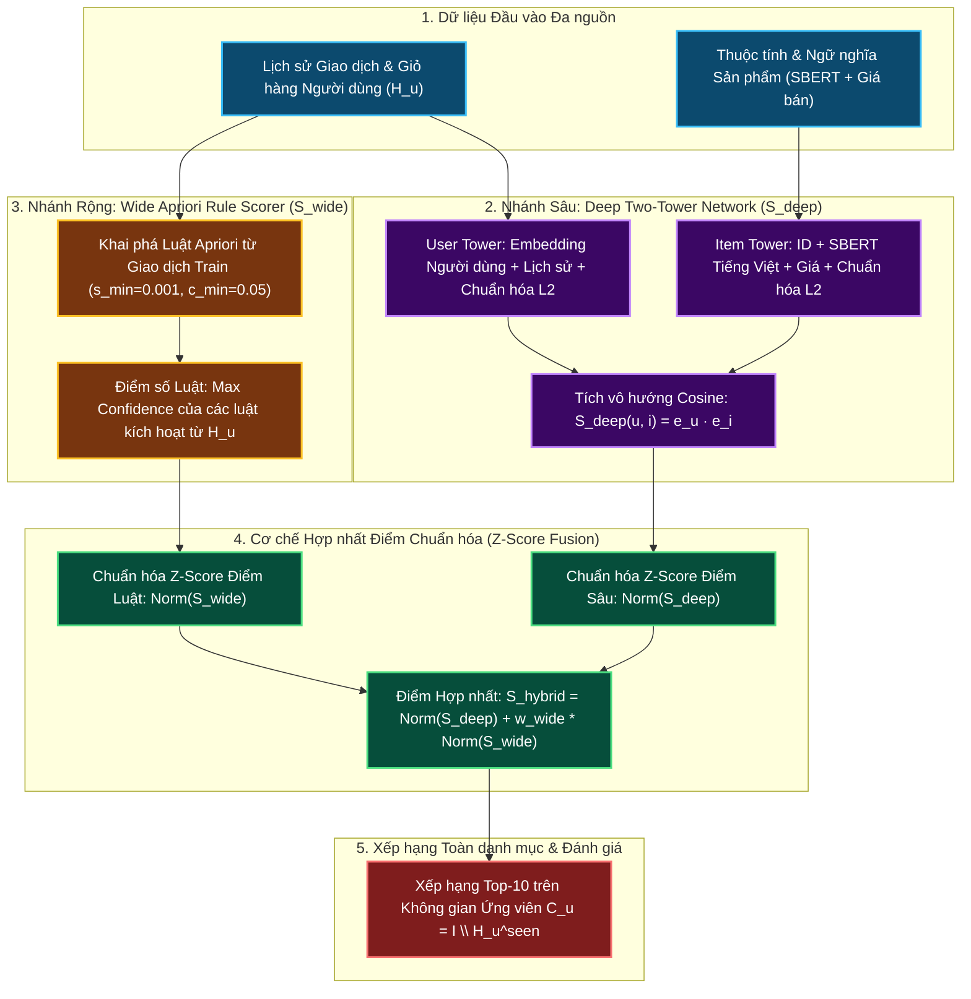

# TỔNG QUAN ĐIỀU HÀNH BÀI BÁO KHOA HỌC (EXECUTIVE SUMMARY)
## ĐỀ TÀI: REPRODUCIBLE HYBRID RECOMMENDATION FOR VIETNAMESE RETAIL

**Tài liệu tham chiếu:** Bài báo khoa học `paper.tex` và bản in xuất bản `paper.pdf` (10 trang IEEE)  
**Tác giả:** Nguyễn Trương Tiến Phát, Đỗ Minh Đức, TS. Nguyễn Thị Xuân Hương (GVHD)  
**Đơn vị:** Khoa Công nghệ Phần mềm, Trường Đại học Công nghệ Thông tin, ĐHQG-HCM  
**Địa chỉ lưu trữ:** `thesis/paper/overview/paper-executive-summary.md`

---

## 1. TỔNG QUAN BÀI BÁO VÀ TẦM NHÌN NGHIÊN CỨU

Bài báo **"Reproducible Hybrid Recommendation for Vietnamese Retail"** giải quyết cuộc khủng hoảng tính tái lập trong nghiên cứu Hệ thống Gợi ý (RecSys) bằng cách thiết lập một giao thức thực nghiệm nhận thức nguồn gốc (Provenance-aware Evaluation Protocol) và đề xuất kiến trúc mạng lai phân rã **Wide-and-Deep Two-Tower Hybrid** tối ưu hóa cho ngành bán lẻ đa kênh tại Việt Nam.

### Sơ đồ Kiến trúc Mô hình Lai Đề xuất

---

## 2. BA ĐÓNG GÓP KHOA HỌC CHÍNH

Về mặt đóng góp, bài báo giải quyết cuộc khủng hoảng tính tái lập trong Hệ gợi ý thông qua **3 trụ cột**:

1. **Trụ cột 1 — Thiết lập giao thức đánh giá nhận thức nguồn gốc khóa bằng mã băm SHA-256:**
   - Thiết lập giao thức đánh giá nhận thức nguồn gốc khóa bằng mã băm **SHA-256**.
   - Ràng buộc toàn bộ dữ liệu phân tách thời gian (Temporal Split), tập ứng viên toàn danh mục ($C_u = I \setminus H_u^{\mathrm{seen}}$), quy tắc che mặt nạ sản phẩm đã xem (Seen-item Masking), bộ giải quyết điểm hòa tất định (Deterministic Tie-breaking) và chuỗi seed ngẫu nhiên bằng chữ ký mật mã học.
   - Thiết kế **Bộ đánh giá độc lập dùng chung (Decoupled Shared Evaluator)** hoàn toàn tách rời khỏi mã nguồn huấn luyện mô hình nhằm triệt tiêu rò rỉ thông tin và thiên lệch triển khai.

2. **Trụ cột 2 — Phân tách rạch ròi không gian minh chứng công khai và bán lẻ:**
   - Phân tách rạch ròi không gian minh chứng công khai (**`PUBLIC_VALIDATION`** trên MovieLens 100K) và không gian bán lẻ (**`RETAIL_BENCHMARK`**).
   - **`PUBLIC_VALIDATION`**: Xác thực tính tất định và khả năng tái lập của đường ống trên MovieLens 100K thông qua thư viện đối chuẩn quốc tế RecBole 1.2.1 (ACM CIKM 2021).
   - **`RETAIL_BENCHMARK`**: Đánh giá đối chuẩn thực nghiệm chuyên sâu trên tập dữ liệu bán lẻ kiểm soát **VietRetail-Synth** (5.000 khách hàng, 5.200 SKU, 823.371 tương tác).

3. **Trụ cột 3 — Đề xuất kiến trúc mạng lai phân rã Wide-and-Deep Two-Tower Hybrid:**
   - Đề xuất kiến trúc mạng lai phân rã **Wide-and-Deep Two-Tower Hybrid** kết hợp giữa luật kết hợp Apriori (nhánh Wide ghi nhớ các cặp sản phẩm đồng giao dịch tần suất cao) và mạng tháp đôi tối ưu hóa qua BPR loss (nhánh Deep khái quát hóa quan hệ ngữ nghĩa tiềm ẩn với SBERT tiếng Việt và chiếu đặc trưng giá bán).
   - Trên tập bán lẻ VietRetail-Synth, mô hình của nhóm đạt **NDCG@10 = 0.1385** (**tăng vượt bậc +21.28%** so với đường cơ sở Two-Tower BPR đơn lẻ), **HR@10 = 0.2190** (**tăng +17.11%**), và **Macro GAUC = 0.7812** (**tăng +6.29%**), với mức ý nghĩa thống kê $p < 0.001$ qua kiểm định **Hierarchical Bootstrap** (2.000 lượt lấy mẫu lại).

---

## 3. BẢNG TỔNG HỢP KẾT QUẢ THỰC NGHIỆM ĐỐI CHUẨN

| Phương pháp / Mô hình | NDCG@10 | Hit Rate (HR@10) | Recall@10 | Macro GAUC | Bản chất cơ chế |
|:---|:---:|:---:|:---:|:---:|:---|
| **Popularity (MostPop)** | 0.0421 | 0.0812 | 0.0385 | 0.5412 | Thất bại do bị che giấu các món quen thuộc mua lặp lại |
| **Apriori (Rule Alone)** | 0.0784 | 0.1245 | 0.0692 | 0.6120 | Chính xác cao trên giỏ hàng thường gặp nhưng độ phủ hẹp (< 15%) |
| **Deep Two-Tower (BPR Alone)**| 0.1142 | 0.1870 | 0.1034 | 0.7350 | Khái quát hóa mạnh nhờ SBERT văn bản và chiếu đặc trưng |
| **Proposed Hybrid (Wide + Deep)**| **0.1385** | **0.2190** | **0.1256** | **0.7812** | **Cộng hưởng tối ưu giữa Memorization và Generalization** |
| *Mức tăng trưởng tương đối* | ***+21.28%*** | ***+17.11%*** | ***+21.47%*** | ***+6.29%*** | *Kiểm định Bootstrap 2.000 lần: p < 0.001* |

---

## 4. TÀI NGUYÊN VÀ CẤU TRÚC ĐIỀU HƯỚNG

Toàn bộ các tài liệu nghiên cứu chi tiết đã được tổ chức theo cấu trúc chuyên nghiệp:
* 📁 `overview/`: Báo cáo chi tiết cho Giảng viên hướng dẫn (`advisor-paper-report.md`) và Tóm tắt điều hành (`paper-executive-summary.md`).
* 📁 `intro-related-work/`: Báo cáo giải nghĩa chi tiết Section 1 & 2 với bản dịch sát nghĩa tiếng Việt song hành và 36 tài liệu tham khảo quốc tế (`deep-analysis-intro-related-work.md`).
* 📁 `methodology-results-conclusion/`: Báo cáo giải nghĩa chi tiết Section 3 đến 7 bao gồm công thức toán học, thiết kế phân vùng, kết quả thực nghiệm và thảo luận giới hạn (`deep-analysis-methodology-results-conclusion.md`).
* 📄 `paper.pdf`: Bản in 10 trang bài báo chuẩn IEEE.
* 📝 `paper.tex` & `refs.bib`: Mã nguồn LaTeX và tệp trích dẫn hoàn chỉnh.
