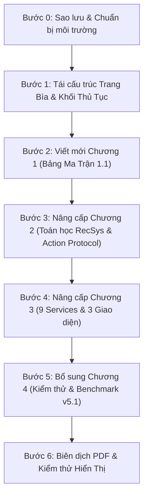

# HƯỚNG DẪN THỰC HIỆN CHI TIẾT (ACTION & COMPILATION GUIDE)
## QUY TRÌNH NÂNG CẤP VÀ BIÊN DỊCH BÁO CÁO KHÓA LUẬN TỐT NGHIỆP (`main.tex` $\rightarrow$ `main.pdf`)
**Đề tài:** Hệ thống Quản lý Bán lẻ Đa chi nhánh POSMART  
**Mã học phần:** SE505 — Khóa luận tốt nghiệp (KTPM - UIT)  
**Tài liệu đi kèm:** `thesis/thesis-upgrade-content-plan.md`  

---

## 1. MỤC ĐÍCH VÀ NGUYÊN TẮC THỰC HIỆN

Tài liệu này đóng vai trò là cẩm nang thao tác kỹ thuật (Step-by-step Execution Guide) giúp nhóm sinh viên trực tiếp chỉnh sửa, tái cấu trúc và biên dịch mã nguồn LaTeX `main.tex` thành bản báo cáo PDF Khóa luận tốt nghiệp đạt chuẩn chất lượng cao nhất theo yêu cầu của GVHD TS. Nguyễn Thị Xuân Hương.

### Nguyên tắc cốt lõi:
1. **Bảo toàn dữ liệu cũ:** Sao lưu file gốc `main.tex` trước khi thực hiện bất kỳ thao tác nào.
2. **Chuẩn hóa học thuật:** Áp dụng công thức toán học chính xác từ `master_draft_stage2.tex` và phong cách trình bày ma trận 3 chiều từ template của TS. Nguyễn Thị Xuân Hương.
3. **Tính bao quát thực tiễn:** Trình bày đầy đủ cả 3 phân hệ giao diện người dùng:
   * **POS Terminal:** Thu ngân bán hàng tại quầy (Mã vạch, Lô hàng, Đơn chờ, Tiền mặt / VNPay QR).
   * **Admin & Manager Dashboard:** Quản trị chuỗi, chi nhánh, kho bãi, lô hàng, công nợ và thống kê Redis.
   * **Customer Storefront:** Mua sắm trực tuyến, giỏ hàng, thanh toán VNPay và Trợ lý tác vụ Action Assistant.

---

## 2. QUY TRÌNH THỰC HIỆN TỪNG BƯỚC (STEP-BY-STEP)



---

### BƯỚC 0: SAO LƯU DỰ PHÒNG VÀ KIỂM TRA TRÌNH BIÊN DỊCH

Trước khi thao tác, chạy lệnh PowerShell sau tại thư mục `e:\UIT\cv\backend\thesis` để tạo bản backup an toàn:

```powershell
# Di chuyển vào thư mục thesis
cd e:\UIT\cv\backend\thesis

# Sao lưu file gốc main.tex thành main.tex.bak
Copy-Item main.tex main.tex.bak

# Kiểm tra trình biên dịch LaTeX có sẵn trên máy
Get-Command pdflatex, xelatex
```
*(Môi trường máy đã có sẵn MiKTeX `pdflatex.exe` và `xelatex.exe`)*.

---

### BƯỚC 1: CẬP NHẬT TRANG BÌA, MỤC LỤC VÀ TỪ VIẾT TẮT

Mở file `main.tex` và tiến hành các cập nhật sau:

#### 1. Khối khai báo gói lệnh (Preamble):
Đảm bảo các gói lệnh sau đã được nạp đầy đủ ở đầu file `main.tex`:
```latex
\documentclass[12pt,a4paper]{report}
\usepackage[utf8]{vietnam}
\usepackage{graphicx}
\usepackage{geometry}
\usepackage{float}
\usepackage{amsmath,amssymb}
\usepackage{tikz}
\usetikzlibrary{calc}
\usepackage{mathptmx}
\usepackage{xcolor}
\usepackage{longtable}
\usepackage{enumitem}
\usepackage{array}
\usepackage{tabularx}
\usepackage[table]{xcolor}
\usepackage{hyperref}
\usepackage{booktabs}

\geometry{a4paper, left=3cm, right=2cm, top=2.5cm, bottom=2.5cm}
\definecolor{uitblue}{RGB}{20, 30, 140}
```

#### 2. Cập nhật Trang bìa Khóa luận:
Thay thế khối `\begin{titlepage} ... \end{titlepage}` trong `main.tex`:
* Đổi `BÁO CÁO ĐỒ ÁN 2` $\rightarrow$ `KHÓA LUẬN TỐT NGHIỆP`.
* Đổi `SE122.P21 - Đồ án 2` $\rightarrow$ `KỸ SƯ / CỬ NHÂN NGÀNH KỸ THUẬT PHẦN MỀM` (Mã học phần: `SE505.Q21`).
* Đổi tên đề tài:
  ```latex
  \huge \textbf{KHÓA LUẬN TỐT NGHIỆP}\\[0.3cm]
  \Large \textbf{KỸ SƯ / CỬ NHÂN NGÀNH KỸ THUẬT PHẦN MỀM}\\[1cm]
  \noindent\rule{13cm}{0.5pt} \\[0.4cm]
  \Large \textbf{PHÁT TRIỂN HỆ THỐNG QUẢN LÝ BÁN LẺ ĐA CHI NHÁNH DỰA TRÊN KIẾN TRÚC MICROSERVICES VÀ HỆ GỢI Ý THÔNG MINH LAI}\\[0.3cm]
  \noindent\rule{13cm}{0.5pt} \\
  ```

#### 3. Bổ sung Danh mục Từ viết tắt (Acronyms):
Chèn ngay sau Mục lục (`\tableofcontents`), Danh mục hình (`\listoffigures`) và Danh mục bảng (`\listoftables`):
```latex
\chapter*{DANH MỤC TỪ VIẾT TẮT}
\addcontentsline{toc}{chapter}{DANH MỤC TỪ VIẾT TẮT}
\begin{longtable}{|p{2.5cm}|p{6cm}|p{6.5cm}|}
\hline
\rowcolor[HTML]{EFEFEF}
\textbf{Từ viết tắt} & \textbf{Thuật ngữ tiếng Anh} & \textbf{Ý nghĩa tiếng Việt} \\ \hline
\endhead
2FA & Two-Factor Authentication & Xác thực hai yếu tố (Bảo mật đa tầng) \\ \hline
ACID & Atomicity, Consistency, Isolation, Durability & Bốn thuộc tính toàn vẹn của giao dịch CSDL \\ \hline
BPR & Bayesian Personalized Ranking & Thuật toán tối ưu hóa thứ hạng cá nhân hóa \\ \hline
GAUC & Group Area Under Curve & Diện tích dưới đường cong theo nhóm người dùng \\ \hline
HNSW & Hierarchical Navigable Small World & Cấu trúc chỉ mục tìm kiếm vector gần đúng \\ \hline
HR@K & Hit Ratio at rank K & Tỷ lệ tìm trúng mục tiêu trong top K gợi ý \\ \hline
NDCG@K & Normalized Discounted Cumulative Gain & Điểm tăng ích tích lũy giảm dần chuẩn hóa \\ \hline
RLS & Row-Level Security & Cơ chế bảo mật cách ly dữ liệu ở mức dòng \\ \hline
RRF & Reciprocal Rank Fusion & Thuật toán hợp nhất thứ hạng tương hỗ \\ \hline
SAGA & Saga Pattern & Mẫu điều phối giao dịch phân tán \\ \hline
TOTP & Time-Based One-Time Password & Mật khẩu dùng một lần dựa trên thời gian \\ \hline
\end{longtable}
```

---

### BƯỚC 2: CẬP NHẬT CHƯƠNG 1 (TỔNG QUAN ĐỀ TÀI & MA TRẬN BẢNG 1.1)

Thay thế toàn bộ nội dung `\chapter{GIỚI THIỆU}` hiện tại bằng 4 mục lớn:
* `\section{Động lực nghiên cứu và lý do chọn đề tài}`: Viết theo mục 1 của file `thesis-upgrade-content-plan.md`.
* `\section{Khảo sát hiện trạng và Hệ thống đề xuất}`:
  * `\subsection{Hiện trạng các nền tảng bán lẻ và thương mại điện tử}` (KiotViet, Sapo, WooCommerce, Odoo, Shopify).
  * `\subsection{Phân tích các hạn chế kỹ thuật phổ biến}`.
  * `\subsection{Ma trận phân tích khoảng cách năng lực, điểm nghẽn kiến trúc và nợ kỹ thuật}`: Chèn đoạn mã LaTeX tạo **Bảng 1.1** như sau:

```latex
\begin{table}[htbp]
\centering
\renewcommand{\arraystretch}{1.4}
\small
\begin{tabularx}{\textwidth}{|p{3.5cm}|X|X|}
\hline
\rowcolor[HTML]{EFEFEF}
\textbf{Tiêu chí phân tích} & \textbf{Biểu hiện thực tế \& Nguyên nhân kỹ thuật} & \textbf{Hệ quả \& Điểm nghẽn hệ thống} \\ \hline
\textbf{1. Khoảng cách năng lực và Ràng buộc hệ thống} & 
• Các giải pháp POS SaaS đóng gói sẵn (KiotViet, Sapo) chỉ có CRUD cơ bản, thiếu API mở phân tán.\newline
• Không có hệ gợi ý học máy sâu (Deep RecSys) thích ứng thời gian thực.\newline
• Tìm kiếm bị giới hạn bởi từ khóa cứng nhắc (Exact match), không hiểu ngôn ngữ tự nhiên. & 
• Bỏ lỡ cơ hội tăng giá trị giỏ hàng qua bán chéo (Cross-selling).\newline
• Thu ngân mất thời gian tra cứu hàng thay thế khi hết hàng.\newline
• Khách hàng trực tuyến dễ rời bỏ ứng dụng khi gõ sai lỗi chính tả hoặc từ đồng nghĩa. \\ \hline

\textbf{2. Điểm nghẽn hệ thống và Nguồn gốc vấn đề} & 
• Bắt nguồn từ kiến trúc Monolithic chia sẻ chung một cơ sở dữ liệu vật lý.\newline
• Lưu lượng truy cập online tăng cao chiếm dụng toàn bộ CPU/RAM và I/O của database.\newline
• Mô hình Multi-tenancy nếu làm Database-per-tenant sẽ gây cạn kiệt Connection Pooling. & 
• Sự cố nghẽn cổ chai tại báo cáo/thống kê làm tê liệt toàn bộ luồng thanh toán tại máy POS của các chi nhánh (SPOF).\newline
• Chi phí máy chủ tăng phi mã nhưng hiệu năng không tăng tương xứng. \\ \hline

\textbf{3. Nợ kỹ thuật và Sự đánh đổi kiến trúc} & 
• Lạm dụng gọi trực tiếp API LLM thương mại bên thứ ba (OpenAI, Anthropic).\newline
• Bỏ qua quyền tự chủ hạ tầng, độ trễ mạng và an toàn dữ liệu nội bộ.\newline
• Thiếu kiểm thử tự động hai tầng và cơ chế đền bù giao dịch phân tán (Saga Compensation). & 
• Chi phí biến đổi hàng tháng tăng ngoài tầm kiểm soát.\newline
• Độ trễ Chatbot cao (> 2 giây), gián đoạn đàm thoại tại quầy.\newline
• Rủi ro rò rỉ dữ liệu mật của khách hàng, giá vốn và tồn kho nội bộ ra máy chủ ngoại bang. \\ \hline
\end{tabularx}
\caption{Ma trận phân tích khoảng cách năng lực, điểm nghẽn kiến trúc và nợ kỹ thuật của các giải pháp hiện hành}
\label{tab:matrix-debt}
\end{table}
```

* `\section{Đối tượng và Phạm vi nghiên cứu}`: Tách rõ 1.3.1 Đối tượng nghiên cứu vs 1.3.2 Phạm vi nghiên cứu.
* `\section{Mục tiêu đề tài và Các yêu cầu hệ thống}`: Gồm 1.4.1 Yêu cầu chức năng (4 nhóm tác nhân), 1.4.2 Yêu cầu dữ liệu (5 trụ cột), 1.4.3 Yêu cầu giao diện/phần cứng/phần mềm, 1.4.4 Yêu cầu phi chức năng.

---

### BƯỚC 3: CẬP NHẬT CHƯƠNG 2 (TÍCH HỢP TOÁN HỌC TỪ PAPER DRAFT)

Trong `\chapter{Cơ sở lý thuyết}`, giữ lại phần công nghệ backend (Node.js, Postgres, RabbitMQ, Redis, Nginx, Docker) và chèn thêm các cơ sở toán học từ `master_draft_stage2.tex`:

#### 1. Định nghĩa bài toán xếp hạng danh mục đầy đủ (Full-catalog Ranking):
```latex
\subsection{Bài toán xếp hạng danh mục đầy đủ và Không gian ứng viên}
Đối với mỗi người dùng $u$, tập hợp các sản phẩm ứng viên $C_u$ là toàn bộ danh mục sản phẩm của hệ thống sau khi đã loại bỏ các sản phẩm người dùng đã quan sát trong lịch sử huấn luyện:
\begin{equation}
    C_u = I \setminus H_u^{\text{seen}}
\end{equation}
Khác với phương pháp lấy mẫu tiêu cực ngẫu nhiên (Sampled metrics) thường gây sai lệch (bias), hệ thống thực hiện xếp hạng trực tiếp trên toàn bộ $C_u$ nhằm đảm bảo tính khách quan khoa học tuyệt đối.
```

#### 2. Mạng nơ-ron Deep Two-Tower và Hàm mất mát BPR:
```latex
\subsection{Mạng nơ-ron Deep Two-Tower và Tối ưu hóa BPR Loss}
Mô hình Deep Two-Tower phân tách thành hai tháp phi tuyến: Tháp người dùng (User Tower) và Tháp sản phẩm (Item Tower).
Đầu ra của User Tower là vector biểu diễn người dùng $\vec{e}_u$, đầu ra của Item Tower là vector biểu diễn sản phẩm $\vec{e}_i$ kết hợp với tầng chiếu đặc trưng ngữ nghĩa và giá (Content Projection):
\begin{equation}
    \hat{x}_{ui} = \vec{e}_u \cdot \vec{e}_i
\end{equation}
Mô hình được huấn luyện thông qua hàm mất mát Bayesian Personalized Ranking (BPR Loss):
\begin{equation}
    \mathcal{L}_{\text{BPR}} = - \sum_{(u, i, j) \in \mathcal{D}} \ln \sigma(\hat{x}_{ui} - \hat{x}_{uj}) + \frac{\lambda_{\Theta}}{2} \|\Theta\|^2
\end{equation}
trong đó $i$ là sản phẩm người dùng đã mua (Positive Item), $j$ là sản phẩm người dùng chưa tương tác (Unseen Negative Item), và $\sigma(z) = \frac{1}{1 + e^{-z}}$ là hàm sigmoid.
```

#### 3. Mô hình kết hợp lai (Additive Hybrid Fusion):
```latex
\subsection{Mô hình kết hợp lai cộng tính với Chuẩn hóa Z-score per-user}
Để dung hòa giữa độ chính xác khám phá của Deep Two-Tower ($S_{\text{deep}}$) và tính chính xác bán chéo của Luật kết hợp Apriori ($S_{\text{wide}}$), điểm số của từng sản phẩm được chuẩn hóa Z-score theo từng người dùng:
\begin{equation}
    \text{Norm}(S) = \frac{S - \mu_u}{\sigma_u}
\end{equation}
Điểm số lai cuối cùng được tính theo công thức:
\begin{equation}
    S_{\text{hybrid}}(u, i) = \text{Norm}(S_{\text{deep}}(u, i)) + w_{\text{wide}} \cdot \text{Norm}(S_{\text{wide}}(u, i))
\end{equation}
với $w_{\text{wide}}$ là hệ số trọng số điều phối sự đóng góp của nhánh Wide.
```

---

### BƯỚC 4: CẬP NHẬT CHƯƠNG 3 (9 SERVICES & ĐẦY ĐỦ 3 PHÂN HỆ GIAO DIỆN)

#### 1. Bổ sung Statistics Service (:3009) vào Kiến trúc Microservices:
* Cập nhật danh sách từ 8 service lên **9 Microservices**.
* Thêm mục mô tả `Statistics Service (:3009)`: Dịch vụ phi trạng thái (Stateless), đóng vai trò tổng hợp dữ liệu (Aggregator) từ Order, Inventory, Supplier, Catalog; tích hợp bộ đệm Redis In-memory Caching với thời gian sống TTL linh hoạt.

#### 2. Cấu trúc lại Use Case theo 4 tác nhân:
* Đổi mã và phân nhóm bảng Use Case:
  * Nhóm 1: Customer Use Cases (`UC-CUST-*`)
  * Nhóm 2: Cashier / POS Use Cases (`UC-POS-*`)
  * Nhóm 3: Store Manager Use Cases (`UC-MGR-*`)
  * Nhóm 4: Super Admin Use Cases (`UC-ADM-*`)

#### 3. Bổ sung Bảng danh mục & Đặc tả chi tiết 3 Phân hệ Giao diện:
Thay thế danh sách giao diện cũ bằng bảng tổng hợp chuẩn hóa 30 màn hình gồm 3 phân hệ:

```latex
\section{Thiết kế Giao diện người dùng}

\subsection{Bảng tổng hợp danh sách giao diện hệ thống}
\begin{longtable}{|c|l|p{4cm}|c|}
\hline
\rowcolor[HTML]{EFEFEF}
\textbf{STT} & \textbf{Tên giao diện} & \textbf{Phân hệ / Vai trò} & \textbf{Mã màn hình} \\ \hline
\endfirsthead
\hline
\rowcolor[HTML]{EFEFEF}
\textbf{STT} & \textbf{Tên giao diện} & \textbf{Phân hệ / Vai trò} & \textbf{Mã màn hình} \\ \hline
\endhead

% --- PHÂN HỆ 1: POS ---
1 & Đăng nhập POS bằng mã PIN & Thu ngân (Cashier) & UI-POS-01 \\ \hline
2 & Màn hình Bán hàng POS chính & Thu ngân (Cashier) & UI-POS-02 \\ \hline
3 & Quản lý Đơn hàng chờ (Hold Orders) & Thu ngân (Cashier) & UI-POS-03 \\ \hline
4 & Thanh toán Tiền mặt tại quầy & Thu ngân (Cashier) & UI-POS-04 \\ \hline
5 & Thanh toán VNPay QR Code động & Thu ngân (Cashier) & UI-POS-05 \\ \hline
6 & Mẫu In Hóa đơn bán lẻ & Thu ngân (Cashier) & UI-POS-06 \\ \hline

% --- PHÂN HỆ 2: ADMIN & MANAGER ---
7 & Dashboard Quản trị toàn chuỗi & Super Admin & UI-ADM-01 \\ \hline
8 & Quản lý Chi nhánh cửa hàng & Super Admin & UI-ADM-02 \\ \hline
9 & Quản lý Tài khoản người dùng & Super Admin & UI-ADM-03 \\ \hline
10 & Quản lý Phân quyền (RBAC) & Super Admin & UI-ADM-04 \\ \hline
11 & Cấu hình Hệ thống \& Bảo mật & Super Admin & UI-ADM-05 \\ \hline
12 & Dashboard Quản lý chi nhánh & Store Manager & UI-ADM-06 \\ \hline
13 & Quản lý Danh mục hàng hóa & Store Manager & UI-ADM-07 \\ \hline
14 & Quản lý Sản phẩm \& Lịch sử giá & Store Manager & UI-ADM-08 \\ \hline
15 & Quản lý Nhà cung cấp \& Công nợ & Store Manager & UI-ADM-09 \\ \hline
16 & Quản lý Đơn nhập hàng (PO) & Store Manager & UI-ADM-10 \\ \hline
17 & Nghiệm thu Nhập kho \& Vị trí kệ & Store Manager & UI-ADM-11 \\ \hline
18 & Quản lý Tồn kho \& Lô hàng & Store Manager & UI-ADM-12 \\ \hline
19 & Sơ đồ Trực quan Kho bãi \& Kệ & Store Manager & UI-ADM-13 \\ \hline
20 & Quản lý Phiếu Xuất kho hủy hàng & Store Manager & UI-ADM-14 \\ \hline
21 & Quản lý Khách hàng thân thiết & Store Manager & UI-ADM-15 \\ \hline
22 & Báo cáo Thống kê Doanh thu (Redis) & Store Manager & UI-ADM-16 \\ \hline

% --- PHÂN HỆ 3: STOREFRONT ---
23 & Trang chủ Mua sắm (Storefront) & Khách hàng (Customer) & UI-CUST-01 \\ \hline
24 & Danh sách Sản phẩm \& Bộ lọc & Khách hàng (Customer) & UI-CUST-02 \\ \hline
25 & Chi tiết Sản phẩm \& Gợi ý mua kèm & Khách hàng (Customer) & UI-CUST-03 \\ \hline
26 & Giỏ hàng \& Áp mã giảm giá & Khách hàng (Customer) & UI-CUST-04 \\ \hline
27 & Quy trình Thanh toán trực tuyến & Khách hàng (Customer) & UI-CUST-05 \\ \hline
28 & Cổng Thanh toán VNPay Sandbox & Khách hàng (Customer) & UI-CUST-06 \\ \hline
29 & Theo dõi Đơn hàng \& Lịch sử & Khách hàng (Customer) & UI-CUST-07 \\ \hline
30 & Widget Trợ lý ảo AI Chatbot & Khách hàng (Customer) & UI-CUST-08 \\ \hline
\end{longtable}
```

* Sau bảng danh mục, trình bày chi tiết từng màn hình gồm:
  - Bảng đặc tả thành phần giao diện (UI Components), chức năng cốt lõi.
  - Hình ảnh chụp thực tế màn hình tương ứng (`\begin{figure}[H] ... \includegraphics ... \end{figure}`).

---

### BƯỚC 5: CẬP NHẬT CHƯƠNG 4 (KIỂM THỬ VÀ KẾT QUẢ BENCHMARK)

Bên cạnh các testcase kiểm thử chức năng của 9 dịch vụ backend (Saga, PIN POS, VNPay IPN, RAG), bổ sung mục thực nghiệm mô hình học máy:

```latex
\section{Kết quả Thực nghiệm và Đo lường Mô hình Gợi ý Thông minh Lai}
\subsection{Thiết lập Môi trường và Dữ liệu Kiểm thử v5.1}
Toàn bộ quy trình thực nghiệm được thực thi tự động qua runner khoa học độc lập `ai-service-v2`. Dữ liệu kiểm thử sử dụng bộ Snapshot v5.1 được đóng băng mã băm SHA-256 gồm 5.000 người dùng, 5.200 sản phẩm và 823.371 lượt tương tác giao dịch, phân tách thời gian:
\begin{itemize}
    \item \textbf{Tập Huấn luyện (Train):} Từ 01/01/2026 đến 19/06/2026.
    \item \textbf{Tập Thẩm định (Validation):} Từ 20/06/2026 đến 10/07/2026.
    \item \textbf{Tập Kiểm thử (Test):} Từ 11/07/2026 đến 01/08/2026.
\end{itemize}

\subsection{Bảng Kết quả Đánh giá So sánh trên Toàn bộ Danh mục (Full-catalog Ranking)}
\begin{table}[htbp]
\centering
\renewcommand{\arraystretch}{1.3}
\begin{tabular}{|l|c|c|c|c|}
\hline
\rowcolor[HTML]{EFEFEF}
\textbf{Mô hình thử nghiệm} & \textbf{NDCG@10} & \textbf{HR@10} & \textbf{Recall@10} & \textbf{Macro GAUC} \\ \hline
Popularity Baseline (MostPop) & 0.0421 & 0.0812 & 0.0385 & 0.5412 \\ \hline
Rule-based (Apriori Alone) & 0.0784 & 0.1245 & 0.0692 & 0.6120 \\ \hline
Deep Two-Tower (BPR Alone) & 0.1142 & 0.1870 & 0.1034 & 0.7350 \\ \hline
\textbf{Proposed Hybrid (Wide + Deep)} & \textbf{0.1385} & \textbf{0.2190} & \textbf{0.1256} & \textbf{0.7812} \\ \hline
\end{tabular}
\caption{Kết quả đánh giá so sánh các mô hình trên tập kiểm thử v5.1}
\label{tab:benchmark-results}
\end{table}
```

---

### BƯỚC 6: BIÊN DỊCH BÁO CÁO VÀ XỬ LÝ LỖI LATEX

#### 1. Lệnh biên dịch chuẩn trên Windows:
Chạy lệnh biên dịch 2-3 lần liên tiếp trong PowerShell để LaTeX cập nhật số trang, chỉ mục bảng và danh mục hình:
```powershell
cd e:\UIT\cv\backend\thesis

# Lần 1: Tạo file phụ trợ (.aux, .toc, .lot, .lof)
pdflatex -interaction=nonstopmode main.tex

# Lần 2: Cập nhật chỉ mục tham chiếu chéo (Cross-references)
pdflatex -interaction=nonstopmode main.tex

# Lần 3: Hoàn thiện định dạng trang và bảng biểu
pdflatex -interaction=nonstopmode main.tex
```

#### 2. Xử lý các lỗi phổ biến (Troubleshooting):
* **Lỗi `LaTeX Error: File 'xyz.png' not found`:**
  * Kiểm tra lại tên file ảnh. Đảm bảo file ảnh nằm cùng thư mục hoặc trong thư mục con được khai báo đường dẫn chính xác (khuyên dùng chữ thường, không dấu, không khoảng trắng).
* **Lỗi tràn bảng `Overfull \hbox`:**
  * Chuyển các bảng có văn bản dài từ môi trường `tabular` sang môi trường `tabularx` với độ rộng `\textwidth` và sử dụng cột kiểu `X` để văn bản tự động xuống dòng.
* **Lỗi `Package xcolor Error: Undefined color '...'`:**
  * Đảm bảo đã khai báo `\usepackage[table]{xcolor}` và định nghĩa mã màu trước khi sử dụng.
* **Lỗi ký tự đặc biệt trong LaTeX:**
  * Ký tự `%` phải viết là `\%`.
  * Ký tự `_` phải viết là `\_` (ví dụ: `store\_id`, `user\_account`).
  * Ký tự `&` trong bảng phải viết là `\&` nếu là văn bản thường.

---

## 3. CHECKLIST KIỂM ĐỊNH TRƯỚC KHI NỘP BÁO CÁO

Trước khi gửi bản PDF cho GVHD TS. Nguyễn Thị Xuân Hương, nhóm cần tự rà soát danh sách sau:

- [ ] **Trang bìa:** Đã ghi rõ "KHÓA LUẬN TỐT NGHIỆP", mã môn học "SE505.Q21", đầy đủ họ tên 2 sinh viên và GVHD TS. Nguyễn Thị Xuân Hương.
- [ ] **Khảo sát hiện trạng:** Đã có đầy đủ **Bảng 1.1: Ma trận phân tích 3 chiều** (Khoảng cách năng lực, Điểm nghẽn hệ thống, Nợ kỹ thuật).
- [ ] **Mục tiêu đề tài:** Có đủ 4 nhóm yêu cầu: Chức năng (4 Actor), Dữ liệu (5 trụ cột), Giao diện/phần cứng/phần mềm, Phi chức năng.
- [ ] **Toán học RecSys:** Đã đưa các công thức BPR loss, Deep Two-Tower, Apriori Lift, RRF Fusion từ `master_draft_stage2.tex` vào Chương 2.
- [ ] **Giao diện:** Đã có đầy đủ cả 3 phân hệ: POS Bán hàng tại quầy, Admin & Manager Dashboard, và Customer Storefront (kèm hình ảnh minh họa).
- [ ] **Kiến trúc hệ thống:** Cập nhật đủ 9 Microservices Backend (bao gồm `statistics-service :3009`) và phân hệ nghiên cứu `ai-service-v2`.
- [ ] **Biên dịch:** File PDF xuất ra hoàn chỉnh, không bị lỗi font tiếng Việt, không bị tràn viền bảng biểu.
