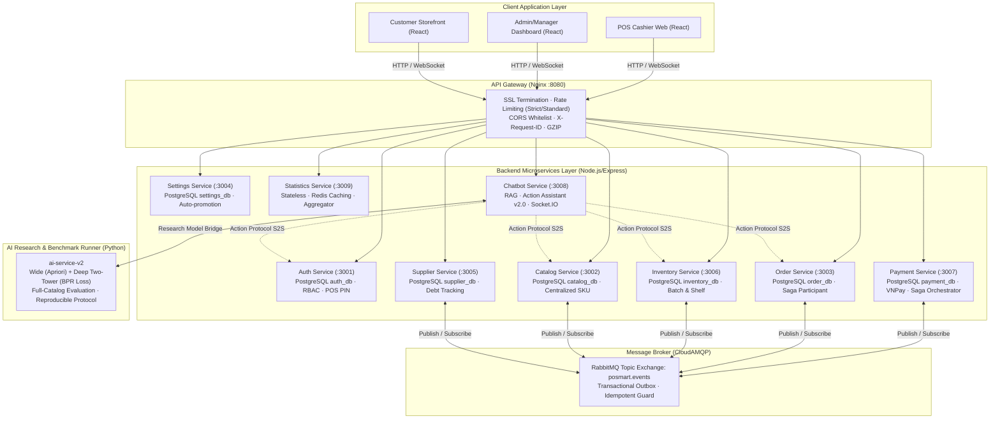

# BÁO CÁO SƠ BỘ TỔNG QUAN ĐỀ TÀI KHÓA LUẬN TỐT NGHIỆP
## NÂNG CẤP VÀ PHÁT TRIỂN HỆ THỐNG QUẢN LÝ BÁN LẺ ĐA CHI NHÁNH POSMART DỰA TRÊN KIẾN TRÚC MICROSERVICES VÀ HỆ GỢI Ý THÔNG MINH LAI (HYBRID RECOMMENDER)
**Mã học phần:** SE505 — Khóa luận tốt nghiệp (Ngành Kỹ thuật Phần mềm - UIT)  
**Giảng viên hướng dẫn:** TS. Nguyễn Thị Xuân Hương  
**Sinh viên thực hiện:** Nguyễn Trương Tiến Phát & Đỗ Minh Đức  
**Văn bản chuẩn bị:** Báo cáo tổng quan cho buổi họp đầu tiên theo `target.md`  
**Tài liệu đối sánh & Kế thừa:** Báo cáo Đồ án 2 (`main.pdf`) & Template mẫu KLTN UIT (`22520664_SE505.Q21_Nguyen Thi Xuan Huong.pdf`)

---

## MỤC LỤC
1. [1. ĐỘNG LỰC NGHIÊN CỨU VÀ LÝ DO CHỌN ĐỀ TÀI](#1-động-lực-nghiên-cứu-và-lý-do-chọn-đề-tài)
   - 1.1. Bối cảnh thị trường và sự chuyển dịch mô hình bán lẻ
   - 1.2. Thách thức kỹ thuật cốt lõi trong hệ thống phân tán
   - 1.3. Động lực nâng cấp từ Đồ án 2 lên Khóa luận tốt nghiệp
2. [2. KHẢO SÁT HIỆN TRẠNG CÁC HỆ THỐNG TƯƠNG ĐƯƠNG VÀ HỆ THỐNG ĐỀ XUẤT](#2-khảo-sát-hiện-trạng-các-hệ-thống-tương-đương-và-hệ-thống-đề-xuất)
   - 2.1. Khảo sát các nền tảng bán lẻ và thương mại điện tử hiện nay
   - 2.2. Phân tích các hạn chế kỹ thuật phổ biến
   - 2.3. Ma trận phân tích khoảng cách năng lực, điểm nghẽn kiến trúc và nợ kỹ thuật (Bảng 1.1)
   - 2.4. Hệ thống kiến trúc đề xuất (POSMART Enterprise Solution)
3. [3. ĐỐI TƯỢNG VÀ PHẠM VI NGHIÊN CỨU](#3-đối-tượng-và-phạm-vi-nghiên-cứu)
   - 3.1. Đối tượng nghiên cứu
   - 3.2. Phạm vi nghiên cứu
4. [4. MỤC TIÊU ĐỀ TÀI VÀ CÁC YÊU CẦU HỆ THỐNG](#4-mục-tiêu-đề-tài-và-các-yêu-cầu-hệ-thống)
   - 4.1. Yêu cầu chức năng hệ thống (Functional Requirements)
   - 4.2. Yêu cầu dữ liệu (Data Requirements)
   - 4.3. Yêu cầu giao diện, phần cứng, phần mềm
   - 4.4. Yêu cầu phi chức năng (Quality Attributes)
5. [5. KẾ HOẠCH TRIỂN KHAI VÀ NỘI DUNG THẢO LUẬN VỚI GVHD](#5-kế-hoạch-triển-khai-và-nội-dung-thảo-luận-với-gvhd)

---

## 1. ĐỘNG LỰC NGHIÊN CỨU VÀ LÝ DO CHỌN ĐỀ TÀI

### 1.1. Bối cảnh thị trường và sự chuyển dịch mô hình bán lẻ
Trong làn sóng chuyển đổi số mạnh mẽ của nền kinh tế, ngành bán lẻ (Retail) và chuỗi siêu thị mini (Convenience Store / Mini-mart) đang chứng kiến bước ngoặt chuyển dịch sâu sắc từ các cửa hàng truyền thống sang mô hình bán lẻ đa kênh tích hợp (**Omnichannel Retailing**). Khách hàng không chỉ mua sắm trực tiếp tại quầy thanh toán (POS Terminal) mà còn có nhu cầu tra cứu giá, kiểm tra lượng tồn kho thực tế, đặt hàng trực tuyến để nhận tại cửa hàng (BOPIS - Buy Online, Pick Up In Store) hoặc giao hàng tận nơi.

Sự bùng nổ về khối lượng giao dịch và số lượng SKU (Stock Keeping Unit) trong các chuỗi bán lẻ đòi hỏi hệ thống quản trị phải đáp ứng đồng thời 3 tiêu chí:
1. **Khả năng mở rộng linh hoạt (High Scalability):** Hệ thống không bị tê liệt vào các khung giờ cao điểm (Peak hours) hoặc các chiến dịch khuyến mãi lớn.
2. **Khả năng phục hồi và chịu lỗi (High Availability & Fault Tolerance):** Một sự cố tại một module nghiệp vụ không được phép làm sập toàn bộ hệ thống bán hàng tại quầy.
3. **Cá nhân hóa thông minh (Smart Personalization & Automation):** Nâng cao giá trị giỏ hàng thông qua bán chéo (Cross-selling), bán gia tăng (Up-selling) và trợ lý ảo thông minh tương tác trực tiếp với dữ liệu nghiệp vụ thời gian thực.

### 1.2. Thách thức kỹ thuật cốt lõi trong hệ thống phân tán
Thực tế triển khai các hệ thống phần mềm quản lý chuỗi bán lẻ hiện nay đặt ra các bài toán kỹ thuật phức tạp:
* **Sự đối lập về đặc thù tải dữ liệu:** Luồng tra cứu thông tin danh mục hàng hóa (Catalog) có tần suất đọc cực cao (*Read-heavy*), trong khi luồng trừ tồn kho chi tiết theo lô và giao dịch bán lẻ (Inventory & Order) có tần suất ghi liên tục (*Write-heavy*). Việc gộp chung vào một cơ sở dữ liệu nguyên khối (Monolithic Database) dẫn đến hiện tượng nghẽn cổ chai (I/O Bottleneck), khóa bảng (Table Locking) và làm suy giảm nghiêm trọng thông lượng của toàn bộ hệ thống.
* **Bài toán chi phí và cô lập dữ liệu (Multi-tenancy Trade-off):** Cấp phát mỗi chi nhánh một cơ sở dữ liệu vật lý riêng (Database-per-tenant) gây lãng phí tài nguyên và chi phí bảo trì khổng lồ đối với các chuỗi vừa và nhỏ (dưới 100 cửa hàng). Ngược lại, việc chia sẻ cơ sở dữ liệu (Shared Database) đòi hỏi một cơ chế cô lập dữ liệu tuyệt đối ở mức ứng dụng và truy vấn (Row-Level Security via `store_id`) nhằm tránh rủi ro rò rỉ dữ liệu giữa các cửa hàng.
* **Tính toàn vẹn giao dịch phân tán (Distributed Data Consistency):** Trong môi trường Microservices, các thao tác thanh toán, tạo đơn hàng và trừ kho diễn ra trên nhiều cơ sở dữ liệu logic độc lập. Áp dụng giao thức khóa 2 pha (2-Phase Commit - 2PC) truyền thống sẽ gây suy giảm nghiêm trọng hiệu năng và tăng độ trễ. Do đó, việc triển khai mô hình **Saga Pattern (Choreography/Orchestration)** kết hợp giao tiếp hướng sự kiện (**Event-Driven**) qua Message Broker là điều kiện tiên quyết để đảm bảo tính nhất quán cuối cùng (**Eventual Consistency**).
* **Nút thắt của hệ gợi ý truyền thống và ảo giác AI (Hallucination):** Các hệ thống gợi ý truyền thống thường phụ thuộc vào gọi API đám mây bên thứ ba (Black-box LLM API) dẫn đến độ trễ cao, chi phí biến đổi đắt đỏ và nguy cơ rò rỉ dữ liệu khách hàng. Ngược lại, nếu chỉ dùng Rule-based cứng nhắc thì hệ thống không thể xử lý ngôn ngữ tự nhiên và tính tương đồng ngữ nghĩa.

### 1.3. Động lực nâng cấp từ Đồ án 2 lên Khóa luận tốt nghiệp
Trong khuôn khổ Đồ án 2 (`SE122.P21`), nhóm nghiên cứu đã xây dựng thành công nền tảng backend gồm **8-9 Microservices** cơ bản bằng Node.js (Express), thiết lập thành công giao thức SAGA với RabbitMQ, thanh toán VNPay và bước đầu tích hợp RAG Heuristic vào Chatbot (`main.pdf`).

Tuy nhiên, để phát triển thành **Khóa luận tốt nghiệp kỹ sư (SE505)** có giá trị thực tiễn cao và hàm lượng khoa học thuyết phục, đề tài cần giải quyết những bài toán chuyên sâu mang tính đột phá:
1. **Nâng cấp kiến trúc Backend chuẩn doanh nghiệp:** Bổ sung hoàn chỉnh phân hệ **Statistics Service (:3009)** sử dụng Redis Cache để tổng hợp số liệu thời gian thực; chuẩn hóa cơ chế **Transactional Outbox** và **Idempotency Guard** nhằm đảm bảo nguyên tắc xử lý *Exactly-Once* / *At-Least-Once* trong giao dịch tài chính và kho bãi.
2. **Nâng cấp Chatbot thành Trợ lý tác vụ hai chiều (Action Assistant v2.0):** Vượt ra khỏi mô hình hỏi đáp chỉ đọc (Read-only RAG), Chatbot được trang bị **Action Response Protocol** và **Confirmation Gate** bảo mật 7 lớp để có khả năng trực tiếp can thiệp trạng thái Frontend (thêm giỏ hàng, tra cứu tồn kho chi nhánh, giữ đơn tại quầy) mà Backend vẫn giữ nguyên trạng thái Stateless.
3. **Mũi nhọn nghiên cứu mới — Hệ gợi ý thông minh lai (`ai-service-v2`):** Phát triển một Recommender System độc lập với kiến trúc kết hợp **Wide Tower (Luật kết hợp Apriori khai thác giỏ hàng mua sắm tự nhiên)** và **Deep Two-Tower (User Tower + Item Tower tích hợp chiếu đặc trưng ngữ nghĩa và giá, tối ưu hóa qua hàm mất mát Bayesian Personalized Ranking - BPR)**. Đồng thời, thiết lập một **Quy trình Benchmark khoa học, độc lập và có thể tái lập (Reproducible Benchmark)** với đầy đủ các kiểm soát chống rò rỉ dữ liệu (No data leakage) và đánh giá trên toàn bộ danh mục hàng hóa (Full-catalog ranking).

---

## 2. KHẢO SÁT HIỆN TRẠNG CÁC HỆ THỐNG TƯƠNG ĐƯƠNG VÀ HỆ THỐNG ĐỀ XUẤT

### 2.1. Khảo sát các nền tảng bán lẻ và thương mại điện tử hiện nay
Hiện nay trên thị trường có 3 nhóm giải pháp chính:
1. **Nền tảng đóng gói SaaS dạng Monolith tại Việt Nam (KiotViet, Sapo, Haravan, Nhanh.vn):** Rất phổ biến cho cửa hàng bán lẻ nhỏ lẻ. Ưu điểm là triển khai nhanh, giao diện thân thiện. Tuy nhiên, kiến trúc nguyên khối dùng chung khiến tính tùy biến kém, không thể chia sẻ tải theo từng service chuyên biệt, và hoàn toàn thiếu vắng các công cụ trợ lý AI hành động (Action Assistant) hay thuật toán gợi ý học máy sâu (Deep RecSys) có khả năng cá nhân hóa theo thời gian thực.
2. **Nền tảng mã nguồn mở quốc tế (WooCommerce, Magento/Adobe Commerce, Odoo POS):** Cho phép can thiệp mã nguồn nhưng đòi hỏi hạ tầng máy chủ cồng kềnh. WooCommerce và Magento phụ thuộc vào cơ sở dữ liệu quan hệ truyền thống (MySQL), khi số lượng SKU và lượt truy cập tăng cao sẽ gặp tình trạng thắt nút cổ chai tại cơ sở dữ liệu. Odoo POS có kiến trúc module nhưng viết bằng Python đồng bộ, khó mở rộng độc lập từng phân hệ khi một chi nhánh có lượng giao dịch đột biến.
3. **Nền tảng thương mại điện tử đám mây quy mô lớn (Shopify Plus, Amazon Marketplace):** Khả năng mở rộng tuyệt vời nhưng chi phí bản quyền và hoa hồng giao dịch cực kỳ đắt đỏ, không phù hợp cho các doanh nghiệp bán lẻ vừa và nhỏ tại Việt Nam. Đồng thời, việc tích hợp sâu các nghiệp vụ quản lý kho bãi vật lý chi tiết đến từng kệ (Location/Block) và điều chuyển nội bộ giữa các chi nhánh thường bị giới hạn.

### 2.2. Phân tích các hạn chế kỹ thuật phổ biến
Qua khảo sát thực tế và phân tích tài liệu học thuật, các điểm nghẽn kỹ thuật trong hệ thống bán lẻ đa chi nhánh hiện hành bao gồm:
* **Bottleneck tại tầng dữ liệu:** Các thao tác thống kê, báo cáo doanh thu và tra cứu tìm kiếm sản phẩm chạy trực tiếp trên cùng một instance cơ sở dữ liệu với luồng thanh toán tại quầy POS, dẫn đến tình trạng treo máy thu ngân khi quản trị viên chạy báo cáo.
* **Xung đột đơn hàng và sai lệch tồn kho (Overselling & Inventory Drift):** Khi nhiều kênh (online và offline tại quầy) cùng bán một sản phẩm, việc thiếu cơ chế khóa phân tán hoặc cơ chế hàng đợi bất đồng bộ có độ tin cậy cao sẽ dẫn đến việc bán vượt quá tồn kho thực tế, gây thiệt hại tài chính và trải nghiệm người dùng.
* **Sự phụ thuộc rủi ro vào API AI ngoại vi:** Nhiều hệ thống tích hợp AI bằng cách gọi thẳng API của OpenAI/Claude. Cách làm này gặp 3 rủi ro chí tử: (1) Chi phí vận hành tăng vọt theo số lượt request; (2) Độ trễ mạng cao (> 2-3 giây) không thể đáp ứng được trải nghiệm bán hàng tại quầy; (3) Nguy cơ vi phạm an toàn thông tin khi gửi toàn bộ dữ liệu nội bộ doanh nghiệp lên cloud công cộng.

### 2.3. Ma trận phân tích khoảng cách năng lực, điểm nghẽn kiến trúc và nợ kỹ thuật
*(Tuân thủ cấu trúc phân tích 3 chiều theo chuẩn mực của TS. Nguyễn Thị Xuân Hương)*

#### Bảng 1.1: Ma trận phân tích khoảng cách năng lực, điểm nghẽn kiến trúc và nợ kỹ thuật của các giải pháp hiện hành

| Tiêu chí phân tích (Ma trận tư duy) | Biểu hiện thực tế & Nguyên nhân kỹ thuật | Hệ quả & Điểm nghẽn hệ thống |
|:---|:---|:---|
| **1. Khoảng cách năng lực và Ràng buộc hệ thống (Capability Gap & Constraints)** | • Các giải pháp POS SaaS đóng gói sẵn (KiotViet, Sapo) chỉ cung cấp các chức năng CRUD cơ bản, không có API mở để tích hợp sâu hệ thống phân tán. • Phân hệ gợi ý sản phẩm chỉ dừng lại ở quy tắc thủ công (bán chạy nhất) hoặc hoàn toàn vắng bóng. • Việc thiếu hụt cơ chế nhận diện ngữ nghĩa ngôn ngữ tự nhiên khiến việc tìm kiếm sản phẩm của nhân viên và khách hàng bị giới hạn bởi từ khóa chính xác tuyệt đối (Exact Match). | • Mất cơ hội gia tăng giá trị giỏ hàng thông qua bán chéo thông minh (Cross-selling). • Nhân viên tại quầy mất nhiều thời gian tìm kiếm mặt hàng thay thế khi hết hàng. • Khách hàng trực tuyến dễ rời bỏ nền tảng khi không tìm thấy sản phẩm do lỗi gõ sai chính tả hoặc cách diễn đạt khác biệt. |
| **2. Điểm nghẽn hệ thống và Nguồn gốc vấn đề (Architectural Bottlenecks & Root Causes)** | • Nguồn gốc bắt nguồn từ kiến trúc Monolithic hoặc Modular Monolith chia sẻ chung một cơ sở dữ liệu quan hệ vật lý. • Khi lưu lượng truy cập trực tuyến tăng đột biến, tài nguyên CPU/RAM và I/O của database bị chiếm dụng toàn bộ cho các câu truy vấn JOIN phức tạp. • Cơ chế Multi-tenancy nếu làm theo dạng Database-per-tenant sẽ làm tăng chi phí quản trị kết nối (Connection Pooling Exhaustion) khi mở rộng số chi nhánh. | • Sự cố nghẽn cổ chai cục bộ tại phân hệ tra cứu/thống kê làm tê liệt toàn bộ luồng thanh toán tại máy POS của các chi nhánh (Single Point of Failure). • Chi phí hạ tầng máy chủ tăng phi mã nhưng hiệu suất thực tế không tăng tương xứng do lãng phí tài nguyên ở các service tải thấp. |
| **3. Nợ kỹ thuật và Sự đánh đổi kiến trúc (Technical Debt & Architectural Trade-offs)** | • Trong nỗ lực tích hợp AI nhanh chóng, nhiều hệ thống chọn giải pháp gọi trực tiếp API LLM đám mây thương mại (như OpenAI GPT, Anthropic Claude). • Đánh đổi này bỏ qua quyền tự chủ hạ tầng, độ trễ mạng và tính bảo mật của dữ liệu nghiệp vụ. • Đồng thời, việc thiếu vắng quy trình kiểm thử phân tầng (Unit/Integration Test) và cơ chế bù trừ giao dịch (Saga Compensation) để lại các khoản nợ kỹ thuật tiềm ẩn lỗi toàn vẹn dữ liệu. | • Chi phí biến đổi hàng tháng tăng ngoài tầm kiểm soát khi số lượng người dùng tăng. • Độ trễ phản hồi của Chatbot vượt quá ngưỡng chấp nhận (> 3 giây), làm gián đoạn luồng đàm thoại. • Rủi ro nghiêm trọng về rò rỉ dữ liệu khách hàng, dữ liệu giá vốn và tồn kho nội bộ sang máy chủ bên thứ ba. |

### 2.4. Hệ thống kiến trúc đề xuất (POSMART Enterprise Solution)
Để khắc phục triệt để các hạn chế trên, đề tài đề xuất phát triển nền tảng **POSMART** với các giải pháp kỹ thuật cốt lõi:
1. **Kiến trúc 9 Microservices độc lập:** Phân rã rõ ràng theo nguyên lý Domain-Driven Design (DDD):
   * *Nhóm dịch vụ lõi (Core):* Auth (:3001), Catalog (:3002), Order (:3003).
   * *Nhóm vận hành (Operations):* Settings (:3004), Supplier (:3005), Inventory (:3006).
   * *Nhóm tài chính & thống kê:* Payment (:3007), Statistics (:3009).
   * *Nhóm trí tuệ nhân tạo:* Chatbot Service (:3008) kết hợp Recommender Research Runner (`ai-service-v2`).
2. **Cơ chế giao tiếp Event-Driven & SAGA Choreography:** Sử dụng RabbitMQ làm Message Broker kết hợp bộ đôi mẫu thiết kế **Transactional Outbox** và **Idempotency Guard**, đảm bảo mọi biến động tài chính, thanh toán VNPay và trừ tồn kho đều đạt tính toàn vẹn tuyệt đối (*All-or-Nothing*).
3. **Cơ chế Row-Level Multi-Tenancy:** Chia sẻ chung 1 instance PostgreSQL (8 logical databases riêng biệt) nhưng cô lập dữ liệu tuyệt đối thông qua `store_id` được ký mã hóa trong JWT Payload, tối ưu hóa chi phí hạ tầng mà vẫn bảo mật an toàn.
4. **Hệ thống AI Tự chủ & Lai ghép 2 tầng:**
   * *Tầng tác vụ thời gian thực (Runtime Action Assistant):* RAG Pipeline kết hợp Semantic Search (`pgvector` HNSW 768 chiều) + Full-Text Search (GIN) qua RRF, kết hợp Action Response Protocol cho phép thực thi hành động trực tiếp.
   * *Tầng học máy nghiên cứu chuyên sâu (`ai-service-v2`):* Mô hình lai Wide + Apriori + Deep Two-Tower (BPR Loss) với cơ chế chuẩn hóa per-user z-score và quy trình benchmark độc lập không rò rỉ dữ liệu.

---

## 3. ĐỐI TƯỢNG VÀ PHẠM VI NGHIÊN CỨU

### 3.1. Đối tượng nghiên cứu
Đề tài tập trung nghiên cứu chuyên sâu vào các công nghệ, mẫu kiến trúc và mô hình toán học sau:
1. **Kiến trúc hệ thống phân tán (Distributed System Architecture):**
   * Mô hình kiến trúc Microservices với API Gateway (Nginx) xử lý các mối quan tâm liên đới (Cross-cutting Concerns).
   * Mẫu kiến trúc hướng sự kiện (Event-Driven Architecture) với RabbitMQ Message Broker (giao thức AMQP 0-9-1).
   * Mẫu điều phối giao dịch phân tán SAGA (Choreography & Orchestration) kết hợp mẫu Transactional Outbox và Idempotent Consumer.
2. **Kỹ thuật lưu trữ và Quản trị dữ liệu đa người thuê (Multi-tenancy):**
   * Mô hình Row-Level Security (Shared Database, Shared Schema) thông qua trường định danh `store_id`.
   * Thiết kế cơ sở dữ liệu chuẩn hóa cho chuỗi bán lẻ: Quản lý danh mục tập trung (Centralized Catalog), quản lý lô hàng và hạn sử dụng (Batch Inventory), quản lý sơ đồ kho vật lý (Warehouse Grid & Shelf Location).
   * Cơ chế lưu trữ phân tầng (Polyglot Persistence): PostgreSQL (Relational & ACID), Redis (In-memory Caching & Rate Limiting), `pgvector` (Vector Embeddings).
3. **Kỹ thuật Trợ lý ảo tác vụ (Action Assistant) & Xử lý ngôn ngữ tự nhiên:**
   * Kỹ thuật RAG (Retrieval-Augmented Generation) kết hợp Semantic Search (Vector Cosine với Vietnamese SBERT 768 chiều, chỉ mục HNSW) và Keyword Search (PostgreSQL Full-Text Search tsvector với chỉ mục GIN).
   * Thuật toán hợp nhất thứ hạng tương hỗ (Reciprocal Rank Fusion - RRF).
   * Giao thức Action Response Protocol và Confirmation Gate cho phép AI thực thi hành động hai chiều có kiểm soát an toàn.
4. **Mô hình toán học Hệ gợi ý lai (Hybrid Recommendation Model):**
   * Thuật toán khai phá luật kết hợp Apriori trên giỏ hàng mua sắm tự nhiên (Support, Confidence, Lift).
   * Mạng nơ-ron Two-Tower phi tuyến (User Tower & Item Tower với text/category/price projection) huấn luyện bằng hàm mất mát Bayesian Personalized Ranking (BPR).
   * Mô hình kết hợp cộng tính (Additive Fusion) với cơ chế chuẩn hóa Z-score theo từng người dùng (Per-user Z-score normalization).

### 3.2. Phạm vi nghiên cứu
Đề tài giới hạn phạm vi nghiên cứu và triển khai thực nghiệm như sau:
* **Quy mô ứng dụng:** Phù hợp cho chuỗi bán lẻ và siêu thị mini có quy mô vừa và nhỏ (dưới 100 cửa hàng chi nhánh).
* **Phân hệ nghiệp vụ trong phạm vi:**
  * Toàn bộ 9 Microservices Backend: Xác thực & Phân quyền (Auth), Danh mục sản phẩm (Catalog), Đơn hàng bán lẻ (Order), Cấu hình hệ thống (Settings), Quản lý nhà cung cấp & Nhập hàng (Supplier), Quản lý tồn kho chi tiết & Kho bãi (Inventory), Xử lý thanh toán đa phương thức & VNPay (Payment), Thống kê & Báo cáo doanh thu (Statistics), Trợ lý ảo đàm thoại & Tác vụ (Chatbot).
  * Phân hệ nghiên cứu mô hình gợi ý chuyên sâu (`ai-service-v2`): Xây dựng runner kiểm thử khoa học độc lập trên Python, thực thi huấn luyện mô hình Wide + Deep Two-Tower và đo lường trên bộ metrics chuẩn (HR@K, NDCG@K, MRR@K, Coverage, Diversity).
* **Ranh giới loại trừ (Out of Scope):**
  * Đề tài không đi sâu vào nghiệp vụ logistics vật lý ngoài thực địa (quản lý lộ trình xe tải giao hàng của bên thứ ba).
  * Phiên bản `ai-service` cũ (Node.js heuristic) được chuyển sang trạng thái lưu trữ phục vụ đối soát (quarantined audit), toàn bộ phát triển khoa học mới tập trung hoàn toàn vào `ai-service-v2`.
* **Môi trường thực nghiệm:**
  * Môi trường phát triển: Điều phối toàn bộ các container dịch vụ qua Docker Compose.
  * Môi trường điện toán đám mây: Triển khai thử nghiệm kết nối dịch vụ cơ sở dữ liệu được quản lý (Supabase PostgreSQL SSL, CloudAMQP RabbitMQ, Upstash/Redis Cloud).
  * Cổng thanh toán: Sử dụng môi trường Sandbox kiểm thử chính thức của VNPay.

---

## 4. MỤC TIÊU ĐỀ TÀI VÀ CÁC YÊU CẦU HỆ THỐNG

### 4.1. Yêu cầu chức năng hệ thống (Functional Requirements)
Hệ thống POSMART được thiết kế để phục vụ 4 nhóm tác nhân với phân quyền chặt chẽ (RBAC):

#### A. Phân hệ Khách hàng (Customer / Online Storefront)
1. **Xác thực & Hồ sơ:** Đăng ký tài khoản trực tuyến (gán tự động quyền Customer thuộc cấp chuỗi), đăng nhập JWT, cập nhật hồ sơ cá nhân.
2. **Khám phá sản phẩm:** Duyệt cây danh mục ngành hàng, tìm kiếm từ khóa kết hợp lọc đa tiêu chí (danh mục, khoảng giá, trạng thái còn hàng), xem chi tiết sản phẩm và các thuộc tính liên quan.
3. **Giỏ hàng & Đặt hàng:** Thêm sản phẩm vào giỏ hàng, điều chỉnh số lượng, chọn hình thức nhận hàng (giao tận nơi hoặc nhận tại cửa hàng - Pickup).
4. **Thanh toán trực tuyến:** Thanh toán bảo mật qua cổng VNPay (quét mã QR-Code qua App ngân hàng) hoặc thanh toán khi nhận hàng (COD).
5. **Theo dõi đơn hàng:** Xem lịch sử mua sắm cá nhân, theo dõi chi tiết trạng thái vòng đời đơn hàng (Pending -> Paid -> Shipping -> Delivered).
6. **Tương tác với AI Chatbot:** Trò chuyện hỏi đáp về thông tin sản phẩm, hỏi gợi ý mặt hàng theo nhu cầu (ví dụ: "nguyên liệu nấu lẩu bò"), nhận diện giỏ hàng để gợi ý mua kèm và yêu cầu AI tự động thêm hàng vào giỏ.

#### B. Phân hệ Thu ngân / Nhân viên bán hàng (Cashier / Store Staff)
1. **Đăng nhập nhanh tại quầy POS:** Đăng nhập tốc độ cao bằng mã PIN 4-6 số được mã hóa bcrypt, bảo vệ khóa tài khoản khi nhập sai quá số lần quy định.
2. **Bán hàng tại quầy (POS Terminal):** Quét mã vạch sản phẩm (Barcode scanner) hoặc tìm kiếm nhanh sản phẩm, chọn lô hàng có hạn dùng phù hợp, tự động tính tổng tiền và chiết khấu.
3. **Quản lý đơn hàng chờ (Hold Orders):** Lưu tạm đơn hàng đang tính dở để thanh toán cho khách hàng tiếp theo, phục hồi lại đơn chờ khi khách quay lại mà không mất dữ liệu giỏ hàng.
4. **Thanh toán đa phương thức tại quầy:** Hỗ trợ thanh toán tiền mặt (tính tiền thừa tự động), quét QR VNPay động hiển thị trên màn hình POS, in hóa đơn bán lẻ.
5. **Hỗ trợ từ Trợ lý AI nội bộ:** Truy vấn nhanh số lượng hàng tồn kho thực tế trên kệ hoặc trong kho phụ của chi nhánh thông qua câu lệnh thoại/text.

#### C. Phân hệ Quản lý cửa hàng (Store Manager)
1. **Quản lý nhập kho (Purchase Orders & Stock-in):** Tạo đơn đặt hàng từ nhà cung cấp, duyệt đơn, thực hiện nghiệm thu nhập kho (ghi nhận số lượng thực nhận, ngày sản xuất, hạn sử dụng, gán vào vị trí kệ kho cụ thể).
2. **Quản lý vị trí kho bãi (Warehouse Locations):** Thiết lập sơ đồ trực quan các khu vực kho (Block) và các ô/kệ (Location) với sức chứa tối đa, hiển thị cảnh báo trực quan về tỷ lệ lấp đầy kho.
3. **Điều chuyển & Quản lý lô hàng (Batch Management & Shelf Transfer):** Theo dõi hạn sử dụng của từng lô hàng, thực hiện điều chuyển hàng hóa từ kho chung (On-Hand) lên kệ bán lẻ (On-Shelf), kích hoạt hủy lô hàng hết hạn hoặc hư hỏng (Stock Out).
4. **Quản lý nhà cung cấp & Công nợ (Supplier Debt):** Theo dõi danh sách nhà cung cấp, lịch sử nhập hàng và quản lý hạn mức công nợ theo từng chi nhánh.
5. **Báo cáo kinh doanh chi nhánh:** Xem báo cáo tổng hợp doanh thu, lợi nhuận gộp, top sản phẩm bán chạy của chi nhánh theo các mốc thời gian linh hoạt.

#### D. Phân hệ Quản trị viên cấp cao (Chain Owner / Super Admin)
1. **Quản trị chi nhánh (Store Management):** Khởi tạo chi nhánh mới trong chuỗi, sinh mã `store_id` định danh, gán nhân sự quản lý cho từng chi nhánh.
2. **Quản trị danh mục hàng hóa tập trung (Centralized Catalog):** Thêm, sửa, xóa sản phẩm và phân loại danh mục dùng chung toàn chuỗi; cấu hình giá niêm yết chuẩn; tra cứu lịch sử biến động giá (Price History Audit).
3. **Quản trị người dùng & Phân quyền (User & RBAC Management):** Cấu hình các vai trò (Role), gán nhóm quyền hạn (Permissions), kích hoạt/khóa tài khoản nhân viên.
4. **Cấu hình chính sách toàn hệ thống (System Settings):** Thiết lập tham số bảo mật (số lần sai PIN tối đa, thời gian khóa tài khoản); cấu hình chính sách bán hàng (chiết khấu khách VIP/Wholesale, bật tự động kích hoạt khuyến mãi giảm giá cho hàng cận date lúc 18h hàng ngày).
5. **Dashboard giám sát tổng thể:** Theo dõi doanh số toàn chuỗi, tổng số đơn hàng, tỷ lệ chuyển đổi và sức khỏe vận hành của toàn bộ các Microservices.

---

### 4.2. Yêu cầu dữ liệu (Data Requirements)
*(Đáp ứng đầy đủ chuẩn mực kiến trúc dữ liệu cho hệ thống phân tán đa người thuê)*

1. **Tính nhất quán và Toàn vẹn giao dịch (ACID & Eventual Consistency):**
   * Các thao tác cục bộ bên trong từng microservice bắt buộc tuân thủ nguyên tắc ACID tuyệt đối (ví dụ: tạo bản ghi Payment và bản ghi VNPay Transaction trong cùng một Transaction).
   * Giao dịch liên dịch vụ (Cross-service Transaction) giữa Payment, Order và Inventory bắt buộc thực thi theo mô hình **Saga Choreography** thông qua RabbitMQ. Đảm bảo tính nhất quán cuối cùng: nếu trừ kho thất bại, hệ thống tự động phát sự kiện bù trừ (`inventory.deduct_failed`) để hủy đơn hàng (`cancelled`) và hoàn tiền.
2. **Tính cách ly dữ liệu Đa người thuê (Multi-tenant Data Isolation):**
   * Dữ liệu các dịch vụ mang tính cục bộ chi nhánh (`order`, `inventory`, `supplier`, `payment`, `chatbot`) bắt buộc lưu trữ trường khóa ngoại `store_id`.
   * Mọi truy vấn đọc/ghi đều phải được Middleware tự động trích xuất `storeId` từ JWT Token đã được ký số, nghiêm cấm việc client tự ý truyền `store_id` qua Query/Body nhằm triệt tiêu lỗ hổng leo thang đặc quyền ngang (IDOR).
   * Các dịch vụ mang tính toàn chuỗi (`catalog`, `auth`, `settings`) quản lý dữ liệu tập trung (Centralized), cho phép mọi chi nhánh truy xuất chung.
3. **Tính linh hoạt của dữ liệu bán cấu trúc (Semi-structured & Auditability):**
   * Sử dụng trường kiểu dữ liệu `JSONB` trong PostgreSQL để lưu trữ các cấu hình động (lịch sử thay đổi cấu hình `settings_history`, cấu trúc snapshot chi tiết đơn hàng lúc thanh toán `items`, và siêu dữ liệu phiên hội thoại `chat_message.metadata`).
   * Bảng `processed_events` tại các service đóng vai trò chốt chặn Idempotent (chống trùng lặp tin nhắn khi RabbitMQ gửi lại sự kiện).
   * Bảng `outbox` hỗ trợ Transactional Outbox Pattern: lưu trữ sự kiện cùng transaction với dữ liệu nghiệp vụ, đảm bảo tin nhắn không bao giờ bị thất lạc ngay cả khi broker gặp sự cố tạm thời.
4. **Lưu trữ Vector và Tìm kiếm Ngữ nghĩa (Vector Database & Semantic Indexing):**
   * Dịch vụ Chatbot tích hợp mở rộng `pgvector` trên PostgreSQL, lưu trữ vector nhúng 768 chiều (Vietnamese SBERT) cho từng sản phẩm tại bảng `product_knowledge_base`.
   * Đánh chỉ mục HNSW (Hierarchical Navigable Small World) tối ưu hóa truy vấn tìm kiếm vector cosine với độ phức tạp $O(\log n)$.
   * Kết hợp cột `fts_content TSVECTOR` được đánh chỉ mục GIN (Generalized Inverted Index) để phục vụ tìm kiếm từ khóa truyền thống.
5. **Tính bất biến của Dữ liệu Nghiên cứu Thực nghiệm (ML Benchmark Lineage):**
   * Cơ sở dữ liệu đơn hàng (`sale_order`) hỗ trợ các trường định danh nghiên cứu: `benchmark_run_id`, `benchmark_kind` (`organic` vs `semantic_trap`), `benchmark_template_id`.
   * Trong module `ai-service-v2`, dữ liệu thực nghiệm được đóng gói thành các **Dataset Snapshot** bất biến, gắn mã băm toàn vẹn SHA-256, phân tách thời gian nghiêm ngặt giữa tập Train / Validation / Test, ngăn chặn hoàn toàn hiện tượng rò rỉ dữ liệu (Data Leakage).

---

### 4.3. Yêu cầu giao diện, phần cứng, phần mềm

#### 1. Yêu cầu giao diện người dùng (UI/UX Requirements)
* **Phong cách thiết kế:** Hiện đại, tối giản, chuyên nghiệp, hỗ trợ đầy đủ chế độ Light Mode (cho Storefront & POS) và Dark Mode (cho Dashboard Quản trị hệ thống).
* **Tính đáp ứng (Responsive Web Design):** Tương thích hoàn hảo trên các độ phân giải màn hình Desktop (Màn hình máy tính quản lý, màn hình quầy thu ngân cảm ứng 1920x1080), Tablet (iPad cho nhân viên kiểm kê kho) và Mobile (cho khách hàng mua sắm trực tuyến).
* **Tối ưu hóa thao tác quầy bán hàng (POS Ergonomics):** Giao diện bán hàng tối ưu cho màn hình cảm ứng, hỗ trợ toàn diện các phím tắt (Hotkeys), bàn phím số ảo lớn nhập PIN, quét mã vạch không độ trễ, và thanh trạng thái kết nối mạng thời gian thực.
* **Giao diện Trợ lý AI (Action Assistant Widget):** Thiết kế dạng bong bóng chat nổi (Floating Widget) góc phải màn hình, hỗ trợ hiển thị thẻ sản phẩm (ProductCard), bảng đối chiếu so sánh thông số kỹ thuật, và các nút lựa chọn nhanh (Quick Replies / Action Confirmation Buttons).
* **Tiêu chuẩn chất lượng web:** Tuân thủ các tiêu chuẩn Core Web Vitals của Google (LCP < 2.5s, FID < 100ms, CLS < 0.1).

#### 2. Yêu cầu phần mềm và Công cụ phát triển
* **Hệ điều hành môi trường phát triển & vận hành:** Windows 11 / Ubuntu Linux 22.04 LTS.
* **Môi trường thực thi (Runtime):** Node.js v20 LTS, Python 3.11+.
* **Web Server & Reverse Proxy:** Nginx (Alpine Linux).
* **Hệ quản trị cơ sở dữ liệu:** PostgreSQL 16 kết hợp extension `pgvector` (Triển khai trên Supabase Cloud với kết nối SSL Pooling), Redis 7 (Redis Cloud / Upstash).
* **Hệ thống Message Broker:** RabbitMQ 3.13+ (CloudAMQP) với giao thức AMQP 0-9-1.
* **Thư viện & Framework lõi Backend:** Express.js v4.21, `pg` (PostgreSQL client pool), `amqplib`, `jsonwebtoken`, `bcrypt`, `pino` (Structured logging), `helmet`, `express-rate-limit`.
* **Thư viện & Framework lõi AI Research:** NumPy, PyTorch (phiên bản 2.2.2 cho deep modules), Hugging Face Inference API (`microsoft/Qwen/Qwen2.5-7B-Instruct`).
* **Công cụ đóng gói & Điều phối container:** Docker v26+, Docker Compose v2.
* **Công cụ kiểm thử & Đảm bảo chất lượng (QA Tools):** Jest & Supertest (cho Node.js), Pytest & Pytest-cov (cho Python), Ruff (Linter), Mypy (Static Type Checker).

#### 3. Yêu cầu phần cứng và Môi trường triển khai
* **Môi trường máy chủ phát triển (Development Workstation):**
  * Vi xử lý (CPU): Tối thiểu 6 nhân / 12 luồng (Intel Core i5 Gen 11+ hoặc AMD Ryzen 5 5600+).
  * Bộ nhớ trong (RAM): Tối thiểu 16GB DDR4/DDR5 (đảm bảo vận hành đồng thời 9 containers Microservices, Nginx, và tiến trình Python AI Runner).
  * Ổ cứng lưu trữ: Tối thiểu 50GB dung lượng trống SSD NVMe.
* **Môi trường máy chủ vận hành (Staging / Production Server):**
  * Máy chủ ảo hóa (Cloud VPS / Dedicated Instance): Tối thiểu 4 vCPU, 8GB - 16GB RAM.
  * Tận dụng tối đa các dịch vụ Đám mây được quản lý (Managed Cloud Services) gồm Supabase (PostgreSQL), CloudAMQP (RabbitMQ) và Redis Cloud để giảm tải tài nguyên phần cứng máy chủ ứng dụng xuống mức tối thiểu.

---

### 4.4. Yêu cầu phi chức năng (Quality Attributes)

1. **Hiệu năng và Tốc độ xử lý (Performance):**
   * Thời gian phản hồi của các API CRUD thông thường qua API Gateway: P95 < 200ms.
   * Thời gian thực thi toàn bộ chuỗi pipeline AI Chatbot (Query Reformulation -> Embedding -> Hybrid Search HNSW/GIN -> RRF Fusion -> LLM Generation): P95 < 500ms trong điều kiện tải chuẩn.
   * Tốc độ tra cứu luật kết hợp Apriori và gợi ý mua kèm tại quầy thanh toán đạt độ phức tạp $O(1)$ với thời gian < 5ms nhờ chỉ mục bán phần (Partial Index).
   * Tỷ lệ trúng bộ nhớ đệm (Cache Hit Rate) tại phân hệ Thống kê và Báo cáo (Statistics Service) đạt trên 85%, giảm tải trực tiếp cho database.
2. **An toàn và Bảo mật thông tin (Security):**
   * **Bảo mật mạng & Cổng vào:** Nginx API Gateway áp dụng chính sách Rate Limiting 3 tầng: Vùng `strict` (10 req/phút) bảo vệ các API nhạy cảm (Auth, Chat, Thanh toán), vùng `standard` (60 req/phút) cho các tác vụ CRUD, và giới hạn kết nối đồng thời WebSocket (`ws_conn`).
   * **Xác thực và Ủy quyền:** Toàn bộ request vào hệ thống (trừ public endpoints) bắt buộc đính kèm JWT Bearer Token hợp lệ. Mật khẩu người dùng và mã PIN thu ngân được băm một chiều an toàn bằng thuật toán Bcrypt với Salt Rounds = 10.
   * **Bảo vệ thanh toán:** Tích hợp kiểm tra chữ ký mã hóa HMAC-SHA512 (`vnp_SecureHash`) trên toàn bộ các gói tin Webhook IPN từ cổng VNPay để loại trừ hoàn toàn nguy cơ giả mạo giao dịch.
   * **Phòng chống tấn công:** Hệ thống trang bị thư viện `helmet` thiết lập các tiêu đề HTTP an toàn (CSP, X-Frame-Options, HSTS), làm sạch dữ liệu đầu vào chống SQL/NoSQL Injection và XSS.
3. **Khả năng mở rộng và Co giãn (Scalability):**
   * Cấu trúc Microservices cho phép mở rộng độc lập theo chiều ngang (Horizontal Scaling) đối với các dịch vụ chịu tải lớn (như Catalog Service hay Chatbot Service) mà không cần nhân bản các dịch vụ ít tải.
   * Kiến trúc Database-per-service (logical databases) cho phép trong tương lai có thể tách vật lý các database sang các máy chủ độc lập khi chuỗi phát triển vượt ngưỡng 100 cửa hàng mà không cần tái cấu trúc lại code nghiệp vụ.
4. **Độ tin cậy và Khả năng chịu lỗi (Reliability & Fault Tolerance):**
   * Thiết lập cơ chế cô lập lỗi (Fault Isolation): Sự cố ngừng hoạt động tại một dịch vụ không trọng yếu (như Chatbot hoặc Statistics) hoàn toàn không làm gián đoạn luồng bán hàng cốt lõi tại quầy POS.
   * Mọi sự kiện phát ra broker đều thông qua Transactional Outbox Pattern, loại bỏ nguy cơ mất mát thông tin khi có sự cố sập nguồn hoặc đứt kết nối mạng.
   * Tiến trình SAGA đảm bảo tính toàn vẹn giao dịch với cơ chế bù trừ tự động (Compensation Mechanism) khi xảy ra lỗi nghiệp vụ.
5. **Khả năng bảo trì và Chuẩn hóa mã nguồn (Maintainability):**
   * Mã nguồn toàn bộ 9 microservices được tổ chức thống nhất theo mô hình 4 tầng phân tách trách nhiệm (Route -> Service/Controller -> Repository -> Database).
   * Toàn bộ mã nguồn tuân thủ tiêu chuẩn Clean Code, cấu hình linter nghiêm ngặt (ESLint cho JavaScript, Ruff & Mypy Strict cho Python).
   * Tỷ lệ bao phủ kiểm thử (Test Coverage): Đạt hệ thống kiểm thử tự động hai tầng với hơn 50+ kịch bản Unit Test và Integration Test, đảm bảo ngăn ngừa triệt để lỗi hồi quy (Regression Bugs).

---

## 5. KẾ HOẠCH TRIỂN KHAI VÀ NỘI DUNG THẢO LUẬN VỚI GVHD
*(Bản tóm tắt đúc kết dành cho sinh viên trình bày tại Buổi họp đầu tiên)*

### 5.1. Nội dung báo cáo trọng tâm với TS. Nguyễn Thị Xuân Hương
1. **Làm rõ sự chuyển tiếp vững chắc từ Đồ án 2 lên Khóa luận tốt nghiệp:**
   * Trình bày hiện trạng: Đồ án 2 đã xây dựng hoàn chỉnh và chạy ổn định hệ thống Backend 9 Microservices, Multi-tenancy RLS, Saga RabbitMQ và VNPay Sandbox.
   * Đặt vấn đề nâng cấp: Khóa luận tốt nghiệp sẽ nâng tầm hệ thống bằng việc hoàn thiện phân hệ Thống kê Dashboard (Redis Cache), nâng cấp Chatbot thành Trợ lý tác vụ hai chiều (**Action Assistant v2.0** với giao thức an toàn) và đặc biệt là công trình nghiên cứu hệ gợi ý thông minh lai (**`ai-service-v2`**).
2. **Trình bày Ma trận khảo sát hiện trạng (Bảng 1.1):**
   * Phân tích rõ 3 chiều: Khoảng cách năng lực, Điểm nghẽn kiến trúc và Nợ kỹ thuật của các giải pháp hiện hành (KiotViet, Sapo, Shopify, và việc gọi API bên thứ ba).
   * Khẳng định tính ưu việt của giải pháp đề xuất POSMART.
3. **Báo cáo kiến trúc mô hình Hệ gợi ý đề xuất (`ai-service-v2`):**
   * Trình bày cấu trúc kết hợp Wide (Apriori Rules) + Deep (Two-Tower với BPR Loss).
   * Trình bày quy trình Benchmark khoa học, cam kết tính trung thực học thuật (Reproducible Benchmark, No Data Leakage, Full-catalog Evaluation).

### 5.2. Các câu hỏi xin ý kiến định hướng từ GVHD (Open Questions)
1. **Về dữ liệu thực nghiệm:** Để đánh giá mô hình gợi ý trong `ai-service-v2`, ngoài bộ dữ liệu bán lẻ nội bộ của POSMART, nhóm có nên thử nghiệm thêm trên các bộ dữ liệu công khai gần lĩnh vực (như ViEcomRec hoặc Amazon Grocery) để tăng tính tổng quát của khóa luận hay không?
2. **Về phân hệ giao diện:** Phạm vi khóa luận có yêu cầu nhóm phải hoàn thiện toàn diện cả 30 màn hình giao diện (Customer Storefront, Seller Console, Admin Dashboard) như template của anh Vương Gia Khiêm, hay nhóm chỉ cần tập trung hoàn thiện sâu giao diện POS bán hàng và Dashboard Quản trị phục vụ việc demo luồng nghiệp vụ backend?
3. **Về định hướng công bố bài báo:** Với các kết quả nghiên cứu độc lập của mô hình hybrid recommender trong `ai-service-v2`, nhóm có cơ hội phát triển thành một bài báo hội nghị khoa học (chuyên san / Hội nghị quốc gia hoặc quốc tế) dưới sự hướng dẫn của Cô hay không?

---
*Báo cáo được hoàn thành và lưu trữ tại: `e:\UIT\cv\backend\thesis\preliminary-survey-report.md`.*
